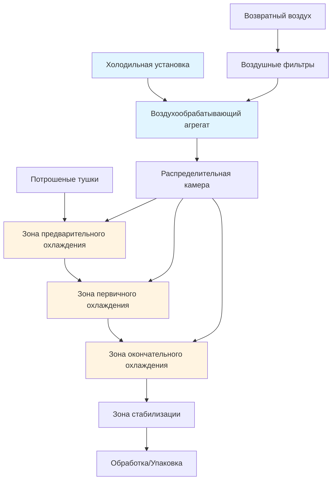
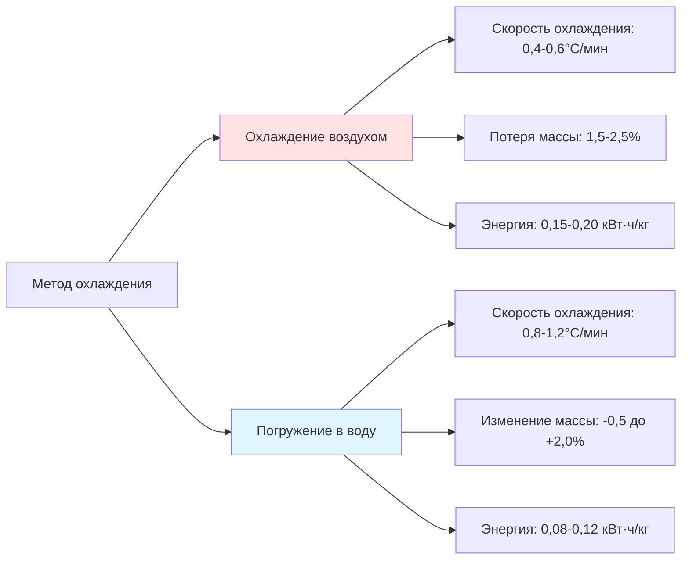

# Системы охлаждения воздухом для переработки птицы

Охлаждение воздухом представляет альтернативный метод к погружению в воду для снижения температуры тушки птицы с примерно 38-40°C после потрошения до 4°C или ниже в установленные нормативные сроки. Этот подход использует принудительную конвекцию охлажденным воздухом для извлечения тепла без контакта с водой, принципиально изменяя характеристики продукта и требования к технологии.

## Термодинамические принципы

Процесс удаления тепла при охлаждении воздухом следует принципам конвективной теплопередачи. Скорость охлаждения зависит от разницы температур между поверхностью тушки и охлаждающим воздухом, коэффициента конвективной теплопередачи и площади поверхности, подверженной потоку воздуха.

### Расчет теплопередачи

Удаление явного тепла из тушки птицы рассчитывается следующим образом:

$$Q = m \cdot c_p \cdot \Delta T$$

Где:
- Q = общее удаление тепла (кДж)
- m = масса тушки (кг)
- c_p = удельная теплоемкость птицы (3,3 кДж/кг·K)
- ΔT = изменение температуры (K)

Скорость конвективной теплопередачи выражается как:

$$\dot{Q} = h \cdot A \cdot (T_s - T_a)$$

Где:
- $\dot{Q}$ = скорость теплопередачи (Вт)
- h = коэффициент конвективной теплопередачи (10-40 Вт/м²·K)
- A = площадь поверхности (м²)
- T_s = температура поверхности (°C)
- T_a = температура воздуха (°C)

## Компоненты конструкции системы

Системы охлаждения воздухом состоят из нескольких интегрированных компонентов, которые работают вместе для достижения быстрого и равномерного охлаждения.

### Конфигурация охлаждающей камеры

Камеры охлаждения воздухом используют многозонную конструкцию с постепенно снижающимися температурами. Типичная конфигурация включает:

**Профиль температур зон:**

| Зона | Температура воздуха | Скорость | Время пребывания | Назначение |
|------|-------------------|----------|------------------|-----------|
| Предварительное охлаждение | 2-4°C | 1,5-2,5 м/с | 15-20 мин | Снижение поверхностной влаги |
| Первичное охлаждение | -2 до 0°C | 2,5-4,0 м/с | 60-90 мин | Снижение внутренней температуры |
| Окончательное охлаждение | -1 до 1°C | 2,0-3,0 м/с | 30-45 мин | Выравнивание температуры |
| Стабилизация | 2-4°C | 1,0-1,5 м/с | 15-25 мин | Стабилизация температуры поверхности |

## Система распределения воздуха

Надлежащее распределение воздуха обеспечивает равномерное охлаждение всех тушек. Система должна подавать постоянную скорость и температуру во всем охлаждающем пространстве.

### Требования к скорости воздуха

Скорость воздуха значительно влияет на коэффициент конвективной теплопередачи. Соотношение следует эмпирическим корреляциям для потока над неправильными поверхностями:

$$h = C \cdot v^{0.8}$$

Где C — постоянная, зависящая от геометрии поверхности, а v — скорость воздуха (м/с). Более высокие скорости увеличивают теплопередачу, но также увеличивают потребление энергии вентилятором и потери влаги из продукта.

### Расчет холодильной нагрузки

Общая холодильная нагрузка включает несколько компонентов:

$$Q_{total} = Q_{product} + Q_{respiration} + Q_{transmission} + Q_{air} + Q_{equipment}$$

**Нагрузка от продукта:**
Для линии переработки, обрабатывающей 12 000 тушек в час со средней массой 2,5 кг:

$$Q_{product} = \frac{12000 \times 2.5 \times 3.3 \times (38-4)}{3600} = 935 \text{ кВт}$$

Это представляет доминирующий компонент нагрузки в системах охлаждения воздухом.

## Характеристики производительности системы

Системы охлаждения воздухом показывают отличные характеристики производительности по сравнению с методами погружения в воду.

### Сравнение скорости охлаждения

### Руководящие принципы ASHRAE

Справочник ASHRAE—Refrigeration, Глава 31 указывает на рекомендуемые практики для холодильных систем переработки птицы. Ключевые требования включают:

- Снижение внутренней температуры до 4°C в течение 4 часов после убоя
- Поддержание температуры поверхности тушки выше -1,5°C во избежание замораживания
- Контроль температуры воздуха в пределах ±1°C для обеспечения равномерного охлаждения
- Относительная влажность поддерживается на уровне 90-95% для минимизации потери влаги

## Рассмотрение оборудования

### Холодильная система

Системы охлаждения воздухом обычно используют аммиак или низкоглобальные потенциалы потепления HFC холодильные системы, работающие при температурах испарителя -8–-12°C. Конструкция испарителя должна справляться с высокими влажностными нагрузками от охлаждения продукта и обеспечивать достаточную мощность для пиковых периодов спроса.

**Критерии выбора испарителя:**

| Параметр | Спецификация | Обоснование |
|----------|-------------|-----------|
| Расстояние между ребрами | 6-8 мм | Предотвращает образование ледяных мостиков |
| Скорость набегающего потока | 2,0-2,5 м/с | Баланс между производительностью и перепадом давления |
| TD (воздух-хладагент) | 6-8 K | Минимизирует температуру воздуха |
| Цикл оттаивания | Горячий газ, 3-4 раза/сутки | Удаляет накопившийся иней |

### Вентиляторные системы

Высокоэффективные осевые вентиляторы обеспечивают требуемый объем воздуха при статическом давлении 100-300 Па. Частотно-регулируемые приводы оптимизируют потребление энергии путем модулирования потока воздуха в зависимости от нагрузки продукта и уставок температуры.

Требуемая мощность вентилятора рассчитывается как:

$$P_{fan} = \frac{\dot{V} \cdot \Delta p}{\eta_{fan} \cdot \eta_{motor}}$$

Где:
- $\dot{V}$ = объемный расход (м³/с)
- Δp = статическое давление (Па)
- η = КПД (дробная единица)

## Оптимизация энергетической эффективности

Несколько стратегий улучшают эффективность системы охлаждения воздухом:

1. **Многоступенчатое охлаждение**: Постепенное снижение температуры снижает пиковую холодильную нагрузку
2. **Рекуперация тепла**: Извлечение тепла из конденсаторов для отопления объекта или горячего водоснабжения
3. **Управление переменной производительностью**: Согласование холодильной производительности с мгновенной нагрузкой
4. **Рециркуляция воздуха**: Смешивание возвратного воздуха со свежим воздухом для снижения нагрузки на кондиционирование
5. **Испарительное предварительное охлаждение**: Использование прямого испарительного охлаждения в зонах предварительного охлаждения, где приемлемо добавление влаги

### Сравнительный энергетический анализ

Системы охлаждения воздухом потребляют на 25-40% больше энергии, чем системы погружения в воду, из-за:

- Более низкого коэффициента теплопередачи, требующего увеличенного времени пребывания
- Дополнительного потребления энергии вентилятором на циркуляцию воздуха
- Более высокой холодильной нагрузки от удаления явного тепла без испарительной помощи

Однако исключение обработки сточных вод и требований нагрева воды частично компенсируют эту энергетическую штрафную санкцию.

## Управление процессом и мониторинг

Автоматические системы управления регулируют температуру воздуха, скорость и время зоны для поддержания постоянного качества продукта. Критические точки мониторинга включают:

- Внутреннюю температуру тушки на выходе каждой зоны
- Температуру и скорость воздуха во всей системе распределения
- Давления нагнетания и всасывания холодильной системы
- Потребление энергии вентилятором и частоту ЧПУ
- Потерю массы продукта через интегрированные системы взвешивания

Современные установки используют управление на базе ПЛК с визуализацией SCADA, что позволяет осуществлять оптимизацию в реальном времени и логирование данных для соответствия HACCP.

## Нормативные требования и безопасность пищевых продуктов

Системы охлаждения воздухом должны соответствовать нормативным требованиям USDA-FSIS, требующим непрерывного мониторинга и документирования температуры. Сухое состояние поверхности, производимое охлаждением воздухом, снижает выживание патогенов по сравнению с мокрыми методами, что способствует улучшению микробиологической безопасности при надлежащей реализации.
