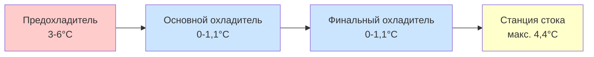

## Основы контроля температуры охлаждения птицы

Контроль температуры во время охлаждения птицы представляет собой критическое пересечение безопасности пищевых продуктов, качества продукции и энергетической эффективности. Основная цель заключается в снижении температуры тушки с примерно 40,6°C после обработки до 4,4°C или ниже в течение установленного времени для предотвращения роста микроорганизмов при одновременном снижении потери влаги и сохранении качества продукции.

Процесс охлаждения следует закону охлаждения Ньютона, модифицированному для сложной геометрии и переменных теплофизических свойств тушек птицы:

$$\frac{dT}{dt} = -hA \frac{(T - T_{\infty})}{mc_p}$$

где $h$ — коэффициент теплоотдачи конвекцией, $A$ — эффективная площадь поверхности, $T$ — температура тушки, $T_{\infty}$ — температура охлаждающей среды, $m$ — масса, а $c_p$ — удельная теплоемкость.

## Нормативные требования к температуре

Правила USDA-FSIS устанавливают конкретные конечные температуры и профили времени-температуры для операций охлаждения птицы. Правила различают различные методы охлаждения и размеры тушек:

| Масса тушки | Максимальная температура | Временной лимит |
|---|---|---|
| ≤0,41 кг | 4,4°C | 4 часа |
| 0,41-0,82 кг | 4,4°C | 6 часов |
| 0,82-1,63 кг | 4,4°C | 8 часов |
| >1,63 кг | 4,4°C | 8-10 часов |

Системы воздушного охлаждения должны достичь внутренней температуры 4,4°C или менее, в то время как погружные системы должны поддерживать температуру охлаждающей воды от 0 до 1,1°C для обеспечения адекватной скорости отвода тепла.

## Контроль температуры при погружном охлаждении

Погружные охладители используют ледяно-водяные суспензии для достижения быстрой теплопередачи через прямой контакт между охлаждающей средой и поверхностью тушки. Стратегия контроля температуры включает три отдельные зоны:

Предохладитель снимает начальную тепловую нагрузку и снижает биологическое загрязнение механическим воздействием стирки. Контроль температуры поддерживает 3-6°C для предотвращения теплового шока при достижении 50-60% от общего снижения температуры. Основной и финальный охладители работают при 0-1,1°C с временем пребывания, рассчитываемым по формуле:

$$t_{residence} = \frac{V_{tank} \times occupancy}{Q_{product}}$$

где $V_{tank}$ — объем резервуара, occupancy — доля объема, заполненная продуктом, а $Q_{product}$ — расход продукта в птицах в час.

Скорость добавления льда должна компенсировать тепловую нагрузку от входящего продукта, механического перемешивания и притока тепла из окружающей среды:

$$\dot{m}_{ice} = \frac{Q_{product} + Q_{mechanical} + Q_{ambient}}{\lambda_{fusion}}$$

где $\lambda_{fusion}$ — удельная теплота плавления льда (335 кДж/кг).

## Контроль температуры при воздушном охлаждении

Системы воздушного охлаждения полагаются на принудительную конвекцию для отвода тепла от подвешенных тушек. Контроль температуры требует точного управления температурой воздуха, скоростью и влажностью для уравновешивания скорости охлаждения против потери влаги.

Скорость охлаждения при воздушном охлаждении зависит от числа Био, которое характеризует отношение внутреннего теплового сопротивления к внешнему конвективному сопротивлению:

$$Bi = \frac{hL_c}{k}$$

где $L_c$ — характеристическая длина (типично половина толщины мышцы грудки) и $k$ — теплопроводность ткани птицы (примерно 0,43 Вт/м·К).

### Профиль температуры многостадийного воздушного охлаждения

| Стадия | Температура воздуха | Скорость воздуха | Относительная влажность | Длительность |
|---|---|---|---|---|
| Стадия 1 | -2 до -1°C | 6,76-8,47 м³/ч (4000-5000 CFM) | 95-98% | 60-90 мин |
| Стадия 2 | 0-1°C | 5,08-6,76 м³/ч (3000-4000 CFM) | 90-95% | 90-120 мин |
| Стадия 3 | 1-2°C | 3,39-5,08 м³/ч (2000-3000 CFM) | 85-90% | 60-90 мин |

Начальная стадия с высокой скоростью и высокой влажностью предотвращает замораживание поверхности при максимизации отвода тепла. Последующие стадии снижают скорость воздуха для минимизации потери влаги при завершении процесса охлаждения.

## Мониторинг температуры и системы контроля

Современные операции охлаждения птицы используют многоуровневые системы контроля температуры, включающие:

**Распределенное датчиковое температурное оборудование**: Датчики RTD (датчик сопротивления температурный), размещенные в стратегических местах, обеспечивают непрерывный мониторинг:
- Температура входящего продукта (±0,3°C точность)
- Температура охлаждающей среды на входе, в середине и на выходе (±0,1°C точность)
- Окончательная температура ядра продукта (±0,3°C точность)

**Пропорционально-интегрально-производная (PID) система управления**: Заданные значения температуры поддерживаются через алгоритмы PID, которые модулируют мощность охлаждения, скорость добавления льда или расходы воздуха. Выход управления следует:

$$u(t) = K_p e(t) + K_i \int_0^t e(\tau)d\tau + K_d \frac{de(t)}{dt}$$

где $e(t)$ — погрешность между установленной и измеренной температурой, а $K_p$, $K_i$, $K_d$ — коэффициенты пропорционального, интегрального и производного усиления.

**Архитектура каскадного управления**: Главный контроллер регулирует окончательную температуру продукта путем корректировки заданных значений для подчиненных контроллеров, управляющих оборудованием охлаждения, ледяными банками или частотно-регулируемыми приводами на циркуляционных насосах и вентиляторах.

## Соображения теплопередачи

Общая скорость теплопередачи в системах охлаждения птицы определяется следующим образом:

$$Q = UA \Delta T_{lm}$$

где $U$ — общий коэффициент теплопередачи, $A$ — эффективная площадь теплопередачи, а $\Delta T_{lm}$ — логарифмическая средняя разность температур между тушкой и охлаждающей средой.

Для погружного охлаждения $U$ варьируется от 280 до 450 Вт/м²·К в зависимости от интенсивности перемешивания. Системы воздушного охлаждения достигают $U$ значений от 85 до 140 Вт/м²·К в типичных условиях эксплуатации.

Тепловая масса тушки птицы создает задержку в реакции температуры, требуя стратегий упреждающего контроля на основе расхода продукта и входящей температуры для предотвращения превышения температуры во время изменений скорости производства.

## Стратегии оптимизации энергии

Стратегии контроля температуры напрямую влияют на нагрузку охлаждения и потребление энергии. Исследования ASHRAE указывают на то, что оптимальный контроль может снизить удельное потребление энергии на 20-30% по сравнению с работой с фиксированной установкой.

**Контроль переменной установки**: Регулировка температуры охладителя на основе реальной температуры продукта и расхода минимизирует нагрузку охлаждения при соблюдении нормативных конечных точек. Эта стратегия снижает среднюю разницу температур, снижая штраф за эффективность Карно:

$$COP_{actual} = \eta_{Carnot} \times COP_{Carnot} = \eta_{Carnot} \times \frac{T_{evap}}{T_{cond} - T_{evap}}$$

**Интеграция теплового аккумулирования**: Ледяные банки или системы хранения гликоля смещают нагрузку охлаждения на внепиковые периоды, снижают платежи за спрос и позволяют работать в более благоприятных условиях окружающей среды для отвода тепла.

**Адаптивное управление**: Алгоритмы машинного обучения анализируют исторические данные для прогнозирования оптимальных параметров управления на основе сезонных вариаций, типов продукции и деградации производительности оборудования, непрерывно улучшая точность температурного контроля и энергетическую эффективность.

## Соображения качества и безопасности

Точность контроля температуры напрямую влияет как на микробиологическую безопасность, так и на атрибуты качества продукции. Чрезмерные скорости охлаждения могут привести к денатурации белков и повышенной потере влаги, в то время как недостаточное охлаждение позволяет росту мезофильных патогенов.

Связь между температурой, временем и микробным ростом следует уравнению Аррениуса для кинетики бактерий, подчеркивая критическую важность поддержания постоянного контроля температуры на протяжении всего процесса охлаждения для обеспечения как соответствия безопасности пищевых продуктов, так и оптимального качества продукции.
