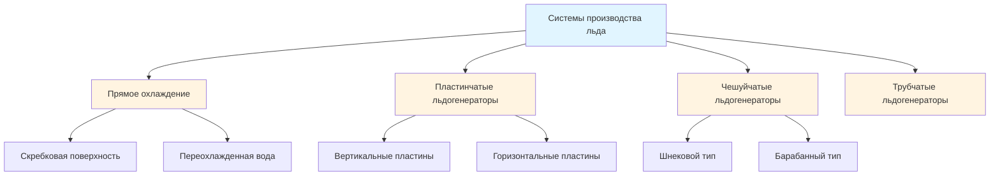
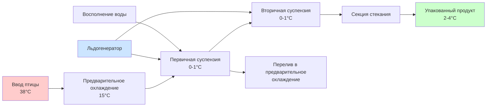

## Обзор охлаждения льдистой суспензией

Охлаждение льдистой суспензией представляет собой передовой метод погружного охлаждения при переработке птицы, сочетающий преимущества быстрой передачи тепла водного погружения с повышенной холодопроизводительностью льда. Система поддерживает суспензию ледяных кристаллов и воды, обычно при 0°C до 1°C, обеспечивая превосходные скорости теплопередачи в сравнении с обычным охлаждением воздухом или системами только с водным погружением.

Основное преимущество вытекает из скрытой теплоты плавления. По мере таяния льда он поглощает 334 кДж/кг без увеличения температуры, обеспечивая значительно большую холодопроизводительность на единицу объема, чем только явное охлаждение. Это позволяет быстрее снизить температуру продукта при сохранении отличного качества поверхности.

## Основы теплопередачи

Скорость охлаждения в системах с льдистой суспензией зависит от множественных механизмов теплопередачи, действующих одновременно. Суммарный коэффициент теплопередачи объединяет конвективную теплопередачу от турбулентного потока суспензии и поглощение скрытой теплоты при таянии льда на поверхности продукта.

Скорость удаления тепла из тушек птицы следует уравнению:

$$Q = hA(T_{\text{product}} - T_{\text{slush}}) + m_{\text{ice}}h_{fg}$$

где:
- $Q$ = общая скорость теплопередачи (Вт)
- $h$ = коэффициент конвективной теплопередачи (Вт/м²·К)
- $A$ = площадь поверхности продукта (м²)
- $T_{\text{product}}$ = температура тушки (°C)
- $T_{\text{slush}}$ = температура суспензии (°C)
- $m_{\text{ice}}$ = скорость таяния льда (кг/с)
- $h_{fg}$ = скрытая теплота плавления, 334 кДж/кг

Коэффициент конвективной теплопередачи в системах с льдистой суспензией обычно составляет от 500-1200 Вт/м²·К, значительно выше, чем в системах охлаждения воздухом (20-50 Вт/м²·К) из-за высокой теплопроводности и турбулентного смешивания суспензии.

## Параметры проектирования системы

### Концентрация льда

Оптимальная концентрация льда уравновешивает холодопроизводительность против текучести суспензии и требований прокачивания. ASHRAE рекомендует доли льда между 25-40% по массе для приложений переработки птицы.

| Концентрация льда | Холодопроизводительность | Текучесть | Мощность прокачивания |
|------------------|------------------------|-----------|----------------------|
| 15-25% | Умеренная | Отличная | Низкая |
| 25-35% | Высокая | Хорошая | Средняя |
| 35-45% | Очень высокая | Удовлетворительная | Высокая |
| >45% | Максимальная | Плохая | Очень высокая |

Зависимость между концентрацией льда и плотностью суспензии:

$$\rho_{\text{slurry}} = \frac{1}{\frac{x}{\rho_{\text{ice}}} + \frac{1-x}{\rho_{\text{water}}}}$$

где $x$ представляет массовую долю льда.

### Контроль температуры

Поддержание температуры суспензии в пределах 0-1°C обеспечивает максимальную стабильность льда, предотвращая замораживание продукта. Стратификация температуры должна быть минимизирована благодаря адекватному перемешиванию, обычно требующему 0,02-0,04 кВт на кубический метр объема резервуара.

Требуемая холодопроизводительность холодильной машины включает:

$$Q_{\text{ref}} = Q_{\text{product}} + Q_{\text{ambient}} + Q_{\text{makeup}} + Q_{\text{pump}}$$

где нагрузка продукта доминирует, рассчитываемая по формуле:

$$Q_{\text{product}} = \dot{m}_{\text{poultry}}c_p(T_{\text{initial}} - T_{\text{final}})$$

Для птицы с удельной теплоемкостью $c_p$ = 3,3 кДж/кг·К снижение температуры с 38°C до 4°C требует приблизительно 112 кДж/кг.

## Методы производства льда

### Чешуйчатые льдогенераторы

Чешуйчатые льдогенераторы производят тонкие ледяные кристаллы (1-2 мм толщиной) с высокими соотношениями площади поверхности к объему, позволяя быстрое таяние и поглощение тепла. Производительность составляет от 500-10 000 кг/ч для промышленных операций переработки птицы.

Эффективность охлаждения для производства чешуйчатого льда:

$$\text{COP}_{\text{ice}} = \frac{h_{fg}}{W_{\text{comp}}}$$

Типичные значения COP варьируются от 2,5-3,5 для аммиачных систем, работающих с температурами испарителя при -10°C до -15°C.

### Системы жидкого льда

Системы жидкого льда или льдистой суспензии генерируют ледяные кристаллы непосредственно в несущей жидкости, производя перекачиваемую смесь, которая может распределяться по всей системе охлаждения. Эти системы используют теплообменники со скребковой поверхностью или генераторы переохлажденной воды.

## Конфигурация технологического потока

Многоступенчатое охлаждение оптимизирует использование льда. Первичный резервуар обрабатывает основное снижение температуры, в то время как вторичный резервуар обеспечивает окончательное охлаждение и температурную однородность. Противоточная конструкция максимизирует термическую эффективность путем воздействия на самый теплый продукт использованной суспензией и на самый холодный продукт свежей льдистой суспензией.

## Микробиологические аспекты

Охлаждение льдистой суспензией обеспечивает быстрое охлаждение, которое минимизирует рост бактерий в критическом диапазоне температур 20-40°C. Положения USDA-FSIS требуют, чтобы тушки птицы достигли 4°C или ниже в установленные сроки для обеспечения безопасности пищевых продуктов.

Система должна поддерживать качество воды посредством непрерывной фильтрации и хлорирования. Типичные уровни свободного хлора составляют от 20-50 ppm для контроля микробных популяций при предотвращении коррозии оборудования.

## Оптимизация производительности

### Перемешивание и поток

Адекватная циркуляция суспензии обеспечивает равномерное распределение льда и предотвращает оседание. Выбор насоса должен учитывать неньютоновское поведение льдистых суспензий, при котором кажущаяся вязкость экспоненциально возрастает выше 35% концентрации льда.

Скорость потока через резервуары охлаждения обычно составляет 0,3-0,6 м/с, обеспечивая достаточную турбулентность для теплопередачи без повреждения поверхности продукта.

### Энергетическая эффективность

Системы льдистой суспензии достигают энергетической эффективности благодаря:

- **Тепловое аккумулирование**: Производство льда в часы с низким спросом снижает пиковый электрический спрос
- **Высокие скорости теплопередачи**: Более короткие времена пребывания снижают объемы резервуаров и потребление воды
- **Оптимизация охлаждения**: Температуры испарителя от -10°C до -12°C уравновешивают скорость производства льда с эффективностью компрессии

Удельное энергопотребление для охлаждения льдистой суспензией составляет 0,15-0,25 кВт·ч на кг переработанной птицы, в зависимости от начальной температуры продукта и целевой конечной температуры.

## Сравнение альтернативных методов

| Метод охлаждения | Скорость охлаждения | Использование воды | Потери выхода | Капитальная стоимость |
|------------------|-------------------|-------------------|---------------|--------------------|
| Охлаждение воздухом | Медленное (2-4 ч) | Нет | 0-2% | Высокая |
| Водное погружение | Быстрое (30-60 мин) | Высокое | 4-12% | Низкая |
| Льдистая суспензия | Очень быстрое (20-40 мин) | Умеренное | 2-6% | Средняя |
| CO₂ снег | Сверхбыстрое (10-15 мин) | Нет | 0-2% | Очень высокая |

Охлаждение льдистой суспензией уравновешивает быстрое охлаждение с умеренным поглощением воды, что делает его подходящим для рынков, где приемлемо некоторое поглощение влаги и требуется быстрая пропускная способность.

## Требования к техническому обслуживанию

Регулярное техническое обслуживание обеспечивает стабильную производительность:

- **Ежедневно**: Контролируйте концентрацию льда, температуру суспензии и уровни хлора
- **Еженедельно**: Очистите переливные экраны и проверьте уплотнения насоса
- **Ежемесячно**: Проверьте производительность холодильной системы и откалибруйте датчики температуры
- **Ежеквартально**: Глубокая очистка резервуаров, проверка оборудования льдогенератора и целостность изоляции

Надлежащее техническое обслуживание поддерживает эффективность теплопередачи и предотвращает загрязнение при продлении срока службы оборудования до 15-20 лет для резервуаров и 10-15 лет для компонентов холодильной системы.

## Соответствие нормативным требованиям

Системы охлаждения льдистой суспензией должны соответствовать нормам USDA-FSIS для переработки птицы, включая 9 CFR Part 381. Ключевые требования включают максимальную температуру тушки 4°C, задокументированные планы HACCP и регулярный мониторинг качества воды.

Стандарт ASHRAE 15 управляет безопасностью холодильной системы, в то время как местные санитарные нормы обычно определяют санитарные процедуры и ведение документации для операций погружного охлаждения.
