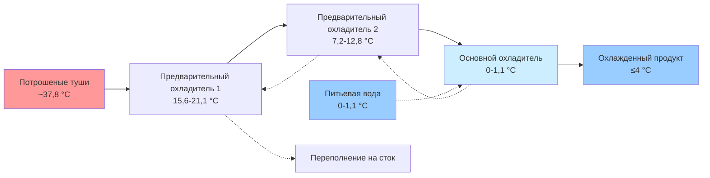
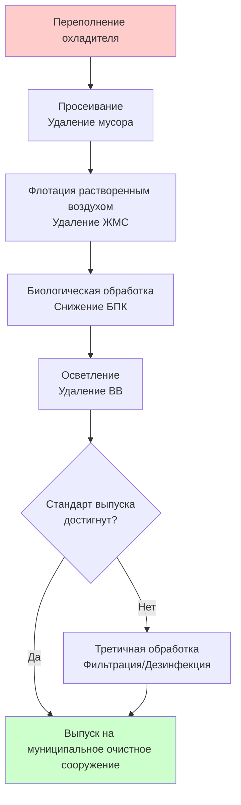

## Обзор

Охлаждение птицы погружением в воду представляет преобладающий метод для быстрого охлаждения туш птицы от температуры после потрошения (приблизительно 37,8 °C) до температуры хранения (ниже 4 °C) на объектах коммерческой переработки. Этот непрерывный процесс сочетает конвективную теплопередачу с требованиями санитарии, достигая скоростей охлаждения, которые предотвращают рост бактерий, сохраняя при этом качество и выход продукции.

Система работает по принципу противоточного потока, где холодная вода входит на конце выпуска и прогрессивно нагревается при потоке, противоположном движению туши, максимизируя тепловую эффективность при соблюдении нормативных требований Управления по безопасности и инспекции пищевых продуктов USDA FSIS (Food Safety and Inspection Service) относительно температуры воды и концентрации хлора.

## Механизмы теплопередачи

### Анализ конвективного охлаждения

Основной механизм удаления тепла сочетает вынужденную конвекцию от движения воды, вызванного мешалкой, с естественной конвекцией от разницы температур. Общая скорость теплопередачи следует формуле:

$$Q = h \cdot A \cdot \Delta T_{lm}$$

Где:
- $Q$ = скорость теплопередачи (кДж/ч)
- $h$ = общий коэффициент теплопередачи (85-140 кДж/ч·м²·°C для охлаждения погружением)
- $A$ = площадь поверхности туши (обычно 0,17-0,20 м² для бройлеров)
- $\Delta T_{lm}$ = логарифмическая средняя разность температур между тушей и водой

Логарифмическая средняя разность температур учитывает изменяющиеся температурные градиенты:

$$\Delta T_{lm} = \frac{(T_{c,in} - T_{w,out}) - (T_{c,out} - T_{w,in})}{\ln\left(\frac{T_{c,in} - T_{w,out}}{T_{c,out} - T_{w,in}}\right)}$$

Где индексы $c$ и $w$ обозначают тушу и воду соответственно, с $in$ и $out$, указывающими условия входа и выхода.

### Профиль снижения температуры

Температура ядра туши следует кривой экспоненциального спада, описываемой уравнением:

$$T(t) = T_w + (T_0 - T_w) \cdot e^{-kt}$$

Где:
- $T(t)$ = температура туши в момент времени $t$ (°C)
- $T_w$ = температура воды (°C)
- $T_0$ = начальная температура туши (°C)
- $k$ = константа охлаждения (0,015–0,025 мин⁻¹ для перемешиваемого погружения)
- $t$ = время погружения (минуты)

USDA FSIS требует достижения внутренней температуры туши 4 °C или ниже, обычно требуя 45–60 минут времени пребывания в правильно спроектированных охладителях.

## Конструкция системы охладителя

### Типы конфигураций

### Расчеты размеров резервуара

Требования к объему охладителя зависят от скорости линии переработки и требуемого времени пребывания:

$$V_{tank} = \frac{n \cdot W_{avg} \cdot t_{res}}{\rho_w \cdot 60}$$

Где:
- $V_{tank}$ = требуемый объем резервуара (л)
- $n$ = производительность птиц в минуту
- $W_{avg}$ = средний вес туши (кг)
- $t_{res}$ = время пребывания (минуты)
- $\rho_w$ = плотность воды (1000 кг/м³ при 4 °C)

Нормативные требования USDA предусматривают минимальное соотношение воды к туше 2,4 л на кг для предварительных охладителей и 4,7 л на кг для основных охладителей.

## Расчеты холодильной нагрузки

### Общее требование охлаждения

Холодильная система должна удалять явное тепло от туш, питьевой воды и преодолевать приток тепла от окружающей среды:

$$Q_{total} = Q_{carcass} + Q_{makeup} + Q_{ambient} + Q_{mechanical}$$

**Явное тепло туши:**
$$Q_{carcass} = \dot{m}_c \cdot c_p \cdot (T_{in} - T_{out})$$

Где:
- $\dot{m}_c$ = скорость потока массы туши (кг/ч)
- $c_p$ = удельная теплоемкость птицы (3,35 кДж/кг·°C выше точки замерзания)
- Разница температур обычно 37,8 °C – 3,3 °C = 34,4 °C

**Охлаждение питьевой воды:**
$$Q_{makeup} = \dot{m}_w \cdot c_{p,w} \cdot (T_{makeup} - T_{chiller})$$

Для объекта производительностью 10 000 птиц в час, обрабатывающего птиц среднего веса 2,27 кг:
- Нагрузка туш: 22 680 кг/ч × 3,35 кДж/кг·°C × 34,4 °C = 2 620 кВ (что эквивалентно примерно 742 кВт)
- Эквивалентное охлаждение: примерно 742 кВт минимум

Коэффициент безопасности 1,25–1,35 применяется для проектной мощности.

## Качество воды и циркуляция

### Требования хлорирования

USDA FSIS требует концентрацию свободного хлора между 20–50 млн⁻¹ в воде охладителя для контроля микробного загрязнения. Спрос на хлор возрастает с:
- Органической нагрузкой от крови и ткани
- Температурой воды (более высокие температуры увеличивают скорость распада)
- pH воды (оптимальная эффективность при pH 6,5–7,5)

Расчет скорости подачи хлора:

$$\dot{m}_{Cl_2} = \frac{C_{target} \cdot Q_{makeup}}{1 000 000} \cdot \rho_w \cdot 60 \cdot 24$$

Где $C_{target}$ — целевая концентрация (млн⁻¹) и $Q_{makeup}$ — скорость подачи питьевой воды (л/мин).

### Гидродинамика противоточного потока

Скорость потока воды через охладитель должна обеспечивать адекватное перемешивание без повреждения туш. Типичные параметры конструкции:

| Параметр | Предварительный охладитель | Основной охладитель |
|----------|--------------------------|---------------------|
| Температура воды | 10-18 °C | 0-3,3 °C |
| Скорость потока | 0,15-0,30 м/с | 0,09-0,18 м/с |
| Скорость мешалки | 20-30 об/мин | 15-25 об/мин |
| Время пребывания | 15-20 мин | 30-45 мин |
| Скорость переполнения | 150-200 % | 100-120 % |

## Сравнение производительности системы

| Метод охлаждения | Капитальные затраты | Эксплуатационные затраты | Расход воды | Потери выхода | Микробиологический контроль |
|------------------|-------------------|--------------------------|------------|--------------|---------------------------|
| Погружение в воду | Средние | Низкие | Высокий (2,4–7,1 л/кг) | Прирост 4-8 % | Отличный |
| Охлаждение воздухом | Высокие | Средние | Минимальный | Потеря 0-2 % | Хороший |
| Гибридные системы | Высокие | Средние | Средний (1,4–2,4 л/кг) | Прирост 2-4 % | Отличный |

Охлаждение птицы погружением в воду парадоксально увеличивает вес туши благодаря поглощению воды, регулируемому USDA максимум до 8 % предохлажденного веса. Это поглощение влаги происходит через градиенты осмотического давления и механическое поглощение в мышечную ткань.

## Альтернативные системы противомикробной защиты

### Применение надуксусной кислоты (ПУК)

ПУК предлагает преимущества перед хлором:
- Эффективна в более широком диапазоне pH (3,0–8,0)
- Отсутствуют канцерогенные побочные продукты дезинфекции
- Низкий потенциал коррозии
- Типичная концентрация: 200–2000 млн⁻¹

**Противомикробная эффективность:**
$$\log_{10} R = k \cdot C^n \cdot t$$

Где:
- $R$ = коэффициент микробного сокращения
- $C$ = концентрация противомикробного средства
- $t$ = время контакта
- $k, n$ = эмпирические константы (зависят от вида)

### Интеграция озона

Озон (O₃) обеспечивает быстрое окисление с минимальными остаточными проблемами:
- Концентрация: 1–5 млн⁻¹ растворенного в воде
- Время контакта: 30–60 секунд для снижения на 2–3 логарифма
- Быстрый распад на кислород исключает химический остаток
- Требует генерирования на месте из кислорода или воздуха

## Стратегии оптимизации энергии

### Применение преобразователя частоты

Внедрение частотных преобразователей на электродвигатели мешалок снижает потребление энергии при:
- Периодах производства с низкой мощностью
- Обработке птицы более легкого веса
- Сезонных колебаниях температуры

Снижение мощности следует законам подобия:
$$\frac{P_2}{P_1} = \left(\frac{N_2}{N_1}\right)^3$$

Где $P$ представляет мощность, а $N$ представляет скорость вращения.

### Интеграция рекуперации тепла

Отходящее тепло от конденсаторов холодильной машины может предварительно нагревать питьевую воду или обеспечивать отопление объекта, улучшая общий коэффициент производительности (COP):

$$COP_{system} = \frac{Q_{useful}}{W_{compressor}}$$

Восстановленное тепло конденсатора обычно обеспечивает 17,5–23,3 кВт на кВт холодильной мощности при температуре конденсации 40,6–46,1 °C.

## Управление сточными водами

### Требования к обработке

Охлаждение погружением в воду порождает существенное количество сточных вод, содержащих:
- Органическое вещество (БПК: 800–1200 мг/л)
- Взвешенные вещества (ВВ: 400–800 мг/л)
- Жиры, масла и смазки (ЖМС: 150–300 мг/л)
- Остаточные противомикробные вещества

**Расчет использования воды:**
$$Q_{wastewater} = n \cdot W_{avg} \cdot R_{water}$$

Где:
- $Q_{wastewater}$ = скорость образования сточных вод (л/ч)
- $n$ = птиц переработано в час
- $W_{avg}$ = средний вес птицы (кг)
- $R_{water}$ = соотношение воды к туше (2,4–7,1 л/кг)

### Технологии обработки

## Соответствие нормативным требованиям

ASHRAE Standard 15 регулирует безопасность холодильных систем, в то время как USDA FSIS 9 CFR Part 381 устанавливает конкретные требования:
- Максимальная температура выхода туши: 4 °C
- Минимальные соотношения воды к туше
- Диапазоны концентрации противомикробных средств (хлор: 20–50 млн⁻¹, ПУК: 200–2000 млн⁻¹)
- Скорости переполнения для контроля фекального загрязнения
- Частота мониторинга и записи температуры

Современные объекты внедряют системы SCADA с непрерывной регистрацией данных для демонстрации соответствия нормативным требованиям и оптимизации эксплуатационной эффективности через корректировки в реальном времени холодильной мощности, скоростей потока воды и систем химической дозировки.

## Мониторинг и управление системой

### Критические контрольные точки

Мониторинг на основе HAZCP сосредоточен на:

| Контрольная точка | Параметр | Лимит | Частота мониторинга |
|------------------|----------|-------|-------------------|
| Вход предварительного охладителя | Температура воды | ≤15,6 °C | Непрерывно |
| Основной охладитель | Температура воды | 0–3,3 °C | Непрерывно |
| Противомикробное средство | Концентрация хлора | 20–50 млн⁻¹ | Каждые 4 часа |
| Выход туши | Внутренняя температура | ≤4 °C | Каждые 1000 птиц |
| Время пребывания | Время задержки | ≥60 минут всего | Непрерывно |

### Автоматизированная стратегия управления

Современные системы используют управление на основе ПЛК:
- Модуляция холодильной мощности на основе температуры входящей воды
- Химическая дозировка пропорционально расходу питьевой воды
- Регулировка скорости мешалки, поддерживающая постоянную скорость потока воды
- Генерирование сигналов тревоги для внеспецификационных условий

Контур управления температурой поддерживает установку охладителя через:
$$\Delta Q_{ref} = K_p \cdot e(t) + K_i \int e(t)dt + K_d \frac{de(t)}{dt}$$

Где $e(t)$ представляет отклонение от установленной температуры, а $K_p$, $K_i$, $K_d$ — константы усиления пропорционального, интегрального и дифференциального действия.

## Ссылки

- ASHRAE Handbook—Refrigeration, Chapter 31: Food Processing Facilities
- USDA FSIS Compliance Guideline for Controlling Salmonella and Campylobacter in Poultry
- ASHRAE Standard 15: Safety Standard for Refrigeration Systems
- 9 CFR Part 381: Poultry Products Inspection Regulations
