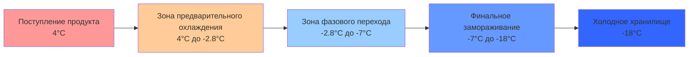

Операции замораживания птицы требуют специализированных холодильных систем, способных быстро удалять как явное, так и скрытое тепло, при этом сохраняя качество продукта. Скорость замораживания напрямую влияет на образование кристаллов льда, сохранение структуры клеток и окончательное качество продукта. Данный анализ рассматривает термодинамические требования, выбор оборудования и параметры проектирования систем для коммерческих объектов замораживания птицы.

## Физика замораживания и теплопередача

Процесс замораживания птицы включает три отдельные термальные фазы. Первоначальное охлаждение явной теплоты снижает температуру продукта с приблизительно 4°C до начальной точки замораживания около -2,8°C. Период фазового перехода удаляет скрытое тепло при кристаллизации воды, происходящий в диапазоне температур от -2,8°C до -7°C из-за понижения точки замораживания растворенными белками и солями. Финальное охлаждение явной теплоты продолжается до целевой температуры хранения, обычно -18°C до -23°C.

Общее удаление тепла на единицу массы:

$$Q_{total} = m \cdot c_{p,above} \cdot (T_{initial} - T_{freeze}) + m \cdot h_{fg,eff} + m \cdot c_{p,frozen} \cdot (T_{freeze} - T_{final})$$

Где:
- $c_{p,above}$ = удельная теплоемкость выше точки замораживания ≈ 3,52 кДж/(кг·К)
- $h_{fg,eff}$ = эффективная скрытая теплота ≈ 235 кДж/кг (содержание влаги 70%)
- $c_{p,frozen}$ = удельная теплоемкость в замороженном состоянии ≈ 1,77 кДж/(кг·К)

Для целой курицы массой 2,0 кг, замороженной с 4°C до -18°C, общее удаление тепла составляет приблизительно 620 кДж на одну птицу.

## Учет скорости замораживания

Скорость замораживания определяет размер и распределение кристаллов льда. Быстрое замораживание (время замораживания < 2 часов) производит небольшие внутриклеточные кристаллы льда, которые минимизируют повреждение клеточной мембраны. Медленное замораживание позволяет образовываться внеклеточному льду и осмотическому обезвоживанию клеток, ухудшая текстуру при размораживании.

Скорость теплопередачи через продукт зависит от теплопроводности, которая изменяется во время замораживания:

$$q = \frac{k_{eff} \cdot A \cdot (T_{surface} - T_{center})}{L_{characteristic}}$$

Теплопроводность увеличивается с приблизительно 0,45 Вт/(м·К) для незамороженной птицы до 1,65 Вт/(м·К) при полном замораживании. Это изменение свойства ускоряет удаление тепла по мере продвижения фронта замораживания внутрь.

## Типы систем замораживания

### Скоростные морозильники

Скоростные морозильники с принудительной циркуляцией воздуха используют высокоскоростной воздух (2,5-6 м/с) при -30°C до -40°C для максимизации конвективной теплопередачи. Продукты размещаются на полках или тележках с интервалом, позволяющим циркулировать воздуху вокруг всех поверхностей. Типичное время замораживания варьируется от 2 до 6 часов в зависимости от размера продукта и скорости воздуха.

Коэффициент конвективной теплопередачи:

$$h_{conv} = C \cdot \rho^{0.8} \cdot v^{0.8} \cdot d^{-0.2}$$

Где более высокая скорость воздуха значительно увеличивает коэффициент теплопередачи, сокращая время замораживания. Испаритель скоростного морозильника работает при -35°C до -45°C с несколькими контурами хладагента для поддержания производительности при накоплении инея.

### Спиральные морозильники

Непрерывные спиральные морозильники с лентой конвейера перемещают продукт через цилиндрическую изолированную камеру с противоточной циркуляцией воздуха. Продукты входят сверху, спускаются по спирали на самоукладывающейся ленте и выходят замороженными внизу. Время пребывания варьируется от 30 до 90 минут в зависимости от толщины продукта и скорости ленты.

Спиральные системы обеспечивают превосходную эффективность использования пространства с производительностью замораживания 2000 до 8000 кг/ч на площади 6 м × 6 м. Производительность испарителя должна соответствовать тепловой нагрузке продукта плюс инфильтрация, обычно требующая 350 до 500 кВт холодопроизводительности для системы 4000 кг/ч.

### Криогенные морозильники

Криогенные морозильники с жидким азотом (LN₂) или жидким диоксидом углерода (LCO₂) достигают чрезвычайно быстрого замораживания путем прямого контакта или распыления. Испарение криогена поглощает тепло непосредственно с поверхностей продукта:

$$q_{cryo} = \dot{m}_{cryo} \cdot (h_{fg,cryo} + c_{p,vapor} \cdot \Delta T)$$

Для жидкого азота при -196°C теплота парообразования равна 199 кДж/кг плюс явное тепло, полученное парами азота. Типичное потребление варьируется от 0,8 до 1,2 кг LN₂ на килограмм замороженного продукта, в зависимости от температуры продукта и целевой скорости замораживания.

Криогенные системы обеспечивают время замораживания менее 15 минут для продуктов порционного размера, минимизируя потери при оттаивании и максимизируя качество. Операционные затраты значительно превышают механическое охлаждение, ограничивая применение высокозначимыми продуктами или узкими местами в производстве.

## Параметры проектирования системы

| Параметр | Скоростной морозильник | Спиральный морозильник | Криогенный туннель |
|-----------|------------------------|----------------------|-------------------|
| Температура воздуха/криогена | -35°C до -40°C | -30°C до -35°C | -50°C до -196°C |
| Время замораживания продукта | 2-6 часов | 30-90 минут | 5-15 минут |
| Скорость воздуха | 2,5-6 м/с | 1,5-3 м/с | 5-10 м/с |
| Дельта Т испарителя | 8-12 К | 10-15 К | N/A |
| Цикл оттайки | 3-4 в день | 2-3 в день | Не требуется |
| Типичная производительность | 500-2000 кг/ч | 2000-8000 кг/ч | 500-3000 кг/ч |
| Энергетические затраты (относительные) | 1,0 | 0,9 | 4,5-6,0 |

## Расчеты холодильной нагрузки

Общая требуемая холодопроизводительность согласно рекомендациям ASHRAE включает:

**Нагрузка от продукта:**
$$Q_{product} = \frac{\dot{m}_{product} \cdot q_{specific}}{3600}$$

**Трансмиссионная нагрузка:**
$$Q_{trans} = U \cdot A \cdot (T_{ambient} - T_{freezer})$$

**Нагрузка от инфильтрации:**
$$Q_{inf} = \frac{n \cdot V \cdot \rho_{air} \cdot \Delta h}{3600}$$

**Нагрузка от оборудования:**
$$Q_{equip} = P_{fans} + P_{conveyors} + P_{lighting}$$

**Нагрузка от персонала:**
$$Q_{personnel} = n_{workers} \cdot q_{person}$$

Для спирального морозильника 4000 кг/ч, работающего при -35°C с площадью поверхности 400 м² и двумя входами, типичное распределение нагрузки:
- Нагрузка от продукта: 380 кВт (75%)
- Трансмиссия: 45 кВт (9%)
- Инфильтрация: 60 кВт (12%)
- Оборудование: 15 кВт (3%)
- Персонал: 5 кВт (1%)
- **Итого: 505 кВт** при температуре испарителя -35°C

## Выбор хладагента и конфигурация системы

Аммиак (R-717) остается доминирующим хладагентом для крупных операций замораживания птицы благодаря превосходным термодинамическим характеристикам, низкой стоимости и нулевому потенциалу глобального потепления. Низкотемпературные применения требуют двухступенчатого сжатия с промежуточным охлаждением для поддержания приемлемых температур нагнетания и степеней сжатия.

Для испарителя при -35°C и конденсации при +35°C одноступенчатое сжатие аммиака дает степень сжатия 18:1 с температурой нагнетания, превышающей 150°C. Двухступенчатое сжатие снижает соотношение до приблизительно 4,2:1 за ступень с промежуточной вспышкой, поддерживая температуры нагнетания ниже 100°C и улучшая объемную эффективность.

Каскадные системы с CO₂ или R-507A на низкой ступени и аммиаком на высокой ступени обеспечивают повышенную эффективность для применений ниже -40°C, хотя добавленная сложность и стоимость ограничивают применение только криогенными предварительными охлаждающими применениями.

## Проектирование воздушного потока и катушки испарителя

Испарительные катушки в морозильниках для птицы должны обеспечивать адекватную площадь поверхности при минимизации перепада давления на стороне воздуха. Расстояние между ребрами варьируется от 4 до 7 мм для сбалансирования поверхности теплопередачи с допуском накопления инея. Большее расстояние уменьшает частоту оттайки, но требует большей площади лица катушки.

Требуемая скорость циркуляции воздуха:

$$\dot{V}_{air} = \frac{Q_{refrigeration}}{\rho_{air} \cdot c_{p,air} \cdot \Delta T_{air}}$$

Для холодопроизводительности 500 кВт с подъемом температуры воздуха 8 К на катушке требуемый воздушный поток равен приблизительно 50 000 м³/ч. Несколько испарителей с отдельными вентиляторами обеспечивают избыточность и улучшенную однородность распределения воздуха.

## Стратегии оттайки

Накопление инея на испарительных катушках снижает воздушный поток и эффективность теплопередачи. Низкотемпературные морозильники требуют циклов оттайки каждые 6-12 часов в зависимости от содержания влаги в продукте и скорости инфильтрации.

**Оттайка горячим газом** циркулирует высокопрессионный пар хладагента через контуры испарителя, обеспечивая быстрое таяние с минимальным увеличением температуры в помещении морозильника. Длительность оттайки варьируется от 20 до 35 минут в зависимости от размера катушки и толщины инея.

**Электрическая оттайка** использует резистивные обогреватели, но значительно увеличивает потребление энергии и колебания температуры морозильника. Применение ограничивается меньшими системами или аварийным резервом.

**Водяная оттайка** быстро удаляет иней, но требует дренажных устройств и увеличивает холодильную нагрузку от конденсатного тепла. Редко используется в морозильниках для птицы из-за опасений образования льда.

Надлежащее завершение оттайки на основе датчиков температуры катушки (обычно 10°C до 15°C) предотвращает чрезмерное использование энергии при обеспечении полного удаления инея.

## Стратегии управления и мониторинга

Продвинутые системы управления морозильником оптимизируют производительность через:

- **Преобразователи частоты** на вентиляторах испарителя, модулирующие воздушный поток на основе нагрузки продукта
- **Управление уровнем жидкого хладагента**, поддерживающее оптимальное питание испарителя
- **Оптимизация графика оттайки** на основе фактического накопления инея, а не фиксированных интервалов
- **Мониторинг температуры продукта** с беспроводными датчиками, отслеживающими профили времени-температуры
- **Системы управления энергией**, балансирующие требования производства против зарядов спроса мощности

Стандарт ASHRAE 15 обеспечивает требования безопасности для холодильных систем. Руководство ASHRAE 3 рассматривает ввод в эксплуатацию и процедуры приемки холодильных систем, специфичные для применений переработки пищевых продуктов.

## Аспекты качества

Чрезмерное время замораживания позволяет образовываться крупным кристаллам льда, разрывая клеточные мембраны и вызывая потери при оттаивании. Целевое время замораживания с 0°C до -5°C (зона максимального образования кристаллов льда) не должно превышать 2 часа для оптимального качества.

Упаковка перед замораживанием защищает продукт от обезвоживания и ледяного ожога. Надлежащая циркуляция воздуха вокруг упакованных продуктов остается необходимой, требующая перфораций упаковки или интервала для обеспечения теплопередачи.

Равномерность температуры по всему морозильному помещению предотвращает частичное замораживание и вариативность качества. Мониторинг температуры в нескольких местоположениях с сигналами тревоги при отклонении ±2°C обеспечивает постоянное качество продукта.
