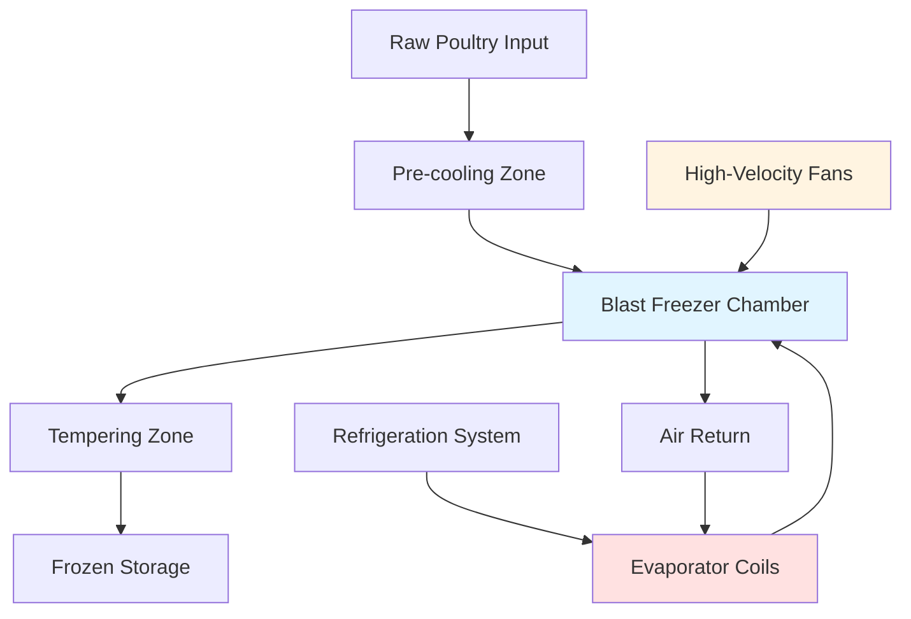

## Основы воздушного скоростного замораживания

Воздушное скоростное замораживание использует принудительную конвекционную теплопередачу для удаления тепловой энергии из продуктов из птицы. Поток охлажденного воздуха высокой скорости проходит по поверхности продукта, создавая коэффициент конвективной теплопередачи, который значительно превышает естественную конвекцию или условия неподвижного воздуха. Этот метод доминирует в коммерческих операциях замораживания птицы благодаря гибкости оборудования, относительно низкой стоимости капитальных вложений и способности замораживать как насыпные, так и упакованные продукты.

Эффективность воздушного скоростного замораживания зависит от трех основных параметров: температуры воздуха, скорости воздуха и геометрии продукта. Типичные температуры воздуха в скоростных морозильных аппаратах находятся в диапазоне от -34°C до -40°C, со скоростью воздуха от 2,5 до 10 м/с. Эти условия обеспечивают баланс между требованиями к скорости замораживания и потреблением энергии, а также потерей веса продукта.

## Анализ теплопередачи

Скорость конвективной теплопередачи от птицы к воздуху следует закону охлаждения Ньютона:

$$Q = h \cdot A \cdot (T_s - T_a)$$

Где:
- Q = скорость теплопередачи (кДж/ч или Вт)
- h = коэффициент конвективной теплопередачи (кДж/ч·м²·K или Вт/м²·K)
- A = площадь поверхности (м²)
- T_s = температура поверхности (°C)
- T_a = температура воздуха (°C)

Коэффициент конвекции увеличивается со скоростью воздуха в соответствии с эмпирическими корреляциями. Для потока через неправильные формы, такие как тушки птицы:

$$h = C \cdot V^{0.6} \cdot D^{-0.4}$$

Где V представляет скорость воздуха, а D — характеристический размер. Это соотношение демонстрирует, что увеличение скорости воздуха в два раза увеличивает коэффициент теплопередачи примерно на 50%.

## Расчеты времени замораживания

Уравнение Планка обеспечивает приблизительную оценку первого порядка для времени замораживания продуктов из птицы:

$$t_f = \frac{\rho \cdot L_f}{T_f - T_a} \left(\frac{P \cdot a}{h} + \frac{R \cdot a^2}{k}\right)$$

Где:
- t_f = время замораживания (ч)
- ρ = плотность (кг/м³)
- L_f = скрытая теплота плавления (кДж/кг)
- T_f = начальная точка замерзания (°C)
- a = толщина (м)
- k = теплопроводность замороженного слоя (Вт/м·K)
- P, R = коэффициенты формы (1/2, 1/8 для бесконечной плиты)

Для птицы типичные значения включают:
- ρ = 1040 кг/м³
- L_f = 247 кДж/кг
- k = 1,47 Вт/м·K

Уравнение показывает, что время замораживания увеличивается с квадратом толщины, что делает геометрию продукта критической для проектирования системы.

## Конфигурация оборудования

### Компоненты системы

**Испарительные катушки**: Катушки низкой температуры работают при температуре от -43°C до -46°C для достижения требуемых температур воздуха. Расстояние между ребрами обычно составляет 4–6 ребер на дюйм для минимизации накопления инея при сохранении эффективности теплопередачи. ASHRAE Refrigeration Handbook, глава 29, указывает циклы разморозки каждые 6–12 часов в зависимости от содержания влаги в продукте.

**Распределение воздуха**: Осевые или центробежные вентиляторы циркулируют 14–28 м³/мин на кВт охлаждения. Мощность вентилятора составляет 5–10% от общего потребления энергии системы. Надлежащее распределение воздуха предотвращает тепловое расслоение и обеспечивает равномерное замораживание по всем поверхностям продукта.

**Размещение продукта**: Размещение птицы влияет на потоки воздуха. Отдельные птицы подвешены на подвесных рельсах или размещены на проволочных сетчатых лотках. Расстояние между продуктами должно позволять циркуляцию воздуха — минимум 5 см между тушками предотвращает ограничение потока воздуха.

## Сравнение рабочих параметров

| Параметр | Непрерывный туннель | Партионная камера | Спиральный морозильный аппарат |
|-----------|------------------|------------|----------------|
| Температура воздуха | -35°C до -40°C | -30°C до -35°C | -35°C до -45°C |
| Скорость воздуха | 1500–2000 м/ч | 500–1000 м/ч | 1000–1500 м/ч |
| Время замораживания (целая птица) | 2–3 часа | 4–6 часов | 2,5–3,5 часа |
| Нагрузка по продукту | Высокая | Средняя | Очень высокая |
| Стоимость капитальных вложений | Высокая | Низкая | Очень высокая |
| Занимаемая площадь | Большая | Средняя | Минимальная |
| Энергетическая эффективность | Хорошая | Удовлетворительная | Отличная |

## Управление процессом

Контроль температуры поддерживает воздух скоростного морозильного аппарата в пределах ±0,5°C от установки. Управление мощностью путем регулирования давления всасывания, байпаса горячего газа или компрессоров с переменной скоростью согласует холодопроизводительность с тепловой нагрузкой. По мере снижения температуры продукта нагрузка на охлаждение уменьшается — эффективное управление предотвращает чрезмерное включение/выключение компрессора.

Мониторинг температуры продукта проверяет завершение замораживания. Температура в центре должна достичь -18°C или ниже. Интеграторы времени-температуры или регистраторы данных отслеживают тепловую историю для соответствия HACCP и обеспечения качества.

## Рассмотрение потерь веса

Испарение влаги с открытых поверхностей птицы вызывает потерю веса (усадку) во время замораживания. Скорость следует уравнению:

$$\dot{m} = h_m \cdot A \cdot (P_{sat}(T_s) - P_{sat}(T_a) \cdot RH)$$

Где h_m представляет коэффициент массопередачи, а P_sat — давление насыщения при соответствующих температурах. Типичные потери веса составляют от 0,5% до 2,0% для целых птиц, при этом более высокие потери наблюдаются для разделанных кусков с большим отношением площади поверхности к массе.

Минимизация потерь веса требует:
- Максимально возможной влажности воздуха (ограничено образованием инея)
- Минимального времени замораживания (сокращение продолжительности воздействия)
- Защитной упаковки (создающей паровой барьер)
- Более низких скоростей воздуха около замороженного состояния

## Энергетическая эффективность

Общее потребление энергии системы включает:
1. Мощность холодильного компрессора (70–80%)
2. Мощность испарительного вентилятора (10–15%)
3. Мощность конденсаторного вентилятора (5–10%)
4. Энергия разморозки (3–5%)

Коэффициент производительности (COP) для систем скоростного замораживания, работающих при температуре испарителя -40°C, обычно находится в диапазоне 1,0–1,5. Потребление энергии на килограмм замороженной птицы в среднем составляет 0,18–0,26 кВт·ч/кг.

Улучшения в эффективности включают:
- Вентиляторы с приводом переменной скорости
- Рекуперацию тепла из магистрали нагнетания компрессора
- Поэтапное замораживание (предварительное охлаждение перед скоростным замораживанием)
- Оптимизированное планирование разморозки

## Рассмотрения при проектировании

Определение размера системы требует точного расчета тепловой нагрузки:

$$Q_{total} = Q_{product} + Q_{infiltration} + Q_{equipment} + Q_{defrost}$$

Нагрузка по продукту доминирует, рассчитывается как расход массы, умноженный на изменение энтальпии от начальной температуры до конечного замороженного состояния. ASHRAE Refrigeration Handbook, глава 20, предоставляет подробную методику для каждого компонента нагрузки.

Вопросы безопасности включают надлежащую вентиляцию для обнаружения утечек хладагента, аварийное освещение в случае отключения питания и температурные сигналы тревоги для защиты продукта. Изолированные панели с минимальным RSI-5,3 снижают приток тепла и повышают эффективность системы.

## Ссылки

- ASHRAE Handbook—Refrigeration, Chapter 29: Food Freezing
- ASHRAE Handbook—Refrigeration, Chapter 20: Thermal Properties of Foods
- USDA Food Safety and Inspection Service: Poultry Processing Guidelines
