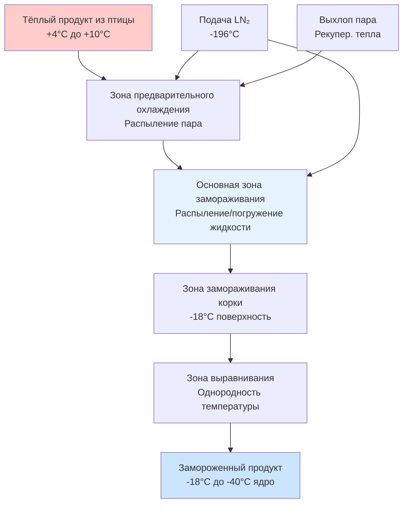
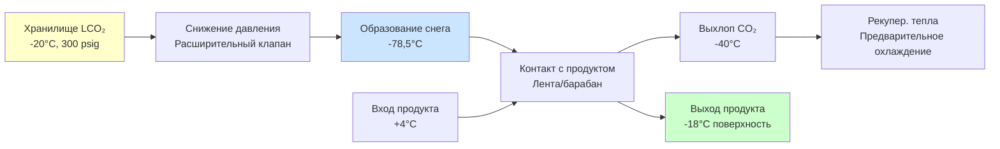

## Обзор технологии криогенного замораживания

Криогенное замораживание использует криогенные охладители при сверхнизких температурах — жидкий азот (LN₂) при -196°C или жидкий/твёрдый углекислый газ при -78,5°C — для достижения чрезвычайно быстрых скоростей замораживания продуктов из птицы. Эта технология обеспечивает скорость замораживания в 5-20 раз выше, чем в обычных механических холодильных системах, что приводит к превосходному качеству продукции благодаря образованию мелких кристаллов льда, минимизирующих повреждение клеток.

Основное преимущество проистекает из исключительно высокого температурного перепада между криогенной средой и продуктом, создавая тепловые потоки 10-50 кВт/м² в сравнении с 0,5-2 кВт/м² в обычных воздушных морозильных камерах.

## Механизмы теплопередачи

Криогенное замораживание включает три первичных режима теплопередачи, действующих одновременно:

**Конвективная теплопередача** возникает, когда криогенный пар течёт по поверхности продукта. Конвективный тепловой поток подчиняется:

$$q_{conv} = h \cdot A \cdot (T_{product} - T_{cryo})$$

где h представляет коэффициент конвективной теплопередачи (обычно 50-200 Вт/м²·К для потока паров LN₂), A — площадь поверхности, а температурный перепад составляет 200-220 К для азотных систем.

**Теплопередача при кипении в пузырьках** доминирует, когда жидкий криоген контактирует непосредственно с поверхностью продукта. Тепловой поток при кипении в пузырьках значительно превышает конвекцию:

$$q_{boiling} = \mu_f \cdot h_{fg} \cdot \left[\frac{g(\rho_f - \rho_g)}{\sigma}\right]^{1/2} \cdot \left[\frac{c_{p,f}(T_s - T_{sat})}{C_{sf} \cdot h_{fg} \cdot Pr_f^n}\right]^3$$

Эта сложная зависимость объясняет, почему системы прямого распыления жидкости достигают коэффициентов теплопередачи 500-2000 Вт/м²·К.

**Криогенное распыление** создаёт наибольшие скорости теплопередачи через тонкое распыление жидкого криогена. Размеры капель 50-500 мкм максимизируют контактную площадь при минимизации потребления криогена.

## Расчёты времени замораживания

Общее время замораживания продуктов из птицы объединяет охлаждение чувствительным теплом и удаление скрытого тепла. Для упрощённой геометрии пластины (филе грудки, котлеты):

$$t_{freeze} = \frac{\rho \cdot d}{2h} \left[c_1(T_i - T_f) + L + c_2(T_f - T_{final})\right]$$

где:
- ρ = плотность продукта (1050-1100 кг/м³ для птицы)
- d = толщина продукта (м)
- h = средний коэффициент теплопередачи (Вт/м²·К)
- c₁ = удельная теплоёмкость выше точки замораживания (3,5 кДж/кг·К)
- c₂ = удельная теплоёмкость ниже точки замораживания (1,8 кДж/кг·К)
- L = скрытая теплота плавления (250-280 кДж/кг для птицы, 75-80% влажности)
- T_i = начальная температура
- T_f = точка замораживания (-2°C до -1,5°C)
- T_final = целевая конечная температура

Для филе куриной грудки толщиной 25 мм с h = 800 Вт/м²·К (распыление LN₂):

$$t_{freeze} = \frac{1075 \times 0.025}{2 \times 800} \left[3.5(4-(-1.5)) + 265 + 1.8(-1.5-(-18))\right] \approx 180 \text{ секунд}$$

## Конфигурации систем и оборудование

| Тип системы | Коэффициент теплопередачи | Скорость замораживания | Эффективность LN₂ | Лучшие применения |
|-------------|---------------------------|------------------------|-------------------|-------------------|
| Погружение/макание | 1500-2000 Вт/м²·К | 10-30 мин | 0,8-1,2 кг/кг | Отдельные куски, IQF |
| Туннель распыления | 600-1200 Вт/м²·К | 15-45 мин | 0,6-0,9 кг/кг | Непрерывная обработка |
| Периодическая камера | 400-800 Вт/м²·К | 30-90 мин | 0,5-0,8 кг/кг | Малые партии, разнообразие |
| Снег CO₂ | 300-600 Вт/м²·К | 45-120 мин | 1,0-1,5 кг/кг | Поверхностная корка, экономия |
| Гибридная (Крио+Мех) | 200-500 Вт/м²·К | 60-180 мин | 0,4-0,6 кг/кг | Высокие объёмы, экономия |

### Туннельные системы жидкого азота

Непрерывные конвейерные туннели представляют наиболее распространённую конфигурацию для высокообъёмной обработки птицы. Продукт проходит через последовательные зоны:

1. **Зона предварительного охлаждения**: Азотный пар из расположенных ниже зон охлаждает продукт от комнатной температуры до близкой к точке замораживания, восстанавливая 30-40% охлаждающей способности криогена
2. **Зона распыления замораживанием**: Несколько распылительных головок подают распылённый LN₂ под давлением 2-8 бар
3. **Зона выравнивания**: Однородность температуры продукта достигается благодаря продолжающемуся воздействию пара

Типичные размеры туннеля: длина 3-15 м, ширина ленты 0,6-2,0 м, производительность 500-5000 кг/ч.

### Системы углекислого газа

Системы с жидким CO₂ работают при температуре подачи -57°C (давление пара 300 фунт-сила/дюйм²) и претерпевают фазовый переход в твёрдый снег и пар. Процесс расширения:

$$\Delta H = m_{CO_2} \cdot h_{sublimation} = m_{CO_2} \times 571 \text{ кДж/кг}$$

CO₂ обеспечивает примерно 50% охлаждающей способности LN₂ на единицу массы, но стоит на 40-60% дешевле, что делает его экономичным для замораживания корки и охлаждения.

## Термодинамическая эффективность и потребление криогена

Теоретическое минимальное потребление криогена определяется из баланса энергии:

$$m_{cryo,min} = \frac{m_{product} \times \Delta H_{product}}{h_{fg,cryo} \times \eta_{recovery}}$$

Для замораживания птицы с +4°C до -18°C при 78% содержании влаги:

$$\Delta H_{product} = 3.5 \times 5.5 + 0.78 \times 335 + 1.8 \times 16.5 \approx 309 \text{ кДж/кг}$$

Энтальпия жидкого азота, доступная (от -196°C до выхлопа при -40°C):

$$h_{available} = 199 \text{ кДж/кг (скрытая)} + 1.04 \times 156 \text{ кДж/кг (чувствительная)} \approx 361 \text{ кДж/кг}$$

Теоретическое потребление: 309/361 = 0,86 кг LN₂/кг продукта

Фактическое потребление колеблется от 0,6-1,2 кг/кг в зависимости от:
- Конструкции оборудования и качества теплоизоляции
- Эффективности рекупер. пара (типично 30-50% восстановления)
- Геометрии продукта и площади поверхности
- Начальной температуры продукта
- Целевой конечной температуры и требований к однородности

## Соображения о качестве продукта

Криогенное замораживание обеспечивает измеримые преимущества качества благодаря быстрому образованию кристаллов льда. Критическая зона (-1°C до -5°C), где происходит максимальная кристаллизация льда, преодолевается за 2-5 минут в сравнении с 30-120 минутами для обычных систем.

**Размер кристаллов льда**: Криогенные методы производят кристаллы среднего диаметра 20-50 мкм в сравнении с 100-200 мкм для воздушного замораживания. Более мелкие кристаллы снижают разрывы клеточных мембран и минимизируют потерю жидкости при размораживании (обычно 2-4% против 6-10%).

**Поверхностное обезвоживание**: Чрезвычайно быстрое замораживание поверхности (10-30 секунд до образования корки) минимизирует миграцию влаги и потерю веса во время обработки. Общее улучшение выхода продукции на 1-3% компенсирует значительные затраты на криоген.

## Экономический анализ и эксплуатационные затраты

| Компонента затрат | Система LN₂ | Система CO₂ | Механический морозильник |
|-------------------|------------|------------|--------------------------|
| Капитальные инвестиции | $150-400/кг/ч | $100-250/кг/ч | $200-500/кг/ч |
| Стоимость криогена/хладагента | $0,30-0,60/кг продукта | $0,15-0,30/кг продукта | $0,05-0,10/кг продукта |
| Стоимость энергии | $0,02-0,05/кг | $0,02-0,04/кг | $0,08-0,15/кг |
| Стоимость обслуживания | $0,01-0,03/кг | $0,01-0,03/кг | $0,04-0,08/кг |
| Стоимость рабочей силы | $0,03-0,06/кг | $0,03-0,06/кг | $0,05-0,10/кг |
| **Общие эксплуатационные затраты** | **$0,36-0,74/кг** | **$0,21-0,43/кг** | **$0,22-0,43/кг** |

Криогенные системы оправдывают более высокие эксплуатационные затраты через:
- Сокращение требуемой площади пола на 50-70%
- Сокращение времени замораживания на 80-90% (повышение пропускной способности)
- Улучшение выхода продукции на 1-3% благодаря снижению обезвоживания
- Превосходное качество продукции, позволяющее команду премиум-цены
- Исключение сложности аммиачной холодильной системы и нормативного бремени

## Требования по безопасности и нормативным актам

Стандарт ASHRAE 15-2019 классифицирует азот и CO₂ как криогены группы A1 (низкая токсичность, отсутствие распространения пламени). Однако опасность асфиксии требует:

- Непрерывного мониторинга кислорода с тревогами при концентрации O₂ 19,5%
- Надлежащей механической вентиляции (минимум 0,5 м³/мин на кг/ч потребления LN₂)
- Размера предохранительных выпусков для максимально возможного выброса криогена
- Обучения персонала обращению с криогенной жидкостью и процедурам в чрезвычайных ситуациях
- Изолированного спецодежды для работ обслуживания (защита от тепла до -196°C)

Нормативные требования OSHA предусматривают протоколы закрытого пространства для внутренней части туннелей и систем вентиляции в соответствии с требованиями 29 CFR 1910.146.

## Интеграция с производственными операциями

Криогенные морозильники интегрируются в линии обработки птицы после:
- Финального мытья и обработки антимикробными веществами
- Снижения времени вытекания (встряхивание/воздушные ножи снижают поверхностную воду)
- Разделения продукта для применений IQF
- Контроля порций и проверки веса

Операции после замораживания включают автоматизированную упаковку, обнаружение металла, проверку веса и передачу в холодное хранилище -18°C. Быстрое образование корки позволяет немедленную обработку и упаковку без деформации продукта или проблем слипания, обычных при более медленных методах замораживания.
