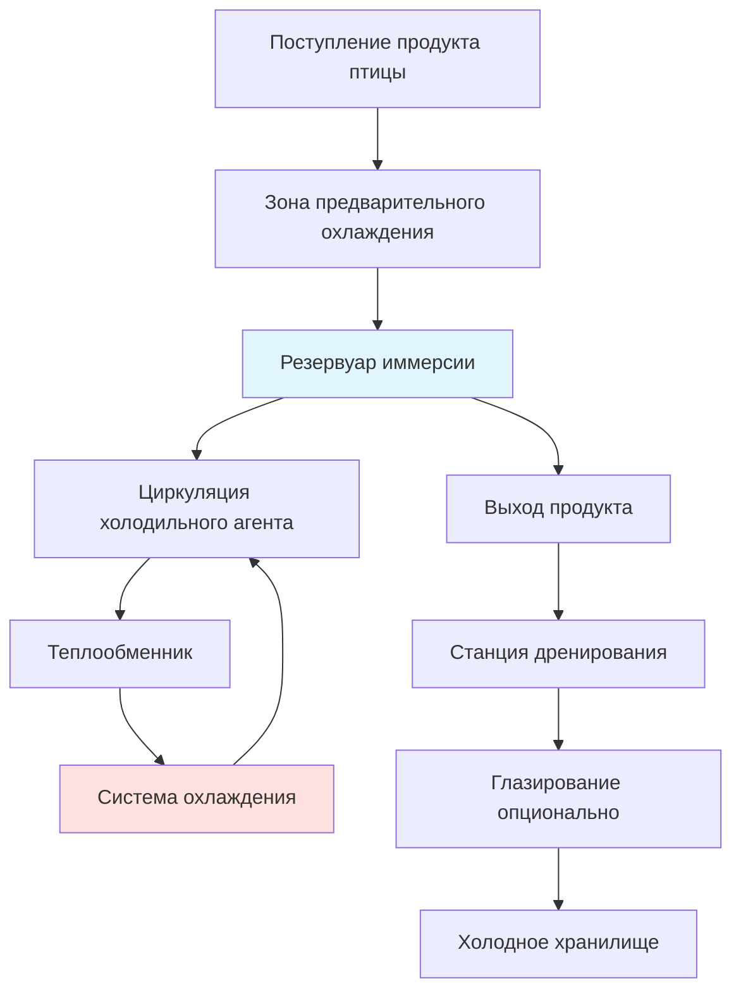
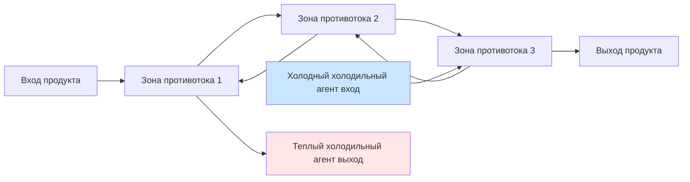

## Обзор системы

Иммерсионное замораживание представляет наиболее быстрый метод замораживания продуктов из птицы посредством прямого контакта между продуктом и циркулирующей средой холодильного агента. Система достигает скорости замораживания в 5-20 раз выше, чем при воздушном взрывном замораживании, благодаря превосходным коэффициентам теплопередачи. Продукт либо погружается, либо опрыскивается охлажденной жидкостью при температурах от -18°C до -40°C, в зависимости от используемого холодильного агента.

Основное преимущество заключается в значительном увеличении коэффициента теплопередачи. При системах воздушного взрывного замораживания h = 25-50 Вт/м²·К, системы иммерсионного замораживания обеспечивают h = 200-2000 Вт/м²·К, снижая время замораживания с часов до минут для типичных порций птицы.

## Основы теплопередачи

### Конвективная теплопередача

Скорость удаления тепла из птицы при иммерсионном замораживании подчиняется закону охлаждения Ньютона:

$$Q = h \cdot A \cdot (T_s - T_{\infty})$$

Где:
- Q = скорость теплопередачи (Вт)
- h = коэффициент конвективной теплопередачи (Вт/м²·К)
- A = площадь поверхности продукта (м²)
- T_s = температура поверхности продукта (°C)
- T_∞ = температура объемного холодильного агента (°C)

Коэффициент теплопередачи зависит от свойств жидкости, скорости потока и геометрии согласно безразмерным корреляциям:

$$Nu = C \cdot Re^m \cdot Pr^n$$

Для водных растворов с вынужденной конвекцией над неправильными формами птицы типичные значения дают числа Нуссельта от 100-500, что соответствует h = 500-1500 Вт/м²·К.

### Прогнозирование времени замораживания

Уравнение Планка, модифицированное для иммерсионного замораживания с поверхностным сопротивлением:

$$t_f = \frac{\rho L}{T_f - T_m} \left( \frac{P \cdot a}{h} + \frac{R \cdot a^2}{k_f} \right)$$

Где:
- t_f = время замораживания (с)
- ρ = плотность продукта (кг/м³)
- L = скрытая теплота плавления (334 кДж/кг для воды)
- T_f = точка замерзания (-2°C для птицы)
- T_m = температура среды (°C)
- a = характерное измерение (м)
- k_f = теплопроводность замороженного слоя (Вт/м·К)
- P, R = коэффициенты формы (P=1/2, R=1/8 для бесконечной плиты)

## Типы сред с холодильным агентом

### Водные растворы

| Тип раствора | Диапазон температур | Преимущества | Ограничения |
|--------------|-------------------|------------|-------------|
| Раствор хлорида натрия | -18°C до -21°C | Низкая стоимость, безопасен для пищи | Коррозионный, проникновение соли |
| Раствор хлорида кальция | -25°C до -35°C | Более низкая точка замерзания | Горький вкус при абсорбции |
| Раствор пропиленгликоля | -30°C до -40°C | Нетоксичен, некоррозионный | Более высокая вязкость, стоимость |
| Растворы глицерола | -20°C до -30°C | Пищевая категория, низкая коррозия | Дорогостоящий, высокая вязкость |

Концентрация рассола влияет на депрессию точки замерзания согласно:

$$\Delta T_f = K_f \cdot m \cdot i$$

Где K_f — криоскопическая постоянная, m — моляльность, i — фактор ван-т-Гоффа.

### Криогенные жидкости

Жидкий азот (LN₂) при -196°C и жидкий CO₂ при -78°C обеспечивают чрезвычайно быстрое замораживание. Коэффициенты теплопередачи достигают 2000 Вт/м²·К благодаря механизмам теплопередачи при кипении с образованием пузырьков. Эти системы применяются для индивидуального быстрого замораживания (IQF) кусков птицы, где ультра-быстрое замораживание сохраняет клеточную структуру.

## Конструктивные соображения оборудования

### Конфигурация резервуара

Резервуары иммерсии имеют длину от 2-10 метров для непрерывных систем. Ширина вмещает поддоны для продуктов или конвейеры, обычно 0,8-1,5 метра. Глубина поддерживает 0,3-0,5 метра жидкости над продуктом для обеспечения полного погружения.

Конструкция резервуара использует нержавеющую сталь (304 или 316) для устойчивости к коррозии. Толщина теплоизоляции 100-150 мм пенополиуретана поддерживает тепловую эффективность. Дно наклонено на 2-3% к точкам дренирования для облегчения очистки.

### Системы циркуляции

Скорость циркуляции холодильного агента 0,3-0,8 м/с поддерживает высокие коэффициенты теплопередачи при предотвращении чрезмерного перемешивания продукта. Центробежные насосы, рассчитанные на 20-40 объемов резервуара в час, обеспечивают надлежащую циркуляцию.

Требования к мощности насоса:

$$P_{pump} = \frac{\dot{V} \cdot \Delta P}{\eta_{pump}}$$

Где типичные перепады давления составляют 50-150 кПа по циклу циркуляции.

### Холодопроизводительность

Общая нагрузка охлаждения включает:

1. **Нагрузка охлаждения продукта** (доминирующая):
   - Удаление чувствительного тепла выше точки замерзания
   - Скрытая теплота плавления
   - Удаление чувствительного тепла ниже точки замерзания

2. **Потери передачи** через теплоизоляцию (5-10% от нагрузки продукта)

3. **Инфильтрация** от входа/выхода продукта (2-5%)

4. **Добавление тепла от насоса** к холодильному агенту (3-8%)

Коэффициент безопасности 15-20% учитывает пиковые нагрузки и будущую емкость.

## Оптимизация производительности системы

### Регулирование температуры

Однородность температуры холодильного агента в пределах ±1°C во всем резервуаре обеспечивает последовательное качество продукта. Датчики температуры на входе, выходе и в середине резервуара обеспечивают обратную связь с системой охлаждения. Системы прямого расширения (DX) реагируют быстрее, чем закачиваемые вторичные системы, но требуют более сложного управления.

### Конструкция схемы потока

Противоточное расположение максимизирует температурный перепад и эффективность. Свежий холодильный агент контактирует с почти замороженным продуктом, где скорость теплопередачи наиболее низка, в то время как более теплый холодильный агент предварительно охлаждает поступающий продукт.

## Соображения качества продукта

Быстрое замораживание минимизирует размер кристаллов льда, сохраняя клеточную структуру и снижая потерю капель при оттаивании. Диаметр кристаллов льда уменьшается со 100-150 мкм при медленном воздушном замораживании до 20-40 мкм в системах иммерсии.

Увеличение веса от абсорбированного холодильного агента (2-4% для водных растворов) требует последующего дренирования. Время удержания 30-60 секунд на вибрирующих экранах удаляет поверхностную жидкость. Некоторые переработчики применяют это как контролируемый процесс глазирования для сохранения влаги во время хранения в замороженном состоянии.

## Стандарты конструкции ASHRAE

ASHRAE Handbook - Refrigeration (Глава 29: Охлаждение при переработке пищевых продуктов) содержит критерии проектирования для систем иммерсионного замораживания. Ключевые рекомендации включают:

- Температура холодильного агента на 15-20°C ниже желаемой температуры ядра продукта
- Минимальная скорость циркуляции 0,3 м/с для надлежащей конвекции
- Санитарная конструкция согласно стандартам 3-A для легкости очистки
- Материалы пищевой категории согласно нормативам FDA

Мониторинг температуры согласно требованиям стандарта ASHRAE 15 по безопасности и документации критических контрольных точек HACCP обеспечивает безопасность продукта и соответствие нормативам.

## Показатели энергетической эффективности

Удельное энергопотребление для иммерсионного замораживания:

$$SEC = \frac{E_{total}}{m_{product}}$$

Типичные значения составляют 180-280 кВт·ч на метрическую тонну замороженной птицы в сравнении с 220-350 кВт·ч/т для систем воздушного взрывного замораживания. Сокращенное время замораживания компенсирует повышенную энергию циркуляционного насоса за счет сокращения времени работы компрессора и снижения потерь передачи.

Коэффициент производительности для полной системы включая прокачку:

$$COP_{system} = \frac{Q_{refrigeration}}{W_{compressor} + W_{pumps}}$$

Оптимизированные системы достигают значений COP 1,8-2,5 при типичных условиях эксплуатации.

## Санитария и техническое обслуживание

Ежедневные протоколы очистки включают полный дренаж холодильного агента, горячее ополаскивание (60-70°C), циркуляцию щелочного моющего средства, кислотное полоскание для удаления минеральных отложений и применение санитайзера. Автоматизированные системы чистки на месте (CIP) снижают трудозатраты и обеспечивают последовательность.

Замена холодильного агента происходит при превышении пределов загрязнения или снижении концентрации ниже эффективного диапазона. Измерения проводимости или рефрактометра контролируют крепость рассола еженедельно. Системы фильтрации непрерывно удаляют твердые частицы во время эксплуатации.
