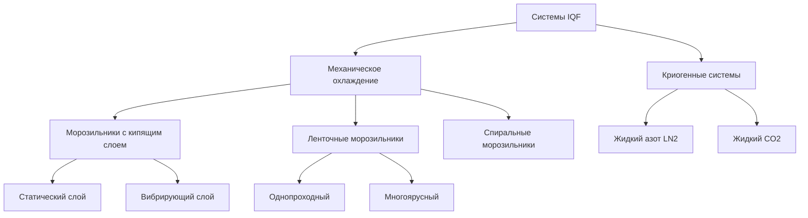
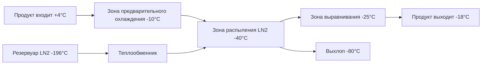

## Обзор технологии IQF

Индивидуальная быстрая заморозка (IQF) представляет наиболее продвинутый метод заморозки продуктов птицы, производящий отдельные замороженные кусочки с минимальным образованием кристаллов льда и максимальным сохранением качества продукта. Системы IQF замораживают небольшие порции птицы (нарезанная курица, полоски, наггетсы, крылья) с экстремально высокой скоростью, обычно достигая времени заморозки 3-15 минут по сравнению с 2-4 часами для традиционной шоковой заморозки.

Основное преимущество вытекает из физики теплопередачи: меньшие размеры продукта и более высокие скорости воздуха генерируют превосходные коэффициенты теплопередачи, обеспечивающие быстрое снижение температуры через критическую зону (-1°C до -5°C), где происходит образование кристаллов льда.

## Основы теплопередачи

### Расчет времени заморозки

Модифицированное уравнение Планка предсказывает время заморозки для неправильно сформированных кусочков птицы:

$$t_f = \frac{\rho_f \lambda}{T_m - T_a} \left(\frac{P \cdot d}{h} + \frac{R \cdot d^2}{k_f}\right)$$

Где:
- $t_f$ = время заморозки (с)
- $\rho_f$ = плотность замороженного продукта (950-1050 кг/м³ для птицы)
- $\lambda$ = удельная теплота плавления (250-280 кДж/кг для птицы)
- $T_m$ = начальная температура замерзания (-2°C для птицы)
- $T_a$ = температура воздуха (-30°C до -40°C для IQF)
- $P$, $R$ = коэффициенты формы (0,5, 0,125 для сфер)
- $d$ = характерный размер (м)
- $h$ = коэффициент поверхностной теплопередачи (Вт/м²·K)
- $k_f$ = коэффициент теплопроводности замороженного продукта (1,8-2,0 Вт/м·K)

### Коэффициент конвективной теплопередачи

Для систем IQF с использованием высокоскоростного воздуха:

$$h = \frac{Nu \cdot k_{air}}{d}$$

С числом Нуссельта для обтекания частиц:

$$Nu = 2.0 + 0.6 \cdot Re^{0.5} \cdot Pr^{0.33}$$

Число Рейнольдса в кипящих слоях IQF обычно колеблется в диапазоне 500-5000, производя коэффициенты теплопередачи 100-250 Вт/м²·K, по сравнению с 20-40 Вт/м²·K в традиционных морозильниках.

## Типы систем IQF

### Морозильники с кипящим слоем

Системы с кипящим слоем достигают оптимальной теплопередачи путем взвешивания кусочков продукта в потоках высокоскоростного холодного воздуха (5-8 м/с). Воздух поступает вверх через перфорированный пояс, создавая состояние кипящего слоя, где продукты перемешиваются и разделяются, обеспечивая равномерное воздействие морозящего воздуха.

**Параметры эксплуатации:**
- Температура воздуха: -35°C до -40°C
- Скорость воздуха: 5-8 м/с на уровне продукта
- Глубина слоя: 50-100 мм
- Время пребывания: 5-12 минут
- Снижение температуры продукта: +4°C до -18°C

Перепад давления по слою продукта следует:

$$\Delta P = \frac{(1-\epsilon) \cdot \rho_p \cdot g \cdot L}{\epsilon}$$

Где $\epsilon$ - пористость слоя (0,4-0,6) и $L$ - глубина слоя.

## Сравнение систем

| Тип системы | Скорость заморозки (мм/ч) | Энергопотребление (кВт·ч/т) | Капитальные затраты | Качество продукта | Типичная производительность (кг/ч) |
|-------------|--------------------------|------------------------------|-------------------|------------------|-----------------------------------|
| Кипящий слой | 25-50 | 80-120 | Высокие | Отличное | 500-3000 |
| Ленточный морозильник | 15-30 | 90-130 | Средние | Очень хорошее | 1000-5000 |
| Спиральный морозильник | 12-25 | 85-125 | Очень высокие | Хорошее | 2000-8000 |
| LN₂ криогенный | 100-200 | 150-250* | Низкие | Отличное | 200-2000 |
| CO₂ криогенный | 80-150 | 140-230* | Низкие | Отличное | 200-2000 |

*Включает эквивалентную энергию производства криогена

## Расчеты холодильной нагрузки

Полная холодильная нагрузка для систем IQF:

$$Q_{total} = Q_{product} + Q_{air} + Q_{trans} + Q_{equipment}$$

### Нагрузка продукта

$$Q_{product} = \dot{m}_p \left[c_{p,above}(T_i - T_m) + \lambda + c_{p,below}(T_m - T_f)\right]$$

Для птицы с содержанием влаги 75%:
- $c_{p,above}$ = 3,5 кДж/кг·K (незамороженный)
- $c_{p,below}$ = 1,8 кДж/кг·K (замороженный)
- $\lambda$ = 265 кДж/кг

### Нагрузка инфильтрации воздуха

$$Q_{air} = \dot{V}_{air} \cdot \rho_{air} \cdot c_{p,air} \cdot \Delta T$$

Туннели IQF с высокой циркуляцией воздуха (85-95%) минимизируют эту нагрузку по сравнению с открытыми конвейерными системами.

## Рассмотрения проектирования процесса

### Система распределения воздуха

Надлежащее распределение воздуха обеспечивает равномерную заморозку по слою продукта. Перфорированный пояс или пол требует:

- Открытая площадь: 40-50% от общей поверхности
- Диаметр отверстия: 6-10 мм
- Скорость через перфорации: 10-15 м/с
- Давление в плену: 500-1000 Па

### Конструкция испарителя

Низкотемпературные испарители для приложений IQF требуют:

**Выбор хладагента:**
- Аммиак (R-717): Наиболее общий для крупных систем
- R-404A: Рассмотрения поэтапного отказа
- R-448A, R-449A: Замены с низким ПГП

**Параметры катушки:**
- TD (разность температур): 6-8 K
- Температура испарения: -42°C до -45°C
- Расстояние между ребрами: 6-8 мм (с горячим газовым разморозкой)
- Скорость воздуха со стороны: 2,5-3,5 м/с

### Системы разморозки

Испарители IQF быстро накапливают иней из-за высокой циркуляции воздуха и низких температур. Конструкция цикла разморозки:

$$t_{defrost} = \frac{m_{frost} \cdot \lambda_{ice} + m_{coil} \cdot c_p \cdot \Delta T}{Q_{defrost}}$$

Циклы горячего газового разморозки обычно происходят каждые 4-8 часов, продолжаясь 15-30 минут.

## Криогенные системы IQF

Криогенные системы IQF с жидким азотом достигают сверхбыстрой заморозки путем прямого контакта криогена:

$$Q_{LN2} = \dot{m}_{LN2} \left[\lambda_{vap,LN2} + c_{p,N2}(T_{product} - T_{LN2})\right]$$

С $\lambda_{vap,LN2}$ = 200 кДж/кг при -196°C, криогенные системы извлекают тепло в 50-100 раз быстрее, чем механическое охлаждение. Скорость потребления обычно колеблется от 0,8-1,2 кг LN₂ на кг продукта.

## Параметры контроля качества

### Размер кристаллов льда

Скорость заморозки прямо влияет на размеры кристаллов льда:

$$d_{crystal} \propto \frac{1}{\sqrt{N}}$$

Где $N$ - скорость зародышеобразования. Системы IQF производят кристаллы размером 30-50 мкм по сравнению со 100-200 мкм при медленной заморозке, минимизируя повреждение клеток и потерю от стекания при оттаивании.

### Контроль обезвоживания

Потеря поверхностной влаги во время заморозки:

$$\frac{dm}{dt} = h_m \cdot A \cdot (P_{sat,surface} - P_{air})$$

Низкие температуры воздуха и высокая относительная влажность (>90%) в туннелях IQF минимизируют потерю веса до <0,5% по сравнению с 1-3% в традиционных системах.

## Оптимизация энергоэффективности

### Регулирование скорости вентилятора

Регулирование скорости воздуха на основе нагрузки продукта:

$$P_{fan} \propto V^3$$

Приводы с переменной частотой снижают энергопотребление вентилятора на 20-40% при работе с частичной нагрузкой.

### Рекуперация тепла

Отводимое тепло от конденсаторов аммиака (35-40°C) может обеспечить:
- Отопление зданий (зимний период)
- Горячую воду для санитарии
- Предварительный подогрев воздуха разморозки

Эффективность рекуперации 40-60% снижает общее энергопотребление на 15-25%.

## Справочные материалы ASHRAE

Руководство проектирования согласно справочнику ASHRAE—Холодильные системы:
- Глава 29: Проектирование охлаждаемых объектов
- Глава 30: Коммерческие методы заморозки
- Глава 51: Продукты птицы

Расчеты холодильной нагрузки следуют требованиям стандарта ASHRAE 15 (Стандарт безопасности холодильных систем) для вентиляции машинного отделения и обнаружения хладагента.

## Лучшие практики эксплуатации

**Подготовка продукта:**
- Равномерный размер кусочков (±15% вариация размера)
- Удаление поверхностной влаги (воздушные ножи)
- Предварительное охлаждение до +2°C до +4°C
- Мониторинг температуры продукта (инфракрасные датчики)

**Мониторинг системы:**
- Профили температуры воздуха (6-10 точек вдоль туннеля)
- Температура ядра продукта (выборочное тестирование)
- Перепад давления испарителя (индикатор накопления инея)
- Перегрев хладагента (целевое значение 8-12 K)
- Тенденции энергопотребления

**График обслуживания:**
- Ежедневно: Удаление остатков продукта, очистка дренажей
- Еженедельно: Выравнивание ленты, проверка подшипников
- Ежемесячно: Тестирование утечек хладагента, проверка изоляции
- Ежеквартально: Мониторинг тока электродвигателя вентилятора, анализ вибрации
- Ежегодно: Очистка катушки испарителя, полная наладка системы

Технология IQF представляет оптимальный баланс между качеством продукта, пропускной способностью и энергоэффективностью для высокостоимостных продуктов птицы, требующих премиум-класса производительности заморозки.
