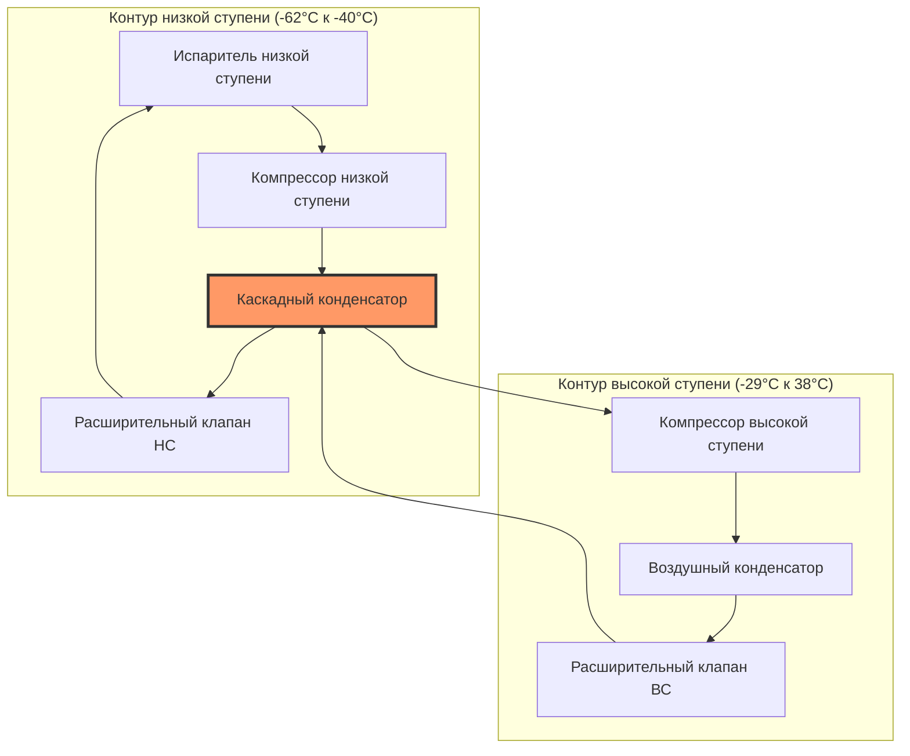

# Системы промышленного охлаждения

Системы промышленного охлаждения обслуживают крупномасштабные приложения охлаждения, включая холодильные склады, пищевые производства, химическое производство, ледовые катки и промышленное охлаждение процессов. Эти системы принципиально отличаются от коммерческого охлаждения по масштабу, выбору хладагента, архитектуре системы и рабочим давлениям.

## Архитектуры систем

Промышленное охлаждение использует три основные конфигурации систем, каждая оптимизирована для определенных диапазонов производительности и требований приложений.

### Системы прямого расширения

Системы прямого расширения (DX) испаряют хладагент непосредственно в охлаждающих змеевиках. Хладагент циркулирует через испаритель один раз, с паром, возвращающимся в компрессор. DX системы работают с меньшими первоначальными затратами, но требуют больших зарядов хладагента и более обширных трубопроводных сетей.

**Ключевые характеристики:**
- Заряд хладагента: 0,9-1,8 кг на кВт охлаждения
- Перегрев испарителя: 4,4-6,7°C на линии всасывания
- Требования скорости возврата масла: минимум 2,1 м/с в вертикальных стояках
- Применимо для нагрузок до 1,758 кВт на контур

### Системы жидкостного переполнения

Системы жидкостного переполнения рециркулируют хладагент в соотношениях 2:1 к 6:1 (циркулируемого к испаренному). Ресивер низкого давления поставляет жидкий хладагент к испарителям через гравитационную или насосную циркуляцию. Пар и неиспарившаяся жидкость возвращаются в ресивер низкого давления, где происходит разделение.

Коэффициент рециркуляции влияет на производительность теплопередачи:

$$q = \dot{m} h_{fg} \eta$$

Где:
- $q$ = производительность охлаждения (кДж/ч)
- $\dot{m}$ = массовый расход хладагента (кг/ч)
- $h_{fg}$ = скрытая теплота испарения (кДж/кг)
- $\eta$ = эффективность испарителя (обычно 0,85-0,95)

**Преимущества:**
- Уменьшенный перегрев в испарителях (1,1-2,2°C)
- Улучшенные коэффициенты теплопередачи (на 15-25% выше, чем DX)
- Лучшее управление маслом в крупных системах
- Более низкие температуры нагнетания на компрессорах

### Каскадные системы

Каскадные системы используют два отдельных контура охлаждения, работающих на разных температурных уровнях. Система высокой ступени отводит тепло от конденсатора низкой ступени. Эта конфигурация необходима для приложений ниже -51°C, где одноступенчатое сжатие становится нецелесообразным.

## Выбор хладагента

Промышленное охлаждение преимущественно использует аммиак (R-717) и углекислый газ (R-744) из-за термодинамической эффективности, экологических соображений и экономики эксплуатации.

| Свойство | Аммиак (NH3) | CO2 (R-744) | R-507A |
|----------|---------------|-------------|---------|
| ODP | 0 | 0 | 0 |
| GWP | <1 | 1 | 3 985 |
| Токсичность (ASHRAE 34) | B2L | A1 | A1 |
| Критическая температура | 132,2°C | 31°C | 70,6°C |
| Скрытая теплота при -18°C | 1 310 кДж/кг | 279 кДж/кг | 151 кДж/кг |
| Плотность жидкости при -18°C | 673 кг/м³ | 1 028 кг/м³ | 1 331 кг/м³ |
| Рабочее давление при -18°C | 209,4 кПа | 2 096 кПа | 494 кПа |

### Аммиачные системы

Аммиак обеспечивает превосходную термодинамическую производительность с высокой скрытой теплотой и отличными свойствами теплопередачи. Хладагент работает при умеренных давлениях (207-1 723 кПа) и обеспечивает исключительную энергетическую эффективность.

**Рассмотрения проектирования согласно ASHRAE 15 и стандартам IIAR:**
- Требования к машинному отделению для количеств, превышающих пороговое значение
- Системы обнаружения утечек обязательны в занятых помещениях
- Аварийная вентиляция: минимум 30 воздухообменов в час
- Выпуск давления в атмосферу или утвержденную систему обработки
- Требования к средствам индивидуальной защиты персонала

### CO2 охлаждение

Системы с углекислым газом работают в докритическом или трансккритическом режимах. Докритические системы функционируют ниже критической точки (31°C, 7 381 кПа), в то время как трансккритические системы превышают критическое давление во время отвода тепла.

Производительность трансккритического CO2 охлаждения:

$$q = \dot{m} (h_1 - h_4)$$

Где:
- $h_1$ = энтальпия на входе газового охладителя (кДж/кг)
- $h_4$ = энтальпия на входе испарителя (кДж/кг)

Подходящая температура газового охладителя значительно влияет на эффективность системы, с оптимальными давлениями нагнетания, варьирующимися в зависимости от внешних условий.

## Выбор компрессора

Промышленные системы используют поршневые, винтовые и центробежные компрессоры на основе требований производительности и операционных характеристик.

### Поршневые компрессоры

Поршневые компрессоры обслуживают приложения от 17,6 до 1 758 кВт на единицу. Многоцилиндровые конфигурации обеспечивают управление производительностью через разгрузку цилиндров.

Объемный коэффициент полезного действия:

$$\eta_v = 1 + C - C \left(\frac{P_d}{P_s}\right)^{1/n}$$

Где:
- $C$ = коэффициент мертвого объема (обычно 0,03-0,06)
- $P_d$ = давление нагнетания (кПа)
- $P_s$ = давление всасывания (кПа)
- $n$ = политропный показатель (1,1-1,3 для аммиака)

### Винтовые компрессоры

Ротационные винтовые компрессоры доминируют в промышленных приложениях от 352 до 10 562 кВт на единицу. Конструкции с двойными винтами обеспечивают непрерывное сжатие с минимальными вибрациями и отличной эффективностью при частичной нагрузке благодаря управлению производительностью слайд-клапана.

**Характеристики производительности:**
- Возможность коэффициента давления: до 20:1 одноступенчатое
- Встроенный коэффициент объема: 2,5-5,0 (оптимизирован для приложения)
- Эффективность при частичной нагрузке: 75-95% при 50% производительности
- Впрыск масла охлаждения снижает температуры нагнетания

## Оборудование отвода тепла

### Испарительные конденсаторы

Испарительные конденсаторы сочетают отвод тепла и испарение воды в одном блоке. Водяные форсунки распыляют воду на поверхность змеевика конденсатора, в то время как воздух проходит через увлажненный материал, достигая температур конденсации на 5,6-8,3°C выше температуры мокрого термометра окружающей среды.

Производительность отвода тепла:

$$q_c = \dot{m}_r (h_2 - h_3) = \dot{m}_a (h_{a,out} - h_{a,in})$$

Где:
- $\dot{m}_r$ = массовый расход хладагента (кг/ч)
- $h_2$ = энтальпия нагнетаемого газа (кДж/кг)
- $h_3$ = энтальпия сконденсированной жидкости (кДж/кг)
- $\dot{m}_a$ = массовый расход воздуха (кг/ч)

**Параметры проектирования согласно ASHRAE 15:**
- Минимальное давление конденсации для возврата масла: 517 кПа для аммиака
- Требования качества воды: 500-800 мг/л общего растворенного вещества
- Скорость продувки: 0,2-0,5% рециркуляции для управления концентрацией минералов
- Защита от замерзания при зимней эксплуатации обязательна

### Аммиачные конденсаторы

Трубчатые конденсаторы аммиака позиционируют хладагент в корпусе с водой или гликолем в трубах. Горизонтальные конфигурации с несколькими проходами труб оптимизируют теплопередачу при сохранении дренажа масла.

Общий коэффициент теплопередачи варьируется от 852 до 1 703 кДж/(ч·м²·°C) в зависимости от скорости хладагента, материала трубок и факторов загрязнения.

## Циркуляция жидкого хладагента

Системы циркуляции жидкого переполнения насосом циркулируют хладагент с использованием центробежных или объемных насосов. Надлежащий расчет размера насоса требует анализа чистого положительного напора всасывания (NPSH) для предотвращения кавитации.

Требуемый NPSH:

$$NPSH_r = \frac{P_{sat} - P_{vap}}{\rho g} + \frac{v^2}{2g} + z$$

Где:
- $P_{sat}$ = давление насыщения при температуре откачки (кПа)
- $P_{vap}$ = давление пара (кПа)
- $\rho$ = плотность жидкости (кг/м³)
- $g$ = гравитационная постоянная (9,81 м/с²)
- $v$ = скорость жидкости (м/с)
- $z$ = напор по высоте (м)

Аммиачные насосы требуют минимального NPSH 2,4-3,7 м для обеспечения надежной эксплуатации. Охлаждение жидкости на 2,8-5,6°C на входе насоса предотвращает образование паровых пузырей.

## Безопасность и соответствие нормативам

Системы промышленного охлаждения должны соответствовать ASHRAE 15 (Стандарт безопасности систем охлаждения), стандартам IIAR и местным нормативам. Ключевые требования включают:

- Классификация машинного отделения согласно IBC и IMC
- Системы обнаружения хладагента и аварийного отключения
- Размер устройства сброса давления согласно ASME Section VIII
- Аварийная вентиляция, связанная с обнаружением хладагента
- Программы обучения персонала и управления хладагентом
- Двойной сброс давления для сосудов с внутренним объемом более 0,042 м³

Количества хладагента запускают конкретные требования безопасности. Системы, превышающие 4 536 кг аммиака, требуют комплексных программ управления безопасностью процессов согласно OSHA 29 CFR 1910.119.

Проектирование системы промышленного охлаждения интегрирует термодинамический анализ, соответствие требованиям безопасности и операционную эффективность для обеспечения надежного крупномасштабного охлаждения критических промышленных процессов.
