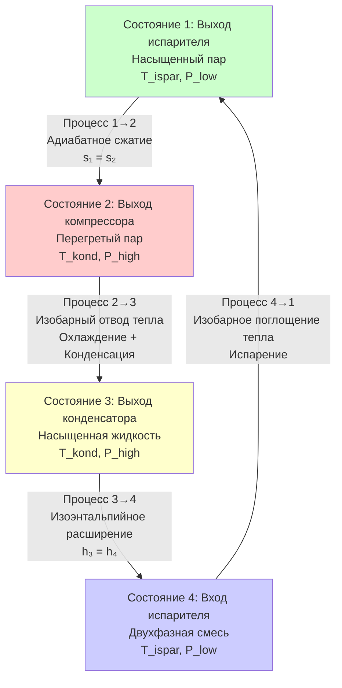
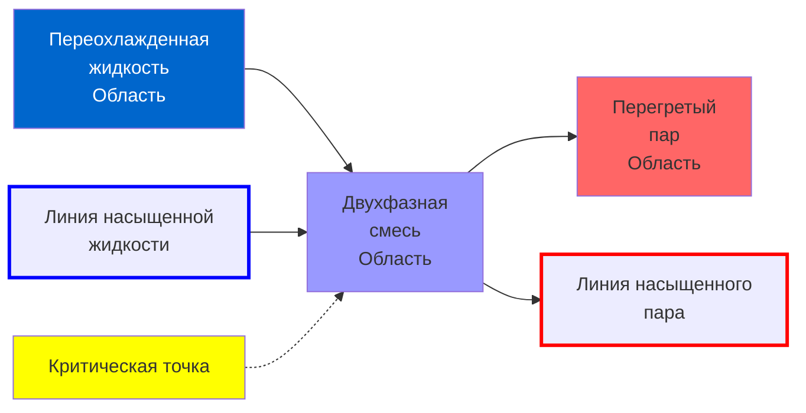
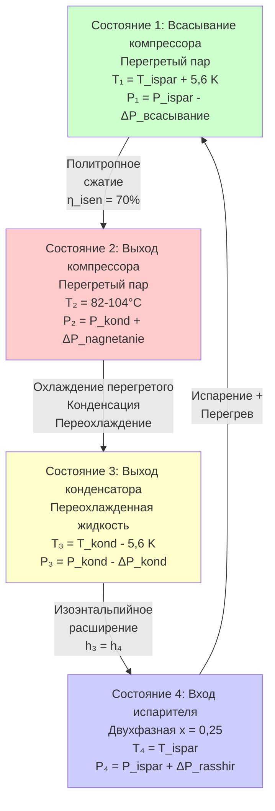
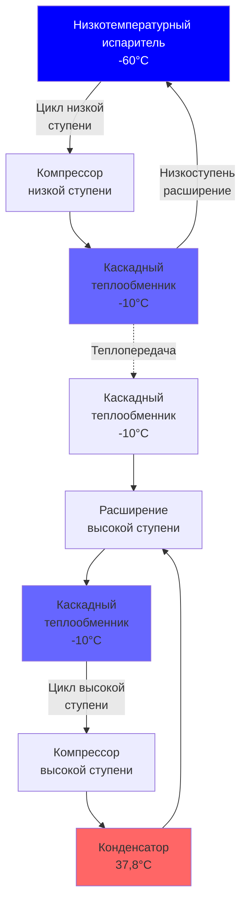

# Цикл парокомпрессионного охлаждения: Термодинамический анализ и оптимизация производительности

Цикл парокомпрессионного охлаждения представляет собой доминирующую технологию механического охлаждения и кондиционирования воздуха в мировом масштабе. Этот цикл использует термодинамические свойства хладагентов — в частности их поведение при фазовых переходах при практических температурах и давлениях — для передачи тепла из холодных помещений в горячие резервуары. Понимание фундаментальной термодинамики, взаимодействия компонентов и ограничений производительности систем парокомпрессионного охлаждения позволяет инженерам проектировать, оптимизировать и диагностировать оборудование охлаждения — от бытовых кондиционеров до промышленных аммиачных систем с пропускной способностью сотни тонн.

## Фундаментальные термодинамические принципы

### Основание обратного цикла Карно

Цикл парокомпрессионного охлаждения работает как обратная тепловая машина, потребляя механическую работу для передачи тепла против градиента температуры. Теоретический максимальный КПД любого цикла охлаждения, работающего между двумя тепловыми резервуарами, определяется коэффициентом производительности Карно:

$$COP_{Carnot} = \frac{T_L}{T_H - T_L}$$

Где:
- $T_L$ = абсолютная температура холодного резервуара (K)
- $T_H$ = абсолютная температура горячего резервуара (K)

COP Карно устанавливает термодинамический предел. Реальные циклы парокомпрессионного охлаждения достигают 40-70% от Carnot COP из-за необратимостей в процессах сжатия, теплопередачи и расширения.

### Анализ второго закона термодинамики

Второй закон термодинамики требует работы для охлаждения. Генерирование энтропии количественно определяет необратимости:

$$\dot{S}_{gen} = \sum \frac{\dot{Q}}{T} + \dot{m}(s_{out} - s_{in}) \geq 0$$

Минимизация генерирования энтропии посредством:
- Уменьшения перепадов температур в теплообменниках
- Улучшения адиабатического КПД компрессора
- Минимизации перепадов давления в трубопроводах хладагента
- Уменьшения потерь при дросселировании в расширительных устройствах

напрямую улучшает эффективность цикла.

## Идеальный цикл парокомпрессионного охлаждения

Идеальный цикл парокомпрессионного охлаждения состоит из четырех обратимых процессов:

### Процесс 1→2: Адиабатное сжатие

Компрессор повышает давление хладагента от давления испарителя к давлению конденсатора при постоянной энтропии (идеально):

$$s_2 = s_1$$

Работа, затраченная на единицу массы:

$$w_{comp} = h_2 - h_1$$

Для идеальных газообразных хладагентов температура на выходе может быть приближена:

$$T_2 = T_1 \left(\frac{P_2}{P_1}\right)^{(\gamma-1)/\gamma}$$

Где $\gamma$ = отношение теплоемкостей ($c_p/c_v$)

Степень сжатия оказывает фундаментальное влияние на эффективность:

$$r_p = \frac{P_{kond}}{P_{ispar}}$$

Типичные степени сжатия:
- Кондиционирование воздуха (R-410A): 2,5-4,0
- Среднетемпературное охлаждение (R-404A): 4,0-6,0
- Низкотемпературное охлаждение (R-404A): 6,0-12,0
- Каскадные системы: 3,0-5,0 на стадию

### Процесс 2→3: Изобарная конденсация

Конденсатор отводит тепло при постоянном давлении через три отчетливых зоны:

**Зона охлаждения перегретого пара (2→2'):**
$$q_{raskhlazhd} = c_p(T_2 - T_{sat,kond})$$

Типично 10-30% от общего отвода тепла конденсатором.

**Зона конденсации (2'→3'):**
$$q_{kondensac} = h_{fg}$$

Где $h_{fg}$ = энтальпия парообразования при температуре конденсации. Это представляет 60-80% от общего отвода тепла.

**Зона переохлаждения (3'→3):**
$$q_{pereokhl} = c_p(T_{sat,kond} - T_3)$$

Переохлаждение улучшает эффективность цикла без штрафа. Типично 3-11 K переохлаждения.

Общий отвод тепла в конденсаторе:
$$q_{kond} = h_2 - h_3$$

### Процесс 3→4: Изоэнтальпийное расширение

Расширительное устройство (термостатический расширительный клапан, электронный расширительный клапан или капиллярная трубка) снижает давление хладагента от давления конденсатора к давлению испарителя через необратимый процесс дросселирования:

$$h_4 = h_3$$

Этот процесс генерирует энтропию:

$$\Delta s_{expansion} = s_4 - s_3 > 0$$

Степень сухости (доля пара) на входе испарителя:

$$x_4 = \frac{h_4 - h_{f,ispar}}{h_{fg,ispar}}$$

Где:
- $h_{f,ispar}$ = энтальпия насыщенной жидкости при давлении испарителя
- $h_{fg,ispar}$ = энтальпия парообразования при давлении испарителя

Типичные диапазоны степени сухости: 0,20-0,40 (20-40% пара)

Более высокая степень сухости снижает эффективность испарителя, так как двухфазная смесь поступает с меньшей чувствительной теплоемкостью охлаждения.

### Процесс 4→1: Изобарное испарение

Испаритель поглощает тепло при постоянном давлении, преобразуя жидкий хладагент в пар:

$$q_{ispar} = h_1 - h_4$$

Это представляет эффект охлаждения — полезное охлаждение, доставляемое циклом.

Для насыщенного всасывания (Состояние 1 = насыщенный пар):

$$q_{ispar} = h_{g,ispar} - h_4$$

Где $h_{g,ispar}$ = энтальпия насыщенного пара при давлении испарителя.

## Диаграммы термодинамического цикла

### Диаграмма давление-энтальпия (P-h)

Диаграмма P-h обеспечивает наиболее практичный инструмент для анализа цикла охлаждения. Логарифмическая ось давления и линейная ось энтальпии ясно показывают:

- **Линии постоянной температуры** (изотермы): Горизонтальные в двухфазной области, кривые в областях перегрева/переохлаждения
- **Линии постоянной энтропии** (изоэнтропы): Вертикальные в двухфазной области, наклонные в области перегрева
- **Линии постоянного качества**: Расходятся от критической точки через двухфазную область
- **Линии постоянного удельного объема**: Используются для расчета рабочего объема компрессора

**Расположение точки состояния на диаграмме P-h:**

**Состояние 1** (всасывание компрессора):
- Расположено на линии насыщенного пара (идеально) или в области перегрева (практически)
- Давление = давление испарителя
- Энтальпия определяет эффект охлаждения

**Состояние 2** (выход компрессора):
- Расположено в области перегретого пара
- Давление = давление конденсатора
- Энтропия приблизительно равна энтропии Состояния 1 (движется вправо и вверх)

**Состояние 3** (выход конденсатора):
- Расположено на линии насыщенной жидкости (идеально) или в области переохлаждения (практически)
- Давление = давление конденсатора (постоянно от Состояния 2)
- Энтальпия определяет условие на входе расширительного клапана

**Состояние 4** (вход испарителя):
- Расположено в двухфазной области
- Давление = давление испарителя
- Энтальпия равна энтальпии Состояния 3 (горизонтальная линия от Состояния 3)

Диаграмма P-h позволяет прямой расчет:
- Эффект охлаждения: $q_{ispar} = h_1 - h_4$ (горизонтальное расстояние)
- Работа сжатия: $w_{comp} = h_2 - h_1$ (следует изоэнтропе от Состояния 1)
- Отвод тепла: $q_{kond} = h_2 - h_3$ (горизонтальное расстояние)

### Диаграмма температура-энтропия (T-s)

Диаграмма T-s подчеркивает термодинамическую эффективность и генерирование энтропии. Область под кривыми процесса представляет теплопередачу:

$$q = \int T \, ds$$

Диаграмма T-s раскрывает:
- **Эффективность Карно**: Площадь прямоугольного цикла
- **Генерирование энтропии**: Горизонтальное расстояние между Состояниями 3 и 4 показывает необратимость дросселирования
- **Теплопередача**: Площади под кривыми 2→3 (конденсатор) и 4→1 (испаритель)

**Представление цикла на диаграмме T-s:**

Процесс 1→2: Вертикальная линия (идеальное адиабатное сжатие) или линия, наклоняющаяся вправо (реальное сжатие с генерированием энтропии)

Процесс 2→3: Кривая, снижающаяся и смещающаяся влево по мере охлаждения хладагента, конденсации при постоянной температуре, затем переохлаждения

Процесс 3→4: Горизонтальная линия вправо (энтропия увеличивается во время необратимого дросселирования)

Процесс 4→1: Кривая, поднимающаяся и смещающаяся вправо во время испарения при постоянной температуре

Замкнутая область представляет чистую затраченную работу:

$$w_{net} = \oint T \, ds = q_{kond} - q_{ispar}$$

## Анализ коэффициента производительности (COP)

### Определения COP

**COP режима охлаждения** (цель охлаждение):

$$COP_R = \frac{Q_{ispar}}{W_{comp}} = \frac{q_{ispar}}{w_{comp}} = \frac{h_1 - h_4}{h_2 - h_1}$$

**COP режима теплового насоса** (цель отопление):

$$COP_{HP} = \frac{Q_{kond}}{W_{comp}} = \frac{q_{kond}}{w_{comp}} = \frac{h_2 - h_3}{h_2 - h_1}$$

**Фундаментальная взаимосвязь:**

$$COP_{HP} = COP_R + 1$$

Эта взаимосвязь вытекает из сохранения энергии: $Q_{kond} = Q_{ispar} + W_{comp}$

### Energy Efficiency Ratio (EER) и Seasonal EER (SEER)

В США эффективность кондиционирования воздуха использует EER и SEER вместо COP:

$$EER = \frac{\text{Производительность охлаждения (кДж/ч)}}{\text{Мощность входа (кВт)}}$$

**Преобразование:**
$$EER = COP_R \times 3.412$$

$$SEER = \text{Сезонное охлаждение (кДж)} / \text{Сезонная мощность (кВт·ч)}$$

SEER учитывает частичную нагрузку, циклические потери и переменные наружные температуры. Текущие минимальные требования SEER:
- Бытовые сплит-системы: SEER 14-15 (региональные варианты)
- Высокоэффективные системы: SEER 18-25
- Системы с переменной скоростью: SEER 20-30

### Влияние рабочих температур на COP

COP уменьшается по мере увеличения температурного подъема $(T_{kond} - T_{ispar})$:

Для приложений охлаждения (охлаждение):
- **Кондиционирование воздуха** (35°C наружный, 7°C испаритель): COP 3,5-5,0
- **Среднетемпературное охлаждение** (32°C окружающая среда, -7°C испаритель): COP 2,5-3,5
- **Низкотемпературное охлаждение** (32°C окружающая среда, -29°C испаритель): COP 1,5-2,5
- **Сверхнизкая температура** (32°C окружающая среда, -40°C испаритель): COP 1,0-1,5

Для приложений теплового насоса (отопление):
- **Мягкий климат** (7°C наружный, 49°C конденсация): COP 3,5-4,5
- **Холодный климат** (-8°C наружный, 49°C конденсация): COP 2,0-3,0
- **Экстремальный холод** (-20°C наружный, 49°C конденсация): COP 1,5-2,0

## Детальный анализ компонентов

### Термодинамика и производительность компрессора

Компрессор приводит в действие цикл охлаждения, потребляя большинство мощности системы. Производительность компрессора определяет общую эффективность цикла.

**Адиабатический КПД:**

$$\eta_{isen} = \frac{h_{2s} - h_1}{h_2 - h_1}$$

Где:
- $h_{2s}$ = идеальная энтальпия на выходе (адиабатное сжатие от Состояния 1 до $P_2$)
- $h_2$ = фактическая энтальпия на выходе

Типичные адиабатические КПД:
- Поршневые компрессоры: 65-75%
- Спиральные компрессоры: 65-75%
- Винтовые компрессоры: 70-80%
- Центробежные компрессоры: 75-85%

**КПД объемный:**

$$\eta_{vol} = \frac{\dot{m}_r}{(\rho_1 \cdot \dot{V}_{displ})}$$

Где:
- $\dot{m}_r$ = фактический массовый расход (кг/мин)
- $\rho_1$ = плотность хладагента на всасывании (кг/м³)
- $\dot{V}_{displ}$ = объемный расход рабочего объема компрессора (м³/мин)

Объемный КПД учитывает:
- Повторное расширение газа мертвого объема
- Перепад давления через клапаны (поршневые)
- Внутренние утечки мимо поршней или спиралей
- Нагревание хладагента от двигателя и сжатия

Типичные объемные КПД: 60-85%

**Расчет рабочего объема компрессора:**

$$\dot{V}_{displ} = \frac{Q_{ispar}}{\eta_{vol} \cdot \rho_1 \cdot (h_1 - h_4)}$$

Это определяет требуемый физический размер компрессора.

**Мощность компрессора:**

$$W_{comp} = \frac{\dot{m}_r (h_2 - h_1)}{\eta_{mech}}$$

Где $\eta_{mech}$ = механический КПД (95-98%)

**Ограничения температуры на выходе:**

Чрезмерная температура на выходе вызывает:
- Деградацию масла (> 120-149°C для большинства масел)
- Разложение хладагента
- Повреждение клапанов
- Сниженный срок служения компрессора

Температура на выходе для адиабатного сжатия:

$$T_2 = T_1 \left(\frac{P_2}{P_1}\right)^{(\gamma-1)/\gamma}$$

Для реального сжатия с КПД $\eta_{isen}$:

$$T_2 = T_1 + \frac{T_{2s} - T_1}{\eta_{isen}}$$

### Анализ теплопередачи конденсатора

Конденсатор отводит тепло цикла в окружающую среду через принудительную или естественную конвекцию. Производительность конденсатора напрямую влияет на давление в системе и эффективность цикла.

**Скорость теплопередачи:**

$$Q_{kond} = UA \cdot LMTD$$

Где:
- $U$ = общий коэффициент теплопередачи (кВт/(м²·K))
- $A$ = площадь поверхности теплопередачи (м²)
- $LMTD$ = логарифмическое среднее температурное расстояние (K)

**Логарифмическое среднее температурное расстояние** для противоточной конфигурации:

$$LMTD = \frac{\Delta T_1 - \Delta T_2}{\ln(\Delta T_1 / \Delta T_2)}$$

Где:
- $\Delta T_1$ = перепад температур на одном конце
- $\Delta T_2$ = перепад температур на другом конце

**Температура приближения конденсатора:**

$$\Delta T_{approach} = T_{kond} - T_{ambient}$$

Типичные температуры приближения:
- Воздушные конденсаторы: 8-17 K
- Водяные конденсаторы: 3-8 K
- Испарительные конденсаторы: 6-11 K

Меньший перепад требует большей площади теплопередачи, но улучшает COP, снижая давление конденсации.

**Коэффициенты теплопередачи в зонах:**

Зона охлаждения перегретого пара (охлаждение газа):
$$U_{raskhlazhd} = 0,3-0,85 \text{ кВт/(м²·K)}$$

Зона конденсации (фазовый переход):
$$U_{kondensac} = 5,7-17 \text{ кВт/(м²·K)}$$

Зона переохлаждения (охлаждение жидкости):
$$U_{pereokhl} = 1,1-3,4 \text{ кВт/(м²·K)}$$

Зона конденсации обеспечивает большинство теплопередачи благодаря высокому $U$ и большому температурному движущему напору.

### Анализ теплопередачи испарителя

Испаритель поглощает тепло из охлаждаемого помещения или процесса. Конструкция испарителя влияет на производительность, осушение воздуха и образование инея.

**Скорость теплопередачи:**

$$Q_{ispar} = UA \cdot LMTD$$

**Температурная разница испарителя (TD):**

$$TD = T_{space} - T_{ispar}$$

Типичные TD:
- Комфортное кондиционирование воздуха: 8-14 K
- Среднетемпературное охлаждение: 6-8 K
- Низкотемпературное охлаждение: 4-7 K
- Технологическое охлаждение (рассол): 3-6 K

Меньший TD требует большего испарителя, но улучшает COP, повышая давление испарителя.

**Чувствительное против латентного охлаждения:**

При кондиционировании воздуха испаритель обеспечивает как чувствительное охлаждение (снижение температуры), так и латентное охлаждение (осушение):

$$Q_{total} = Q_{sensible} + Q_{latent}$$

Отношение чувствительного тепла (SHR):

$$SHR = \frac{Q_{sensible}}{Q_{total}}$$

Типичные диапазоны SHR: 0,65-0,85

Более низкий SHR (более высокое осушение) требует более низкой температуры испарителя, снижая COP.

**Образование инея:**

Когда температура поверхности испарителя падает ниже 0°C и точка росы воздуха > 0°C, на поверхностях катушки накапливается иней. Иней увеличивает перепад давления воздушной стороны и снижает теплопередачу, требуя периодических циклов оттаивания.

Методы оттаивания:
- Электрическое сопротивление
- Горячий газ (реверсивный цикл)
- Водяное оттаивание
- Воздушное оттаивание (выключенный цикл)

### Анализ расширительного устройства

Расширительное устройство дозирует расход хладагента и поддерживает разность давлений между конденсатором и испарителем.

**Термостатический расширительный клапан (TXV):**

TXV модулирует расход хладагента для поддержания постоянного перегрева:

$$\Delta T_{superheat} = T_1 - T_{sat,ispar}$$

Целевой перегрев: 3-8 K

TXV уравновешивает три давления:
- Давление в колбе (определение перегрева)
- Давление испарителя (противодействие)
- Давление пружины (регулируемое)

**Пропускная способность клапана:**

$$\dot{m}_r = C \sqrt{\Delta P \cdot \rho_L}$$

Где:
- $C$ = коэффициент пропускной способности клапана
- $\Delta P$ = перепад давления на клапане
- $\rho_L$ = плотность жидкости выше по потоку

**Электронный расширительный клапан (EEV):**

Управляемые микропроцессором клапаны с шаговым двигателем обеспечивают:
- Точное управление перегревом (±0,6 K)
- Адаптивные алгоритмы управления
- Интеграцию с компрессорами переменной скорости
- Оптимизированную эффективность в диапазоне нагрузок

**Капиллярная трубка:**

Расширительное устройство с фиксированным отверстием для малых систем (< 12 кВт). Скорость расхода зависит от:
- Длины и внутреннего диаметра трубки
- Разности давлений
- Переохлаждения хладагента

Критическая длина капиллярной трубки:

$$L = f(D, \Delta P, \Delta T_{pereokhl})$$

Определяется эмпирически или по графикам производителя.

## Реальный цикл парокомпрессионного охлаждения

Реальные циклы отклоняются от идеального цикла из-за практических ограничений и необратимостей:

### Отклонения от идеального цикла

**1. Перегрев всасывания компрессора:**

Реальные системы поддерживают 3-11 K перегрева на всасывании компрессора для предотвращения жидкого гидравлического удара. Это смещает Состояние 1 в область перегретого пара.

Влияние на производительность:
- Небольшое увеличение эффекта охлаждения: $\Delta h_{ispar} = c_p \cdot \Delta T_{superheat}$
- Повышенная температура на выходе компрессора
- Сниженный объемный КПД компрессора (более низкая плотность всасывания)
- Чистый эффект: Типично снижение COP на 0-5%

**2. Переохлаждение в конденсаторе:**

Переохлаждение сконденсированной жидкости на 3-11 K ниже температуры насыщения увеличивает эффект охлаждения без увеличения работы сжатия.

Влияние на производительность:
- Увеличенный эффект охлаждения: $\Delta h_{pereokhl} = c_p \cdot \Delta T_{subcool}$
- Предотвращает газообразование в жидкостной линии
- Чистый эффект: Улучшение COP на 2-8% на 5,6 K переохлаждения

**3. Перепады давления в трубопроводах и теплообменниках:**

Перепады давления из-за трения и ускорения возникают в:
- Линии всасывания (выход испарителя к компрессору)
- Линии нагнетания (компрессор к конденсатору)
- Жидкостной линии (конденсатор к расширительному клапану)

Перепад давления в линии всасывания особенно вреден:
- Снижает давление всасывания компрессора
- Увеличивает степень сжатия
- Снижает объемный КПД
- Типичный штраф: потеря COP на 1-2% на 6,9 кПа

Ограничения проектирования:
- Линия всасывания: < 13,8 кПа (эквивалентно < 0,6-1,1 K изменения температуры насыщения)
- Линия нагнетания: < 34,5 кПа
- Жидкостная линия: Любой размер приемлем (нет фазового перехода)

**4. Неадиабатное сжатие:**

Реальные компрессоры генерируют энтропию из-за:
- Трения
- Теплопередачи к/от стенок цилиндра
- Дросселирования через клапаны
- Повторного расширения мертвого объема

Адиабатический КПД количественно определяет это отклонение: типично 65-85%

**5. Теплопередача к/от окружающей среды:**

- Прирост тепла в линии всасывания увеличивает перегрев, снижая производительность
- Переохлаждение жидкостной линии может улучшить производительность, если намеренное
- Потеря/прирост тепла в корпусе компрессора влияет на КПД

### Практическое представление цикла

## Свойства хладагентов и их выбор

### Теплофизические свойства

Идеальные свойства хладагента:
- **Высокая энтальпия парообразования**: Снижает массовый расход для данной производительности
- **Умеренные уровни давления**: Диапазон работы 210-2070 кПа избегает вакуума или крайне высоких давлений
- **Высокая критическая температура**: Обеспечивает конденсацию при температурах окружающей среды
- **Низкий удельный объем**: Снижает рабочий объем компрессора
- **Высокая теплопроводность**: Улучшает производительность теплообменника
- **Низкая вязкость**: Снижает перепады давления

### Экологические свойства

**Потенциал разрушения озона (ODP):**

$$ODP = \frac{\text{Разрушение озона хладагентом}}{\text{Разрушение озона R-11}}$$

- CFC (R-11, R-12): ODP = 0,6-1,0 (запрещены)
- HCFC (R-22): ODP = 0,055 (выключены)
- HFC, HFO, естественные хладагенты: ODP = 0

**Потенциал глобального потепления (GWP):**

$$GWP = \frac{\text{Климатическое воздействие 1 кг хладагента за 100 лет}}{\text{Климатическое воздействие 1 кг CO₂ за 100 лет}}$$

Текущий нормативный фокус: Килальский поправкой требует снижения HFC.

| Хладагент | Тип | ODP | GWP (100-лет) | Применение |
|-----------|-----|-----|---------------|-----------|
| **Выключены** |
| R-12 | CFC | 1,0 | 10 900 | Устаревший (автомобильный, холодильники) |
| R-22 | HCFC | 0,055 | 1 810 | Наследие (запрет на новое оборудование) |
| **Текущие HFC** |
| R-134a | HFC | 0 | 1 430 | Автомобильный AC, чиллеры, низкотемп. |
| R-404A | Смесь HFC | 0 | 3 920 | Коммерческое охлаждение (заменяется) |
| R-410A | Смесь HFC | 0 | 2 088 | Бытовой/коммерческий AC, тепловые насосы |
| R-407C | Смесь HFC | 0 | 1 774 | Замена R-22 в AC |
| **Низкие GWP альтернативы** |
| R-32 | HFC | 0 | 675 | Бытовой AC (Азия, Европа) |
| R-1234yf | HFO | 0 | 4 | Автомобильный AC |
| R-1234ze | HFO | 0 | 6 | Чиллеры, вспенивание пены |
| R-448A | Смесь HFC/HFO | 0 | 1 387 | Замена R-404A |
| R-449A | Смесь HFC/HFO | 0 | 1 397 | Замена R-404A |
| R-513A | Смесь HFC/HFO | 0 | 631 | Замена R-134a |
| **Естественные хладагенты** |
| R-717 (Аммиак) | Естественный | 0 | 0 | Промышленное охлаждение |
| R-744 (CO₂) | Естественный | 0 | 1 | Каскадные системы, трансскритические |
| R-290 (Пропан) | Естественный | 0 | 3 | Малые приборы (легковоспламеняющийся) |
| R-600a (Изобутан) | Естественный | 0 | 3 | Бытовые холодильники |

### Критерии выбора хладагента

**Кондиционирование воздуха (комфортное охлаждение):**
- R-410A: Текущий стандарт, высокая эффективность, требует новой конструкции оборудования (давление на 70% выше, чем R-22)
- R-32: Более низкий GWP, слегка легковоспламеняющийся (A2L), набирающий рыночную долю
- R-1234yf: Очень низкий GWP, слегка легковоспламеняющийся, более высокая стоимость

**Коммерческое охлаждение:**
- R-448A, R-449A: Прямые замены R-404A, на 65% более низкий GWP
- R-744 (CO₂): Нулевой GWP, требует трансскритического цикла или каскадной системы
- R-290 (Пропан): Нулевой GWP, высокоэффективный, требует сниженного заряда (легковоспламеняющийся)

**Промышленное охлаждение:**
- R-717 (Аммиак): Доминирующий выбор, наивысшая эффективность (COP 4-6), токсичен, требует систем безопасности
- R-744 (CO₂) каскадная система: Низкотемпературный хладагент в каскаде с аммиаком

**Чиллеры:**
- R-134a: Текущий стандарт для центробежных чиллеров
- R-1234ze: Низкий-GWP замена, эффективность на 10-15% ниже
- R-513A: Замена R-134a, лучшая эффективность, чем R-1234ze

## Стратегии оптимизации производительности

### Максимизация переохлаждения

Переохлаждение жидкого хладагента, выходящего из конденсатора, напрямую улучшает COP:

$$COP_{improved} = \frac{h_1 - h_{3,pereokhl}}{h_2 - h_1}$$

Методы увеличения переохлаждения:

**1. Специальный подохладитель:**
Дополнительный теплообменник после основного конденсатора, использующий наружный воздух или воду.

Преимущество: Улучшение COP на 2-5% на 5,6 K переохлаждения

**2. Теплообменник линии всасывания (SLHX):**
Противоточный теплообменник, передающий тепло от теплой жидкостной линии к холодной линии всасывания.

Преимущества:
- Переохлаждение жидкого хладагента
- Испарение любой жидкости в линии всасывания
- Повышение перегрева на всасывании компрессора

Компромисс:
- Повышение температуры нагнетания компрессора
- Чистая выгода зависит от свойств хладагента
- Полезен для: R-22, R-407C, R-290
- Вреден для: R-410A, R-134a, R-404A

**3. Механическое переохлаждение:**
Выделенный цикл охлаждения переохлаждает жидкую линию основного цикла.

Преимущество: Увеличение производительности на 5-15% и улучшение COP

Используется в: Больших хранилищах с замороженными продуктами, промышленное охлаждение

### Оптимизация управления перегревом

Чрезмерный перегрев снижает производительность и эффективность:
- Повышает температуру нагнетания компрессора
- Снижает массовый расход (более низкая плотность всасывания)
- Тратит впустую площадь теплопередачи испарителя

Оптимальный перегрев: 3-6 K на выходе испарителя

Методы:
- Электронные расширительные клапаны (EEV) с точным управлением
- Регуляторы давления испарителя (EPR)
- Конструкция распределителя для равномерного распределения хладагента

### Плавающее управление давлением в системе

Традиционные системы поддерживают постоянное высокое давление круглый год. Плавающее давление в системе снижает давление конденсатора в условиях прохладной окружающей среды.

**Механизм экономии энергии:**
- Более низкая степень сжатия → меньше работы компрессора
- Более низкая температура нагнетания → улучшенный КПД компрессора

**Методы управления:**
- Циклирование вентилятора (включение/выключение)
- Конденсаторные вентиляторы переменной скорости
- Модуляция клапана воды конденсатора

**Ограничения:**
- Минимальное давление в системе, требуемое для разности давлений TXV
- Возврат масла при низкой окружающей температуре
- Миграция хладагента

Типичная экономия: 5-20% годного потребления электроэнергии

### Компрессоры переменной скорости

Частотные приводы (VFD) модулируют скорость компрессора в соответствии с тепловой нагрузкой:

**Преимущества:**
- Исключает циклические потери
- Поддерживает точное управление температурой
- Улучшенная эффективность при частичной нагрузке (IEER, SEER)
- Сниженный пусковой ток

**Механизм улучшения эффективности при частичной нагрузке:**

При частичной нагрузке компрессоры с фиксированной скоростью включаются/выключаются. Штрафы при циклировании включают:
- Переходные процессы пуска
- Управление маслом
- Миграция в цикле отключения

Работа с переменной скоростью избегает этих штрафов.

Улучшение эффективности при частичной нагрузке: 15-40% против фиксированной скорости

**Проблемы:**
- Более высокая начальная стоимость (1 000-2 200 евро для бытовых систем)
- Надежность инвертора
- Гармонические помехи

### Многоступенчатое сжатие с промежуточным охлаждением

Для больших температурных подъемов (степень сжатия > 8:1) одноступенчатое сжатие становится неэффективным:

**Проблемы с высокой степенью сжатия:**
- Чрезмерная температура нагнетания (> 121°C)
- Плохой объемный КПД (< 60%)
- Сниженная надежность

**Преимущества двухступенчатого сжатия:**
- Сниженная температура нагнетания: на 22-44 K ниже
- Улучшенный объемный КПД: на 15-30% выше
- Лучший COP: улучшение на 10-25%

**Оптимальное промежуточное давление:**

Для равных степеней сжатия между ступенями:

$$P_{inter} = \sqrt{P_{ispar} \times P_{kond}}$$

**Методы промежуточного охлаждения:**

**Flash промежуточное охлаждение:**
- Простейшая конфигурация
- Флэш-резервуар при промежуточном давлении
- Насыщенный пар на вторую ступень
- Жидкость продолжает испаритель

**Прямое промежуточное охлаждение:**
- Впрыск жидкого хладагента на промежуточную ступень
- Охлаждает сжатый газ
- Улучшает эффективность на 5-10% против flash промежуточного охлаждения

**Приложения:**
- Низкотемпературное охлаждение (< -29°C)
- Тепловые насосы в холодном климате
- Промышленное охлаждение
- Системы CO₂ трансскритические

### Циклы с экономайзером

Экономайзер извлекает пар при промежуточном давлении между конденсатором и испарителем, подающий его на промежуточный порт компрессора.

**Конфигурация:**
1. Жидкость из конденсатора проходит через флэш-резервуар или подохладитель при промежуточном давлении
2. Пар из флэш-резервуара поступает в компрессор в промежуточной точке
3. Переохлажденная жидкость из флэш-резервуара продолжает расширительный клапан

**Преимущества:**
- Увеличенный эффект охлаждения (большее переохлаждение)
- Сниженная работа сжатия на единицу производительности
- Улучшение COP: 5-15%

**Приложения:**
- Винтовые компрессоры с портом экономайзера
- Спиральные компрессоры с впрыском пара
- Двухступенчатые поршневые системы

## Отработанные примеры с подробными расчетами

### Отработанный пример 1: Полный анализ цикла охлаждения R-134a

**Дано:**
- Хладагент: R-134a
- Температура испарителя: $T_{ispar} = 4,4°C$
- Температура конденсатора: $T_{kond} = 37,8°C$
- Производительность охлаждения: $Q_{ispar} = 35 кВт$ = 126 000 кДж/ч
- Адиабатический КПД компрессора: $\eta_{isen} = 75\%$
- Механический КПД компрессора: $\eta_{mech} = 95\%$
- Перегрев испарителя: 5,6 K
- Переохлаждение конденсатора: 4,4 K
- Перепад давления линии всасывания: 13,8 кПа
- Перепад давления линии нагнетания: 20,7 кПа

**Найти:**
1. Все свойства точек состояния (P, T, h, s)
2. COP (режим охлаждения)
3. Мощность компрессора (кВт)
4. Массовый расход (кг/мин)
5. Объемный расход на всасывании компрессора (м³/ч)
6. Отвод тепла конденсатором (кДж/ч)
7. Сравнение с COP Карно

**Решение:**

**Шаг 1: Определение свойств насыщения**

Из таблиц свойств R-134a при температуре испарителя ($T_{ispar} = 4,4°C$):
- $P_{sat,4,4°C} = 357 \text{ кПа}$
- $h_{f,4,4°C} = 117 \text{ кДж/кг}$
- $h_{g,4,4°C} = 471 \text{ кДж/кг}$
- $h_{fg,4,4°C} = 354 \text{ кДж/кг}$
- $s_{g,4,4°C} = 1,544 \text{ кДж/(кг·K)}$
- $v_{g,4,4°C} = 0,0525 \text{ м³/кг}$

Из таблиц свойств R-134a при температуре конденсатора ($T_{kond} = 37,8°C$):
- $P_{sat,37,8°C} = 960 \text{ кПа}$
- $h_{f,37,8°C} = 169 \text{ кДж/кг}$
- $h_{g,37,8°C} = 507 \text{ кДж/кг}$
- $s_{f,37,8°C} = 0,5359 \text{ кДж/(кг·K)}$
- $s_{g,37,8°C} = 1,497 \text{ кДж/(кг·K)}$

**Шаг 2: Состояние 1 (всасывание компрессора с перегревом и перепадом давления)**

Температура выхода испарителя:
$$T_{ispar,out} = T_{ispar} + \Delta T_{superheat} = 4,4 + 5,6 = 10°C$$

Давление всасывания компрессора (с учетом перепада давления линии всасывания):
$$P_1 = P_{sat,4,4°C} - \Delta P_{suction} = 357 - 13,8 = 343,2 \text{ кПа}$$

При $T_1 = 10°C$ и $P_1 = 343,2$ кПа (перегретый пар):
- $h_1 = 481 \text{ кДж/кг}$ (из таблиц перегрева)
- $s_1 = 1,570 \text{ кДж/(кг·K)}$
- $v_1 = 0,0552 \text{ м³/кг}$

**Шаг 3: Состояние 2s (адиабатный нагнетание)**

Давление конденсатора (перед перепадом давления линии нагнетания):
$$P_{kond} = P_{sat,37,8°C} = 960 \text{ кПа}$$

Давление нагнетания компрессора:
$$P_2 = P_{kond} + \Delta P_{nagnetanie} = 960 + 20,7 = 980,7 \text{ кПа}$$

Для адиабатного сжатия от Состояния 1 к $P_2$ ($s_{2s} = s_1 = 1,570$ кДж/(кг·K)):

При $P_{2s} = 980,7$ кПа и $s_{2s} = 1,570$ кДж/(кг·K):
- $h_{2s} = 523 \text{ кДж/кг}$ (интерполировано из таблиц перегрева)
- $T_{2s} = 49°C$

**Шаг 4: Состояние 2 (фактическое нагнетание с неэффективностью компрессора)**

$$h_2 = h_1 + \frac{h_{2s} - h_1}{\eta_{isen}} = 481 + \frac{523 - 481}{0,75} = 481 + 56,3 = 537,3 \text{ кДж/кг}$$

При $P_2 = 980,7$ кПа и $h_2 = 537,3$ кДж/кг:
- $T_2 = 62°C$ (из таблиц перегрева)
- $s_2 = 1,603 \text{ кДж/(кг·K)}$

Степень сжатия:
$$r_p = \frac{P_2}{P_1} = \frac{980,7}{343,2} = 2,86$$

**Шаг 5: Состояние 3 (выход конденсатора с переохлаждением)**

Температура жидкости на выходе конденсатора:
$$T_3 = T_{kond} - \Delta T_{pereokhl} = 37,8 - 4,4 = 33,4°C$$

При $T_3 = 33,4°C$ и $P_3 = P_{kond} = 960$ кПа (переохлажденная жидкость):
- $h_3 = 158,6 \text{ кДж/кг}$ (из таблиц переохлажденной жидкости)
- $s_3 = 0,5244 \text{ кДж/(кг·K)}$

Удельная теплоемкость жидкости R-134a: $c_p \approx 1,48 \text{ кДж/(кг·K)}$

Приблизительный эффект переохлаждения:
$$\Delta h_{pereokhl} = c_p \times \Delta T_{pereokhl} = 1,48 \times 4,4 = 6,5 \text{ кДж/кг}$$

Проверка: $h_3 = h_{f,37,8°C} - \Delta h_{pereokhl} = 169 - 10,5 \approx 158,6$ ✓

**Шаг 6: Состояние 4 (вход испарителя после расширения)**

Изоэнтальпийное расширение:
$$h_4 = h_3 = 158,6 \text{ кДж/кг}$$

При давлении испарителя $P_4 = P_{sat,4,4°C} = 357$ кПа:
- $T_4 = 4,4°C$ (температура насыщения)
- $s_4 = s_f + x_4 \cdot s_{fg}$

Степень сухости на входе испарителя:
$$x_4 = \frac{h_4 - h_{f,4,4°C}}{h_{fg,4,4°C}} = \frac{158,6 - 117}{354} = \frac{41,6}{354} = 0,1175 = 11,75\%$$

$$s_4 = s_f + x_4(s_g - s_f) = 0,3505 + 0,1175(1,544 - 0,3505) = 0,3897 \text{ кДж/(кг·K)}$$

**Шаг 7: Расчет массового расхода**

Эффект охлаждения на единицу массы:
$$q_{ispar} = h_1 - h_4 = 481 - 158,6 = 322,4 \text{ кДж/кг}$$

Требуемый массовый расход:
$$\dot{m}_r = \frac{Q_{ispar}}{q_{ispar}} = \frac{126000}{322,4} = 390,6 \text{ кг/ч} = 6,51 \text{ кг/мин}$$

**Шаг 8: Расчет мощности компрессора**

Адиабатная работа на единицу массы:
$$w_{isen} = h_{2s} - h_1 = 523 - 481 = 42 \text{ кДж/кг}$$

Фактическая работа на единицу массы:
$$w_{comp} = h_2 - h_1 = 537,3 - 481 = 56,3 \text{ кДж/кг}$$

Мощность на валу (с учетом механического КПД):
$$W_{shaft} = \frac{\dot{m}_r \times w_{comp}}{\eta_{mech}} = \frac{390,6 \times 56,3}{0,95} = 23050 \text{ кДж/ч}$$

Преобразование в киловатты:
$$W_{shaft} = \frac{23050}{3600} = 6,40 \text{ кВт}$$

**Шаг 9: Расчет объемного расхода на всасывании компрессора**

$$\dot{V}_1 = \dot{m}_r \times v_1 = 6,51 \times 0,0552 = 0,3595 \text{ м³/мин} = 21,6 \text{ м³/ч}$$

**Шаг 10: Расчет отвода тепла конденсатором**

Отвод тепла на единицу массы:
$$q_{kond} = h_2 - h_3 = 537,3 - 158,6 = 378,7 \text{ кДж/кг}$$

Общий отвод тепла в конденсаторе:
$$Q_{kond} = \dot{m}_r \times q_{kond} = 390,6 \times 378,7 = 147960 \text{ кДж/ч}$$

Проверка баланса энергии:
$$Q_{kond} = Q_{ispar} + W_{comp} = 126000 + (390,6 \times 56,3) = 126000 + 21990 = 147990 \text{ кДж/ч}$$ ✓

(Небольшое различие из-за округления)

**Шаг 11: Расчет COP**

$$COP_R = \frac{Q_{ispar}}{W_{comp}} = \frac{q_{ispar}}{w_{comp}} = \frac{322,4}{56,3} = 5,73$$

COP теплового насоса:
$$COP_{HP} = \frac{Q_{kond}}{W_{comp}} = \frac{q_{kond}}{w_{comp}} = \frac{378,7}{56,3} = 6,73$$

Проверка взаимосвязи:
$$COP_{HP} = COP_R + 1 = 5,73 + 1 = 6,73$$ ✓

**Шаг 12: Расчет COP Карно для сравнения**

Абсолютные температуры:
- $T_L = 4,4 + 273,15 = 277,55 \text{ K}$
- $T_H = 37,8 + 273,15 = 310,95 \text{ K}$

$$COP_{Carnot} = \frac{T_L}{T_H - T_L} = \frac{277,55}{310,95 - 277,55} = \frac{277,55}{33,4} = 8,31$$

Эффективность Карно (процент идеального):
$$\eta_{Carnot} = \frac{COP_R}{COP_{Carnot}} = \frac{5,73}{8,31} = 68,95\%$$

**Сводка результатов:**

| Параметр | Значение | Единицы |
|----------|---------|---------|
| **Состояние 1** (Всасывание компрессора) |
| Давление | 343,2 | кПа |
| Температура | 10 | °C |
| Энтальпия | 481 | кДж/кг |
| Энтропия | 1,570 | кДж/(кг·K) |
| Удельный объем | 0,0552 | м³/кг |
| **Состояние 2** (Нагнетание компрессора) |
| Давление | 980,7 | кПа |
| Температура | 62 | °C |
| Энтальпия | 537,3 | кДж/кг |
| Энтропия | 1,603 | кДж/(кг·K) |
| **Состояние 3** (Выход конденсатора) |
| Давление | 960 | кПа |
| Температура | 33,4 | °C |
| Энтальпия | 158,6 | кДж/кг |
| Энтропия | 0,5244 | кДж/(кг·K) |
| **Состояние 4** (Вход испарителя) |
| Давление | 357 | кПа |
| Температура | 4,4 | °C |
| Энтальпия | 158,6 | кДж/кг |
| Степень сухости | 11,75 | % |
| **Показатели производительности** |
| Эффект охлаждения | 322,4 | кДж/кг |
| Работа компрессора | 56,3 | кДж/кг |
| Отвод тепла | 378,7 | кДж/кг |
| Массовый расход | 390,6 (6,51) | кг/ч (кг/мин) |
| Объемный расход | 21,6 | м³/ч |
| Мощность компрессора | 6,40 | кВт |
| Отвод тепла конденсатором | 147960 | кДж/ч |
| COP (охлаждение) | 5,73 | - |
| COP (тепловой насос) | 6,73 | - |
| COP Карно | 8,31 | - |
| Эффективность Карно | 68,95 | % |
| Степень сжатия | 2,86 | - |

**Инженерные выводы:**

1. **Выгода переохлаждения**: 4,4 K переохлаждение увеличило эффект охлаждения приблизительно на $(158,6 - 169)/(481 - 169) = 3,5\%$ по сравнению с насыщенной жидкостью, пропорционально улучшая COP.

2. **Штраф перегрева**: 5,6 K перегрев увеличил удельный объем всасывания приблизительно на 5%, снижая объемный КПД.

3. **Температура нагнетания**: При 62°C, температура нагнетания остается хорошо ниже типичных пределов разрушения масла (120-149°C), указывая приемлемую степень сжатия.

4. **Перепады давления**: Перепад давления линии всасывания 13,8 кПа снизил давление испарителя с 357 до 343,2 кПа, эквивалент приблизительно 1,5 K изменению температуры насыщения, вызывая примерно 2% штраф эффективности.

5. **Низкая степень сухости входа испарителя**: 11,75% степень сухости указывает на входящую большей частью жидкость, максимизирующую площадь теплопередачи для испарения.

6. **Эффективность Карно**: При 68,95%, этот цикл хорошо работает по сравнению с типичными системами парокомпрессионного охлаждения (40-70% Карно).

### Отработанный пример 2: Влияние переохлаждения на производительность системы

Используя ту же систему как Пример 1, сравним производительность с:
- **Случай A**: Без переохлаждения (насыщенная жидкость на выходе конденсатора)
- **Случай B**: 4,4 K переохлаждение (исходный случай)
- **Случай C**: 8,3 K переохлаждение

**Дано:**
Все остальные параметры остаются идентичны Примеру 1.

**Решение:**

**Случай A: Без переохлаждения**

Состояние 3: Насыщенная жидкость при 37,8°C
- $h_3 = h_{f,37,8°C} = 169 \text{ кДж/кг}$

Состояние 4: $h_4 = h_3 = 169 \text{ кДж/кг}$

Эффект охлаждения:
$$q_{ispar,A} = h_1 - h_4 = 481 - 169 = 312 \text{ кДж/кг}$$

Массовый расход (для той же производительности 126 000 кДж/ч):
$$\dot{m}_{r,A} = \frac{126000}{312} = 403,8 \text{ кг/ч}$$

Работа компрессора (неизменна): $w_{comp} = 56,3$ кДж/кг

COP:
$$COP_A = \frac{312}{56,3} = 5,54$$

**Случай B: 4,4 K переохлаждение** (из Примера 1)

- $h_3 = 158,6 \text{ кДж/кг}$
- $q_{ispar,B} = 322,4 \text{ кДж/кг}$
- $COP_B = 5,73$

**Случай C: 8,3 K переохлаждение**

Температура состояния 3: $T_3 = 37,8 - 8,3 = 29,5°C$

Энтальпия при 29,5°C переохлажденной жидкости:
$$h_3 = h_{f,37,8°C} - c_p \times \Delta T_{pereokhl} = 169 - (1,48 \times 8,3) = 169 - 12,3 = 156,7 \text{ кДж/кг}$$

Эффект охлаждения:
$$q_{ispar,C} = h_1 - h_4 = 481 - 156,7 = 324,3 \text{ кДж/кг}$$

COP:
$$COP_C = \frac{324,3}{56,3} = 5,76$$

**Таблица сравнения производительности:**

| Параметр | Случай A (Нет переохлаждения) | Случай B (4,4 K переохлаждение) | Случай C (8,3 K переохлаждение) |
|----------|-----------------|-------------|--------------|
| Переохлаждение (K) | 0 | 4,4 | 8,3 |
| $h_3$ (кДж/кг) | 169 | 158,6 | 156,7 |
| $h_4$ (кДж/кг) | 169 | 158,6 | 156,7 |
| Эффект охлаждения (кДж/кг) | 312 | 322,4 | 324,3 |
| Массовый расход (кг/ч) | 403,8 | 390,6 | 388,8 |
| COP | 5,54 | 5,73 | 5,76 |
| Улучшение против случая A | - | 3,4% | 3,96% |
| Мощность компрессора (кВт) | 6,56 | 6,40 | 6,38 |
| Экономия мощности против случая A | - | 2,4% | 2,74% |

**Инженерные выводы:**

1. **Линейная взаимосвязь**: COP улучшается приблизительно линейно с переохлаждением: примерно 0,47% на K переохлаждения для этого цикла.

2. **Сниженный массовый расход**: Переохлаждение снижает требуемый массовый расход хладагента на 3,3% (4,4 K) и 3,72% (8,3 K), снижая перепады давления по всей системе.

3. **Экономия мощности компрессора**: 4,4 K переохлаждение сэкономит 0,16 кВт (2,4%), в то время как 8,3 K переохлаждение сэкономит 0,18 кВт (2,74%).

4. **Никакой штраф**: В отличие от перегрева, переохлаждение не имеет отрицательных эффектов — оно только улучшает производительность. Проблема является достижением переохлаждения экономически.

5. **Реализация**: Достижение 8,3 K переохлаждения может требовать:
   - Увеличенный конденсатор (повышенная начальная стоимость)
   - Секция специального подохладителя
   - Теплообменник линии всасывания (SLHX)
   - Система механического переохлаждения

### Отработанный пример 3: Сравнение хладагентов (R-134a против R-410A)

Сравним хладагенты R-134a и R-410A для приложения кондиционирования воздуха:
- Температура испарителя: 7,2°C
- Температура конденсатора: 43,3°C
- Производительность охлаждения: 10,6 кВт (3 тонны)
- Адиабатический КПД: 75%
- Без перегрева или переохлаждения (идеальный цикл)

**Решение:**

**Анализ R-134a:**

Свойства насыщения:
- При 7,2°C: $P_{ispar} = 75 \text{ кПа}$, $h_g = 472 \text{ кДж/кг}$, $s_g = 1,5542 \text{ кДж/(кг·K)}$
- При 43,3°C: $P_{kond} = 1174 \text{ кПа}$, $h_f = 193 \text{ кДж/кг}$

Состояние 1: $h_1 = 472 \text{ кДж/кг}$, $s_1 = 1,5542 \text{ кДж/(кг·K)}$

Состояние 2s (адиабатный к 1174 кПа):
- $h_{2s} = 539 \text{ кДж/кг}$

Состояние 2 (фактический):
$$h_2 = 472 + \frac{539 - 472}{0,75} = 472 + 89,3 = 561,3 \text{ кДж/кг}$$

Состояние 3: $h_3 = 193 \text{ кДж/кг}$

Состояние 4: $h_4 = h_3 = 193 \text{ кДж/кг}$

Эффект охлаждения:
$$q_{ispar,134a} = 472 - 193 = 279 \text{ кДж/кг}$$

Работа компрессора:
$$w_{comp,134a} = 561,3 - 472 = 89,3 \text{ кДж/кг}$$

COP:
$$COP_{134a} = \frac{279}{89,3} = 3,13$$

Массовый расход:
$$\dot{m}_{r,134a} = \frac{10600}{279} = 37,99 \text{ кг/ч}$$

Мощность компрессора:
$$W_{comp,134a} = \frac{37,99 \times 89,3}{3600} = 0,945 \text{ кВт}$$

Степень сжатия:
$$r_{p,134a} = \frac{1174}{75} = 15,65$$

**Анализ R-410A:**

Свойства насыщения:
- При 7,2°C: $P_{ispar} = 821 \text{ кПа}$, $h_g = 495 \text{ кДж/кг}$, $s_g = 1,5700 \text{ кДж/(кг·K)}$, $v_g = 0,0247 \text{ м³/кг}$
- При 43,3°C: $P_{kond} = 2356 \text{ кПа}$, $h_f = 219 \text{ кДж/кг}$

Состояние 1: $h_1 = 495 \text{ кДж/кг}$, $s_1 = 1,5700 \text{ кДж/(кг·K)}$

Состояние 2s (адиабатный к 2356 кПа):
- $h_{2s} = 567 \text{ кДж/кг}$

Состояние 2 (фактический):
$$h_2 = 495 + \frac{567 - 495}{0,75} = 495 + 96 = 591 \text{ кДж/кг}$$

Состояние 3: $h_3 = 219 \text{ кДж/кг}$

Состояние 4: $h_4 = h_3 = 219 \text{ кДж/кг}$

Эффект охлаждения:
$$q_{ispar,410A} = 495 - 219 = 276 \text{ кДж/кг}$$

Работа компрессора:
$$w_{comp,410A} = 591 - 495 = 96 \text{ кДж/кг}$$

COP:
$$COP_{410A} = \frac{276}{96} = 2,875$$

Массовый расход:
$$\dot{m}_{r,410A} = \frac{10600}{276} = 38,41 \text{ кг/ч}$$

Мощность компрессора:
$$W_{comp,410A} = \frac{38,41 \times 96}{3600} = 1,024 \text{ кВт}$$

Степень сжатия:
$$r_{p,410A} = \frac{2356}{821} = 2,87$$

**Таблица сравнения:**

| Параметр | R-134a | R-410A | Разница |
|----------|--------|--------|---------|
| **Давления** |
| Давление испарителя (кПа) | 75 | 821 | +994% |
| Давление конденсатора (кПа) | 1174 | 2356 | +101% |
| Степень сжатия | 15,65 | 2,87 | -82% |
| **Термодинамика** |
| Эффект охлаждения (кДж/кг) | 279 | 276 | -1% |
| Работа компрессора (кДж/кг) | 89,3 | 96 | +7,5% |
| COP | 3,13 | 2,875 | -8,1% |
| **Расходы** |
| Массовый расход (кг/ч) | 37,99 | 38,41 | +1,1% |
| Удельный объем всасывания (м³/кг) | 0,452 | 0,0247 | -94,5% |
| Объемный расход (м³/ч) | 0,475 | 0,156 | -67,2% |
| **Мощность** |
| Мощность компрессора (кВт) | 0,945 | 1,024 | +8,4% |

**Инженерные выводы:**

1. **Уровни давления**: R-410A работает при примерно 2× давлении R-134a. Это требует:
   - Толще стенки компонентов
   - Конструкции компрессора высокого давления
   - Различные процедуры пайки/расширения

2. **Преимущество объемной эффективности**: R-410A на 94,5% ниже удельный объем всасывания позволяет меньшему рабочему объему компрессора для той же производительности. Физически меньшие компрессоры снижают стоимость и улучшают упаковку.

3. **Недостаток COP при высокой температуре**: При этих рабочих температурах (43,3°C конденсация), R-134a показывает на 8,4% лучший COP. Однако:
   - При более низких температурах конденсации (35°C), различие COP сужается на 5-8%
   - Лучшие свойства теплопередачи R-410A компенсируют в реальном оборудовании

4. **Преимущества теплопередачи** (не показано в анализе идеального цикла):
   - R-410A имеет более высокую теплопроводность
   - Лучшие коэффициенты теплопередачи в испарителе и конденсаторе
   - Меньшие теплообменники для той же производительности

5. **Приложение**: R-410A стало стандартом для жилого/легкого коммерческого AC потому что:
   - Превосходная теплопередача → меньше оборудования
   - Более высокая производительность на единицу объема
   - Лучше КПД при частичной нагрузке с компрессорами переменной скорости
   - Более низкий GWP, чем R-22 (хотя все еще высок при 2 088)

6. **Проблемы переходного периода**: Системы, спроектированные для R-22 (давления, подобные R-134a), не могут использовать R-410A без полного переизменения конструкции из-за требований рейтинга давления.

## Продвинутые модификации цикла

### Каскадные системы охлаждения

Для сверхнизких температурных приложений (< -60°C), одноступенчатое парокомпрессионное охлаждение становится непрактичным из-за:
- Чрезмерных степеней сжатия (> 15:1)
- Очень высоких температур нагнетания (> 149°C)
- Плохого объемного КПД (< 40%)
- Проблем надежности компрессора

Каскадные системы используют два отдельных цикла охлаждения, работающих при различных температурных диапазонах, связанные через каскадный теплообменник.

**Конфигурация:**

**Цикл низкой ступени:**
- Хладагент: CO₂, R-508B, или R-23
- Испаритель: -60°C к -100°C
- Конденсатор: -10°C к -20°C (каскадный теплообменник)

**Цикл высокой ступени:**
- Хладагент: Аммиак, R-404A, R-507A
- Испаритель: -10°C к -20°C (каскадный теплообменник)
- Конденсатор: 32°C к 43°C

**Общий COP:**

$$COP_{cascade} = \frac{1}{\frac{1}{COP_{low}} + \frac{1}{COP_{high}}}$$

Типичный каскадный COP для -60°C испарителя, 32°C конденсатора: 1,2-1,6

**Приложения:**
- Сушка замораживанием
- Сверхнизкотемпературные морозильники
- Фармацевтическое хранилище
- Криогенные приложения
- Хранилище замороженного тунца (-60°C)

### Трансскритические циклы CO₂

Когда CO₂ (R-744) работает выше его критической точки (31°C, 7393 кПа), цикл становится трансскритическим — высокопрессионная сторона работает в трансскритической области, где различные жидкие и газообразные фазы не существуют.

**Уникальные характеристики:**

1. **Охладитель газа замещает конденсатор**: Нет фазового перехода; трансскритический CO₂ охлаждается чувствительно с ~87°C к ~32°C

2. **Давление-независимая температура**: В трансскритической области, температура и давление являются независимыми переменными

3. **Оптимальное давление охладителя газа**: В отличие от трансскритических циклов, оптимальное давление охладителя газа существует, которое максимизирует COP:

$$P_{opt} \approx 2.6 \times T_{gas\ cooler,out} - 0.0185 \times T_{gas\ cooler,out}^2 + C$$

Где температура в °C и давление в баре (эмпирическая корреляция)

4. **Высокие рабочие давления**: Охладитель газа работает при 8300-10350 кПа (против 2070-3450 кПа для трансскритических)

**Преимущества:**
- Нулевой GWP, нулевой ODP
- Нетоксичный, невоспламеняющийся
- Отличные свойства теплопередачи
- Низкая вязкость → низкие перепады давления
- Малые диаметры трубопровода

**Недостатки:**
- Более низкий COP, чем HFC системы (штраф 10-20%)
- Очень высокие давления требуют специализированных компонентов
- Ограниченная доступность компонентов
- Более высокая стоимость

**Приложения:**
- Европейские тепловые насосы
- Автомобильное AC (замена R-134a)
- Коммерческое охлаждение в теплых климатах
- Тепловые насосы с водяными резервуарами

### Расширение эжектора охлаждения

Традиционные расширительные клапаны тратят впустую энергию давления через дросселирование (изоэнтальпийный процесс, генерирующий энтропию). Циклы расширения эжектора восстанавливают часть этой энергии.

**Работа эжектора:**

Эжектор использует высокопрессионную жидкость из конденсатора (первичный поток) для увлечения низкопрессионного пара из испарителя (вторичный поток), повышая давление вторичного потока перед входом в компрессор.

**Преимущества:**
- Сниженное давление всасывания компрессора
- Улучшение COP на 5-15%
- Повышенный эффект охлаждения

**Проблемы:**
- Геометрия эжектора требует оптимизации для каждого рабочего состояния
- Ограниченный диапазон перестройки
- Более сложная система

**Приложения:**
- Коммерческое охлаждение супермаркетов
- Промышленное охлаждение
- Системы CO₂ трансскритические (значительное преимущество)

## Мониторинг производительности и диагностика

### Ключевые показатели производительности

**Перегрев:**

$$\Delta T_{superheat} = T_{всасывание} - T_{sat@P_{всасывание}}$$

Цель: 3-8 K (кондиционирование воздуха), 2-4 K (охлаждение)

**Низкий перегрев (< 3 K) указывает:**
- Переполнение расширительного клапана
- Низкая тепловая нагрузка
- Риск гидравлического удара компрессора

**Высокий перегрев (> 11 K) указывает:**
- Недополнение расширительного клапана
- Низкий заряд хладагента
- Неисправность расширительного клапана
- Ограниченный расход хладагента

**Переохлаждение:**

$$\Delta T_{pereokhl} = T_{sat@P_{kond}} - T_{жидкостная\ линия}$$

Цель: 4,4-11 K

**Низкое переохлаждение (< 3 K) указывает:**
- Низкий заряд хладагента
- Недостаточный конденсатор
- Плохой поток воздуха конденсатора
- Высокая температура окружающей среды

**Высокое переохлаждение (> 14 K) указывает:**
- Переполненная система
- Ограниченная жидкостная линия
- Частично закрытый расширительный клапан

**Температуры приближения:**

Приближение конденсатора:
$$\Delta T_{approach,kond} = T_{sat@P_{kond}} - T_{окружающая}$$

Приближение испарителя (охлаждение):
$$\Delta T_{approach,ispar} = T_{помещение} - T_{sat@P_{ispar}}$$

### Общие проблемы производительности

| Симптом | Возможные причины | Диагностические шаги |
|---------|------------------|----------------------|
| Низкая производительность | - Низкий заряд - Грязный испаритель - Недостаточное оборудование | Проверить перегрев, переохлаждение, поток воздуха |
| Высокая мощность | - Грязный конденсатор - Переполнение - Неконденсирующиеся газы | Проверить переохлаждение, давление нагнетания |
| Короткие циклы | - Переполненное оборудование - Низкий заряд - Расположение термостата | Контролировать время работы, перегрев |
| Обмерзание | - Низкий поток воздуха - Низкий заряд - Низкая температура окружающей среды | Проверить поток воздуха, перегрев, температуру |
| Высокая температура нагнетания | - Высокая степень сжатия - Низкое давление всасывания - Утечка клапана нагнетания | Проверить оба давления, отношение |

## Экологические и соображения безопасности

### Обнаружение утечек хладагента и смягчение их последствий

Утечки хладагента способствуют:
- Прямым выбросам парниковых газов (HFC)
- Разрушению озона (HCFC)
- Снижению производительности системы
- Увеличенному потреблению энергии (косвенные выбросы)

**Методы обнаружения утечек:**

1. **Электронные детекторы утечек**: Чувствительность к 14 г/год
2. **Ультразвуковые детекторы**: Обнаруживают звук турбулентного газового потока
3. **Тестирование снижения давления**: Количественно определяют скорость утечки
4. **Раствор пузырьков**: Визуальная идентификация

**Оценка скорости утечки:**

Годовой процент утечки:
$$\text{Скорость утечки (\%)} = \frac{\text{Добавлен хладагент (кг/год)}}{\text{Общий заряд (кг)}} \times 100\%$$

Пороговое значение значительной утечки EPA:
- Коммерческое охлаждение: 35% годовая скорость утечки
- Промышленное процессное охлаждение: 35%
- Комфортное охлаждение (> 22,7 кг заряд): 10%

### Классификация безопасности (стандарт ASHRAE 34)

Хладагенты классифицируются по:
- **Токсичность**: A (низкая), B (высокая)
- **Легковоспламеняемость**: 1 (нет), 2L (более низкая), 2 (умеренная), 3 (высокая)

| Класс | Токсичность | Легковоспламеняемость | Примеры | Приложения |
|-------|-------------|----------------------|----------|-----------|
| A1 | Низкая | Нет | R-134a, R-410A, R-744 | Все приложения |
| A2L | Низкая | Более низкая | R-32, R-1234yf, R-1234ze | Жилые/коммерческие с ограничениями |
| A2 | Низкая | Умеренная | R-152a | Ограниченные приложения |
| A3 | Низкая | Высокая | R-290, R-600a | Пределы заряда, наружное оборудование |
| B1 | Высокая | Нет | R-123 | Чиллеры с машинным помещением |
| B2L | Высокая | Более низкая | R-717 (аммиак) | Промышленный (применяются токсичные пределы) |

**Пределы заряда:**

ASHRAE Стандарт 15 определяет максимальный заряд хладагента на основе:
- Классификация безопасности
- Занятое против машинного помещения
- Объем помещения
- Скорость вентиляции

Пример: Хладагенты A2L ограничены приблизительно 1,8 кг на 283 м³ в занятых помещениях.

## Резюме и рекомендации по проектированию

Цикл парокомпрессионного охлаждения достигает практического охлаждения через четыре фундаментальных процесса: сжатие, конденсацию, расширение и испарение. Производительность цикла зависит от:

**Термодинамические факторы:**
- **Температурный подъем** $(T_{kond} - T_{ispar})$: Минимизация для максимального COP
- **Свойства хладагента**: Соответствие хладагента диапазону температур приложения
- **Адиабатический КПД**: Выбрать высокоэффективные компрессоры (75-85%)

**Оптимизация конструкции:**
- **Максимизировать переохлаждение**: 6-11 K улучшает COP на 4-8% без штрафа
- **Минимизировать перегрев**: 3-6 K защищает компрессор максимизируя производительность
- **Снизить перепады давления**: Размер трубопровода для < 13,8 кПа перепада линии всасывания
- **Плавающее давление в системе**: Снизить давление конденсатора в условиях низкой окружающей температуры
- **Компрессоры переменной скорости**: Улучшить эффективность при частичной нагрузке на 15-40%

**Выбор компонентов:**
- **Компрессор**: Соответствие тип к производительности и хладагенту (поршневой < 37 кВт, спиральной < 22 кВт, винтовой > 15 кВт, центробежной > 293 кВт)
- **Конденсатор**: Выбрать температуру приближения на основе экономической оптимизации (8-14 K воздушный, 3-6 K водяной)
- **Испаритель**: Выбор TD баланса первой стоимости против эффективности (6-8 K типично)
- **Расширительное устройство**: EEV обеспечивают улучшение эффективности на 5-15% против TXV

**Рекомендации по приложениям:**
- **Кондиционирование воздуха**: R-410A или R-32, плавающее давление в системе, циклы экономайзера
- **Коммерческое охлаждение**: R-448A/R-449A (замена R-404A), системы параллельной стойки, трансскритический CO₂
- **Промышленное охлаждение**: Аммиак (R-717), двухступенчатое сжатие, механическое переохлаждение
- **Тепловые насосы**: Хладагенты низкого-GWP (R-32, R-454B), переменная скорость, вспомогательное отопление
- **Сверхнизкая температура**: Каскадные системы, авто-каскадные, или поэтапное сжатие

**Типичные достижимые COP:**
- Кондиционирование воздуха (35°C окружающая, 7°C испаритель): COP 3,5-5,0
- Среднетемпературное охлаждение (32°C окружающая, -7°C испаритель): COP 2,5-3,5
- Низкотемпературное охлаждение (32°C окружающая, -29°C испаритель): COP 1,5-2,5
- Отопление тепловым насосом (7°C окружающая, 49°C конденсация): COP 3,0-4,5

Современные системы парокомпрессионного охлаждения достигают 50-70% Carnot COP через тщательное проектирование, выбор компонентов и оптимизацию операции. Понимание термодинамических принципов позволяет инженерам спроектировать эффективные, надежные системы охлаждения, которые соответствуют требованиям производительности при минимизации потребления энергии и экологического воздействия.

---

**Связанные технические руководства:**
- Выбор и свойства хладагентов
- Выбор и производительность компрессора
- Проектирование цикла охлаждения
- Термодинамические циклы
- Основы теплопередачи
- Психрометрические основы

**Ссылки:**
- ASHRAE Справочник по охлаждению, Глава 1: Термодинамика и циклы охлаждения
- ASHRAE Справочник по охлаждению, Глава 2: Поток жидкости
- ASHRAE Стандарт 15: Стандарт безопасности для систем охлаждения
- ASHRAE Стандарт 34: Обозначение и классификация безопасности хладагентов
- Stoecker, W.F., Справочник промышленного охлаждения, McGraw-Hill
- Dossat, R.J., Принципы охлаждения, 5-е издание, Prentice Hall
- AHRI Стандарт 540: Рейтинг производительности компрессоров положительного вытеснения и блоков компрессоров
- AHRI Стандарт 550/590: Рейтинг производительности охлаждающих воду пакетов и тепловых насосов с нагревом воды
- Calm, J.M., Следующее поколение хладагентов — Исторический обзор, Соображения и Выводы, Международный журнал охлаждения
- IIR Справочник по ледяным шугам — Основы и инженерия, Международный институт охлаждения
