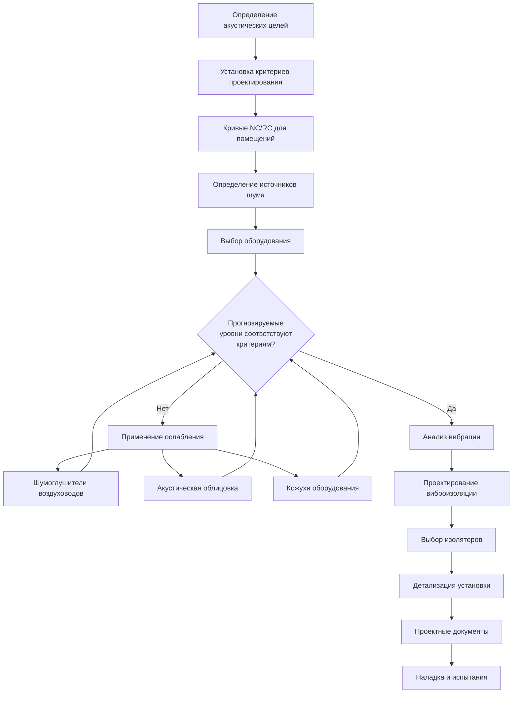

# HVAC акустика, борьба с шумом и вибрацией

Акустическая производительность – это критический, но часто игнорируемый аспект проектирования HVAC систем. Комфорт занимающихся зависит не только от тепловых условий, но и от приемлемых уровней шума и минимальной передачи вибрации. Этот раздел предоставляет инженерные рекомендации по прогнозированию, измерению и контролю звука и вибрации в HVAC системах.

## Основы HVAC акустики

### Звуковая мощность и звуковое давление

Понимание различия между звуковой мощностью и звуковым давлением необходимо для акустического анализа:

**Уровень звуковой мощности** представляет полную акустическую энергию, излучаемую источником:

$$L_W = 10 \log_{10} \left( \frac{W}{W_0} \right) \text{ дБ пер. } 10^{-12} \text{ Вт}$$

где:
- $L_W$ = уровень звуковой мощности (дБ)
- $W$ = звуковая мощность источника (Вт)
- $W_0$ = опорная звуковая мощность = $10^{-12}$ Вт

**Уровень звукового давления** представляет акустическую интенсивность в определенном месте:

$$L_p = 20 \log_{10} \left( \frac{p}{p_0} \right) \text{ дБ пер. } 20 \text{ мкПа}$$

где:
- $L_p$ = уровень звукового давления (дБ)
- $p$ = среднеквадратичное звуковое давление (Па)
- $p_0$ = опорное звуковое давление = 20 мкПа

### Связь между мощностью и давлением

В свободном поле со сферической волной звуковое давление связано со звуковой мощностью:

$$L_p = L_W - 20 \log_{10}(r) - 11 \text{ дБ}$$

где $r$ – расстояние от источника в метрах. Это уравнение предполагает отсутствие отражений и применимо к открытым условиям или безэховым помещениям.

В типичных помещениях с отражающими поверхностями:

$$L_p = L_W + 10 \log_{10} \left( \frac{Q}{4\pi r^2} + \frac{4}{R} \right) \text{ дБ}$$

где:
- $Q$ = коэффициент направленности (безразмерный)
- $R$ = постоянная помещения = $\frac{S\alpha}{1-\alpha}$ (м²)
- $S$ = общая площадь поверхности помещения (м²)
- $\alpha$ = средний коэффициент поглощения

## Источники шума HVAC систем

### Генерация шума оборудованием

| Тип оборудования | Типичный уровень звуковой мощности (дБ) | Доминирующая частота |
|------------------|----------------------------------------|----------------------|
| Центробежные вентиляторы | 85-105 | Частота прохождения лопастей |
| Осевые вентиляторы | 90-110 | Широкополосный |
| Охладители воздухом | 90-100 | 125-500 Гц |
| Градирни | 85-95 | Широкополосный |
| Компрессоры (винтовые) | 95-110 | Тональный + широкополосный |
| Концевые устройства (VAV) | 55-75 | 500-2000 Гц |

Данные по звуковой мощности оборудования должны быть получены у производителей в соответствии со стандартом AHRI 370 или ASHRAE 130.

### Шум, генерируемый воздуховодом

Воздушный поток через воздуховоды генерирует шум несколькими механизмами:

**Шум турбулентного потока**:
$$L_W = K + 50 \log_{10}(V) + 10 \log_{10}(A)$$

где:
- $K$ = константа (зависит от конфигурации воздуховода)
- $V$ = скорость воздуха (м/с)
- $A$ = площадь поперечного сечения воздуховода (м²)

Критические ограничения скорости для предотвращения чрезмерного регенерированного шума:

| Участок воздуховода | Максимальная скорость |
|---------------------|----------------------|
| Главные воздуховоды | 8-10 м/с |
| Ветвевые воздуховоды | 5-7 м/с |
| Концевые участки | 3-5 м/с |

## Процесс акустического проектирования

## Критерии проектирования и стандарты

### Критерии шума (NC) и критерии помещения (RC)

Кривые NC и RC определяют максимально приемлемые уровни звукового давления в полосах октав. Система NC (ANSI S12.2) в основном вытеснена кривыми RC (ASHRAE), которые обеспечивают лучшую оценку качества звука системы HVAC.

**Рекомендуемые максимальные уровни NC/RC**:

| Тип помещения | Уровень NC/RC |
|--------------|---------------|
| Отдельные офисы | 30-35 |
| Конференц-залы | 25-30 |
| Открытые офисы | 35-40 |
| Библиотеки | 30-35 |
| Классные комнаты | 30-35 |
| Больничные палаты | 30-35 |
| Театры/аудитории | 20-25 |
| Студии звукозаписи | 15-20 |

### Применяемые стандарты

- **ASHRAE Handbook—HVAC Applications, Chapter 49**: Комплексное руководство по контролю звука и вибрации
- **ANSI/ASA S12.60**: Критерии акустической производительности классных комнат
- **AHRI Standard 370**: Классификация шума наружного унитарного оборудования
- **ASHRAE Standard 130**: Классификация шума неканальных внутренних кондиционеров воздуха

## Стратегии звукоослабления

### Шумоглушители воздуховодов

Рассеивающие глушители используют звукопоглощающие материалы (стекловолокно, минеральная вата) в аэродинамических отражателях. Производительность зависит от:

- Длины глушителя (больше длина = большее ослабление)
- Конфигурации отражателей (параллельные отражатели или конструкция в виде капсулы)
- Скорости на входе (более высокая скорость снижает производительность)
- Частоты (более эффективно на средних-высоких частотах)

Типичное вносимое ослабление составляет 10-30 дБ в полосах октав 250-2000 Гц.

### Акустическая облицовка воздуховодов

Облицовка воздуховодов обеспечивает:
- Внутреннее поглощение (3-10 дБ на 3 м облицованного воздуховода)
- Снижение излучаемого шума
- Снижение регенерированного шума

Максимально рекомендуемая скорость для облицованных воздуховодов: 10-12 м/с для предотвращения эрозии и отслоения материала.

### Звукоизолирующие кожухи оборудования

Когда шум оборудования невозможно достаточно ослабить путем акустической обработки пути:

$$TL = L_{W,in} - L_{W,out}$$

где $TL$ – коэффициент звукоизоляции кожуха. Соображения при проектировании включают вентиляцию для отвода тепла, доступ для обслуживания и виброизоляцию конструкции.

## Виброизоляция и контроль вибрации

### Основы вибрации

Вибрация оборудования передается на конструкцию здания через:
- Прямые соединения крепления
- Соединения трубопроводов и воздуховодов (структурно передаваемая вибрация)
- Регенерированное излучение в воздух

Собственная частота изолированных систем:

$$f_n = \frac{1}{2\pi} \sqrt{\frac{k}{m}}$$

где:
- $f_n$ = собственная частота (Гц)
- $k$ = жесткость пружины (Н/м)
- $m$ = поддерживаемая масса (кг)

**Эффективность виброизоляции**:

$$\eta = \left( 1 - \frac{1}{f_r^2 - 1} \right) \times 100\%$$

где $f_r$ = $f_{возмущающая}/f_n$ – коэффициент частоты. Эффективная изоляция требует $f_r > \sqrt{2}$ (обычно $f_r$ ≥ 3-4 для приложений HVAC).

### Проектирование виброизоляции

### Выбор изоляторов

| Тип оборудования | Рекомендуемый статический прогиб | Тип изолятора |
|------------------|--------------------------------|------------------|
| Вентиляторы (напольные) | 25-40 мм | Стальные пружины |
| Охладители | 40-50 мм | Стальные пружины + инертное основание |
| Насосы | 25-40 мм | Стальные пружины или неопрен |
| Градирни | 25-40 мм | Пружины с поддерживающими подвесами |
| Кровельные установки | 25-40 мм | Пружины, монтируемые на кровельное основание |

## Испытания и проверка

Акустическая наладка должна включать:

1. **Измерения фонового шума** до включения оборудования
2. **Измерения уровня звукового давления** в занимаемых местах при работающем оборудовании
3. **Анализ в полосах октав** для проверки соответствия критериям NC/RC
4. **Измерения вибрации** на оборудовании и в чувствительных местах

Измерения должны соответствовать ASTM E1573 (класс звукоизоляции перегородок) и ISO 10052 (полевые измерения звукоизоляции).

## Заключение

Успешное акустическое проектирование требует интегрированного рассмотрения выбора оборудования, ослабления звука по пути распространения и виброизоляции. Ранняя координация между инженерами HVAC, архитекторами и консультантами по акустике предотвращает дорогостоящие исправления и обеспечивает комфорт занимающихся. Соблюдение рекомендаций ASHRAE и применяемых стандартов обеспечивает основу для достижения приемлемой акустической производительности во всех типах зданий.
