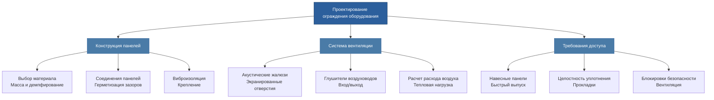

# Акустические барьеры и ограждения оборудования

Акустические барьеры и ограждения оборудования обеспечивают критически важные решения по контролю шума для систем HVAC, когда обработка источника или только модификация пути не могут достичь требуемых уровней звука. Понимание механизмов потерь передачи и надлежащего проектирования ограждения позволяет обеспечить эффективное снижение шума при сохранении доступности оборудования и управления тепловым режимом.

## Основы потерь передачи звука

Передача звука через барьеры следует физическим принципам, определяемым характеристиками массы, жесткости и демпфирования. Закон массы представляет фундаментальное соотношение между поверхностной плотностью материала и ослаблением звука.

### Уравнение закона массы

Теоретические потери передачи (TL) для гибкой однородной перегородки при нормальном падении:

$$TL = 20 \log_{10}(m \cdot f) - 47 \text{ дБ}$$

Где:
- $TL$ = потери передачи (дБ)
- $m$ = поверхностная плотность массы (кг/м²)
- $f$ = частота (Гц)

Это соотношение демонстрирует, что потери передачи увеличиваются на 6 дБ при удвоении массы или частоты. Реальная производительность отклоняется от закона массы из-за эффектов жесткости, явлений совпадения и структурной связи.

### Эффект совпадения

На критической частоте изгибные волны в барьере распространяются со скоростью звука в воздухе, создавая минимум потерь передачи:

$$f_c = \frac{c^2}{1.8 \pi} \sqrt{\frac{m}{B}}$$

Где:
- $f_c$ = критическая частота (Гц)
- $c$ = скорость звука в воздухе (343 м/с при 20°C)
- $B$ = жесткость на изгиб на единицу ширины (Н·м)

Ниже критической частоты доминирует передача, управляемая жесткостью. Выше нее поведение возобновляет закон массы с возрастающей важностью демпфирования.

## Класс звукопередачи (STC)

STC обеспечивает одноцифровой рейтинг производительности перегородки на основе лабораторного тестирования ASTM E90 и процедур классификации ASTM E413. Метод контура STC сравнивает измеренные значения потерь передачи звука в диапазоне из 16 октавных полос (125-4000 Гц) со стандартизированной эталонной кривой.

### Критерии расчета STC

1. Эталонный контур смещен в наивысшее положение, где:
   - Ни один отдельный дефицит не превышает 8 дБ
   - Сумма дефицитов не превышает 32 дБ
2. Рейтинг STC равен значению эталонного контура на частоте 500 Гц

Типичные приложения HVAC требуют:
- Механические помещения рядом с офисами: STC 50-55
- Ограждения чиллеров рядом с жилыми помещениями: STC 55-60
- Барьеры крышного оборудования: STC 40-50

## Производительность составных стен

Многослойные конструкции и стены с проникновениями демонстрируют деградацию потерь передачи по сравнению с однородными барьерами. Коэффициент передачи для составной конструкции:

$$\tau_{composite} = \frac{\sum A_i \tau_i}{\sum A_i}$$

Где:
- $\tau_i$ = коэффициент передачи элемента $i$ (безразмерный, где $\tau = 10^{-TL/10}$)
- $A_i$ = площадь элемента $i$ (м²)

Малая площадь с высокой передачей (низкий TL) значительно ухудшает общую производительность. Отверстие площадью 1% с TL = 0 дБ снижает стену STC 50 примерно до STC 30.

### Двойная стеновая конструкция

Двухслойные барьеры, разделенные воздушным зазором или поглощающим материалом, достигают превосходных потерь передачи:

$$TL_{double} \approx TL_{leaf1} + TL_{leaf2} + 20 \log_{10}(f \cdot d) - K$$

Где:
- $d$ = глубина полости (м)
- $K$ = поправочный коэффициент (обычно 29-35 дБ)

Поглощение в полости и структурная изоляция между слоями максимизируют производительность. Упругие направляющие и смещенные стойки предотвращают акустическое мостирование.

## Проектирование ограждения оборудования

Полные ограждения оборудования должны уравновешивать акустическую производительность с требованиями вентиляции, доступа и обслуживания.

### Требования к потерям передачи ограждения

Определите необходимое TL ограждения из уровня акустической мощности источника и целевого уровня приемника:

$$TL_{req} = SPL_{source} + 10 \log_{10}(S) - 10 \log_{10}(A_{room}) - SPL_{target}$$

Где:
- $SPL_{source}$ = уровень звукового давления на поверхности ограждения (дБ)
- $S$ = площадь поверхности ограждения (м²)
- $A_{room}$ = поглощение помещения приемника (м² сабин)
- $SPL_{target}$ = проектный уровень звука (дБ)

Добавьте запас по безопасности 5-10 дБ для учета неопределенности и будущих модификаций оборудования.

### Проектирование вентиляции ограждения

Оборудование, генерирующее тепло, требует расхода вентиляционного воздуха для поддержания приемлемых внутренних температур:

$$Q = \frac{H}{\rho \cdot c_p \cdot \Delta T}$$

Где:
- $Q$ = требуемый расход воздуха (м³/с)
- $H$ = выход тепла оборудования (Вт)
- $\rho$ = плотность воздуха (1.2 кг/м³ на уровне моря)
- $c_p$ = удельная теплоемкость воздуха (1005 Дж/кг·К)
- $\Delta T$ = допустимый рост температуры (К)

Вентиляционные отверстия должны включать акустическую обработку для предотвращения деградации производительности:

Акустические жалюзи и экранированные отверстия обеспечивают потери при вставке 10-25 дБ в зависимости от глубины и внутреннего поглощения. В сочетании с глушителями воздуховодов системы вентиляции ограждения оборудования сохраняют общую производительность TL.

## Критерии выбора материала

Материалы барьеров и ограждений должны удовлетворять акустическим, конструкционным и экологическим требованиям:

| Материал | Поверхностная плотность | TL на 500 Гц | Применение |
|----------|----------------------|--------------|-----------|
| Стальная панель 16 га | 8 кг/м² | 25 дБ | Легкие ограждения |
| Стальная панель 12 га | 13 кг/м² | 29 дБ | Стандартные ограждения оборудования |
| Барьер из виниловой нагрузкой | 5-10 кг/м² | 20-26 дБ | Гибкая обертка, составная |
| Бетонный блок (20 см) | 95 кг/м² | 48 дБ | Постоянные механические помещения |
| Двойная стена сталь/изоляция | 20 кг/м² | 40-45 дБ | Высокопроизводительные ограждения |

Обработки демпфирования, применяемые к резонансным панелям (сталь, алюминий), снижают радиационную эффективность и контролируют эффекты провала совпадения. Демпфирование с ограниченным слоем обеспечивает улучшение на 5-10 дБ в диапазоне критической частоты.

## Стандарты реализации проектирования

ASHRAE Handbook - HVAC Applications, Глава 49 предоставляет комплексное руководство по контролю звука, включая процедуры проектирования барьеров и ограждений. ASTM E90 устанавливает лабораторные методы измерения потерь передачи воздушного звука, в то время как ASTM E413 определяет классификацию STC. Проверка полевой производительности следует процедурам ASTM E336.

Надлежащая герметизация всех проникновений, стыков и панелей доступа остается критически важной. Зазор 3 мм по периметру панели может снизить производительность STC 50 до STC 25. Неопреновые прокладки, акустический герметик и компрессионные уплотнения обеспечивают достижение расчетных потерь передачи при полевых установках.

## Заключение

Акустические барьеры и ограждения оборудования обеспечивают измеримое снижение шума при проектировании в соответствии с принципами потерь передачи. Основы закона массы, эффекты составных стен и надлежащая интеграция вентиляции позволяют разработать эффективные решения, отвечающие акустическим критериям проекта при сохранении работоспособности оборудования и требований доступности.
