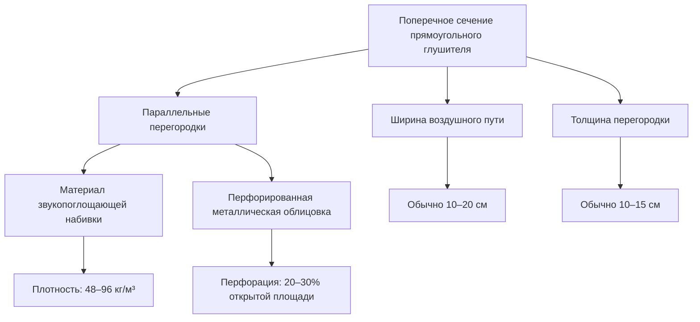
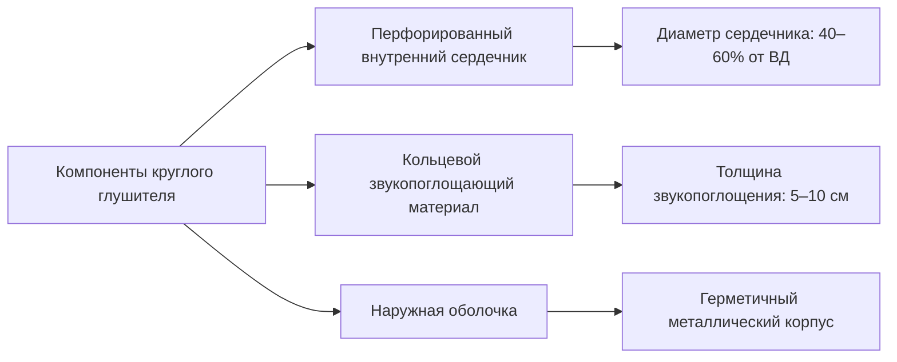
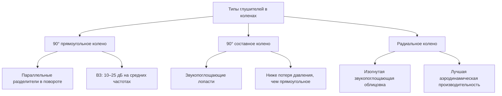

# Глушители воздуховодов HVAC: выбор и производительность

Глушители воздуховодов — это специализированные акустические устройства, устанавливаемые в HVAC-системах распределения воздуха для снижения передачи шума по воздуховодам. Эти пассивные аттенюаторы используют звукопоглощающие материалы и геометрические конфигурации для диссипации акустической энергии в определённых диапазонах частот без значительного затруднения потока воздуха.

## Фундаментальные акустические параметры

### Вносимое затухание

Вносимое затухание (ВЗ) количественно определяет снижение уровня звуковой мощности, достигаемое установкой глушителя в систему воздуховода. Оно представляет разность уровней звуковой мощности, измеренных в точке ниже по потоку, с глушителем и без него:

$$ВЗ = L_{w1} - L_{w2} = 10 \log_{10} \left( \frac{W_1}{W_2} \right) \text{ дБ}$$

Где:
- $L_{w1}$ = уровень звуковой мощности без глушителя (дБ)
- $L_{w2}$ = уровень звуковой мощности с глушителем (дБ)
- $W_1$ = акустическая мощность без глушителя (Вт)
- $W_2$ = акустическая мощность с глушителем (Вт)

Вносимое затухание зависит от частоты, обычно находясь в диапазоне 5–10 дБ на низких частотах (63–125 Гц) и 30–50 дБ на средних и высоких частотах (500–4000 Гц) для хорошо спроектированных устройств.

### Динамическое вносимое затухание

Динамическое вносимое затухание (ДВЗ) учитывает самогенерируемый шум от потока воздуха через глушитель, обеспечивая более реалистичный показатель производительности в условиях эксплуатации:

$$ДВЗ = ВЗ - ШП_{реген}$$

$$ШП_{реген} = L_{w,реген} - L_{w,вход}$$

Где:
- $ШП_{реген}$ = коэффициент регенерируемого шума (дБ)
- $L_{w,реген}$ = уровень звуковой мощности регенерируемого шума (дБ)
- $L_{w,вход}$ = уровень звуковой мощности на входе (дБ)

При низких скоростях потока (< 1 829 м³/ч), регенерируемый шум незначителен и ДВЗ ≈ ВЗ. При скоростях выше 2 743 м³/ч шум, генерируемый потоком, может значительно снизить эффективное затухание, особенно на высоких частотах.

## Типы конфигураций глушителей

### Прямоугольные диссипативные глушители

Прямоугольные глушители состоят из параллельных перегородок, заполненных звукопоглощающим материалом (обычно стекловолокно или минеральная вата), обёрнутым в перфорированные металлические облицовки. Ширина открытого воздушного пути между перегородками напрямую влияет на акустическую производительность.

**Характеристики производительности:**
- Эффективная длина определяет затухание на низких частотах (минимум 1,2–1,5 м для 125 Гц)
- Ширина воздушного пути влияет на производительность на высоких частотах (уже = лучше затухание)
- Стандартные скорости на входе: 609–762 м³/ч для минимальной потери давления

### Круглые диссипативные глушители

Цилиндрические глушители имеют центральный перфорированный сердечник, окружённый кольцевым звукопоглощающим материалом. Отношение диаметра сердечника к внешнему диаметру влияет на акустическую эффективность.

**Проектные соображения:**
- Более компактны, чем прямоугольные, при эквивалентной свободной площади
- Лучше подходят для высокоскоростных приложений (до 2 286 м³/ч)
- Менее эффективны на низких частотах из-за ограниченной длины пути звукопоглощения

### Глушители в коленах

Глушители в коленах интегрируют акустическую обработку в направленные изменения потока, комбинируя звукоослабление с перенаправлением воздуха. Эти компактные устройства используют расширенный путь через поворот.

**Примечания по применению:**
- Обеспечивают дополнительное затухание 5–15 дБ сверх стандартных облицованных колен
- Эффективны, когда пространственные ограничения препятствуют установке прямого глушителя
- Регенерируемый шум обычно ниже, чем у прямых глушителей, благодаря сниженной скорости через поворот

## Критерии выбора

### Акустические требования

Выбор глушителя начинается с анализа уровня звуковой мощности по октавным полосам источника шума (вентилятор, концевой элемент и т.д.) и целевых критериев NC или RC для занимаемого помещения. Требуемое вносимое затухание по полосам частот определяет тип глушителя и его размеры.

**Ключевые факторы выбора:**
1. **Диапазон частот, вызывающий беспокойство** — преобладание низких частот требует более длинных устройств или активных обработок
2. **Требуемый спектр ВЗ** — соответствие кривых производительности глушителя требуемому затуханию
3. **Доступность пространства** — ограничения по длине и поперечному сечению
4. **Место выпуска** — близость к занимаемым помещениям влияет на требуемое ДВЗ

### Учёт потерь давления

Потери статического давления через глушители прямо влияют на энергопотребление вентилятора и пропускную способность системы. Потеря давления следует стандартным уравнениям сопротивления потоку:

$$\Delta P = \frac{\rho V^2}{2} \left( K_{вход} + K_{трение} + K_{выход} \right)$$

Где:
- $\Delta P$ = потеря давления (кПа)
- $\rho$ = плотность воздуха (кг/м³)
- $V$ = скорость на входе (м³/ч)
- $K$ = коэффициенты потерь (безразмерные)

**Типичные потери давления:**
- Прямоугольные диссипативные: 20–60 Па при 609 м³/ч
- Круглые диссипативные: 36–96 Па при 762 м³/ч
- Глушители в коленах: 24–84 Па в зависимости от конфигурации

Максимальная рекомендуемая скорость на входе сбалансирует акустическую производительность (избегая регенерируемого шума) с штрафами за потерю давления. Стандартная практика ограничивает скорости на входе 609–762 м³/ч для систем подачи воздуха и 457–610 м³/ч для низкошумных приложений.

## Стандарты испытаний и проверка производительности

### ASTM E477

ASTM E477 "Standard Test Method for Laboratory Measurement of Acoustical and Airflow Performance of Duct Liner Materials and Prefabricated Silencers" устанавливает стандартизированные процедуры для измерения вносимого затухания и потерь давления в контролируемых условиях.

**Требования испытаний:**
- Измерения по октавным полосам от 63 Гц до 8000 Гц
- Минимальная длина воздуховода выше и ниже по потоку для установления условий плоской волны
- Несколько скоростей потока для характеристики динамической производительности
- Фоновый шум как минимум на 10 дБ ниже уровней измерения

### Справочники ASHRAE

ASHRAE Handbook—HVAC Applications, глава 49 "Noise and Vibration Control" предоставляет:
- Типичные данные вносимого затухания для различных конфигураций глушителей
- Коэффициенты потерь давления и ограничения скорости
- Руководство по проектированию систем для достижения целевых уровней шума
- Коррекции отражений концов для выпусков воздуховодов

### Рассмотрения производительности в поле

Лабораторное вносимое затухание представляет идеальную производительность. Полевые установки испытывают снижённую эффективность из-за:
- **Обходные пути** — передача звука через стенки воздуховода и конструктивные соединения
- **Входа/выхода** — акустическая энергия, обходящая глушитель через тонкостенный воздуховод
- **Эффекты установки** — турбулентность от близких фитингов, генерирующих дополнительный шум
- **Старение** — деградация звукопоглощающих материалов, снижающая производительность на высоких частотах

Консервативная практика проектирования применяет снижающий коэффициент 3–5 дБ к лабораторным значениям ВЗ для полевых прогнозов, особенно на частотах выше 1000 Гц, где фланговые пути становятся значительными.

## Руководства по применению

### Системы подачи воздуха

Глушители, устанавливаемые ниже по потоку от вентиляторов подачи, обеспечивают адресацию основных источников шума. Расположите глушители на расстоянии не менее 5 диаметров воздуховода от выпуска вентилятора, чтобы обеспечить стабилизацию потока и точную акустическую производительность.

### Системы возврата воздуха

Глушители возврата воздуха контролируют передачу шума от вентиляторов через решётки возврата. Более низкие скорости (457–610 м³/ч) и потенциальное загрязнение от наружного воздуха здания могут влиять на выбор материала.

### Критические помещения

Лечебные учреждения, студии звукозаписи и учебные среды требуют усиленного акустического контроля. Конфигурации глушителей серии (два устройства, разделённые 3–6 м облицованного воздуховода) обеспечивают дополнительное затухание 3–5 дБ по сравнению с однородными установками благодаря сниженным фланговым путям и минимизированному входу/выходу эффектам.

---

**Источники:**
- ASHRAE Handbook—HVAC Applications (2023), глава 49
- ASTM E477-13, Standard Test Method for Laboratory Measurement of Acoustical and Airflow Performance
- ASHRAE Handbook—Fundamentals (2021), глава 8 "Sound and Vibration"
