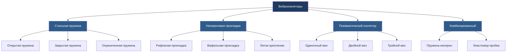
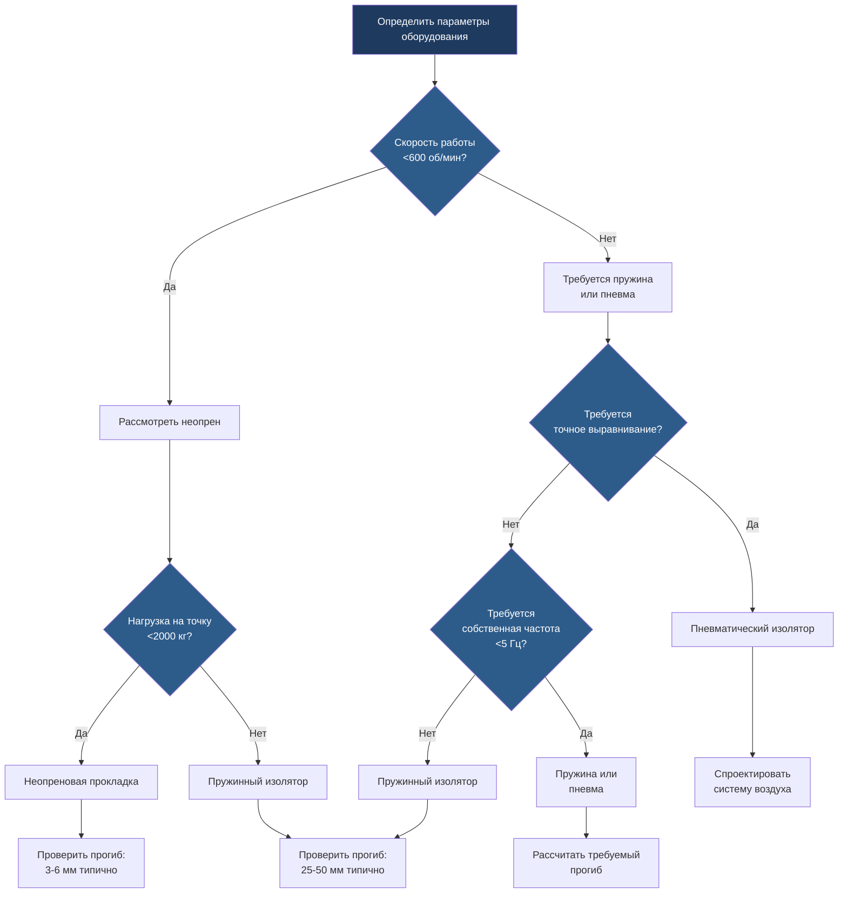

Виброизоляция предотвращает передачу механических колебаний от оборудования HVAC на конструкции здания. Надлежащая изоляция защищает целостность конструкции, снижает передачу шума и улучшает комфорт пребывания людей за счёт ослабления низкочастотных вибраций, которые в противном случае распространялись бы через перекрытия, стены и потолки.

## Фундаментальные принципы

Виброизоляция работает на основе принципа введения упругого элемента между источником вибрации и воспринимающей конструкцией. Изолятор создаёт механический фильтр, который снижает передачу силы на частотах выше собственной частоты системы.

### Собственная частота

Собственная частота системы изоляции определяет характеристики её работы. Для эффективной изоляции собственная частота должна быть значительно ниже частоты возмущающего воздействия.

$$f_n = \frac{1}{2\pi} \sqrt{\frac{k}{m}}$$

Где:
- $f_n$ = собственная частота (Гц)
- $k$ = коэффициент жёсткости пружины (Н/м)
- $m$ = масса, поддерживаемая изолятором (кг)

Собственная частота также может быть выражена через статический прогиб:

$$f_n = \frac{15.76}{\sqrt{\delta}}$$

Где $\delta$ = статический прогиб (мм). Это соотношение показывает, что больший прогиб обеспечивает более низкую собственную частоту и лучшую изоляцию на низких частотах.

### Передаточная функция

Передаточная функция количественно определяет отношение переданной силы к приложенной силе. Для недемпфированной системы изоляции:

$$T = \frac{F_t}{F_0} = \frac{1}{\left|\left(1 - \frac{f^2}{f_n^2}\right)\right|}$$

Где:
- $T$ = коэффициент передаточной функции
- $F_t$ = переданная сила
- $F_0$ = приложенная сила
- $f$ = частота возмущающего воздействия (Гц)
- $f_n$ = собственная частота (Гц)

Для демпфированных систем передаточная функция принимает вид:

$$T = \frac{1}{\sqrt{\left(1 - \frac{f^2}{f_n^2}\right)^2 + \left(2\zeta\frac{f}{f_n}\right)^2}}$$

Где $\zeta$ = коэффициент демпфирования. Эффективность изоляции улучшается при $f/f_n > \sqrt{2}$ (отношение частот больше 1,414).

### Эффективность изоляции

Эффективность изоляции выражает процентное снижение переданной силы:

$$\eta = \left(1 - T\right) \times 100\%$$

Достижение эффективности 90 % требует $f/f_n \approx 3,3$, а эффективность 95 % требует $f/f_n \approx 4,5$. ASHRAE рекомендует минимальные отношения частот 3,5–4,0 для большинства приложений HVAC.

## Типы изоляторов

### Пружинные изоляторы из стали

Стальные пружины обеспечивают самые низкие собственные частоты (1,5–8 Гц) и наиболее высокую эффективность изоляции для механического оборудования. Они демонстрируют минимальное изменение жёсткости при изменении нагрузки и температуры.

**Критерии выбора:**
- Диапазон прогиба: 25–100 мм типично
- Грузоподъёмность: 50–50 000 кг на один изолятор
- Рабочая температура: -40°C до 150°C
- Применение: холодильные машины, градирни, воздухообрабатывающие установки, вентиляторы

Пружинные изоляторы требуют горизонтального ограничения для предотвращения боковых перемещений во время пуска, остановки или сейсмических событий. Закрытые пружины включают акустические прокладки из неопрена для ослабления высокочастотных вибраций, которые пружины сами по себе не могут изолировать.

### Неопреновые изоляторы

Неопреновые (полихлоропреновые) эластомерные изоляторы обеспечивают умеренную изоляцию с внутренним демпфированием. Собственные частоты обычно находятся в диапазоне 8–20 Гц в зависимости от толщины и твёрдости прокладки.

**Расчёт статического прогиба:**

$$\delta = \frac{W}{A \times k_e}$$

Где:
- $\delta$ = прогиб (мм)
- $W$ = нагрузка на один изолятор (Н)
- $A$ = площадь прокладки (мм²)
- $k_e$ = модуль упругости (Н/мм²)

Неопреновые изоляторы работают лучше всего для менее тяжёлого оборудования с умеренным уровнем вибрации. Твёрдость по шкале Шора варьируется от 40–70 Shore A, где более мягкие составы обеспечивают больший прогиб и более низкую собственную частоту.

**Ограничения:**
- Жёсткость увеличивается при низких температурах
- Деградация под воздействием масла, озона и УФ излучения
- Грузоподъёмность ограничена примерно 350 кПа контактного давления
- Производительность ухудшается ниже 5°C

### Пневматические изоляторы

Пневматические изоляторы (пневматические изоляторы) используют сжатый воздух в гибких мехах для достижения собственных частот от 1 до 3 Гц. Они обеспечивают превосходную изоляцию низких частот для чувствительных приложений.

**Соотношение давления и прогиба:**

$$\delta = \frac{W}{P \times A_e}$$

Где:
- $P$ = давление воздуха (кПа)
- $A_e$ = эффективная площадь поршня (мм²)

Пневматические изоляторы поддерживают постоянную собственную частоту независимо от нагрузки за счёт автоматической регулировки давления. Они превосходны в приложениях, требующих точного выравнивания или переменной нагрузки.

**Требования:**
- Подача сжатого воздуха (обычно 550–700 кПа)
- Клапаны контроля высоты для выравнивания
- Обслуживание компонентов системы воздуха
- Более высокие начальные затраты, чем на пассивные изоляторы

## Методология выбора

Критерии выбора в порядке приоритета:

1. **Частота возмущающего воздействия**: Скорость работы оборудования определяет минимально требуемое отношение частот
2. **Величина нагрузки**: Общий вес, распределённый по точкам изоляции (обычно 4–6 точек)
3. **Условия окружающей среды**: Температура, химическое воздействие, наружная установка
4. **Ограничения пространства**: Доступный прогиб под оборудованием
5. **Бюджет**: Начальная стоимость в сравнении с требованиями долгосрочной производительности
6. **Доступ для обслуживания**: Доступность для проверки и замены

ASHRAE Handbook—HVAC Applications, Chapter 49, предоставляет подробное руководство по выбору изолятора, деталям установки и процедурам проверки производительности. Надлежащая установка требует жёстких инерционных оснований для несбалансированного оборудования, анкерных болтов, изолированных от конструкции неопреновыми втулками, и гибких соединений для всех трубопроводов и воздуховодов.

## Рассмотрения при монтаже

Эффективность изоляции критически зависит от надлежащей установки:

- **Инерционные основания**: Требуются для оборудования с возвратно-поступательными или несбалансированными вращающимися компонентами
- **Гибкие соединители**: Все жёсткие соединения обходят изоляцию и должны использовать гибкие шланги, компенсационные швы или гибкие воздуховоды
- **Сейсмическое ограничение**: Амортизаторы или ограничивающие тросы ограничивают движение при сейсмических событиях без ущерба для изоляции
- **Выравнивание**: Изоляторы должны быть выровнены в пределах ±2° и нести равные нагрузки для оптимальной производительности

Центр тяжести должен совпадать по вертикали с геометрическим центром конфигурации изоляторов, чтобы предотвратить раскачивающиеся моды. Неравномерная нагрузка снижает эффективность изоляции и вызывает преждевременный отказ изолятора.
