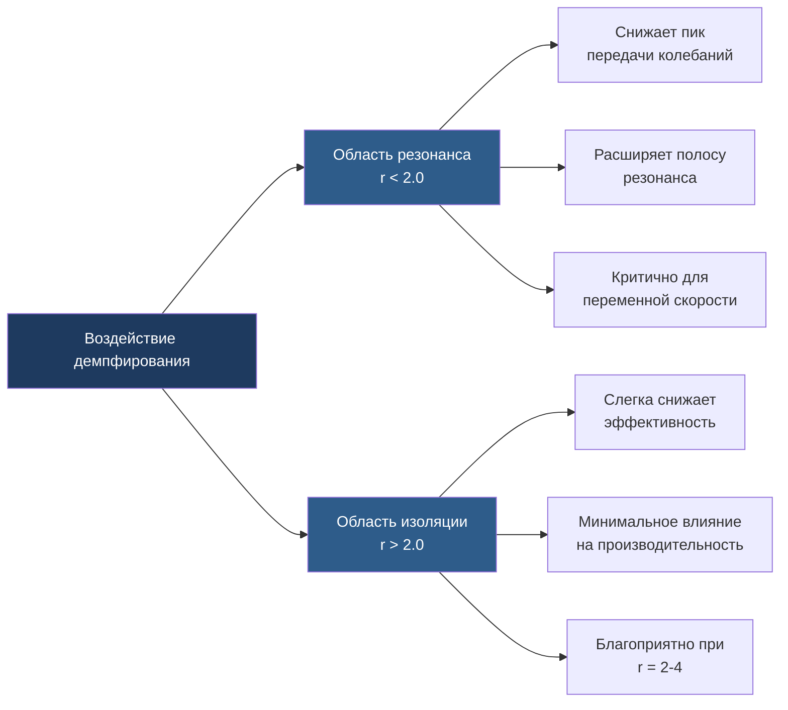
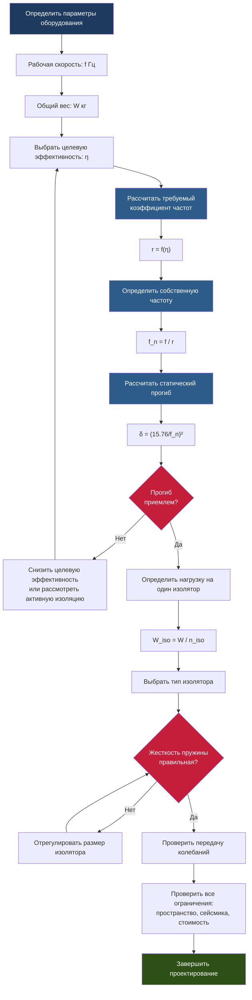

Проектирование виброизоляции требует систематического инженерного анализа для достижения установленных показателей производительности при обеспечении совместимости конструкции и надежности при эксплуатации. Процесс проектирования балансирует конкурирующие требования, включая эффективность изоляции, пространственные ограничения, распределение нагрузки и стоимость, для создания эффективных решений при установке оборудования HVAC.

## Методология проектирования

Фундаментальная последовательность проектирования следует подходу, основанному на физике и грounded в динамическом поведении систем масса-пружина-демпфер. Проектирование начинается с характеризации оборудования, переходит к анализу частот и завершается спецификацией и верификацией изолятора.

### Этапы процесса проектирования

1. **Характеризация оборудования**: Рабочая скорость, несбалансированные силы, распределение веса, точки крепления
2. **Требования к производительности**: Целевая эффективность изоляции, диапазон частот, условия окружающей среды
3. **Анализ частот**: Расчет собственной частоты, определение коэффициента частот, оценка резонанса
4. **Выбор изолятора**: Тип, прогиб, грузоподъемность, характеристики демпфирования
5. **Верификация системы**: Расчет передачи колебаний, проверка эффективности, ограничения при установке

## Анализ коэффициента частот

Коэффициент частот $r$ представляет соотношение между возмущающей частотой и собственной частотой системы. Этот безразмерный параметр определяет производительность изоляции.

$$r = \frac{f}{f_n}$$

Где:
- $r$ = коэффициент частот (безразмерный)
- $f$ = возмущающая частота (Гц)
- $f_n$ = собственная частота системы изоляции (Гц)

### Критические области частот

| Коэффициент частот | Условие изоляции | Отклик системы |
|-----------------|---------------------|-----------------|
| $r < 1.0$ | Ниже резонанса | Усиление, плохая изоляция |
| $r = 1.0$ | В точке резонанса | Максимальное усиление |
| $1.0 < r < \sqrt{2}$ | Вблизи резонанса | Усиление продолжается |
| $r = \sqrt{2}$ | Порог изоляции | Передача колебаний = 1.0 |
| $r > \sqrt{2}$ | Область изоляции | Возникает ослабление силы |

Эффективная изоляция требует $r \geq 3.5$ для большинства приложений HVAC. Более высокие коэффициенты обеспечивают большую изоляцию, но требуют больших статических прогибов и увеличенного свободного пространства под оборудованием.

## Расчет передачи колебаний

Передача колебаний quantifies передача силы через систему изоляции. Полное выражение включает эффекты демпфирования, влияющие на поведение системы вблизи резонанса.

### Передача колебаний без демпфирования

Для идеальных систем без демпфирования:

$$T = \frac{1}{\left|1 - r^2\right|}$$

Эта упрощенная форма применяется, когда $r > 2.0$, где демпфирование имеет минимальное влияние. Ниже этого коэффициента эффекты резонанса доминируют, и демпфирование становится критическим.

### Передача колебаний с демпфированием

Реальные системы изоляции включают демпфирование от гистерезиса материала, трения и сопротивления жидкости:

$$T = \frac{\sqrt{1 + (2\zeta r)^2}}{\sqrt{(1 - r^2)^2 + (2\zeta r)^2}}$$

Где $\zeta$ = коэффициент демпфирования (безразмерный). Это выражение охватывает полный динамический отклик, включая снижение пика резонанса и модификацию поведения на высоких частотах.

#### Эффекты демпфирования

Типичные коэффициенты демпфирования для изоляторов HVAC:
- Стальные пружины: $\zeta = 0.01 - 0.05$ (минимальное демпфирование)
- Неопреновые подкладки: $\zeta = 0.05 - 0.10$ (умеренное демпфирование)
- Пробковые композиты: $\zeta = 0.10 - 0.15$ (высокое демпфирование)
- Пневматические пружины: $\zeta = 0.02 - 0.08$ (переменное демпфирование)

## Эффективность изоляции

Эффективность изоляции выражает производительность как процент снижения силы:

$$\eta = \left(1 - T\right) \times 100\%$$

Раскрывая с коэффициентом частот:

$$\eta = \left(1 - \frac{1}{\left|1 - r^2\right|}\right) \times 100\%$$

Для систем без демпфирования в области изоляции ($r > \sqrt{2}$):

$$\eta = \frac{r^2 - 1}{r^2} \times 100\%$$

### Целевые значения эффективности

| Приложение | Требуемая эффективность | Коэффициент частот | Статический прогиб* |
|-------------|---------------------|-----------------|-------------------|
| Легкая коммерция | 85% | 2.5 - 3.0 | 10 - 16 мм |
| Стандартный HVAC | 90% | 3.3 - 3.5 | 18 - 22 мм |
| Критические объекты | 95% | 4.5 - 5.0 | 32 - 40 мм |
| Прецизионное оборудование | 98% | 7.0 - 8.0 | 77 - 100 мм |

*Для оборудования 1800 об/мин (30 Гц)

## Определение собственной частоты

Собственная частота системы изоляции получена из соотношения между жесткостью и массой:

$$f_n = \frac{1}{2\pi} \sqrt{\frac{k}{m}}$$

Для практического проектирования подход со статическим прогибом более удобен:

$$f_n = \frac{1}{2\pi} \sqrt{\frac{g}{\delta}}$$

Где:
- $g$ = ускорение свободного падения (9.81 м/с²)
- $\delta$ = статический прогиб под нагрузкой (м)

Это упрощается до инженерной формы:

$$f_n = \frac{15.76}{\sqrt{\delta_{мм}}}$$

Где $\delta_{мм}$ = статический прогиб в миллиметрах.

### Расчет требуемого прогиба

Перестраивая для целей проектирования:

$$\delta_{мм} = \left(\frac{15.76}{f_n}\right)^2$$

При заданном целевом коэффициенте частот и известной возмущающей частоте:

$$\delta_{мм} = \left(\frac{15.76 \times r}{f}\right)^2$$

## Рабочий процесс проектирования

## Предотвращение резонанса

Оборудование, проходящее резонанс во время запуска или остановки, испытывает высокие амплитуды колебаний и потенциально опасные силы. Проектирование должно учитывать три сценария резонанса:

### Переходные процессы при запуске

Преобразователи частоты (ПЧ) переметают область собственной частоты при ускорении. Время пребывания в резонансе определяет величину колебаний:

- Быстрое ускорение (>5 Гц/с): Минимальное усиление резонанса
- Умеренное ускорение (2-5 Гц/с): Приемлемо для большинства оборудования
- Медленное ускорение (<2 Гц/с): Может требовать усиления демпфирования

### Гармоники рабочей скорости

Вращающееся оборудование генерирует вибрацию на целых кратных рабочей частоте. Проектирование должно учитывать:

$$f_{гармоника} = n \times f_{рабочая}$$

Где $n$ = 1, 2, 3, 4... Вторая и третья гармоники (2× и 3× рабочей скорости) часто содержат значительную энергию, особенно для возвратно-поступательных компрессоров и несбалансированных вентиляторов.

### Биения

Несколько машин, работающих на близких скоростях, создают частоты биений:

$$f_{биение} = |f_1 - f_2|$$

Эти низкочастотные биения могут приближаться к собственной частоте системы даже при адекватном разделении частот отдельных машин.

## Ограничения проектирования

### Пространственные ограничения

Статический прогиб определяет минимальный зазор под оборудованием. Требуемая общая высота включает:

- Сжатую высоту изолятора
- Полный ход прогиба
- Дополнительный зазор для динамического движения (обычно 1.5× статического прогиба)
- Зазор для сейсмических ограничений

### Распределение нагрузки

Равномерное распределение нагрузки по изоляторам максимизирует эффективность и срок службы изолятора:

$$\frac{W_{макс} - W_{мин}}{W_{средн}} < 0.10$$

Эта 10% допуск сохраняет однородную собственную частоту во всех точках изоляции. Неравномерная нагрузка смещает индивидуальные частоты изолятора, создавая множественные пики резонанса и снижая общую производительность.

### Согласование жесткости пружины

При использовании нескольких изоляторов вариация жесткости пружины должна оставаться в допусках:

$$\frac{k_{макс} - k_{мин}}{k_{средн}} < 0.15$$

Превышение 15% вариации вызывает дифференциальный прогиб, наклон оборудования и концентрацию напряжений в более жестких точках крепления.

## Нормативные документы

Справочник ASHRAE — Приложения HVAC, глава 49 "Контроль звука и вибрации" предоставляет полное руководство по проектированию, включая:

- Рекомендуемые коэффициенты частот для типов оборудования
- Требования к эффективности изоляции по приложениям
- Критерии проектирования инерционной базы
- Спецификации гибких соединений

Техническая документация производителя предоставляет:

- Кривые зависимости нагрузки от прогиба изолятора
- Спецификации жесткости пружины с допусками
- Ограничения по температуре и условиям окружающей среды
- Требования к крутящему моменту при установке

Верификация проектирования требует документации расчетов, демонстрирующей соответствие целевым коэффициентам частот, ограничениям распределения нагрузки и пространственным ограничениям. Полевая верификация посредством измерения вибрации подтверждает предсказанную производительность изоляции.
