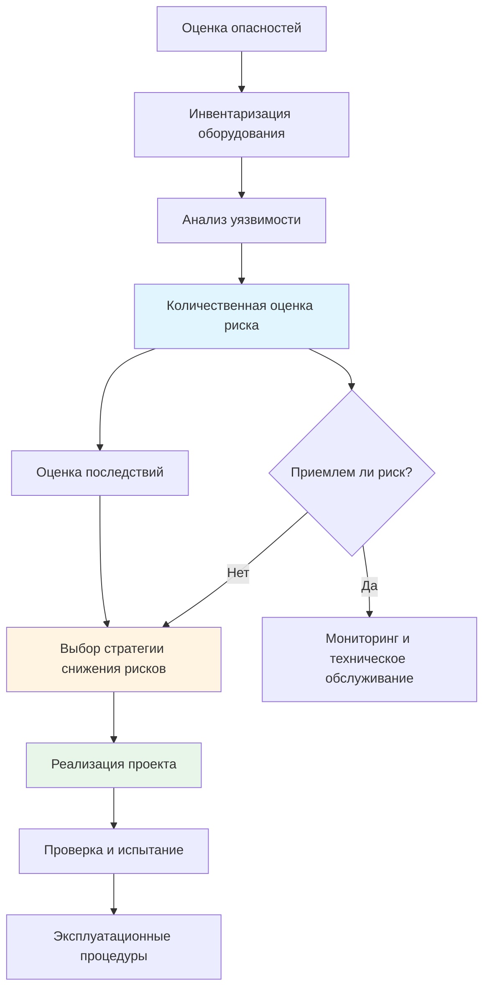
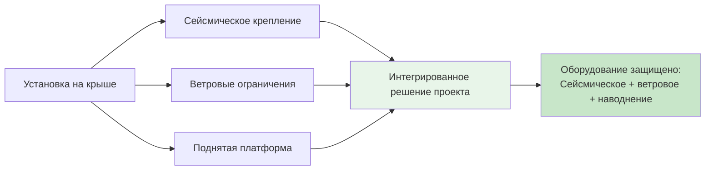

# Сейсмостойкое, ветроустойчивое и устойчивое к наводнениям проектирование систем HVAC

Оборудование HVAC представляет собой критически важную инженерную инфраструктуру зданий, которая должна оставаться в рабочем состоянии во время стихийных бедствий и после них. Устойчивое проектирование защищает жизнь и здоровье людей, обеспечивает функциональность здания и минимизирует экономические потери от повреждения оборудования и перебоев в обслуживании.

## Обзор стихийных бедствий для систем HVAC

Оборудование HVAC подвергается различным угрозам от сейсмической активности, ветровых событий и наводнений. Каждый вид опасности требует специфических проектных решений:

**Сейсмические события:** Горизонтальные и вертикальные ускорения создают инерционные силы, которые могут смещать оборудование, разрывать соединения трубопроводов, повреждать воздуховоды и нарушать конструкционные опоры.

**Ветровые нагрузки:** Высокоскоростные ветры создают прямое давление на поверхности оборудования, подъёмные силы на установки на крыше и аэродинамические эффекты, которые могут опрокинуть или смещать компоненты.

**Наводнения:** Проникновение воды повреждает электрические компоненты, вызывает коррозию металлических поверхностей, загрязняет холодильные системы и может привести к плаванию или смещению оборудования.

## Структура проектирования, основанная на анализе риска

Устойчивое проектирование HVAC следует структурированному подходу к оценке рисков и выбору мер по их снижению:

### Процесс оценки риска

1. **Характеризация опасностей:** Определение параметров сейсмического действия для конкретной площадки (ускорение грунта, спектр отклика), скорости ветра при проектировании (порыв 3 секунды, категория открытости местности) и зоны наводнений (отметка уровня базового наводнения, волновое воздействие).

2. **Критичность оборудования:** Классификация систем по коэффициенту важности (безопасность жизни, критически важные операции, стандартная занятость).

3. **Оценка уязвимости:** Анализ крепления оборудования, несущей способности конструкционных опор и хрупкости компонентов.

4. **Анализ последствий:** Количественная оценка потенциальных потерь от отказа оборудования (затраты на ремонт, прерывание бизнеса, риск для жизни).

## Принципы сейсмического проектирования

Сейсмические силы на оборудование HVAC возникают в результате усиления колебаний грунта конструкцией здания. Фундаментальная горизонтальная сейсмическая сила на неконструкционные компоненты в соответствии с ASCE 7-22:

$$F_p = \frac{0,4 a_p S_{DS} W_p}{R_p / I_p} \left(1 + 2\frac{z}{h}\right)$$

Где:
- $F_p$ = горизонтальная сейсмическая расчётная сила (кН)
- $a_p$ = коэффициент усиления компонента (1,0 до 2,5)
- $S_{DS}$ = расчётное спектральное ускорение (g)
- $W_p$ = рабочий вес компонента (кН)
- $R_p$ = коэффициент модификации отклика компонента (1,5 до 6,0)
- $I_p$ = коэффициент важности компонента (1,0 или 1,5)
- $z$ = высота крепления компонента над основанием (м)
- $h$ = средняя высота крыши конструкции (м)

Применяются максимальные и минимальные пределы силы:

$$F_{p,max} = 1,6 S_{DS} I_p W_p$$

$$F_{p,min} = 0,3 S_{DS} I_p W_p$$

### Ключевые параметры сейсмического проектирования

**Крепление оборудования:** Соединения должны сопротивляться как горизонтальным силам, так и опрокидывающим моментам. Типичное механическое оборудование использует $R_p = 2,5$ и $a_p = 1,0$ для жёстко прикреплённых компонентов или $a_p = 2,5$ для гибко прикреплённого оборудования.

**Трубопроводные системы:** Холодильные и гидравлические трубопроводы требуют сейсмических подпорок на определённых интервалах в зависимости от диаметра трубы и категории сейсмического проектирования. Критическими аспектами являются дифференциальные смещения в соединениях оборудования и стыках расширения здания.

**Крепление воздуховодов:** Большие прямоугольные воздуховоды и все воздуховоды в зонах высокой сейсмичности требуют боковых подпорок и продольных ограничений для предотвращения разрушения или расхождения соединений.

## Проектные аспекты ветровых нагрузок

Ветровые нагрузки на оборудование HVAC следуют процедурам ASCE 7 для основной системы сопротивления ветровым силам (MWFRS) или компонентов и облицовки (C&C) в зависимости от размера оборудования и конфигурации монтажа.

Для установок на крыше расчётное ветровое давление:

$$p = q_z G C_p - q_h (GC_{pi})$$

Где:
- $p$ = расчётное ветровое давление (кПа)
- $q_z$ = динамическое давление ветра на высоте z (кПа)
- $G$ = коэффициент пульсаций (обычно 0,85)
- $C_p$ = коэффициент внешнего давления
- $q_h$ = динамическое давление ветра на средней высоте крыши (кПа)
- $GC_{pi}$ = коэффициент внутреннего давления

**Критические вопросы проектирования при ветровых нагрузках:**

- Установки на крыше в краевых и угловых зонах подвергаются коэффициентам давления в 2-3 раза выше, чем внутренние зоны
- Подъёмные силы часто превышают нисходящие силы, требуя положительного крепления
- Аэродинамическое экранирование и архитектурные надстройки значительно снижают ветровые нагрузки
- Регионы, подверженные ураганам, требуют усиленного крепления и строительства с защитой от удара

## Стратегии защиты от наводнений

Проектирование, устойчивое к наводнениям, применяет методы поднятия, барьеров или перемещения оборудования:

**Методы поднятия:**
- Монтаж механического оборудования на конструкционные платформы выше отметки уровня базового наводнения
- Установка оборудования на крыше для критически важных систем
- Проектирование конструкционных опор для сил плавучести при затоплении

**Системы барьеров:**
- Развёртываемые наводнениями барьеры для механических помещений
- Постоянные наводнения стены с герметизированными проходами
- Обратные клапаны на всех дренажных соединениях

**Выбор оборудования:**
- Спецификация компонентов с защитой от наводнений для участков ниже отметки уровня базового наводнения
- Использование коррозионно-стойких материалов в потенциальных зонах наводнений
- Установка быстроразъёмных муфт для быстрого удаления оборудования

## Интеграция нескольких опасностей

Устойчивое проектирование решает несколько опасностей одновременно:

Комбинированные сценарии нагружения требуют анализа коэффициентов нагрузок и комбинаций согласно ASCE 7 Глава 2. Системы крепления и подпорок должны удовлетворять наиболее жёстким требованиям, применимым ко всем опасностям.

## Ссылки на коды и стандарты

**ASCE 7:** Минимальные проектные нагрузки и соответствующие критерии для зданий и других сооружений (Глава 13 для сейсмического проектирования, главы 26-31 для ветровых нагрузок, глава 5 для наводнений)

**International Building Code (IBC):** Требования к конструкционному проектированию и установке оборудования (главы 16, 18, 23)

**ASHRAE Applications Handbook:** Глава 56 предоставляет подробные рекомендации по сейсмическим подпоркам, ветроустойчивости и защите от наводнений, специфичные для систем HVAC

**SMACNA Guidelines:** Seismic Restraint Manual и HVAC Systems Duct Design предоставляют подробную практику установки

## Аспекты реализации

Успешное устойчивое проектирование требует координации между инженерами механики, инженерами конструкций и производителями оборудования. Ключевые этапы реализации включают:

- Проведение анализа специфичных для площадки опасностей на ранних этапах проектирования
- Спецификация оборудования с адекватной конструкционной прочностью и положениями крепления
- Разработка детальных чертежей крепления и подпорок
- Требование заводских чертежей, демонстрирующих соответствие требованиям проекта
- Проверка установки посредством полевой инспекции и испытания
- Установление процедур технического обслуживания для сохранения эффективности подпорок

Устойчивость оборудования выходит за рамки первоначального строительства благодаря надлежащему вводу в эксплуатацию, периодической инспекции и протоколам оценки после события.

---

**Связанные темы:**
- [Критерии сейсмического проектирования](seismic-design-criteria/)
- [Сейсмические подпорки оборудования](seismic-bracing-equipment/)
- [Проектирование ветровых нагрузок](wind-load-design/)
- [Оборудование, устойчивое к наводнениям](flood-resistant-equipment/)
- [Проектирование, устойчивое к ураганам](hurricane-resistant-design/)
- [Стратегии устойчивого проектирования](resilient-design-strategies/)
