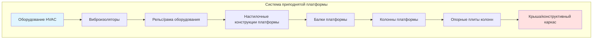
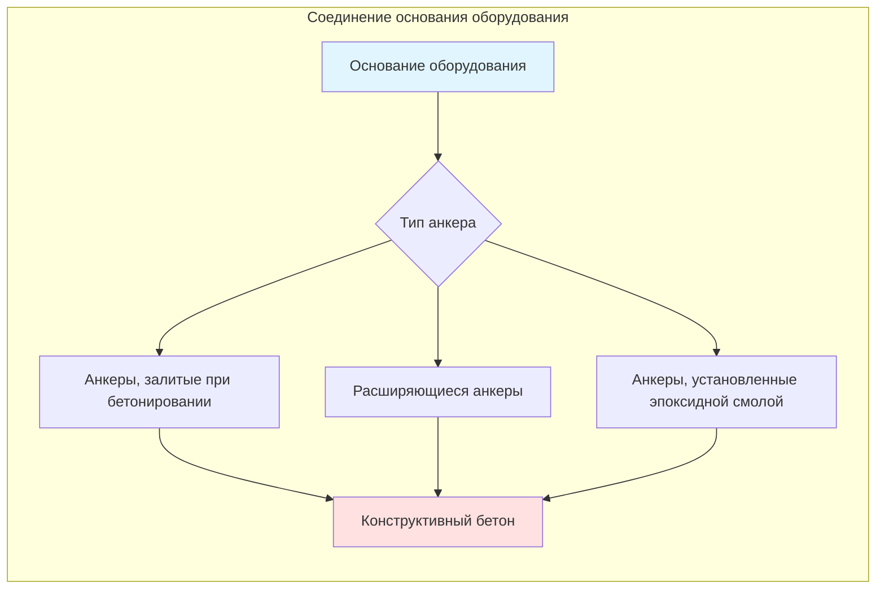
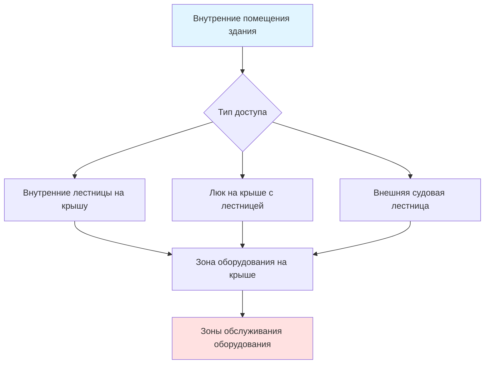

Установки оборудования HVAC на повышенной высоте требуют комплексной конструктивной координации для обеспечения надлежащей опоры, соответствия кодам и длительной производительности системы. Оборудование, установленное на крышах и платформах, создает уникальные вызовы для конструктивных нагрузок, обеспечения доступа, управления вибрацией и гидроизоляции.

## Конструктивные соображения по нагрузкам

### Расчеты постоянной нагрузки

Полная постоянная нагрузка состоит из веса оборудования, опорных конструкций, трубопровода и аксессуаров:

$$W_{total} = W_{equip} + W_{curb} + W_{platform} + W_{piping} + W_{misc}$$

где каждый компонент должен быть проверен по данным производителя и полевым измерениям.

### Требования к временной нагрузке

Раздел IBC 1607.11.2.2 определяет временные нагрузки для оборудования:

$$L_{equip} = \max(716 \text{ Па}, \frac{W_{equip}}{A_{footprint}})$$

Зоны обслуживания требуют минимальной рассчитанной на нагрузку области 1916 Па согласно Таблице IBC 1607.1.

### Комбинированный анализ нагрузок

Полная нагрузка проектирования для конструктивной проверки:

$$P_{design} = 1.2D + 1.6L + 0.5(L_r \text{ или } S)$$

где $D$ = постоянная нагрузка, $L$ = временная нагрузка, $L_r$ = нагрузка на крышу, и $S$ = снежная нагрузка согласно ASCE 7.

## Системы опор оборудования

### Постаменты на крыше

Сборные постаменты обеспечивают основной интерфейс между оборудованием и конструкцией крыши:

**Минимальная высота постамента:** 203 мм над готовой поверхностью крыши для предотвращения проникновения воды

**Конструкция постамента:** Оцинкованная сталь калибра 14 или алюминий с конструктивным усилением

**Интеграция гидроизоляции:** Установленные на заводе косые полосы и регле-планки для крепления мембраны

### Опорные платформы

Когда конструкция крыши не может выдержать сосредоточенные нагрузки оборудования, платформы распределяют усилия:

### Конструктивный стальной каркас

Определение размера балки платформы на основе подвешиваемой нагрузки:

$$M_{max} = \frac{wL^2}{8}$$

Требуемый модуль сечения:

$$S_{req} = \frac{M_{max}}{F_b}$$

где $w$ = распределенная нагрузка, $L$ = длина пролета, и $F_b$ = допустимое напряжение изгиба.

## Крепление и анкеровка

### Проектирование базового анкера

Анкеровка оборудования должна сопротивляться как вертикальным, так и боковым усилиям:

Глубина заглубления анкера согласно ACI 318:

$$l_{emb} = \max(12d_b, 203 \text{ мм})$$

где $d_b$ = диаметр болта анкера.

### Виброизоляция

Оборудование на крыше требует изоляции для предотвращения передачи вибрации в конструкцию:

**Пружинные изоляторы:** Прогиб 25–51 мм для оборудования свыше 600 об/мин

**Неопреновые подушки:** Прогиб 13–25 мм для оборудования ниже 600 об/мин

Эффективность изоляции:

$$\eta = \left(1 - \frac{1}{(f/f_n)^2 - 1}\right) \times 100\%$$

где $f$ = рабочая частота и $f_n$ = собственная частота изолированной системы.

## Требования доступа и зазоры

### Требуемые кодом зазоры

Раздел IMC 306 определяет минимальное рабочее пространство:

| Сторона оборудования | Ширина | Глубина | Высота |
|----------------------|--------|---------|--------|
| Сторона обслуживания | 762 мм минимум | 762 мм минимум | 1981 мм минимум |
| Сторона управления | 762 мм минимум | 914 мм минимум | 1981 мм минимум |
| Сторона без обслуживания | 152–305 мм | 0 мм | Н/П |

### Доступ на крышу

Постоянный доступ на крышу требуется согласно Разделу IBC 1011.12.1:

**Судовая лестница:** Минимальный угол 30 градусов, ширина 406–610 мм

**Лестницы:** Предпочтительны при частом доступе, максимальный подъем 178 мм, минимальная проступь 279 мм

**Ограждающие рейлинги:** Требуются при прохождении по поверхности, превышающей 762 мм над соседней поверхностью

### Технологические зазоры

Руководства по установке производителя определяют дополнительные требования:

**Доступ к теплообменнику:** Зазор, равный глубине теплообменника плюс минимум 610 мм

**Доступ к фильтру:** Зазор 914 мм для банков фильтров, требующих регулярного обслуживания

**Обслуживание компрессора:** Зазор 1219 мм для соединений холодильных линий

## Требования координации

### Конструктивное проектирование

Привлекать конструктора для:

1. Проверки пути нагрузок от оборудования до фундамента
2. Оценки пропускной способности существующей конструкции при модернизации
3. Расчетов проектирования платформы и опор
4. Разработки деталей соединений
5. Подписания документов строительства

### Защита кровельной мембраны

Координация с подрядчиком по кровле:

**Дорожки для ходьбы:** Требуются для маршрутов доступа для снижения износа мембраны

**Косые полосы:** Минимальная высота 102 мм по периметру постамента

**Карманы на скате:** Избегаются в пользу облицованных постаментов для проникновений

**Размещение оборудования:** Минимум 3 м от края крыши, 1,2 м от парапета

### Координация коммунальных услуг

Проложить сервисы для минимизации проникновений в крышу:

**Дренаж конденсата:** Уклон минимум 6,35 мм на метр до кровельных стоков

**Холодильные линии:** Опора каждые 3 м, изоляция при соединении с оборудованием

**Электрический кабелепровод:** Влагозащищенные фитинги, минимизация горизонтальных прогонов на крыше

**Газопроводы:** Сейсмический контур при соединении с оборудованием согласно NFPA 54

## Ветровые и сейсмические соображения

Оборудование должно сопротивляться боковым усилиям согласно ASCE 7:

**Давление ветра:**

$$p = q_z G C_p$$

где $q_z$ = скоростное давление, $G$ = коэффициент порывов, $C_p$ = коэффициент давления.

**Сейсмическое усилие:**

$$F_p = \frac{0.4 a_p S_{DS} W_p}{R_p/I_p}\left(1 + 2\frac{z}{h}\right)$$

где $S_{DS}$ = ускорение проектного спектра, $W_p$ = вес оборудования, $z$ = высота оборудования, $h$ = высота здания.

Смотрите [Критерии сейсмического проектирования](../seismic-design-criteria/) и [Проектирование по ветровым нагрузкам](../wind-load-design/) для подробных процедур анализа.

## Лучшие практики установки

### Предварительная проверка при установке

1. Проверить пропускную способность конструкции крыши по чертежам от исполнения
2. Подтвердить, что размеры постамента совпадают с основанием оборудования
3. Проверить состояние мембраны крыши в зоне установки
4. Проверить наличие доступа для крана и пропускную способность точек буксировки

### Последовательность установки

1. Установить и загидроизолировать постамент оборудования
2. Завершить период отверждения мембраны (обычно 48 часов)
3. Расположить и выровнять виброизоляторы
4. Буксировать и установить оборудование, используя точки подъема производителя
5. Установить болты анкеров с надлежащим крутящим моментом
6. Присоединить и поддержать сервисные линии
7. Установить крышки оборудования и гидроизоляцию

### Обеспечение качества

Документировать соответствие установке:

- Проверка крутящего момента болтов анкеров
- Измерения сжатия виброизоляторов
- Фотографии проверки технологических зазоров
- Завершение контрольного списка запуска производителя

## Соображения по наводнениям

Для установок в зонах, подверженных наводнениям, согласно Разделу IBC 1612:

**Требование по отметке:** Оборудование 305 мм выше отметки основного наводнения (BFE)

**Материалы платформы:** Устойчивая к коррозии сталь или бетон

**Защита анкеров:** Оборудование из нержавеющей стали в зонах наводнений

Смотрите [Оборудование, устойчивое к наводнениям](../flood-resistant-equipment/) для подробных стратегий защиты от наводнений.

---

**Ссылки:**
- ASCE 7: Минимальные нагрузки при проектировании зданий и других сооружений
- IBC Глава 16: Конструктивное проектирование
- IMC Глава 3: Общие положения
- SMACNA Руководство по сейсмическому удержанию
- Инструкции по установке производителя и данные приложений
