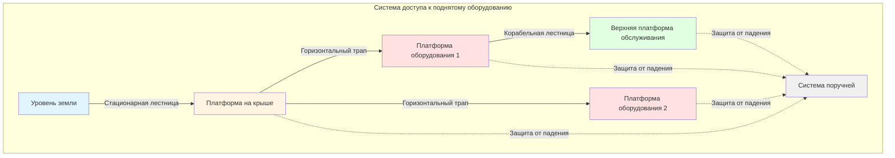
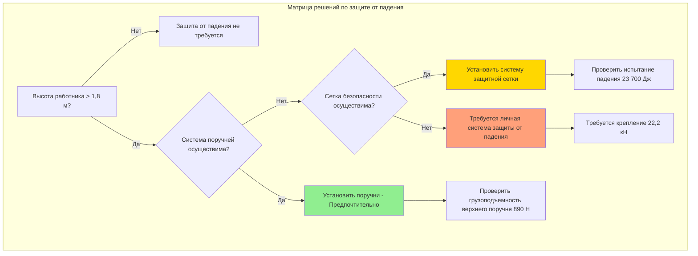
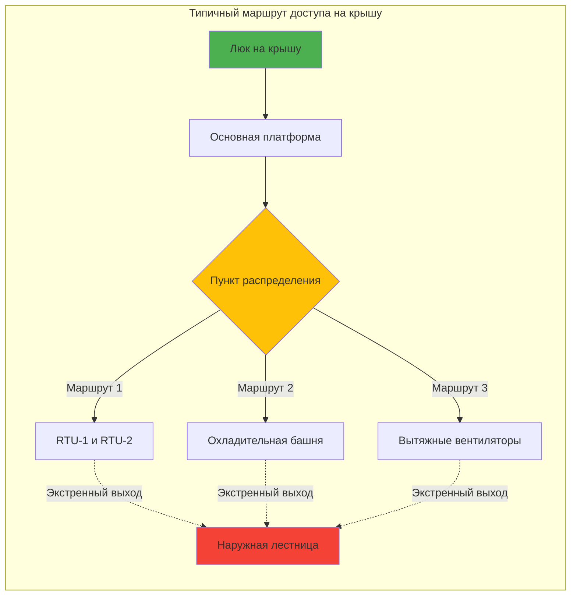

## Обзор

Безопасный и эффективный доступ к поднятому HVAC оборудованию необходим для планового обслуживания, экстренного ремонта и соответствия нормативным требованиям. Надлежащая конструкция доступа снижает время обслуживания, минимизирует риски безопасности и обеспечивает эффективную работу оборудования на протяжении всего срока его эксплуатации.

## Компоненты системы доступа

### Стационарные лестницы

Стационарные лестницы обеспечивают вертикальный доступ к поднятому оборудованию и должны соответствовать стандартам OSHA 1910.27:

**Требования к конструкции:**
- Минимальная ширина перекладины: 406 мм (16 дюймов)
- Максимальный интервал между перекладинами: 305 мм (12 дюймов) по центру
- Зазор позади лестницы: минимум 178 мм (7 дюймов) от препятствия
- Зазор для носков: минимум 114 мм (4,5 дюйма) по глубине
- Грузоподъемность перекладины: минимум 113 кг (250 фунтов) на перекладину
- Выступ боковой направляющей: 1067 мм (42 дюйма) выше поверхности площадки

**Требования к защите от падения:**
- Лестницы выше 7,3 м (24 фута) требуют систем безопасности лестниц или личных систем защиты от падения
- Клеточные системы запрещены на новых установках согласно нормативам OSHA 2018 года
- Системы рельсов должны обеспечивать непрерывную защиту при подъеме и спуске

### Платформы и трапы

Рабочие платформы обеспечивают безопасные рабочие площадки для обслуживания оборудования и должны позволять передвижение рабочих с инструментом:

**Критерии конструкции платформы:**

| Параметр | Минимальное требование | Примечания |
|-----------|-------------------|-------|
| Ширина | 762 мм (30 дюймов) | 914 мм (36 дюймов) предпочтительно для двусторонних перемещений |
| Грузоподъемность | 2,4 кПа (50 psf) | Минимальная равномерная нагрузка |
| Высота поручня | 1067 мм (42 дюйма) | Допуск ±76 мм |
| Высота промежуточного поручня | 533 мм (21 дюйм) | Посередине между верхним поручнем и платформой |
| Высота плинтуса | 102 мм (4 дюйма) | Требуется при наличии инструмента или материалов |
| Поверхность | Противоскользящая | Решетчатые или текстурированные поверхности необходимы |

**Конфигурация трапа:**
- Максимальный уклон: 1:8 (12,5%) без шипов или ступеней
- Уклоны более 1:8 требуют лестничных проступей или ступенчатого типа
- Минимальный допуск сверху: 2032 мм (80 дюймов)
- Непрерывность поручня на поворотах

### Зазоры для обслуживания

Размещение оборудования должно обеспечивать надлежащие зазоры для работ по техническому обслуживанию:

**Минимальные зазоры для обслуживания:**
- Фронтальный доступ для обслуживания: 914 мм (36 дюймов) от панелей управления и компонентов, требующих обслуживания
- Боковой зазор: 762 мм (30 дюймов) при отсутствии необходимости обслуживания
- Допуск сверху: минимум 1981 мм (78 дюймов) для рабочей зоны
- Расстояние между оборудованием: 1219 мм (48 дюймов) для основных компонентов
- Зазор для снимаемой панели: 1,5 × размер панели в направлении, перпендикулярном удалению

**Специальные соображения:**
- Удаление трубного пучка теплообменника требует зазора, равного длине пучка плюс 610 мм (24 дюйма)
- Удаление корпуса вентилятора требует зазора, равного диаметру ротора плюс 914 мм (36 дюймов)
- Замена компрессора требует зазора для грузоподъемного оборудования
- Обслуживание блока фильтров требует пространства вытягивания плюс рабочую зону технического специалиста

## Системы защиты от падения

### Личные системы защиты от падения (PFAS)

Требуются при работе на высоте более 1,8 м (6 футов) без поручней:

**Компоненты системы:**
- Полнотелесная привязь (класс III) с D-образным кольцом между лопатками
- Карабин с амортизирующий шнуром или самовозвратный спасательный канат
- Точка крепления, рассчитанная на 22,2 кН (5000 фунтов) на одного присоединенного рабочего
- Расчет общего расстояния падения: длина карабина + расстояние замедления + высота рабочего + коэффициент безопасности

**Конструкция крепления:**
- Постоянные точки крепления на крыше у оборудования
- Горизонтальные системы спасательных канатов для расширенных рабочих зон
- Мобильные якорные тележки для переменных позиций оборудования
- Сертификация и ежегодная проверка требуется

### Системы поручней

Предпочтительный метод защиты от падения, обеспечивающий пассивную защиту:

**Требования верхнего поручня:**
- Высота: 1067 мм (42 дюйма) ±76 мм от рабочей поверхности
- Грузоподъемность: 890 Н (200 фунтов) при приложении вниз или наружу
- Прогиб: максимум 76 мм (3 дюйма) при нагрузке 890 Н

**Промежуточные поручни:**
- Промежуточный поручень или эквивалентное ограждение для предотвращения прохождения сферы диаметром 483 мм (19 дюймов)
- Высота промежуточного поручня: 533 мм (21 дюйм) номинальная

**Выбор материалов:**
- Стальные трубы или конструктивные сечения для постоянных установок
- Алюминий или нержавеющая сталь в коррозионноактивных средах
- Желтое порошковое покрытие для видимости (необязательно, но рекомендуется)

## Планирование маршрута доступа

### Путь движения

Эффективная маршрутизация доступа снижает время обслуживания и повышает безопасность:

**Принципы конструирования:**
- Минимизировать перепады высот между оборудованием, требующим частого обслуживания
- Обеспечивать непрерывную защиту от падения по всему маршруту
- Избегать пересечения активных путей дренажа крыши
- По возможности отделить маршруты доступа от трубопроводов хладагента
- Освещать пути для ночного обслуживания (минимум 54 люкса)

**Экстренный выход:**
- Два выхода требуются для крыш площадью более 279 м² (3000 кв. футов)
- Максимальное расстояние до выхода: 61 м (200 футов)
- Маршрут выхода обозначен фотолюминесцентной сигнализацией

## Хранение оборудования для техического обслуживания

### Инструментальные шкафчики и площадки для временного хранения материалов

Хранение на крыше снижает время транспортировки оборудования:

**Защищенные от влаги шкафчики:**
- Безопасное хранение часто используемого ручного инструмента
- Коррозионностойкая конструкция (алюминий или композит)
- Вентиляция для предотвращения накопления влаги
- Минимальный размер: 0,6 м × 0,6 м × 1,2 м высота (2 фута × 2 фута × 4 фута)

**Площадки для временного хранения материалов:**
- Предусмотренное хранилище фильтров рядом с вентиляционными установками
- Точки крепления грузоподъемного оборудования для удаления тяжелых компонентов
- Системы стопорения баллонов хладагента
- Пункты сбора отходов

## Соответствие нормативным требованиям

### Ссылки на кодексы

**Стандарты OSHA:**
- 1910.27: Стационарные лестницы
- 1910.28: Обязанность иметь защиту от падения
- 1910.29: Системы защиты от падения и критерии защиты от падающих предметов
- 1910.140: Личные системы защиты от падения

**Отраслевые стандарты:**
- ANSI A14.3: Стационарные лестницы - требования безопасности
- ANSI Z359: Кодекс защиты от падения
- ASHRAE Standard 15: Стандарт безопасности систем охлаждения (доступ для проверки предохранительного клапана)

### Проверка и документирование

**Плановые проверки:**
- Системы защиты от падения: Ежегодная проверка компетентным лицом
- Системы лестниц: Визуальная проверка перед каждым использованием, подробная ежегодная проверка
- Платформы и трапы: Ежеквартальная проверка конструкции
- Точки крепления: Испытание нагрузкой каждые 5 лет или после любого события падения

**Требования к документированию:**
- Журналы проверок, сохраняемые на протяжении срока эксплуатации оборудования
- Таблички с указанием грузоподъемности постоянно прикреплены к платформам
- Документация по сертификации систем защиты от падения
- Записи о подготовке работников (обучение защите от падения каждые 2 года минимум)

## Передовая практика

1. **Интеграция на этапе проектирования**: Координировать системы доступа при разработке расположения оборудования для оптимизации эффективности обслуживания
2. **Избыточная защита**: Обеспечивать поручни и точки крепления, где это возможно
3. **Зимние условия**: Указывать противоскользящие поверхности, эффективные при льде и снеге
4. **Освещение**: Обеспечивать задачное освещение в точках обслуживания оборудования независимо от освещения здания
5. **Связь**: Установить системы экстренной связи у удаленного оборудования
6. **Эргономика**: Расположить часто обслуживаемые компоненты на высоте 762–1524 мм (30–60 дюймов) выше платформы
7. **Стандартизация**: Использовать единообразное оборудование доступа и системы защиты от падения на всех объектах

Надлежащие системы доступа и защиты от падения не являются факультативными — это существенная инфраструктура, которая обеспечивает безопасную и эффективную работу HVAC систем на протяжении всего жизненного цикла оборудования.
