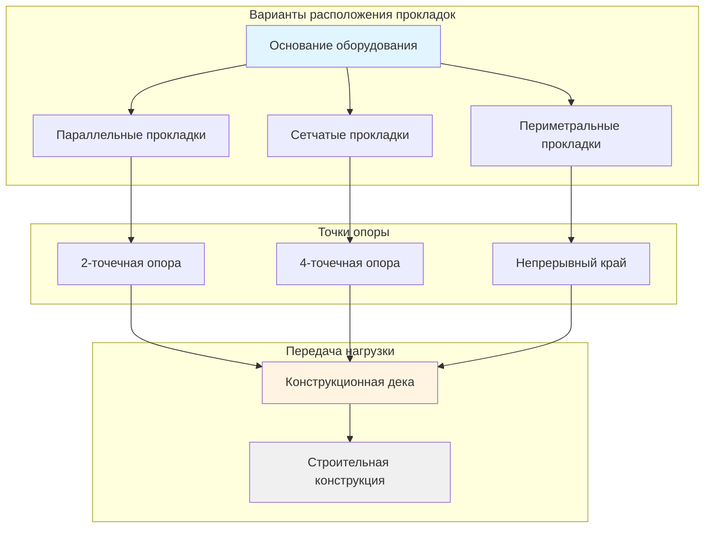
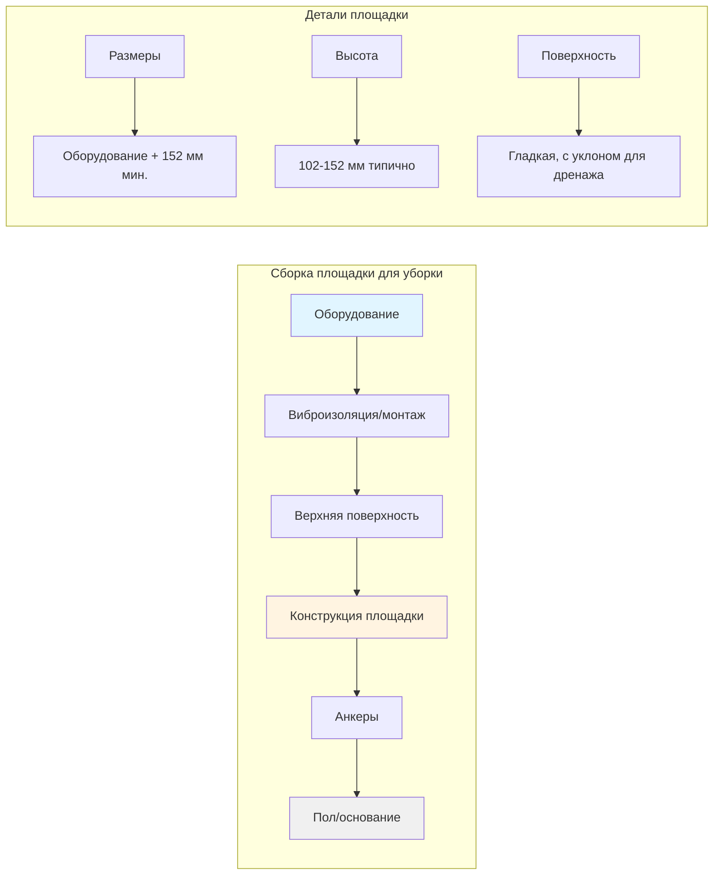
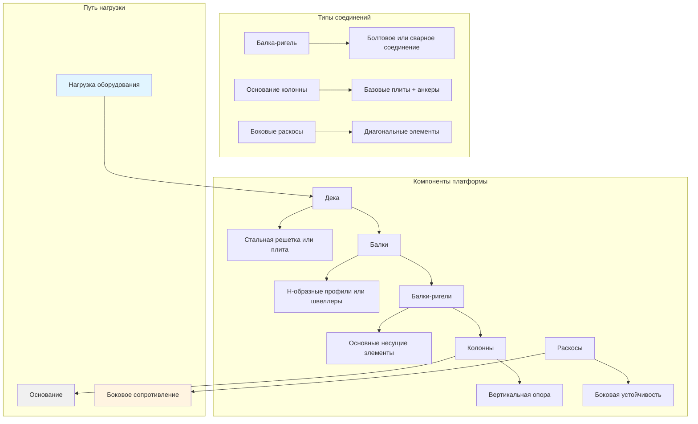

Опоры платформ обеспечивают критический структурный интерфейс между оборудованием HVAC и строительными конструкциями, гарантируя надлежащее распределение нагрузок, выравнивание оборудования и соответствие требованиям проектирования на сейсмические и ветровые нагрузки. Эти системы поддержки включают прокладки, площадки для уборки и конструкционные стальные каркасы.

## Системы прокладок

Прокладки состоят из конструкционных элементов, размещенных между оборудованием и опорной поверхностью для распределения нагрузок, обеспечения зазоров для соединений и облегчения выравнивания.

### Выбор материалов

**Стальные прокладки:**
- Конструкционные стальные швеллеры (С-образные профили)
- Двутавровые балки (Н-образные профили)
- Пустотелые профили (HSS)
- Горячее цинкование или окрасочное покрытие

**Деревянные прокладки:**
- Обработанный пиломатериал для временных установок
- Не рекомендуется для постоянного оборудования HVAC
- Ограниченное применение в сейсмических зонах или зонах затопления

### Расчет распределения нагрузок

Требуемое сечение прокладки зависит от веса оборудования и расстояния между опорами:

$$\sigma_{b} = \frac{M}{S} \leq F_b$$

Где:
- $\sigma_b$ = Напряжение при изгибе (МПа)
- $M$ = Максимальный момент изгиба (Н⋅м)
- $S$ = Момент сопротивления (см³)
- $F_b$ = Допустимое напряжение при изгибе (МПа)

Для равномерно распределенной нагрузки оборудования:

$$M = \frac{wL^2}{8}$$

Где:
- $w$ = Распределенная нагрузка на единицу длины (Н/см)
- $L$ = Пролет между опорами (см)

### Конфигурация прокладок

**Типовые высоты прокладок:**
- Минимум: 51 мм (зазор для труб)
- Стандартная: 102-152 мм (доступ для обслуживания)
- Расширенная: 203-305 мм (основное трубопроводное хозяйство/дренаж)

## Площадки для уборки

Площадки для уборки представляют собой бетонные или стальные платформы, которые поднимают оборудование над уровнем пола для дренажа, доступа к очистке и защиты от влаги пола.

### Бетонные площадки для уборки

**Требования к проектированию:**

Минимальная толщина бетона:

$$t = \sqrt{\frac{3P(1-\mu^2)}{2\pi E h}}$$

Где:
- $t$ = Толщина плиты (см)
- $P$ = Сосредоточенная нагрузка (кН)
- $\mu$ = Коэффициент Пуассона (0,15 для бетона)
- $E$ = Модуль упругости (МПа)
- $h$ = Допустимое давление подшипника (МПа)

**Стандартные спецификации:**
- Прочность бетона: минимум 20-28 МПа
- Толщина: 102-152 мм для легкого оборудования
- Толщина: 152-305 мм для тяжелого оборудования
- Армирование: стержни диаметром 12 мм с шагом 305 мм в обоих направлениях
- Расстояние от края: минимум 76 мм от анкеров

### Стальные площадки для уборки

Изготовленные стальные платформы, использующие:
- Конструкционный стальной каркас (уголки, швеллеры, балки)
- Стальная плита или решетчатая дека
- Сварная или болтовая конструкция
- Требуется защита от коррозии

### Требования к высоте

Минимальные высоты площадок для уборки:
- Сухие помещения: 51-102 мм
- Влажные помещения: 102-152 мм
- Подверженные затоплению участки: в соответствии с руководящими принципами FEMA (выше уровня наводнения)
- Помещения оборудования с напольными сливами: минимум 102 мм

## Платформы со структурным каркасом

Конструкционные платформы поддерживают несколько единиц оборудования или обеспечивают поднятые механические помещения, требуя комплексного конструкционного проектирования.

### Анализ нагрузок платформы

**Расчет постоянной нагрузки:**

$$DL = W_{eq} + W_{platform} + W_{piping} + W_{misc}$$

Где:
- $W_{eq}$ = Вес оборудования (кН)
- $W_{platform}$ = Вес конструкции платформы (кН)
- $W_{piping}$ = Трубопроводы, кабелепроводы и аксессуары (кН)
- $W_{misc}$ = Прочие нагрузки (кН)

**Временная нагрузка:**
- Доступ для обслуживания: минимум 6,0 кПа
- Пути замены оборудования: 12 кПа
- В соответствии с требованиями IBC Глава 16

**Сейсмическая нагрузка:**

$$F_p = \frac{0.4 a_p S_{DS} W_p}{R_p/I_p}\left(1 + 2\frac{z}{h}\right)$$

Где:
- $F_p$ = Сейсмическая сила на оборудование (кН)
- $a_p$ = Коэффициент амплификации компонента
- $S_{DS}$ = Расчетное спектральное ускорение
- $W_p$ = Вес компонента (кН)
- $R_p$ = Коэффициент модификации отклика компонента
- $I_p$ = Коэффициент важности компонента
- $z$ = Высота точки присоединения
- $h$ = Высота здания

### Конфигурация проектирования каркаса

### Требования к конструкционной стали

**Проектирование элементов:**
- AISC 360: Спецификация для зданий из конструкционной стали
- ASCE 7: Минимальные расчетные нагрузки
- IBC: Требования к конструкции

**Пределы прогибов:**
- Прогиб от временной нагрузки: максимум L/360
- Прогиб от полной нагрузки: максимум L/240
- Пределы, специфичные для оборудования, могут быть более строгими

**Проектирование соединений:**
- Болтовые соединения: AISC 360 Глава J
- Сварные соединения: AWS D1.1
- Базовые плиты: минимальная толщина в соответствии с AISC Design Guide 1

### Опоры бетонных платформ

Для платформ, опирающихся на бетон:

**Давление подшипника:**

$$f_p = \frac{P}{A} \leq \phi(0.85f'_c)$$

Где:
- $f_p$ = Давление подшипника (МПа)
- $P$ = Приложенная нагрузка (кН)
- $A$ = Площадь подшипника (см²)
- $\phi$ = Коэффициент снижения прочности (0,65)
- $f'_c$ = Прочность бетона на сжатие (МПа)

**Проектирование анкеров:**
- ACI 318 Глава 17: Крепление к бетону
- Минимальная глубина заделки в соответствии с производителем анкера
- Расстояние от края: минимум 152 мм для опор платформ
- Расстояние между анкерами: минимум 4 диаметра анкера

## Требования к установке и проверке

### Выравнивание платформы
- Максимальный уклон: 6 мм на 3 м
- Использование прецизионных прокладок или винтов для выравнивания
- Проверка с помощью цифрового уровня перед размещением оборудования

### Установка анкеров
- Проверка глубины скважин
- Процедуры очистки отверстий
- Спецификации момента затяжки производителя
- Требуется специальная проверка для сейсмических приложений

### Обеспечение качества
- Проверка конструкционных расчетов и рабочих чертежей
- Проверка сварных швов в соответствии с AWS D1.1
- Подтверждение сертификатов материалов
- Документирование фактического состояния

### Доступ и безопасность
- Платформы выше 762 мм требуют перил ограждения
- Лестницы или трапы в соответствии с требованиями OSHA
- Адекватное пространство для обслуживания (минимум 914 мм)
- Требуется табличка с грузоподъемностью

## Координация проектирования

Проектирование опор платформ требует координации между:
- Инженером-конструктором (емкость платформы)
- Инженером HVAC (нагрузки оборудования и зазоры)
- Архитектором (распределение пространства и эстетика)
- Геотехническим инженером (требования к основанию для платформ на уровне грунта)

Надлежащее проектирование опор платформ обеспечивает работу оборудования в пределах допусков выравнивания производителя, безопасное распределение нагрузок на строительную конструкцию и обеспечивает необходимый доступ для установки и обслуживания при одновременном соответствии всем требованиям кодексов по сейсмической стойкости, ветровым нагрузкам и защите от наводнений.
