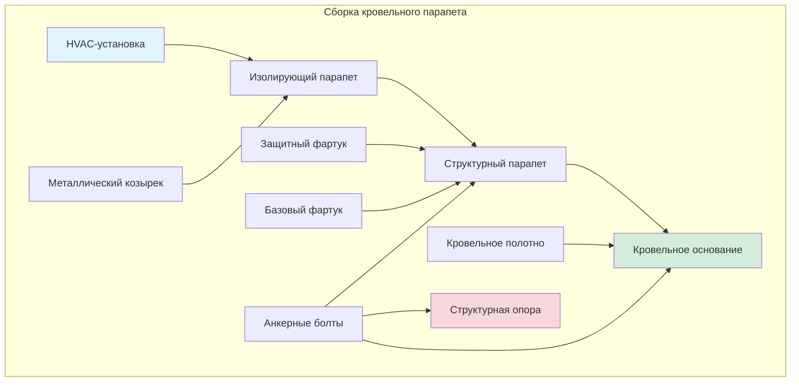
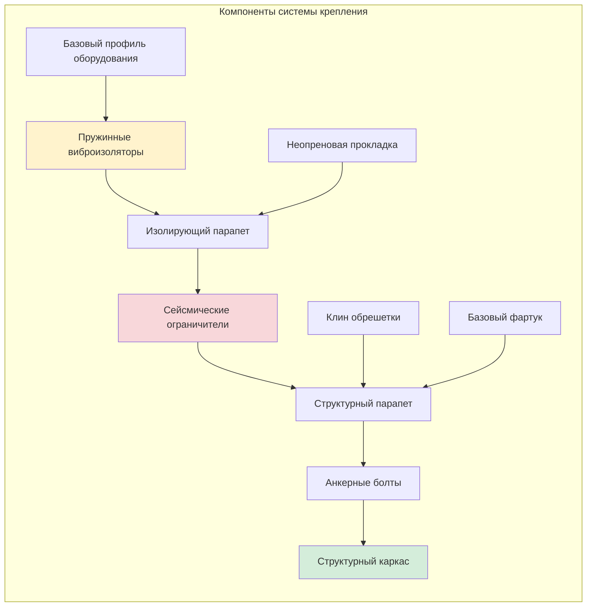

## Обзор

Монтаж кровельного оборудования представляет одно из наиболее сложных применений HVAC, требующее координации структурной емкости, ветроустойчивости, сейсмических ограничений, виброизоляции и гидроизоляции. Оборудование, начиная от малых моноблочных установок и заканчивая крупными чиллерами и градирнями, должно быть надлежащим образом закреплено, чтобы противостоять воздействию окружающей среды при сохранении целостности крыши.

Положения ASCE 7 по подъемной силе ветра и сейсмическим силам определяют проектирование установок на крыше со специфическими коэффициентами усиления для приподнятого оборудования.

## Проектирование ветровых нагрузок на кровельное оборудование

### Расчеты подъемной силы ветра

Кровельное оборудование испытывает значительно более высокое давление ветра, чем установки на уровне земли, из-за воздействия и краевых эффектов.

**Расчетное ветровое давление на кровельное оборудование:**

$$
p = q_h \cdot G \cdot C_p
$$

Где:
- $p$ = расчетное ветровое давление (кПа)
- $q_h$ = скоростное давление на средней высоте крыши (кПа)
- $G$ = коэффициент порывистости ветра (обычно 0,85)
- $C_p$ = коэффициент внешнего давления

**Расчет скоростного давления:**

$$
q_h = 0,00256 \cdot K_z \cdot K_{zt} \cdot K_d \cdot V^2
$$

Где:
- $K_z$ = коэффициент скоростного давления по высоте
- $K_{zt}$ = топографический коэффициент
- $K_d$ = коэффициент направленности ветра
- $V$ = базовая скорость ветра (м/с)

### Коэффициенты давления в зависимости от местоположения

ASCE 7 определяет повышенное давление для оборудования, расположенного в угловых и краевых зонах кровли:

| Местоположение | Диапазон $C_p$ | Коэффициент подъема |
|----------|-------------|---------------|
| Внутренняя зона | -0,9 до -1,3 | 1,0 |
| Краевая зона | -1,5 до -2,2 | 1,7 |
| Угловая зона | -2,0 до -3,0 | 2,3 |

Оборудование следует размещать во внутренних зонах, когда это возможно, чтобы минимизировать ветровые нагрузки и требования к креплению.

## Сейсмическое проектирование приподнятого оборудования

### Усиление сейсмических сил

Кровельное оборудование испытывает усиленные сейсмические силы из-за высоты и динамического отклика здания.

**Расчетная сейсмическая сила:**

$$
F_p = \frac{0.4 \cdot a_p \cdot S_{DS} \cdot W_p}{R_p / I_p} \cdot \left(1 + 2 \cdot \frac{z}{h}\right)
$$

Где:
- $F_p$ = расчетная сейсмическая сила
- $a_p$ = коэффициент усиления компонента (2,5 для HVAC)
- $S_{DS}$ = расчетное спектральное ускорение отклика
- $W_p$ = рабочий вес компонента
- $R_p$ = коэффициент модификации отклика компонента (2,5 для HVAC)
- $I_p$ = коэффициент важности компонента
- $z$ = высота точки крепления
- $h$ = высота здания

**Максимальные и минимальные пределы силы:**

$$
F_{p,max} = 1.6 \cdot S_{DS} \cdot I_p \cdot W_p
$$

$$
F_{p,min} = 0.3 \cdot S_{DS} \cdot I_p \cdot W_p
$$

Для кровельного оборудования, где $z = h$, коэффициент усиления $(1 + 2z/h)$ равен 3,0, утраивая базовую сейсмическую силу.

## Кровельный парапет и системы крепления

### Требования к конструкции парапета

Кровельные парапеты обеспечивают структурный интерфейс между оборудованием и конструкцией крыши при сохранении водонепроницаемости.

**Требования к высоте парапета:**
- Минимум 20 см над готовой поверхностью крыши
- 30 см рекомендуется для регионов с обильными снегопадами
- Дополнительная высота для предполагаемого нарастания кровельного полотна

### Конфигурация крепления оборудования

## Структурная координация

### Путь передачи нагрузки

Полный путь передачи нагрузок от оборудования к основной конструкции должен быть проверен:

1. **Основание оборудования:** Распределяет нагрузки на монтажные профили
2. **Система виброизоляции:** Передает статические нагрузки при изоляции вибрации
3. **Сборка парапета:** Распределяет нагрузки по кровельному основанию
4. **Кровельное основание:** Перекрывает пространство между конструктивными элементами
5. **Конструктивный каркас:** Передает нагрузки на колонны/стены здания

### Требования к структурному анализу

**Компоненты мертвой нагрузки:**
- Рабочий вес оборудования
- Парапет и сборка монтажа
- Платформа доступа для обслуживания (при наличии)

**Рассмотрение живой нагрузки:**
- Доступ персонала: 1,3 кН сосредоточенная нагрузка
- Нагрузки оборудования обслуживания
- Накопление снега (скопление вокруг оборудования)

**Распределение сосредоточенной нагрузки:**

$$
P_{distributed} = \frac{P_{equipment}}{A_{effective}}
$$

Где эффективная площадь зависит от размеров парапета и способности кровельного основания к пролету.

## Виброизоляция на уровне крыши

### Выбор системы изоляции

Кровельные установки требуют тщательной виброизоляции, чтобы предотвратить структурную передачу:

**Прогиб пружинного виброизолятора:**

$$
\delta = \frac{W}{k \cdot n}
$$

Где:
- $\delta$ = статический прогиб (см)
- $W$ = вес оборудования (кг)
- $k$ = жесткость пружины (кН/см)
- $n$ = количество виброизоляторов

**Эффективность изоляции:**

$$
T = \frac{f_n}{f_d}
$$

Где:
- $T$ = коэффициент передачи
- $f_n$ = собственная частота системы изоляции
- $f_d$ = частота возмущения

Целевой коэффициент передачи: $T < 0,1$ (требует $f_n < 0,3 \cdot f_d$)

### Ограниченные пружинные виброизоляторы

Кровельные установки требуют сейсмически ограниченных виброизоляторов, обеспечивающих:
- Вертикальную поддержку нагрузки с виброизоляцией
- Горизонтальное ограничение при сейсмических и ветровых силах
- Ограниченное вертикальное перемещение при сейсмических событиях
- Возможность ограничения во всех направлениях

## Гидроизоляция и кровельные проходы

### Проектирование системы фартуков

Критические слои гидроизоляции для кровельного оборудования:

1. **Базовый фартук:** Соединяет кровельное полотно с парапетом, минимальная высота 20 см
2. **Защитный фартук:** Перекрывает базовый фартук, механически закреплен на парапете
3. **Козырьковый фартук:** Защищает верх парапета от проникновения воды
4. **Гидравлические коробки:** Избегаются, если возможно; вместо них используются компрессионные манжеты

### Герметизация проходов

Все кровельные проходы требуют защиты несколькими слоями:

**Проходы электрических кабелепроводов:**
- Гидравлические коробки с заливочным герметиком (наименее предпочтительно)
- Компрессионные манжеты для труб (предпочтительно)
- Распределительные коробки на парапете (наиболее надежно)

**Проходы холодильных линий:**
- Заводские герметичные комплекты линий через боковую стенку парапета
- Поролоновые закрывающие полосы у входа комплекта линий
- Герметик на металлических соединениях

**Маршрутизация конденсатного дренажа:**
- Внутренний маршрут предпочтителен (через внутренние помещения здания)
- Наружный маршрут требует ловушек соединений
- Зимняя защита от замерзания

## Последовательность установки и координация

### Проверка перед установкой

1. **Подтверждение структурной емкости:** Одобрение инженером адекватности кровельного каркаса
2. **Координация размещения парапета:** Выравнивание со структурными элементами
3. **Местоположения проходов:** Координация с подрядчиком по кровле
4. **Путь доступа:** Доступ кранов, точки строповки, защита крыши

### Процедура установки

1. Установить базовый парапет конструкции, закрепить к кровельному основанию/конструктивному каркасу
2. Завершить интеграцию базового фартука с кровельным полотном
3. Установить защитный и козырьковый фартуки
4. Монтировать изолирующий парапет с сейсмическими ограничителями
5. Установить оборудование на изолирующий парапет
6. Подключить и герметизировать все проходы
7. Проверить значения крутящего момента крепления
8. Проверить включение сейсмических ограничителей
9. Ввести в эксплуатацию и проверить работу

## Испытание нагрузок и проверка

### Требования испытания на вытягивание

Испытание вытягивания анкерных болтов проверяет емкость установки:

**Требуемая испытательная нагрузка:**

$$
T_{test} = 1.5 \cdot T_{design}
$$

Размер выборки: Минимум 4 анкера или 10 % от общего числа, в зависимости от того, что больше.

### Мониторинг прогиба

Долгосрочный мониторинг прогиба крыши под нагрузкой оборудования:
- Первоначальное обследование сразу после установки
- Повторное обследование через 30 дней
- Ежегодная проверка для критического оборудования

Чрезмерный прогиб (>L/240) указывает на неадекватную конструктивную поддержку, требующую исправления.

## Соответствие нормам и документирование

### Требуемые расчеты

1. Сопротивление подъемной силе ветра согласно ASCE 7 Глава 29
2. Сейсмическое крепление согласно ASCE 7 Глава 13
3. Анализ распределения конструктивной нагрузки
4. Проектирование системы виброизоляции
5. Проверка емкости анкерных болтов

### Документирование по факту выполнения

- План расположения оборудования с размерами относительно структурной сетки
- Компоновка и спецификации анкерных болтов
- Детали сейсмических ограничителей и настройки
- Спецификации виброизоляторов и их прогибы
- Детали кровельных проходов и конфигурация фартуков
- Структурные расчеты и одобрение инженера

---

**Смежные темы:**
- [Сейсмическое крепление оборудования](../../../../specialty-applications-testing/seismic-wind-flood-resistant-design/seismic-bracing-equipment/_index.md)
- [Проектирование ветровых нагрузок](../../../../specialty-applications-testing/seismic-wind-flood-resistant-design/wind-load-design/_index.md)
- [Управление вибрацией](../../../../specialty-applications-testing/acoustic-noise-vibration/vibration-control/_index.md)
