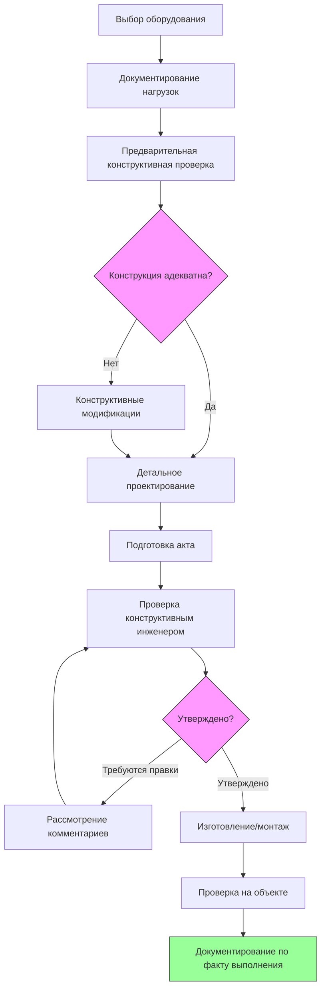
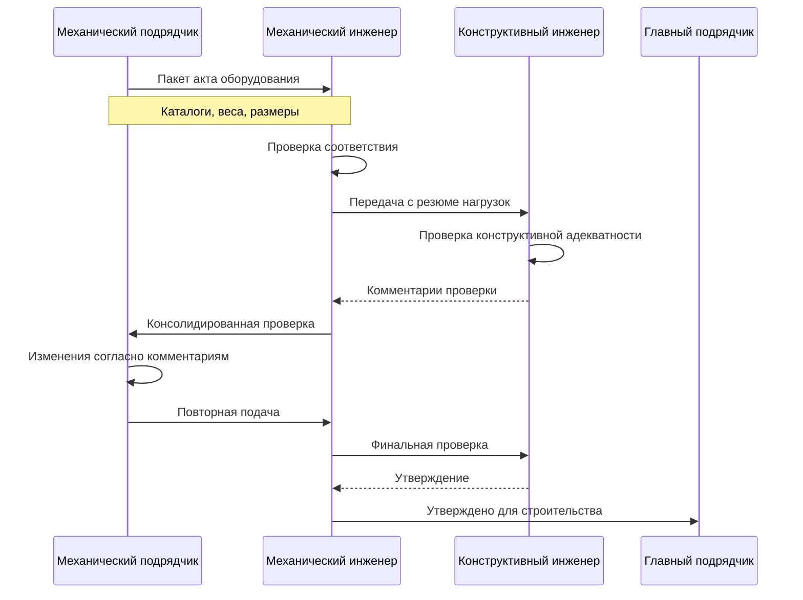

Структурная координация между проектировщиками HVAC и конструктивными инженерами критична при монтаже оборудования на возвышенных уровнях. Надлежащая координация обеспечивает, что строительные конструкции могут безопасно поддерживать нагрузки механического оборудования при соблюдении норм и обеспечении производительности систем.

## Ответственность инженера-автора проекта

Конструктивный инженер-автор проекта несет окончательную ответственность за проверку того, что строительные конструкции могут воспринимать нагрузки оборудования HVAC. Это включает:

**Полномочия конструктивного проектирования:**
- Проверка и утверждение всех нагрузок оборудования и конфигураций поддержки
- Проверка конструктивной адекватности мест крепления
- Расчет требуемого усиления или модификаций
- Подпись конструктивных чертежей и расчетов
- Обеспечение соответствия норм для всех конструктивных элементов

**Проверка пути передачи нагрузок:**
- Отслеживание нагрузок оборудования через основные конструктивные элементы
- Проверка механизмов передачи боковых нагрузок
- Подтверждение пропускной способности диафрагмы для сейсмических сил
- Оценка адекватности фундамента для накопленных нагрузок
- Проверка точек концентрации нагрузок, требующих усиления

**Проектирование соединений:**
- Определение требований анкеровки и деталей крепления
- Проектирование конструктивных опор, фартуков и подушек оборудования
- Определение требуемых глубин анкеровки и расстояний до края
- Определение усиления в местах проемов и отверстий
- Проверка методов крепления виброизолирующих опор

Конструктивный инженер должен получить полную и точную информацию о нагрузках в начале процесса проектирования для правильного определения размеров конструктивных элементов и соединений.

## Требования к документированию нагрузок

Комплексное документирование нагрузок формирует основу структурной координации. Нагрузки оборудования должны быть ясно доведены до сведения и должным образом отформатированы для конструктивного анализа.

**Технические описания оборудования:**

Включите следующую информацию для каждого элемента оборудования:

| Параметр | Требуемая информация |
|-----------|---------------------|
| Операционный вес | Общий вес, включая хладагент, воду, органы управления |
| Транспортировочный вес | Вес при такелажных работах и монтаже |
| Занимаемое пространство | Размеры основания оборудования и расположение точек поддержки |
| Центр масс | Расстояние от основания в направлениях X, Y, Z |
| Доступ для обслуживания | Требуемые зазоры и нагрузки при техническом обслуживании |
| Сейсмическая категория | Сейсмическая категория проектирования IBC и коэффициент значимости |

**Типы нагрузок и комбинации:**

Документируйте все применимые нагрузки согласно ASCE 7:

- **Постоянные нагрузки:** Вес оборудования, опоры, трубопроводы, кабелепровод, органы управления
- **Полезные нагрузки:** Персонал обслуживания, оборудование для обслуживания, снег/лед
- **Сейсмические нагрузки:** Горизонтальные силы на основе расчетов Fp
- **Ветровые нагрузки:** Подъемная и опрокидывающая силы на открытом оборудовании
- **Эксплуатационные нагрузки:** Тяга вентилятора, вибрация компрессора, гидравлический удар
- **Тепловые нагрузки:** Силы расширения в трубопроводах и опорах

Предоставьте комбинации нагрузок согласно ASCE 7 глава 2 для расчета по предельным состояниям:

- 1,2D + 1,6L + 0,5(Lr или S)
- 1,2D + 1,0E + L + 0,2S
- 0,9D + 1,0W

## Процесс рабочего потока координации

Эффективная структурная координация следует систематическому рабочему потоку на протяжении всех этапов проекта.

**Этап разработки проекта:**

1. Механический инженер предоставляет предварительные спецификации оборудования с приблизительными весами и местоположением
2. Конструктивный инженер проверяет пропускную способность существующей конструкции
3. Определение участков, требующих усиления или перемещения
4. Установка точек координации и графика для детальных актов
5. Документирование допущений и критериев проектирования

**Этап рабочей документации:**

Подготовка детальных чертежей поддерживающих конструкций, содержащих:

- Контур оборудования с расположением точек поддержки
- Расчеты сейсмических и ветровых сил
- Требуемая анкеровка и усиление
- Координация с дренажом крыши и гидроизоляцией
- Требования к зазорам для монтажа и обслуживания

Включите общие примечания, в которых указывается, что подрядчик должен проверить условия на объекте и получить утверждение конструктивного инженера перед монтажом.

## Процесс подачи акта и проверки

Процесс подачи акта обеспечивает, что установленное оборудование соответствует допущениям проектирования и пропускной способности конструкции.

**Требуемая информация в акте:**

- Технические данные производителя оборудования с сертифицированными весами
- Габаритные чертежи с расположением точек поддержки
- Местоположение центра масс для расчета сейсмических сил
- Сейсмическое свидетельство или отчеты испытаний (если требуется)
- Детали анкеровки и инструкции по монтажу
- Спецификации и детали виброизоляции
- Требования к зазорам для обслуживания

**Контрольный список конструктивной проверки:**

Конструктивный инженер проверяет:

- Вес оборудования соответствует допущениям проектирования (обычно ±10% допуска)
- Местоположение точек поддержки совпадает с конструктивными элементами
- Сейсмические силы находятся в пределах параметров проектирования
- Детали анкеровки адекватны и конструктивны
- Требования к усилению удовлетворены
- Проемы в крыше не компрометируют конструктивную целостность
- Последовательность монтажа не перенапрягает конструктивные элементы

## Документирование интерфейса

Ведите четкую документацию механо-конструктивного интерфейса на протяжении проекта:

**Чертежи координации:**

Подготовьте комплексные чертежи, показывающие:

- План конструктивного каркаса с расположением балок и ферм
- Контуры оборудования наложенные на конструктивную сетку
- Пути передачи нагрузок выделены
- Детали разрешения конфликтов
- Расположение усилений

**Таблицы резюме нагрузок:**

Создайте таблицы резюме для каждого уровня крыши или платформы оборудования:

| Идентификатор оборудования | Вес (кг) | Сейсмическая сила (кН) | Тип поддержки | Статус конструктивной проверки |
|--------------|-------------|-------------------|--------------|-------------------------|
| AHU-1 | 1450 | 8,5 | Стальной фартук | Утверждено 15.03.25 |
| CU-1 по 4 | 385 каждая | 2,3 каждая | Бетонная подушка | Утверждено 18.03.25 |
| ERV-1 | 660 | 3,9 | Фартук крыши | На рассмотрении |

**Документирование приказов на дополнительные работы:**

При изменении оборудования:

1. Немедленно уведомить конструктивного инженера
2. Подать пересмотренную документацию нагрузок
3. Получить проверку и утверждение конструктивного инженера
4. Документировать влияние на график строительства
5. Обновить чертежи по факту выполнения

## Проверка на объекте и требования по факту выполнения

Финальная координация продолжается через монтаж и закрытие:

**Предварительная проверка перед монтажом:**

- Подтвердить расположение конструктивных опор на объекте
- Проверить анкеровку и шаг анкерных болтов
- Проверить установку конструктивного усиления
- Документировать любые требуемые полевые модификации

**Проверка при монтаже:**

Конструктивный инженер должен наблюдать:

- Критические установки якорей
- Установку и выравнивание оборудования
- Проверку распределения нагрузок
- Усиление проемов

**Документирование по факту выполнения:**

Обновите чертежи, отражающие:

- Финальное местоположение оборудования и веса
- Фактические расположения и детали анкеров
- Полевые модификации конструктивных опор
- Расположение проемов и усиление

Надлежащая структурная координация защищает целостность здания, обеспечивает соответствие нормам и предотвращает дорогостоящие полевые модификации. Ранний взаимодействие, полная документация и систематические процессы проверки необходимы для успешного монтажа оборудования на возвышенных уровнях.
