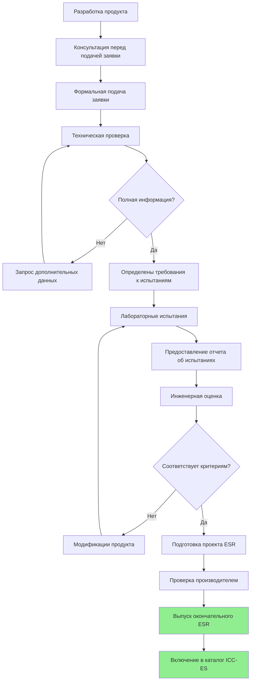
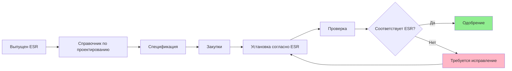

Служба оценки Международного совета по кодексам (ICC-ES) обеспечивает критическую независимую валидацию оборудования HVAC и вспомогательных систем посредством комплексных отчетов об оценке. Эти отчеты демонстрируют соответствие строительным кодексам и позволяют производителям документировать, что их продукты соответствуют строгим требованиям производительности для сейсмических, ветровых и конструктивных приложений.

## Обзор служб оценки ICC-ES

ICC-ES функционирует как независимая служба оценки, которая оценивает строительные продукты, компоненты, методы и материалы на соответствие Международному строительному кодексу (IBC), Международному кодексу жилых зданий (IRC) и другим применимым стандартам. Для приложений HVAC отчеты об оценке ICC-ES (ESR) предоставляют должностным лицам строительного кодекса, проектировщикам и подрядчикам задокументированное свидетельство того, что оборудование и вспомогательные системы соответствуют требованиям кодекса без требования одобрений для конкретных проектов.

Служба оценки заполняет пробел между инновационными продуктами и предписывающими требованиями кодекса, особенно ценна в следующих случаях:

- Продукты используют новые материалы или конструкции, не охватываемые явно в строительных кодексах
- Оборудование включает собственные системы сейсмического крепления
- Производители стремятся к широкому признанию на рынке в нескольких юрисдикциях
- Проекты требуют задокументированного свидетельства соответствия кодексу для получения разрешений

## Структура отчета об оценке (ESR)

Отчеты об оценке ICC-ES следуют стандартизированному формату, который предоставляет полную информацию о продукте:

**Информация заголовка отчета:**
- Номер ESR и дата выпуска
- Информация о производителе и контактные данные
- Описание продукта и предполагаемое использование
- Применимые разделы кодекса и стандарты

**Технические спецификации:**
- Свойства материалов и описания компонентов
- Грузоподъемность и ограничения производительности
- Требования к установке и ограничения
- Контроль качества и надзор за производством

**Условия использования:**
- Рассмотренные разделы строительного кодекса
- Ограничения на применение
- Требуемые практики установки
- Требования к проверке и испытаниям

ESR остаются действительными, пока продукт, производственный процесс и применимые кодексы остаются неизменными. Отчеты подвергаются периодическому пересмотру и переизданию для поддержания актуальности с циклами кодекса.

## Критерии приемлемости AC156

AC156 (Критерии приемлемости для сейсмической сертификации путем испытаний на встряхивающем столе неструктурных компонентов) представляет основной стандарт для сейсмической квалификации оборудования HVAC. Этот документ критериев приемлемости устанавливает:

**Требования к испытаниям:**
- Протоколы испытаний на встряхивающем столе, моделирующие сейсмическое движение
- Требуемые уровни производительности (RPL) на основе значимости оборудования
- Параметры входного движения, соответствующие ускорениям грунта, указанным в кодексе
- Требования к многоосному тестированию для реалистичного моделирования сейсмических событий

**Уровни производительности:**

| Уровень | Описание | Требование к эксплуатации |
|---------|----------|--------------------------|
| RPL 1 | Безопасность жизни | Удержание положения, отсутствие падающих опасностей |
| RPL 2 | Контроль повреждений | Ограниченные повреждения, пригодна к обслуживанию после проверки |
| RPL 3 | Немедленная готовность к работе | Непрерывная работа во время и после события |
| RPL 4 | Критические объекты | Повышенная производительность для существенных систем |

**Категории оборудования:**
AC156 охватывает различные компоненты HVAC, включая воздухообрабатывающие установки, охладители, котлы, кровельные установки, воздуховоды, трубопроводные системы и конструкции поддержки. Каждая категория имеет специфические требования к креплению, распорам и анкеровке.

## Рабочий процесс процесса одобрения ICC-ES

Путь от разработки продукта до одобрения ICC-ES следует структурированной последовательности:

## Требования к испытаниям и документации

Продукты, претендующие на одобрение ICC-ES, должны пройти комплексные испытания в аккредитованных лабораториях. Для сейсмических приложений это обычно включает:

**Испытания на встряхивающем столе:**
- Двухосное или трёхосное моделирование сейсмических явлений
- Оборудование, установленное в репрезентативных конфигурациях
- Приборы, контролирующие ускорения и смещения
- Проверка функциональности после испытания

**Структурные испытания:**
- Статические испытания нагрузкой вспомогательных систем
- Циклическая нагрузка для оценки соединений
- Проверка свойств материалов
- Испытания несущей способности анкеровки

**Документация по обеспечению качества:**
- Управление производственными процессами
- Сертификаты материалов
- Процедуры текущей проверки
- Система управления качеством производителя

## Применение к системам HVAC

Отчеты об оценке ICC-ES напрямую влияют на проектирование и установку систем HVAC:

**Выбор оборудования:**
Отчеты ESR позволяют проектировщикам указывать продукты с задокументированными сейсмическими квалификациями, исключая необходимость в проектных испытаниях или специальных одобрениях. Отчеты указывают максимальный рабочий вес, требуемую анкеровку и ограничения установки.

**Проектирование систем поддержки:**
ESR для систем сейсмического крепления, виброизоляторов с сейсмическими ограничителями и сборок поддержки воздуховодов/трубопроводов обеспечивают предварительно спроектированные решения с известными несущими способностями. Проектировщики ссылаются на продукты, включенные в ESR, для упрощения структурных расчетов и документации соответствия кодексам.

**Требования к установке:**
ESR устанавливают специфические процедуры установки, включая типы крепежных элементов, требования к крутящему моменту, зазоры и критерии проверки. Подрядчики должны соблюдать условия использования ESR для поддержания соответствия кодексам.

**Принятие должностными лицами строительного кодекса:**
Должностные лица по строительству признают отчеты ICC-ES как надежные доказательства соответствия кодексам. Документация ESR облегчает одобрение разрешений и уменьшает задержки проектов, связанные с одобрениями продуктов.

## Техническое обслуживание и обновление ESR

Производители, держатели отчетов об оценке ICC-ES, должны поддерживать консистентность продукта и обновлять отчеты по мере развития кодексов:

- Годовые надзорные проверки подтверждают соответствие производства
- Обновления цикла кодекса приводят ESR в соответствие с новыми изданиями IBC
- Модификации продукта вызывают поправки к отчету
- Технические обновления учитывают данные полевой работоспособности

## Интеграция с другими одобрениями

Одобрение ICC-ES часто дополняет другие сертификации:

- Одобрение OSHPD для медицинских учреждений Калифорнии
- Одобрение продуктов Флориды для зон ураганов с высокой скоростью ветра
- Сертификация UL для электробезопасности и пожарной защиты
- Сертификация AHRI для показателей производительности

Комбинация отчетов об оценке ICC-ES с другими одобрениями предоставляет комплексную документацию для сложных проектов, требующих нескольких путей соответствия.

## Проверка и соответствие

Полевая проверка гарантирует, что установленное оборудование HVAC соответствует условиям ESR:

- Маркировка продукта соответствует номеру ESR
- Установка следует требованиям ESR
- Анкеровка соответствует указанным критериям
- Документация доступна для проверки

Одобрение ICC-ES обеспечивает основу для установок HVAC, соответствующих кодексам в сейсмически активных регионах и зонах с сильным ветром, предлагая производителям, проектировщикам и подрядчикам упрощенный путь для соответствия все более строгим требованиям производительности зданий.
