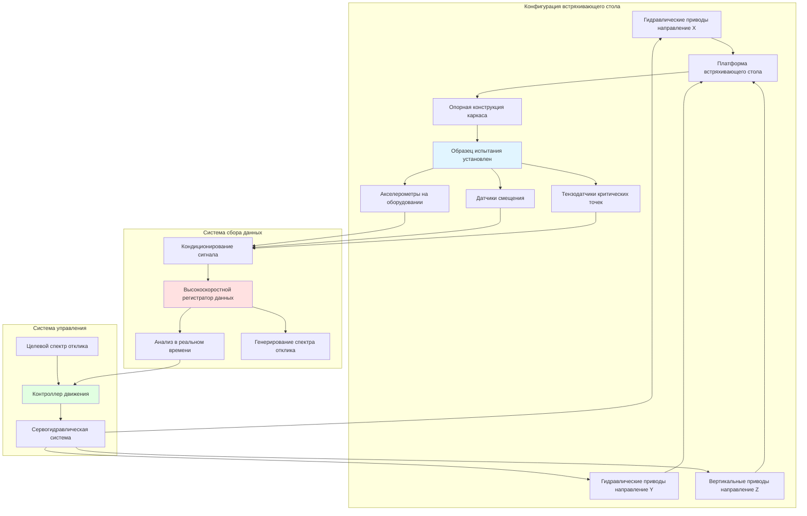
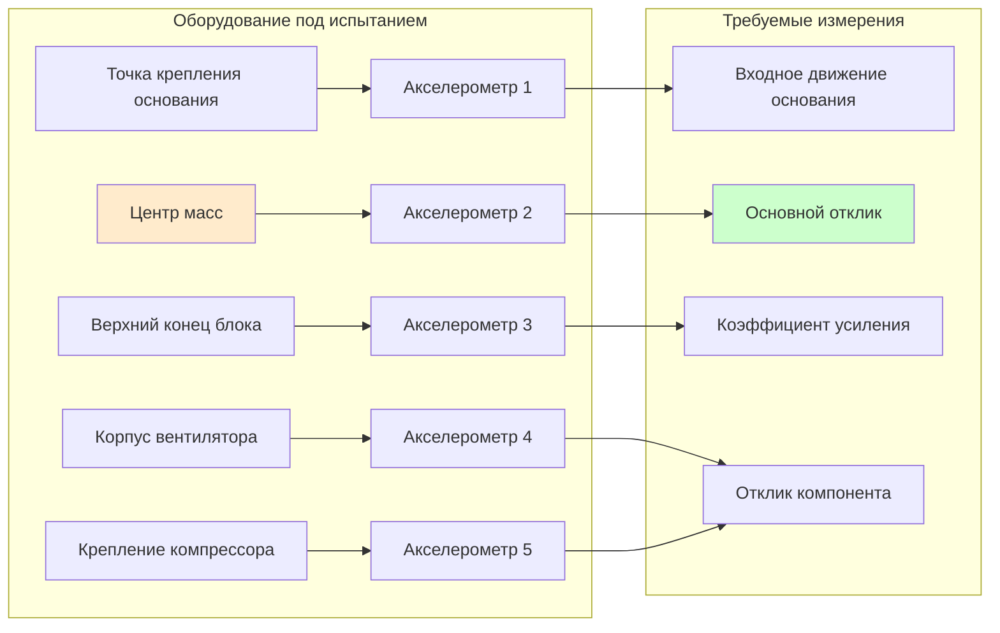

## Обзор

Испытания на встряхивающем столе обеспечивают наиболее строгий и реалистичный метод сейсмической квалификации оборудования HVAC. Этот метод динамического испытания подвергает оборудование воздействию смоделированных землетрясений на программируемой платформе, демонстрируя работоспособность во время и после сейсмических событий.

## Стандарты и протоколы испытаний

### Требования AC156

Критерии приемки ICC-ES 156 устанавливают протоколы испытаний на встряхивающем столе для несущих компонентов. Ключевые требования включают:

- **Двухосные или трёхосные испытания**: Оборудование должно испытываться при одновременном движении в двух или трёх ортогональных направлениях
- **Монтаж образца испытания**: Представительный для реальных условий установки, включая гибкость опорной конструкции
- **Входное движение**: Требуемый спектр отклика (RRS), охватывающий целевой спектр на всех частотах
- **Коэффициенты усиления**: Коэффициенты усиления компонента (ap) от 1,0 до 2,5, применяемые в зависимости от высоты монтажа

### Стандарт IEEE 693

IEEE 693 применяется в основном к электрооборудованию подстанций, но предоставляет соответствующие рекомендации для электрических компонентов HVAC:

- Уровни производительности: высокая, средняя и низкая квалификация
- Генерация временных истории, соответствующей целевым спектрам отклика
- Хрупкое тестирование для определения предельной мощности
- Требования к функциональной проверке после испытаний

## Требуемый спектр отклика

Целевой спектр отклика для испытаний на встряхивающем столе должен охватывать требования проектирования. Спектральное ускорение с демпфированием 5% рассчитывается как:

$$S_a(T) = \frac{S_{DS}}{T} \cdot \frac{a_p}{R_p} \cdot \left(1 + 2\frac{z}{h}\right)$$

Где:
- $S_a(T)$ = спектральное ускорение при периоде T (g)
- $S_{DS}$ = спектральное ускорение отклика проектирования на коротких периодах
- $T$ = собственный период компонента (секунды)
- $a_p$ = коэффициент усиления компонента (1,0 до 2,5)
- $R_p$ = коэффициент модификации отклика компонента (типично 2,5 для механического оборудования)
- $z$ = высота точки крепления компонента над уровнем грунта
- $h$ = средняя высота кровли конструкции

Спектр отклика испытания (TRS) должен удовлетворять:

$$TRS(f) \geq 0.9 \cdot RRS(f) \text{ для всех частот}$$

$$\frac{1}{n}\sum_{i=1}^{n}\frac{TRS(f_i)}{RRS(f_i)} \geq 1.0$$

Где средний коэффициент по всем частотным точкам должен быть равен или превышать единицу.

## Установка встряхивающего стола

## Процедуры испытаний

### Предварительные требования

1. **Функциональное тестирование**: Проверить корректную работу оборудования перед испытаниями
2. **Инструментализация**: Установить акселерометры в критических местах (основание, центр масс, крайние точки)
3. **Документирование**: Сфотографировать установку, записать состояние оборудования
4. **Поиск резонансной частоты**: Развёртка синусоидальной волны низкой амплитуды для определения собственных частот

### Последовательность испытаний

**Этап 1: Исследовательские испытания**

Движение низкой амплитуды (0,25 × RRS) для проверки:
- Функциональности системы сбора данных
- Отсутствие проблем установки
- Подтверждение начальной резонансной частоты

**Этап 2: Моделируемое проектное землетрясение (DBE)**

Испытание полной амплитуды, соответствующее требуемому спектру отклика:
- Продолжительность: Минимум 20 секунд интенсивного движения
- Три полных прохода в основных направлениях
- Контроль функциональных проблем во время встряхивания

**Этап 3: Максимальное рассматриваемое землетрясение (MCE)**

Усиленное испытание на уровне 1,5 × DBE (опционально):
- Демонстрирует запас по безопасности
- Определяет предельную мощность
- Документирует режимы отказа в случае отказа оборудования

**Этап 4: Проверка после испытаний**

- Визуальный осмотр на предмет повреждений (трещины, свободные компоненты, деформация)
- Функциональное тестирование для проверки работоспособности
- Сравнение резонансной частоты для обнаружения конструктивных изменений

## Критерии приемки

Оборудование проходит испытания на встряхивающем столе если:

1. **Конструктивная целостность**: Отсутствие конструктивного отказа, разлома или отделения основных компонентов
2. **Функциональная производительность**: Оборудование работает в соответствии со спецификациями после испытаний
3. **Производительность крепежа**: Система монтажа остаётся целой и надёжной
4. **Пределы деформации**: Остаточная деформация не нарушает функцию и не создаёт опасность для безопасности
5. **Сдвиг частоты**: Изменение собственной частоты менее 10% указывает на отсутствие значительных повреждений

Незначительные косметические повреждения (растрескивание краски, небольшие вмятины) приемлемы при условии сохранения функции.

## Требования к инструментализации

### Размещение акселерометров

Минимум три трёхосных акселерометра:
- Один на интерфейсе монтажа (входное движение)
- Один в центре масс оборудования (основной отклик)
- Один в наивысшей точке (проверка усиления)

## Требования к документации

### Содержание отчёта об испытаниях

1. **Описание оборудования**: Модель, мощность, размеры, вес, конфигурация монтажа
2. **Установка испытания**: Фотографии, чертежи, детали опорной конструкции
3. **Входные движения**: Временные истории, спектры отклика, пиковые ускорения
4. **Данные отклика**: Ускорения, смещения, деформации во всех точках измерения
5. **Проверка приемки**: Сравнение с критериями, результаты функциональных тестов
6. **Сертификационное заявление**: Декларация соответствия применимым стандартам

### Обеспечение качества

- Независимая испытательная лаборатория третьей стороны, аккредитованная согласно ISO/IEC 17025
- Сертификаты калибровки для всех приборов в пределах 1 года
- Контроль инженером, имеющим лицензию в юрисдикции установки оборудования
- Видеодокументирование всех прогонов испытаний

## Соображения по стоимости и расписанию

Испытания на встряхивающем столе требуют значительных инвестиций:

- **Стоимость испытаний**: 25 000 до 150 000 долл. в зависимости от размера и сложности оборудования
- **Расписание**: 2 до 6 недель от доставки оборудования до финального отчёта
- **Требования образца**: Минимум одна производственная единица, иногда две для повторяемости

Для оборудования производимого в больших объёмах, сертификация на встряхивающем столе амортизирует стоимость на множество установок в сейсмических регионах.

## Альтернативы полному испытанию на встряхивающем столе

Когда полное испытание на встряхивающем столе непрактично:

- **Сертификация на основе опыта**: Продемонстрированная сейсмическая производительность при прошлых землетрясениях
- **Анализ с ограниченным тестированием**: Компьютерное моделирование, проверенное компонентными тестами
- **Сертификация подобия**: Испытание представительного блока, распространённое на аналогичные модели

Эти альтернативы требуют значительного инженерного обоснования и могут быть не приняты в высокосейсмических юрисдикциях.

## Заключение

Испытания на встряхивающем столе предоставляют определённое доказательство сейсмической способности, но требуют значительных инвестиций в специализированные объекты, инструментализацию и экспертизу. Соответствие протоколам AC156 и IEEE 693 обеспечивает способность оборудования выдержать землетрясения уровня проектирования при сохранении критической функции. Надлежащая документация и сертификация третьей стороной обеспечивают широкое признание результатов испытаний во всех юрисдикциях, делая этот подход экономически эффективным для оборудования, развёрнутого в сейсмических зонах.
