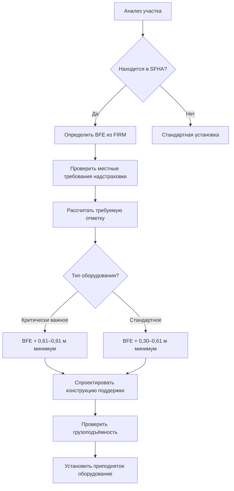
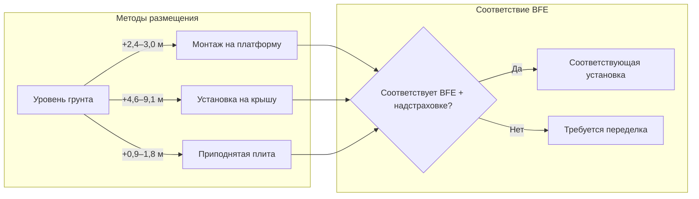
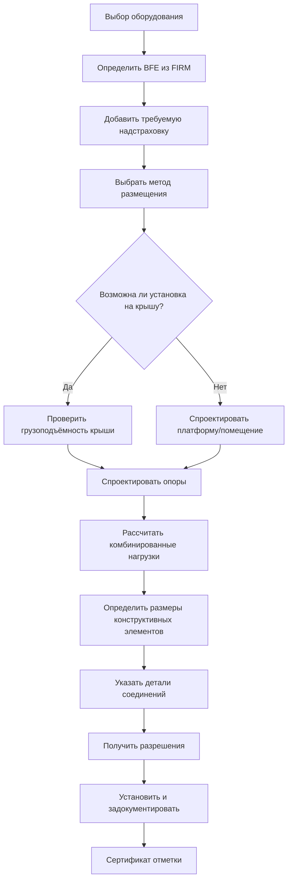

## Основы базовой отметки паводка

Базовая отметка паводка (BFE) представляет собой расчётную отметку, на которую поднимутся паводковые воды во время базового паводка, определяемого как паводок с вероятностью 1% возникновения в течение любого года (стотысячелетний паводок). Размещение оборудования HVAC выше BFE является основной стратегией защиты механических систем в специальных зонах паводковой опасности (SFHA).

BFE устанавливается FEMA через карты по оценке страхования от наводнений (FIRM) и служит нормативным ориентиром для строительства и размещения оборудования в районах, подверженных паводкам. Оборудование, установленное ниже BFE, подвергается значительному риску повреждения водой, электрических опасностей и отказа системы во время наводнений.

## Требования надстраховки

Надстраховка - это дополнительная высота выше BFE, требуемая большинством строительных кодексов и страховых программ. Этот запас безопасности учитывает:

**Стандартные положения надстраховки:**

- **Минимальная надстраховка:** обычно 0,30–0,61 м выше BFE для жилых помещений
- **Коммерческие/критически важные объекты:** часто требуют надстраховку 0,61–0,91 м
- **Местные поправки:** многие юрисдикции требуют надстраховку, превышающую минимальные требования FEMA
- **Соображения страховки:** дополнительная надстраховка может снизить стоимость страховых премий

Международный кодекс по строительству (IBC) и Международный жилищный кодекс (IRC) включают требования ASCE 24 по конструктивной защите от паводков, которые определяют надстраховку в зависимости от классификации занятости здания и локального риска паводков. Критически важные объекты, включая больницы, пожарные станции и центры управления в чрезвычайных ситуациях, обычно требуют самые большие запасы надстраховки.

## Стратегии размещения

### Установка на крышу

Размещение оборудования на крышах здания обеспечивает врождённое возвышение выше уровня паводков. Этот подход требует:

**Конструктивные соображения:**

- Проверка грузоподъёмности крыши для веса оборудования плюс обслуживающий персонал
- Учёт снежных нагрузок, ветрового подъёма и сейсмических сил
- Проектирование бортов или платформ для распределения сосредоточенных нагрузок
- Обеспечение защиты кровельного покрытия под опорами оборудования

**Требования доступа:**

- Постоянный доступ по лестнице или лестничному маршу в соответствии со стандартами OSHA
- Анкеры для защиты от падения при выполнении работ по обслуживанию
- Достаточный зазор для демонтажа и замены оборудования
- Доступ кранов для обслуживания или такелажные точки

### Монтаж на платформу

Приподнятые платформы поддерживают оборудование над землёй при одновременном сохранении установки на уровне грунта. Проектирование платформы должно учитывать:

**Проектирование фундамента:**

- Бетонные сваи, доходящие ниже глубины промерзания и потенциального размыва
- Свайные фундаменты в районах с высокоскоростным потоком
- Сопротивление гидростатическим и гидродинамическим нагрузкам
- Положения о разрушаемых стенах ниже BFE в соответствии с ASCE 24

**Конструктивный каркас:**

- Стальной или обработанный деревянный каркас, рассчитанный на коррозионную среду
- Оцинкованные горячим способом крепежи и соединения
- Открытая решётка или сетчатая настилка для минимизации препятствия потоку
- Крепления крепления для сейсмической и ветровой устойчивости

### Приподнятые помещения оборудования

Специально спроектированные помещения оборудования с приподнятыми полами обеспечивают защищённые ограждения:

- Отметка первого этажа на уровне или выше BFE плюс надстраховка
- Паводковые люки в стенах фундамента ниже приподнятого пола
- Мокрая защита от паводков для фундамента и конструктивных элементов
- Коммунальные услуги, входящие сверху, чтобы предотвратить обратный поток

## Соответствие кодексам и документация

### Требования FEMA

FEMA требует специальной документации для приподнятого оборудования в SFHA:

**Требуемая документация:**

- Сертификат отметки, заполненный лицензированным геодезистом
- Высота установки оборудования со ссылкой на базовую точку NAVD88
- Отметка самого нижнего механического оборудования, чётко указанная
- Фотографии, документирующие состояние после завершения работ
- Сертификация проектного специалиста для платформ и опор

### Местное управление паводковой равниной

Местные администраторы паводковой равнины применяют нормативные акты, которые часто превышают минимальные требования FEMA:

- Участие в системе рейтинга сообщества (CRS) может потребовать дополнительной надстраховки
- Прибрежные зоны высокой опасности (V-зоны) требуют свайных/столбчатых фундаментов
- Существенные улучшения могут потребовать возвышения существующего оборудования
- Требования к разрешениям на всё работы в пределах нанесённых на карту паводковых равнин

## Коммунальные подключения для приподнятого оборудования

Электрические, хладагентные и конденсатные соединения с приподнятым оборудованием требуют особых соображений:

**Электроснабжение:**

- Головка и отключение обслуживания выше BFE плюс надстраховка
- Гибкие трубопроводы для размещения теплового расширения
- Защита GFCI для всех наружных розеток
- Место отключения доступно во время паводков

**Линии хладагента:**

- Виброизоляция в точке подключения платформы
- Устойчивая к ультрафиолету изоляция на открытых комплектах линий
- Надлежащий угол наклона для возврата масла в длинные вертикальные участки
- Компенсационные петли для размещения движения здания

**Отвод конденсата:**

- Отвод под действием силы тяжести, заканчивающийся выше BFE
- Предотвращение обратного потока на линиях ниже BFE
- Защита от замерзания в холодном климате
- Зазор воздуха между системами ливневого дренажа

## Комбинации расчётных нагрузок

Платформы приподнятого оборудования должны выдерживать комбинированные экологические нагрузки в соответствии с ASCE 7:

**Критические случаи нагружения:**

1. Постоянная нагрузка + нагрузка от паводка + ветровая нагрузка
2. Постоянная нагрузка + нагрузка от паводка + сейсмическая нагрузка
3. Постоянная нагрузка + временная нагрузка + снежная нагрузка + ветровая нагрузка
4. Постоянная нагрузка + нагрузки от ударов обломков (V-зоны)

Гидродинамические нагрузки от движущейся воды могут превышать гидростатическое давление в 2–3 раза в зонах с высокоскоростными паводками. При наличии потенциала плавающих обломков должны быть учтены силы удара обломков.

## Анализ затрат и выгод

Размещение оборудования выше BFE влечёт значительные первоначальные затраты, но обеспечивает долгосрочные выгоды:

**Первоначальные затраты:**

- Конструктивная платформа: 150 000–750 000 рублей в зависимости от высоты и грузоподъёмности
- Надбавка к установке на крышу: 15–30% над стоимостью наземного монтажа
- Расширенные коммунальные линии: 150–450 рублей за погонный метр
- Инженерные и геодезические работы: 60 000–240 000 рублей

**Долгосрочные выгоды:**

- Снижение страховой премии от наводнений: 30–70%
- Избежание затрат на замену оборудования во время паводков
- Сокращение простоев по причине прерывания деятельности
- Соответствие требованиям финансирования и страховки

Актуарные данные Национальной программы страхования от наводнений (NFIP) показывают, что правильно приподнятое оборудование значительно снижает частоту и серьёзность претензий, что делает размещение экономически оправданным в большинстве мест SFHA.

## Соображения по техническому обслуживанию

Приподнятое оборудование представляет уникальные проблемы с техническим обслуживанием:

- Безопасный доступ в соответствии со стандартами OSHA по защите от падения
- Размер оборудования, позволяющий замену компонентов через люки в крыше
- Такелажные и грузоподъёмные планы для демонтажа крупных компонентов
- Увеличенная длина линий хладагента, влияющая на производительность системы
- Надёжность конденсатного насоса становится критической

Регулярная проверка конструктивных опор, защиты от коррозии и систем крепления обеспечивает постоянную устойчивость к паводкам и конструктивную целостность на протяжении всего срока службы оборудования.
