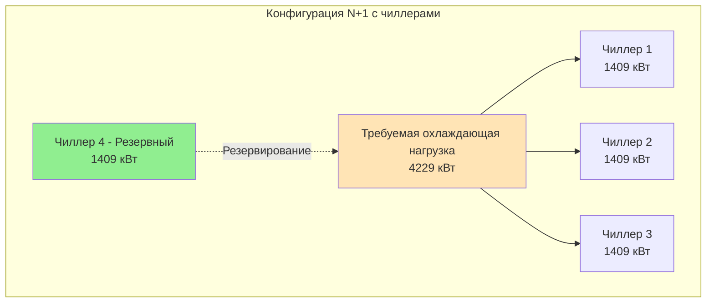
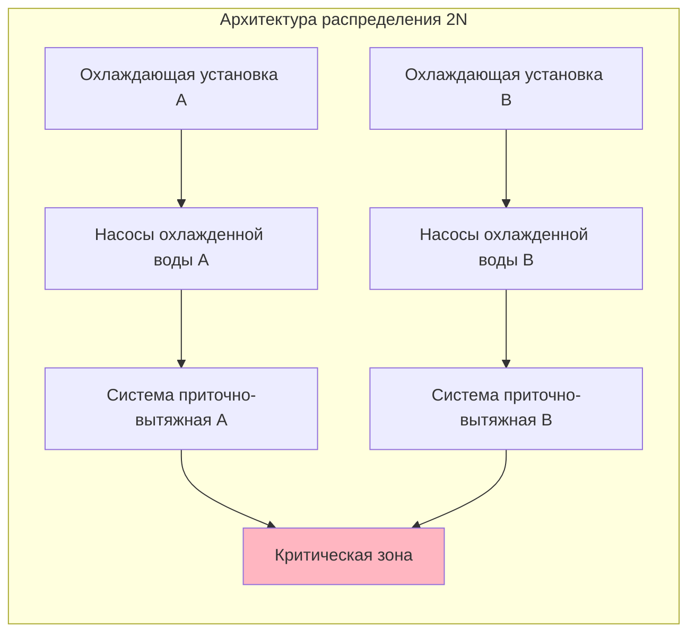
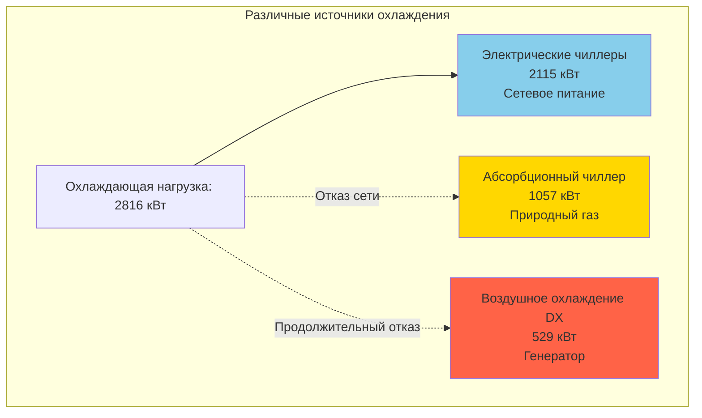

Отказоустойчивое проектирование HVAC обеспечивает непрерывное или быстро восстанавливаемое климатическое управление в критических объектах во время и после разрушительных событий. Этот подход интегрирует резервирование, разнообразие, повышение надежности и планирование восстановления для поддержания операций, когда обычные системы выходят из строя.

## Фундаментальные принципы устойчивости

Отказоустойчивое проектирование отличается от стандартной инженерии надежности тем, что оно решает маловероятные, но высокопоследственные события, включая стихийные бедствия, продолжительные отключения коммунальных служб и каскадные отказы инфраструктуры.

**Основные стратегии устойчивости:**

- **Резервирование**: Множественные пути для достижения требуемой производительности
- **Разнообразие**: Различные технологии или методы во избежание отказов по общей причине
- **Повышение надежности**: Физическая защита от выявленных опасностей
- **Быстрое восстановление**: Заранее спланированные процедуры и ресурсы для ускоренного восстановления
- **Пассивная выживаемость**: Минимальная функциональность без активных механических систем

## Конфигурации резервирования

Резервирование обеспечивает альтернативное оборудование или пути при отказе основных систем. Уровень резервирования соответствует критичности объекта и допустимому времени простоя.

### Стандартные уровни резервирования

| Конфигурация | Описание | Доступность | Применение |
|---------------|---------|------------|-----------|
| N | Минимальная мощность, без резервирования | 95-98% | Некритические объекты |
| N+1 | Одна дополнительная единица сверх минимума | 99-99,5% | Стандартные ЦОД, больницы |
| N+2 | Две дополнительные единицы сверх минимума | 99,5-99,9% | ЦОД уровня III, критические исследовательские центры |
| 2N | Полностью дублированные системы | 99,95%+ | ЦОД уровня IV, центры управления |
| 2(N+1) | Двойные системы с N+1 каждая | 99,99%+ | Критически важные национальные объекты |

### Реализация резервирования

**Рассмотрения при проектировании N+1:**

- Размер агрегатов для эффективной работы при неполной нагрузке во время нормальной эксплуатации
- Обеспечение того, что отказ любого одного агрегата сохраняет требуемую мощность
- Проверка автоматического включения резервного оборудования управлением
- Рассмотрение чередования активного-резервного режима для выравнивания времени работы всех агрегатов
- Учет снижения производительности при экстремальных температурах окружающей среды

### Резервирование распределения

Критические объекты требуют резервных путей распределения в дополнение к резервированию оборудования.

**Принципы проектирования распределения:**

- Физически разделенные пути распределения снижают риск отказа по общей причине
- Установка запорных клапанов позволяет техническому обслуживанию без остановки системы
- Перекрестное соединение систем с обычно закрытой изоляцией для аварийного резервирования
- Размер каждого пути распределения для независимой работы с полной нагрузкой

## Стратегии разнообразия

Разнообразие использует различные технологии или источники энергии во избежание одновременного отказа от единственной причины.

**Подходы разнообразия:**

1. **Разнообразие источников энергии**: Электрические чиллеры подкреплены абсорбционными чиллерами на природном газе или паре
2. **Разнообразие технологии**: Воздушное оборудование охлаждения дополняет водяные системы (исключает зависимость от градирни)
3. **Географическое разнообразие**: Оборудование на крыше в сочетании с механическими комнатами подвала (защита от наводнения и ветра)
4. **Разнообразие управления**: Пневматическое или ручное резервирование для цифровых систем управления

### Пример энергетического разнообразия

Эта конфигурация поддерживает охлаждающую мощность благодаря:
- **Нормальная эксплуатация**: Электрические чиллеры на сетевом питании
- **Отказ сети**: Абсорбционный чиллер на природном газе (если услуга газоснабжения сохраняется)
- **Продолжительный отказ**: Воздушное охлаждение DX на аварийном генераторе (сниженная мощность только для критических нагрузок)

## Интеграция резервного электроснабжения

Системы аварийного питания должны быть надлежащим образом рассчитаны и интегрированы для поддержки нагрузок HVAC в соответствии с требованиями критического назначения объекта.

**Рассмотрения при расчете генератора:**

- **Определение критической нагрузки**: Определение минимального оборудования HVAC, требуемого для непрерывности операций
- **Пусковой ток**: Учет броска тока при пуске двигателя (5-7× номинальный ток для больших двигателей)
- **Последовательность нагрузки**: Ступенчатый запуск оборудования во избежание превышения мощности генератора
- **Продолжительная работа**: Размер хранилища топлива для требуемого времени работы (обычно 48-96 часов для критических объектов)

**Стратегии сниженной мощности:**

Когда мощность генератора ограничивает полную работу HVAC:

- Работа чиллеров при сниженной мощности с использованием управления VFD
- Реализация приоритизации зон (только критические пространства)
- Увеличение заданной температуры для снижения нагрузки
- Использование свободного охлаждения при допустимых условиях окружающей среды
- Предварительное охлаждение тепловой массы перед ожидаемыми отказами

## Повышение надежности оборудования

Физическая защита предотвращает повреждение от выявленных опасностей, специфичных для расположения объекта.

**Меры повышения надежности по опасностям:**

| Опасность | Стратегия защиты |
|-----------|-----------------|
| Сейсмическая активность | Базовая изоляция, гибкие соединения, крепление по ASCE 7 |
| Ветер | Аэродинамическое проектирование оборудования, усиленное крепление, ударостойкие корпуса |
| Наводнение | Возвышенная установка, водонепроницаемые корпуса, обратные клапаны |
| Пожар | Огнестойкие корпуса, разделительные барьеры, системы раннего подавления |
| Физическая безопасность | Ограждение, стоячие барьеры, взрывоустойчивое строительство, удаленное размещение оборудования |

**Стратегия возвышения для защиты от наводнения:**

- Установка механического оборудования выше отметки наводнения 500-летнего периода плюс 610 мм (2 фута) запаса
- Размещение критического оборудования на верхних этажах или в помещениях на крыше
- Защита подземного оборудования барьерами от наводнения и системами дренажных насосов
- Использование компонентов электроснабжения морского класса в подверженных наводнению районах

## Планирование быстрого восстановления

Предварительное планирование обеспечивает более быстрое восстановление при повреждении или отключении систем.

**Элементы плана восстановления:**

1. **Протоколы оценки повреждений**: Контрольные списки для проверки после события по серьезности
2. **Приоритизация ремонта**: Анализ критического пути, определяющий зависимости оборудования
3. **Инвентарь запасных частей**: Запас критических компонентов с длительными сроками поставки (компрессоры, двигатели, управление)
4. **Соглашения с поставщиками**: Предварительно согласованные контракты на аварийное обслуживание и аренду оборудования
5. **Процедуры временных систем**: Инструкции по развертыванию переносного охлаждения/отопления
6. **Обучение персонала**: Регулярные тренировки по аварийной эксплуатации и процедурам восстановления

### Каркас временной шкалы восстановления

```mermaid
gantt
    title Временная шкала восстановления HVAC
    dateFormat HH:mm
    axisFormat %H:%M

    section Оценка
    Начальная проверка безопасности: done, assess1, 00:00, 1h
    Подробная инспекция оборудования: done, assess2, 01:00, 3h

    section Аварийные меры
    Развертывание переносного охлаждения: active, temp1, 02:00, 6h
    Установление питания от генератора: active, temp2, 01:00, 4h

    section Ремонт
    Замена поврежденных компонентов: repair1, 05:00, 12h
    Тестирование системы: repair2, 17:00, 4h

    section Восстановление
    Возврат к нормальной работе: restore, 21:00, 2h
```

## Каркас сертификации RELi

Система оценки RELi (Resilient Design) предоставляет структурированный подход к планированию устойчивости. Для систем HVAC применимые кредиты включают:

**Применимые кредиты RELi:**

- **Пассивная выживаемость**: Поддержание пригодных для жилья условий без механических систем в течение определенного периода
- **Различные и избыточные системы**: Документирование уровней резервирования и стратегий разнообразия
- **Расширенная наладка**: Проверка режимов аварийной работы и автоматического переключения
- **Выбор материалов**: Спецификация долговечных материалов для продленного срока службы в суровых условиях
- **Резервное питание и накопитель энергии**: Размер аварийного питания для определенного периода устойчивости

**Целевые показатели пассивной выживаемости:**

Критические объекты должны поддерживать температуру от 13 до 29°C в течение 7+ дней без механического охлаждения или отопления благодаря:

- Высокопроизводительная оболочка здания (изоляция, герметизация воздуха, тепловая масса)
- Оптимизированная ориентация по солнцу и затенение
- Пути естественной вентиляции с открывающимися окнами
- Испарительное охлаждение при допустимом климате

## Контрольный список реализации проектирования

- [ ] Проведение оценки опасностей для расположения объекта (сейсмическая активность, ветер, наводнение, продолжительные отказы)
- [ ] Определение пространств критического назначения и допустимых пределов простоя
- [ ] Установление уровня резервирования (N+1, 2N и т.д.) на основе критичности
- [ ] Включение разнообразия в источники энергии или технологии
- [ ] Размер аварийного генератора для основных нагрузок HVAC с планом сброса нагрузки
- [ ] Проектирование повышения надежности оборудования, надлежащего выявленным опасностям
- [ ] Физическое разделение резервных систем во избежание отказов по общей причине
- [ ] Разработка процедур быстрого восстановления с инвентарем запасных частей
- [ ] Наладка всех режимов аварийной работы и систем автоматического переключения
- [ ] Обучение персонала объекта аварийным процедурам и ручным переключениям

## Заключение

Отказоустойчивое проектирование HVAC преобразует системы климатического управления из потенциальных единственных точек отказа в надежную инфраструктуру, способную поддерживать операции при возмущениях. Инвестиция в резервирование, разнообразие и повышение надежности оправдана критическими миссиями, которые поддерживают эти объекты. Правильная реализация требует координации механического проектирования с архитектурной защитой, системами электрического резервного питания и планированием операционного восстановления для достижения истинной устойчивости.
