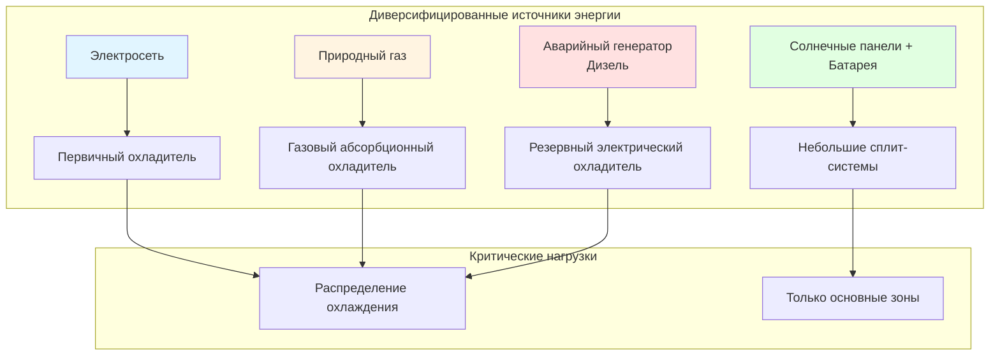
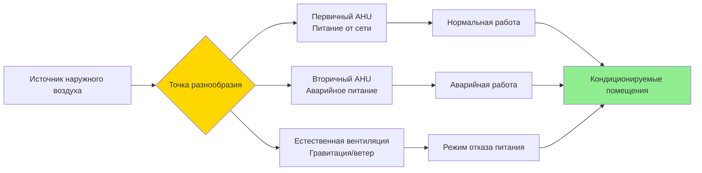
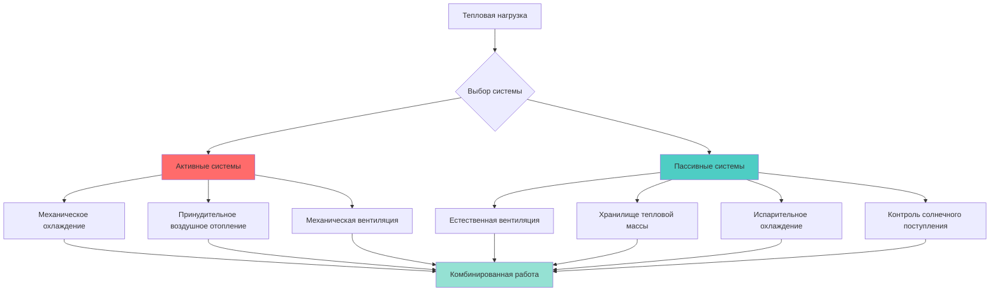

## Обзор

Разнообразие в проектировании устойчивых систем HVAC означает стратегическое внедрение множественных источников энергии, типов оборудования и конфигураций систем для предотвращения единственной точки отказа. Этот подход обеспечивает, что критические объекты сохраняют возможность климатического контроля при нарушении инфраструктуры, стихийных бедствиях или продолжительных отключениях коммунальных услуг.

Принцип разнообразия отличается от резервирования. Хотя резервирование обеспечивает резервную производительность с использованием аналогичного оборудования, разнообразие применяет принципиально различные технологии или источники топлива для защиты от системных отказов, влияющих на один тип системы.

## Стратегии разнообразия топлива

### Двухтопливные системы отопления

Двухтопливная способность позволяет оборудованию отопления работать на двух различных источниках топлива, обычно природном газе с резервным топливным маслом:

**Ключевые моменты реализации:**
- Горелочные системы, способные к автоматическому переключению топлива
- Хранилище топливного масла на месте, рассчитанное на 48–96 часов работы
- Отдельная инфраструктура подачи топлива с изолирующими клапанами
- Системы управления, которые контролируют доступность топлива и переключают его автоматически
- Регулярные протоколы тестирования для проверки функциональности переключения топлива

**Соображения производительности:**
Оборудование должно сохранять номинальную производительность на обоих видах топлива. Топливное масло обычно обеспечивает 146,5 МДж/л (HHV), в то время как природный газ обеспечивает приблизительно 38,5 МДж/м³. Сопла горелки и параметры горячего воздуха требуют регулировки для различных характеристик топлива.

### Интеграция множественных источников энергии

Этот диверсифицированный подход обеспечивает, что отказ любого единственного источника энергии не устраняет всю производительность охлаждения.

## Применение разнообразия технологий

### Диверсификация систем отопления

Сочетание различных технологий отопления обеспечивает защиту от отказов, специфичных для технологии:

| Первичная система | Резервная система | Применение |
|----------------|---------------|-------------|
| Центральные котлы горячей воды | Электрические сопротивляющиеся воздухонагреватели | Предотвращает полную потерю при отказе котла |
| Тепловые насосы | Газовые воздухонагреватели | Защищает от отказов системы охлаждения |
| Паровая система | Гидравлические радиационные панели | Сохраняет отопление при отказе паровой сети |
| VRF тепловые насосы | Упакованные кровельные установки | Обеспечивает альтернативу при отказе управления VRF |

### Диверсификация систем охлаждения

**Стратегия централизованной + децентрализованной:**
Большие центральные охладители обеспечивают эффективную работу в нормальных условиях, а распределённое оборудование (сплит-системы, упакованные установки) сохраняет необходимое охлаждение при отказе центрального объекта из-за:
- Разрыва трубопроводов охлажденной воды
- Отказа первичного насоса
- Повреждения градирни
- Неисправности центральной системы управления

### Разнообразие вентиляции

**Проектирование вентиляции с несколькими путями:**
- Механические установки наружного воздуха с моторизованными дроссельными заслонками
- Положения естественной вентиляции (открываемые окна, дроссельные заслонки подъема)
- Выделенные вентиляторы вытяжки на отдельных электрических цепях
- Вентиляция критических помещений на аккумуляторных батареях

## Интеграция аварийного питания

### Избирательное подключение нагрузки

Не все оборудование HVAC требует аварийного питания. Приоритизируйте подключения по критичности:

**Уровень 1 – Существенные (генератор + UPS):**
- Прецизионное охлаждение серверной
- HVAC операционной
- Охлаждение аптеки
- Критические системы вытяжки

**Уровень 2 – Важные (только генератор):**
- Первичные воздухообрабатывающие установки
- Насосы охлажденной воды для основных зон
- Циркуляция горячей воды для отопления
- Системы управления и автоматизация зданий

**Уровень 3 – Отложенные (обычное питание):**
- Комфортное охлаждение административных помещений
- Некритическая вентиляция
- Оборудование рекуперации энергии
- Элементы управления оптимизацией

### Соображения по размеру генератора

Производительность генератора должна учитывать пусковые токи двигателей HVAC. Используйте плавные стартеры или переменные частотные приводы для снижения пускового тока на 65–75%, что позволяет использовать генератор меньшей мощности.

**Последовательность подключения нагрузки:**
Реализуйте автоматическую последовательность подключения нагрузки для предотвращения перегрузки генератора:
1. Запуск критических вентиляторов вытяжки (0–10 секунд)
2. Включение систем управления и датчиков (10–30 секунд)
3. Запуск первичных насосов (30–60 секунд)
4. Запуск охладителей или воздухообрабатывающих установок (60–120 секунд)
5. Добавление комфортного HVAC по мере наличия производительности (120+ секунд)

## Географическое распределение

Для многозданных кампусов распределите оборудование HVAC географически, чтобы предотвратить единовременную катастрофическую потерю:

- Центральные объекты в отдельных зданиях с различными высотами наводнения
- Кровельное оборудование на различных конструкциях
- Аварийные генераторы на противоположных концах кампуса
- Хранилище топлива в различных местоположениях выше уровня наводнения

## Разнообразие системы управления

**Многоуровневая архитектура управления:**
- Первичная BAS с облачным подключением для удаленного мониторинга
- Автономные программируемые контроллеры для критического оборудования
- Жестко смонтированные элементы управления безопасностью, независимые от сети
- Возможности ручного управления для существенных функций

Этот многоуровневый подход обеспечивает, что отказы сети, кибератаки или сбои программного обеспечения не устраняют все возможности управления.

## Разнообразие производителя и типа оборудования

### Снижение рисков благодаря различным источникам

Использование оборудования от множественных производителей защищает от:
- Дефектов проектирования, специфичных для продукта, влияющих на целые классы оборудования
- Нарушений цепи поставок для деталей замены
- Зависимости от единственного поставщика при требованиях обслуживания
- Уязвимостей микропрограммы в идентичных системах управления

**Пример реализации:**
Для больницы с четырьмя охладителями укажите два от производителя A и два от производителя B. Это обеспечивает, что отзыв продукта или широкораспространенный режим отказа, влияющий на один бренд, не устраняет всю производительность охлаждения.

### Комбинация пассивных и активных систем

Пассивные системы не требуют входной энергии и продолжают функционировать при полном отказе питания. Примеры включают:
- Вентиляция с эффектом дымохода через вертикальные шахты
- Вентиляция естественной тяги, приводимая в движение ветром
- Тепловые дымоходы для вытяжки горячего воздуха
- Радиационное охлаждение ночного неба
- Хранилище тепла, соединённое с землей

## Стандарты и руководства проектирования

**ASHRAE Guideline 29-2021** обеспечивает методологию для оценки устойчивости системы HVAC, включая критерии оценки разнообразия.

**FEMA P-1019** содержит рекомендации требования систем аварийного питания для критических объектов, включая положения по разнообразию топлива.

**UFC 3-600-01** (объекты DoD) предписывает минимальные требования разнообразия для критических в отношении миссии военных установок.

**NFPA 110** устанавливает стандарты для систем аварийного питания, включая требования по хранению топлива и автоматического переключения.

## Экономическое обоснование

Разнообразие увеличивает первоначальную стоимость на 15–35% в сравнении с конструкциями с единственным источником. Методы обоснования:

- **Анализ рисков:** Рассчитайте вероятность продолжительных отключений × стоимость рабочего перерыва
- **Стоимость жизненного цикла:** Включите избежанные потери от сохраняемых операций
- **Сокращение страховых премий:** Многие компании предлагают скидки 5–15% для систем с разнообразием топлива
- **Нормативное соответствие:** Здравоохранение, центры обработки данных и экстренные службы часто требуют разнообразия

## Контрольный список реализации

**Фаза планирования:**
- [ ] Определите критические функции, требующие непрерывной работы
- [ ] Оцените надежность локальных коммунальных услуг и доступность топлива
- [ ] Оцените опасности, специфичные для объекта (зоны наводнения, сейсмическая активность)
- [ ] Определите приемлемое время простоя для каждого типа пространства

**Фаза проектирования:**
- [ ] Выберите дополняющие технологии с различными режимами отказа
- [ ] Рассчитайте хранилище топлива на месте для длительности проектного шторма
- [ ] Спроектируйте элементы управления автоматического переключения с ручным переводом
- [ ] Скоординируйте распределение электроэнергии с различными источниками питания
- [ ] Укажите оборудование от нескольких производителей для резервных систем

**Фаза пуска в эксплуатацию:**
- [ ] Протестируйте переключение топлива при нагрузке
- [ ] Проверьте последовательность автоматического переключения
- [ ] Подтвердите производительность на всех источниках топлива
- [ ] Документируйте процедуры работы для сценариев чрезвычайной ситуации

**Фаза эксплуатации:**
- [ ] Проверяйте альтернативные системы квартально
- [ ] Поддерживайте качество топлива в резервуарах хранения
- [ ] Обучите операторов процедурам ручного переключения
- [ ] Ежегодно обновляйте планы реагирования на чрезвычайные ситуации

---

**Связанные разделы:**
- [Стратегии резервирования](../redundancy/)
- [Системы аварийного питания](../emergency-power/)
- [Оборудование, устойчивое к наводнениям](../../flood-resistant-equipment/)
- [Критерии сейсмического проектирования](../../seismic-design-criteria/)
