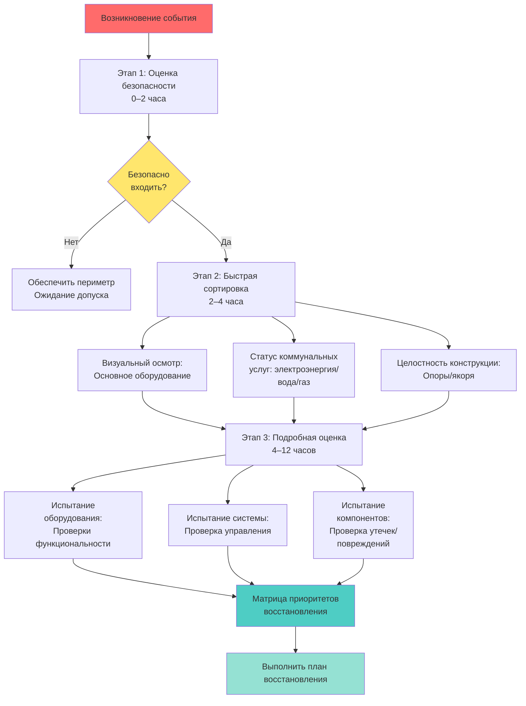
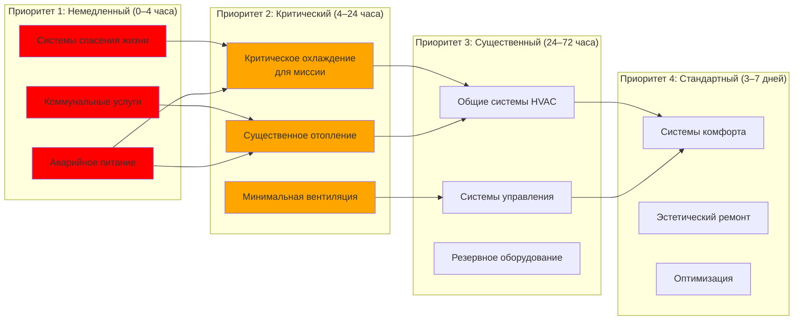
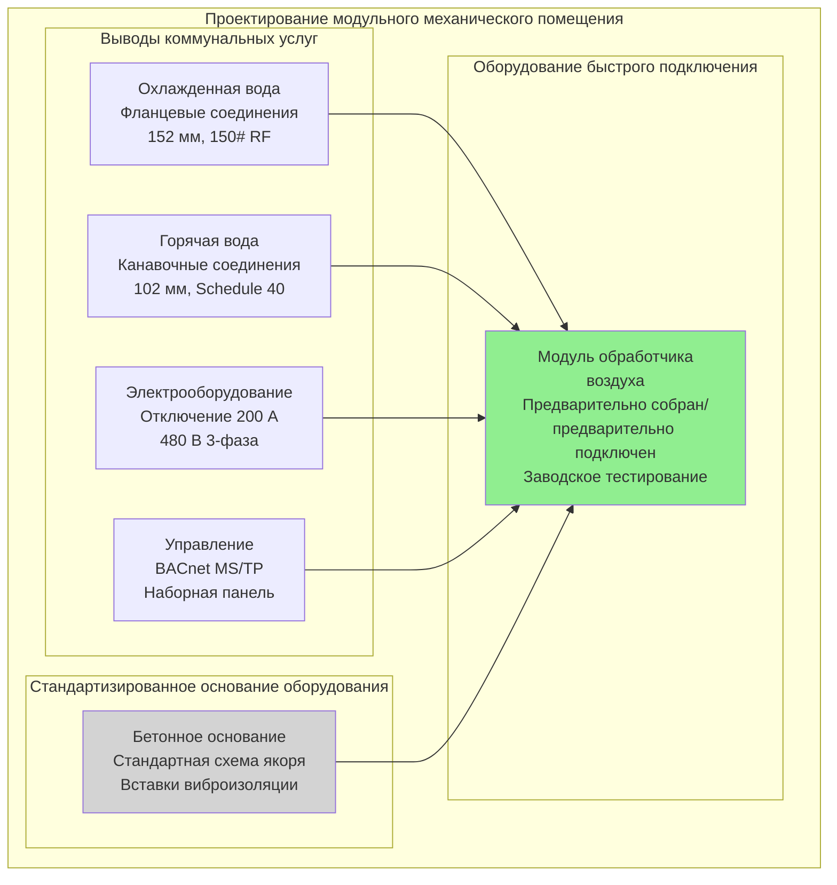

# Стратегии быстрого восстановления систем HVAC

Планирование быстрого восстановления обеспечивает ускоренное восстановление систем HVAC после нарушающих событий благодаря предварительно расположенным ресурсам, стандартизированным процедурам и спроектированным решениям для быстрого развертывания. Целевые показатели времени восстановления (RTO) определяют решения по проектированию, которые балансируют капитальные инвестиции с риском простоев для критически важных объектов.

## Целевые показатели времени восстановления

RTO определяет максимально приемлемую продолжительность между отказом системы и восстановлением минимально требуемой функциональности. Установление RTO требует согласования требований миссии объекта с техническими возможностями восстановления и доступными ресурсами.

### Классификационная система RTO

| Категория RTO | Целевая продолжительность | Применение | Стратегия проектирования |
|--------------|-------------|-----------|-----------------|
| Немедленное | 0–4 часа | Центры обработки данных, больницы (критические зоны) | Полная избыточность (2N), мгновенный переход на резервную систему |
| Быстрое | 4–24 часа | Центры аварийных операций, производство | Резервная система N+1, предварительно подготовленные запасные части |
| Ускоренное | 24–72 часа | Высокие коммерческие здания, научные учреждения | Положения для быстрого подключения, соглашения с поставщиками |
| Стандартное | 72 часа – 1 неделя | Офисные здания, розница | Стандартные процедуры ремонта, арендное оборудование |
| Расширенное | 1–4 недели | Некритические объекты | Обычные закупки и ремонт |

**Факторы определения RTO:**

- **Критичность миссии**: потери доходов, влияние на безопасность, нормативные требования
- **Уязвимость занятых**: пациенты здравоохранения, технологические процессы, чувствительные к температуре
- **Сезонные факторы**: отказ отопления зимой в сравнении с отказом охлаждения летом в умеренном климате
- **Альтернативные помещения**: способность переместить операции во время восстановления
- **Требования страхования**: условия страховки по потерям от перерывов в деятельности

## Протоколы оценки ущерба

Систематическая оценка ущерба после события определяет поврежденные компоненты и устанавливает приоритеты действий по восстановлению. Предварительно разработанные контрольные списки ускоряют процесс оценки и гарантируют, что критические системы получат немедленное внимание.

### Ступенчатая процедура оценки

**Этап 1: Оценка безопасности (0–2 часа)**

- Проверить конструктивную устойчивость помещений оборудования и механических пространств
- Проверить утечки газа, электрические опасности или разрывы водопровода
- Осмотреть холодильные системы на наличие катастрофических утечек
- Подтвердить безопасные условия работы перед входом в механические пространства
- Установить охранный периметр вокруг поврежденных участков

**Этап 2: Быстрая сортировка (2–4 часа)**

Систематический обход, устанавливающий приоритеты критических для жизнедеятельности и критичных для миссии систем:

- **Системы контроля дыма**: проверить работу вентилятора, функциональность заслонок, ответ управления
- **Аварийные генераторы**: проверить подачу топлива, системы охлаждения, пути выхлопных газов
- **Критическое охлаждение**: блоки CRAC/CRAH центров обработки данных, охлаждение медицинского оборудования
- **Резервное отопление**: резервные котлы, источники аварийного тепла для холодного климата
- **Противопожарная защита**: противопожарные заслонки HVAC, датчики дыма, интеграция с пожарной сигнализацией

**Этап 3: Подробная оценка (4–12 часов)**

Осмотр на уровне компонентов с документированием конкретных повреждений:

- **Механическое оборудование**: смещения выравнивания, сломанные крепления, внутренние повреждения, отказы подшипников
- **Системы распределения**: разделение воздуховодов, разрывы труб, отказы подвесок, повреждение изоляции
- **Управление**: связь сети BAS, смещение датчиков, блокировка приводов
- **Электрооборудование**: целостность обмоток двигателя, функциональность VFD, статус автоматических выключателей
- **Холодильная установка**: состояние компрессора, холодильный заряд, загрязнение масла

### Документирование оценки

Предварительно напечатанные полевые формы инспекции ускоряют сбор данных и обеспечивают согласованность:

**Элементы контрольного списка инспекции оборудования:**

- Номер тега оборудования и местоположение
- Описание визуального ущерба с фотографиями
- Операционный статус (функциональное/деградированное/неработающее)
- Проблемы или опасности безопасности
- Смета время ремонта и требуемые детали
- Ранжирование приоритетов (критическое/высокое/среднее/низкое)

## Матрица приоритетов восстановления

Матрица приоритетов определяет последовательность действий по ремонту на основе критичности системы и взаимозависимостей. Такой структурированный подход предотвращает потраченные впустую усилия на системы, которые не могут функционировать из-за восходящих отказов.

### Система ранжирования приоритетов

**Анализ зависимостей** определяет необходимые работы предварительного ремонта:

- Система охлажденной воды не может работать до восстановления электроснабжения и сети управления
- Обработчики воздуха требуют как электроэнергии, так и доступности охлажденной/горячей воды
- Управление DDC зависит от сетевой инфраструктуры и электроэнергии
- Градирни требуют подачи воды, электроэнергии и целостности бассейна

## Принципы модульного проектирования

Модульное проектирование HVAC упрощает быструю замену компонентов благодаря стандартизированным интерфейсам и минимизации полевых работ. Такой подход сокращает время восстановления критического оборудования с дней до часов.

### Стратегии стандартизации

**Модульность оборудования:**

- **Узлы на салазках**: предварительно смонтированные комплекты насосов, модули холодильных машин с интегральными пускателями
- **Заводские сборки**: упакованные обработчики воздуха с предварительно смонтированным управлением
- **Стандартные мощности**: несколько идентичных единиц вместо одного пользовательского оборудования
- **Общие компоненты**: двигатели, приводы, клапаны от одной линии производителя
- **Предварительно испытанные модули**: заводское тестирование исключает полевые работы по запуску

**Стандартизация интерфейсов:**

- **Трубопроводные соединения**: фланцевые или канавочные соединения на оборудовании, стандартные расстояния
- **Электрооборудование**: разъемные соединения, стандартные длины кабелей, помеченные цепи
- **Управление**: узлы BAS с беспроводной передачей, модули контроллеров с возможностью подключения, стандартное отображение I/O
- **Конструктивные**: предварительно спроектированные монтажные рамы, стандартные схемы болтов якоря
- **Зазоры**: согласованные размеры доступа для обслуживания для замены оборудования

### Помещения механики "Plug-and-Play"

**Требования проектирования для модульных помещений:**

- Двери доступа оборудования рассчитаны на самый крупный модуль (минимум 1,8 м × 2,1 м)
- Грузоподъемность пола для самого тяжелого предполагаемого оборудования замены (150 % от установленного оборудования)
- Точки строповки и четкий вертикальный путь для операций крана/подъема
- Выводы коммунальных услуг выходят на 0,9 м за пределы площади оборудования с закрытыми соединениями
- Электрические отключения доступны независимо от положения оборудования
- Домашние трассы сетей управления заканчиваются в доступных распределительных коробках

## Системы быстрого подключения

Технологии быстрого подключения исключают требующие трудозатрат полевые работы и требования к специализированному труду при аварийном восстановлении.

### Методы быстрого подключения трубопроводов

**Канавочные механические муфты:**

- Время установки: 5–10 минут на соединение (против 30–45 минут для сварки)
- Допускает угловое отклонение ±0,5° с компенсацией незначительного несоосности
- Визуальная инспекция подтверждает правильность установки (неразрушающий контроль не требуется)
- Возможность разборки для техническое обслуживание без резки трубы
- Номинальное давление до 2070 кПа для применений HVAC

**Фланцевые соединения:**

- Предварительно просверленные отверстия под болты обеспечивают повторяемость выравнивания
- Выбор материала прокладки на основе типа жидкости и температуры
- Стандартные спецификации крутящего момента болтов (ASME B16.5)
- Подходят для магистралей большого диаметра (152 мм и больше)
- Упрощает удаление оборудования без модификаций системы

**Фитинги "push-to-connect":**

- Установка без инструментов для медной трубы и трубы PEX (до 25 мм типично)
- Способность немедленного испытания давлением (не требуется время отверждения)
- Применения: линии приборов, малые циклы отопления, бытовое водоснабжение
- Ограничения: максимальная температура 93°C, не для холодильной установки

### Быстрое электрическое подключение

**Соединения "штепсель-розетка":**

- Разъемы "булавка-гильза", рассчитанные на нагрузки двигателей HVAC (до 100 А)
- Доступны конфигурации для влажных помещений и взрывозащищенные
- Предотвращает обратное включение фаз через механическую фиксацию
- Способность блокировки/маркировки интегрирована в конструкцию разъема
- Цветная кодировка определения напряжения (стандарт IEC 60309)

**Предварительно изготовленные кабельные сборки:**

- Заводская установка клемм исключает ошибки полевого монтажа
- Проводники с маркировкой соответствуют схемам подключения оборудования
- Стандартизация длины позволяет запасы в наличии
- Литые кожухи обеспечивают защиту от натяжения и защиту окружающей среды

### Быстрое подключение системы управления

**Интеграция BAS с беспроводной передачей:**

- Исключает физическое кабелирование сети для автономного оборудования
- Топология сетки обеспечивает избыточные пути связи
- Батарейный источник питания поддерживает связь во время перерывов в подаче электроэнергии
- Замена датчика без переподключения (узлы с саморозпознаванием)
- Запуск через интерфейс приложения смартфона

**Модули контроллера с возможностью подключения:**

- Стандартные конфигурации I/O (8 входов/4 выхода типично)
- Предварительно запрограммированные последовательности управления, загруженные из библиотеки шаблонов
- Замена с горячей заменой без отключения системы
- Автоматическая загрузка конфигурации из сети при установке
- Диагностика светодиода указывает операционный статус без специализированных инструментов

## Подготовка аварийного оборудования

Предварительно расположенное аварийное оборудование и договоры аренды позволяют немедленное развертывание при неработоспособности постоянных систем. Стратегические места размещения уравновешивают скорость доступа с защитой оборудования.

### Инвентаризация критических запасных частей

**Высокостоимостные компоненты с длительными сроками поставки:**

- Компрессоры холодильных машин и платы управления (8–16 недель типично)
- Крупные узлы двигателей (25 л.с. и больше, 4–8 недель)
- Специализированные насосы (нестандартные размеры, 6–12 недель)
- Контроллеры DDC и модули I/O (4–8 недель, зависит от цепи поставок)
- Холодильный агент в количестве системного заряда (задержки нормативной закупки)

**Стратегии управления инвентаризацией:**

- Ротация запасенных двигателей через запланированные замены оборудования
- Соглашения об управлении инвентаризацией поставщика для контроллеров (доставка "точно в срок")
- Программы страхования компрессоров (замена экстренного замены производителем)
- Совместное использование инвентаризации для больших портфелей
- Хранение с контролируемым климатом предотвращает деградацию (двигатели, электроника)

### Положения для портативного/арендного оборудования

Предварительно спроектированные точки соединения позволяют быстрое развертывание временной системы:

**Соединения временной холодильной машины:**

- Проникновения через внешнюю стену с съемными крышками (фланцевые вставки)
- Канавочные соединения по размеру для стандартной емкости арендного агрегата (100–500 кВт типично)
- Изоляционные клапаны и сливы для соединения без отключения системы
- Электрические розетки или посадочные места кабелей (480 В, 200–600 А)
- Бетонные основания или усиленные участки для размещения оборудования

**Положения для портативного отопления:**

- Воротники воздуховодов для соединения временного блока отопления (610 мм типично)
- Проникновения входа наружного воздуха и выхлопа с заглушками с демпфирующей заслонкой
- Быстрые соединения подачи топлива (природный газ или пропан)
- Панели распределения электроэнергии с запасной емкостью автоматического выключателя
- Положения переопределения термостата для временного управления

**Положения подключения генератора:**

- Разъемы Cam-lock или ручные переключатели передачи, рассчитанные на аварийные нагрузки
- Документация расчета нагрузки, определяющая приоритетные цепи
- Процедуры последовательности предотвращают перегрузку генератора при запуске
- Проверка совместимости типа топлива (дизель против природного газа)
- Требования звукоизоляции и протоколы уведомления соседей

## Планирование непрерывности бизнеса для MEP

Восстановление HVAC интегрируется в системы управления непрерывностью бизнеса (BCMS) в соответствии с ISO 22301. MEP-специфичное планирование учитывает технические зависимости и требования к ресурсам.

### Документирование процедур восстановления

Стандартные операционные процедуры (СОП) предоставляют пошаговые инструкции, выполняемые доступным персоналом при аварийных условиях, когда специализированный персонал может быть недоступен.

**Существенные элементы СОП:**

1. **Критерии активации**: конкретные условия, инициирующие реализацию процедуры
2. **Меры безопасности**: требования личной защиты, блокировка/маркировка, протоколы замкнутых пространств
3. **Требуемые инструменты и материалы**: полный инвентарь с местоположением хранилища
4. **Пошаговые инструкции**: пронумерованные задачи с четко отмеченными точками решения
5. **Проверки верификации**: функциональные проверки, подтверждающие успешное завершение
6. **Руководство по устранению неполадок**: распространенные проблемы и решения
7. **Контакты эскалации**: 24/7 контактная информация экстренной технической поддержки

**Пример: СОП аварийной замены холодильной машины**

```mermaid
gantt
    title График аварийной замены холодильной машины
    dateFormat HH:mm
    axisFormat %H:%M

    section Подготовка
    Мобилизовать группу реагирования: done, prep1, 00:00, 1h
    Изолировать неработающую холодильную машину: done, prep2, 01:00, 2h
    Разместить арендованный агрегат: done, prep3, 02:00, 3h

    section Соединение
    Соединить трубопровод охлажденной воды: active, conn1, 05:00, 4h
    Соединить электрическое питание: active, conn2, 06:00, 3h
    Соединить управление (временное): active, conn3, 08:00, 2h

    section Пуск
    Заполнить и выпустить воздух из системы: comm1, 10:00, 2h
    Функциональное тестирование: comm2, 12:00, 3h
    Передача нагрузки: comm3, 15:00, 1h

    section Операция
    Мониторинг производительности: oper1, 16:00, 8h
    Оптимизировать установочные значения: oper2, 20:00, 4h
```

**Предположения по графику:**

- Предварительно спроектированные точки соединения доступны
- Арендованное оборудование на месте в течение 3 часов после события
- Экипаж из двух человек с базовыми механическими навыками
- Система охлажденной воды предварительно изолирована (клапаны функциональны)
- Временное управление адекватно (постоянная интеграция BAS отложена)

### Подготовка и учения персонала

Эффективность плана восстановления зависит от знакомства персонала с процедурами экстренной помощи. Регулярная подготовка и учения выявляют пробелы в процедурах и укрепляют уверенность персонала.

**Компоненты программы подготовки:**

- **Ежегодная аудиторная подготовка**: обзор процедур восстановления, расположения оборудования, списков контактов
- **Практическое обучение компонентам**: отработка установок быстрого подключения на некритичных системах
- **Настольные упражнения**: прохождение сценариев выявления точек решения и потребностей в ресурсах
- **Полномасштабные учения**: выполнение полной процедуры восстановления при имитируемых аварийных условиях
- **Обзоры после учения**: документирование полученных уроков и обновление процедур

**Сценарии учений по типу объекта:**

- **Больницы**: отказ холодильной машины во время жаркой волны, резервная система на аварийном питании
- **Центры обработки данных**: отказ блока CRAH, развертывание портативного охлаждения в течение 2-часового RTO
- **Лаборатории**: отказ вытяжного вентилятора с опасностью химических испарений, временная вентиляция
- **Производство**: потеря технологического охлаждения, развертывание арендной холодильной машины и интеграция

### Соглашения с поставщиками и подрядчиками

Предварительно согласованные соглашения об аварийном обслуживании исключают задержки закупок при реагировании на кризис. Договоры определяют время отклика, ставки труда и доступность оборудования.

**Существенные условия соглашения:**

- **Гарантированное время отклика**: 2–4-часовая мобилизация типична для контрактов на экстренную помощь
- **Уровень приоритетного обслуживания**: ранг заказчика для распределения ресурсов при масштабных событиях
- **Предварительно одобренные ставки труда**: переработки и аварийные множители установлены (типично 1,5–2,0×)
- **Доступность оборудования**: выделенный или приоритетный доступ к арендному инвентарю
- **Техническая поддержка**: 24/7 телефонная консультация включена в плату за содержание
- **Ежегодный сбор за содержание**: фиксированная стоимость поддержания соглашения (типично 5–10 % от прогнозируемых годовых аварийных расходов)

**Категории поставщиков:**

- **Сервисные подрядчики**: аварийный ремонт основного оборудования (холодильные машины, котлы, управление)
- **Поставщики аренды**: портативное оборудование HVAC (холодильные машины, котлы, обработчики воздуха, генераторы)
- **Дистрибьюторы запасных частей**: ускоренная доставка запасных компонентов
- **Инженерные консультанты**: аварийные услуги проектирования для временных систем
- **Агенты пуска**: быстрое тестирование и проверка восстановленных систем

## Метрики производительности и тестирование

Способность восстановления требует проверки через отслеживание метрик и периодическое тестирование. Эти измерения выявляют деградацию готовности к восстановлению до возникновения реальных чрезвычайных ситуаций.

### Ключевые показатели производительности

| Метрика | Целевое значение | Метод измерения |
|--------|-------------------|-------------------|
| Среднее время оценки (MTTA) | < 4 часов | Тестовые учения, журналы инцидентов |
| Среднее время восстановления (MTTR) критичных систем | < 24 часов | Отслеживание реальных событий, имитационные модели |
| Доступность запасных частей | 95%+ | Ежеквартальные аудиты инвентаризации |
| Завершение подготовки персонала | 100% ежегодно | База данных записей подготовки |
| Актуальность контрактов с поставщиками | 100% активных | Система управления контрактами |
| Обновления процедур экстренной помощи | В течение 30 дней после изменений системы | Аудит контроля документов |
| Функциональность быстрого подключения | 100% операционально | Ежегодное физическое тестирование |

**Ежегодная оценка способности восстановления:**

- Физическая проверка точек экстренного соединения (не загромождены, оборудование присутствует)
- Аудит инвентаризации запасных частей (подтвердить уровни запасов, проверить сроки годности)
- Проверка актуальности списка контактов поставщиков (текущие номера телефонов, подтвердить 24/7 доступ)
- Проверка пути доступа к оборудованию (двери разблокированы, точки строповки доступны)
- Аварийное тестирование питания (испытание генератора с нагрузочным блоком, включая нагрузки HVAC)

## Заключение

Стратегии быстрого восстановления преобразуют устойчивость систем HVAC из пассивной избыточности в активную способность восстановления. Комбинация модульного проектирования, положений быстрого подключения, предварительно расположенных ресурсов и документированных процедур сокращает целевые показатели времени восстановления с недель до часов для критически важных объектов.

Эффективная реализация требует авансовых инвестиций в стандартизированные интерфейсы, положения аварийного оборудования и соглашения с поставщиками—затраты, оправданные избежанными простоями в критических объектах, где часы отказа HVAC создают миллионные потери или компрометируют безопасность жизнедеятельности. Регулярное тестирование и подготовка персонала гарантируют, что способности восстановления остаются операционными при необходимости, предотвращая устаревание плана, которое делает теоретические сроки восстановления невозможными в реальных чрезвычайных ситуациях.
