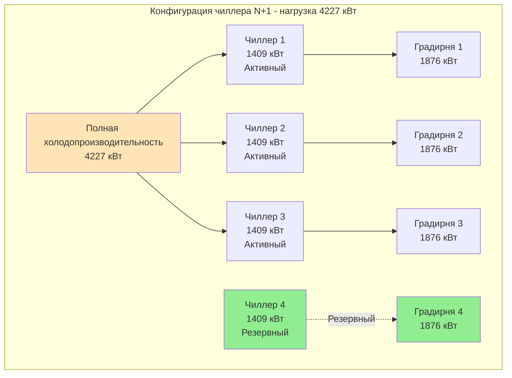
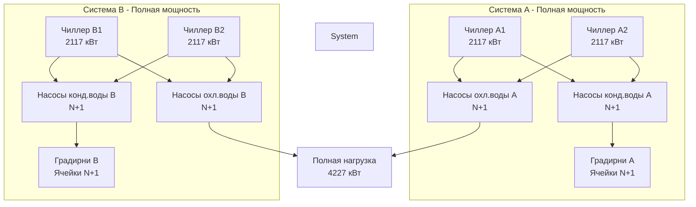
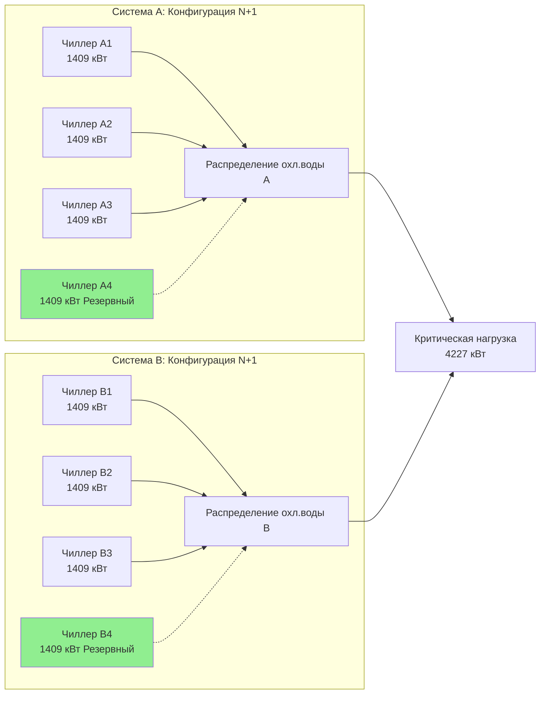
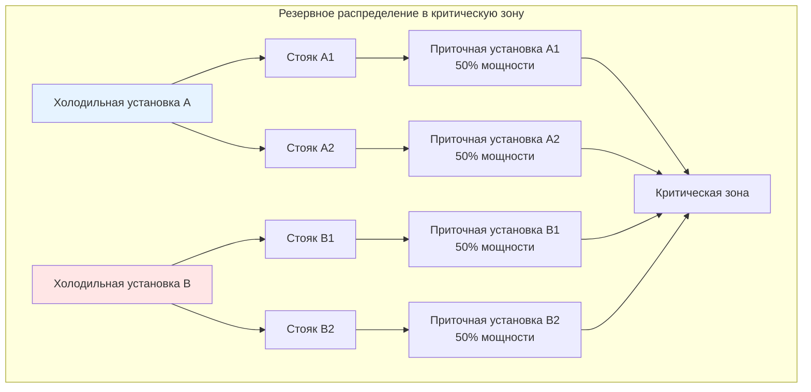

Резервирование предусматривает несколько параллельных путей или оборудование для поддержания работы системы HVAC при отказе отдельных компонентов. Уровень резервирования определяет доступность системы и напрямую коррелирует с требованиями к времени безотказной работы объекта. Этот подход является основополагающим для критических объектов, включая дата-центры, больницы, центры аварийного реагирования и телекоммуникационные узлы.

## Выбор уровня резервирования

Надлежащая конфигурация резервирования зависит от критичности объекта, стоимости простоев и целевых показателей доступности. Каждый уровень представляет отдельную архитектуру со специфическими характеристиками доступности.

### Сравнение конфигураций резервирования

| Конфигурация | Предоставление мощности | Типичная доступность | Возможность одновременного обслуживания | Примеры применения |
|---------------|-------------------------|---------------------|-------------------------------------|-------------------|
| N | Минимально требуемая | 95-98% | Нет | Офисные здания, розница |
| N+1 | N + 1 резервный блок | 99,0-99,5% | Ограниченная | Стандартные больницы, дата-центры Tier II |
| N+2 | N + 2 резервных блока | 99,5-99,9% | Частичная | Научные учреждения, дата-центры Tier III |
| 2N | Полное дублирование | 99,95-99,99% | Да | Дата-центры Tier IV, финансовый трейдинг |
| 2(N+1) | Двойные системы N+1 | 99,99%+ | Да | Критически важные государственные объекты, командные центры |

**Расчёт доступности:**

Доступность резервной системы превосходит доступность отдельных компонентов благодаря параллельной конфигурации:

**Последовательные компоненты:** A_total = A₁ × A₂ × A₃

**Параллельные компоненты:** A_total = 1 - [(1 - A₁) × (1 - A₂)]

Для N+1 с надёжностью компонента 95%:
- Один компонент: доступность 95%
- Конфигурация N+1: доступность 99,75%
- Три параллельных компонента: доступность 99,99%

## Конфигурация резервирования N+1

N+1 предусматривает один дополнительный блок сверх минимально требуемого для обслуживания нагрузки. Это наиболее распространённый подход к резервированию для критических объектов, уравновешивающий стоимость и надёжность.

### Архитектура холодильной установки N+1



**Методология определения размеров N+1:**

1. **Определение проектной нагрузки:** пиковая холодопроизводительность 4227 кВт
2. **Выбор количества блоков:** N = 3 блока для распределения нагрузки
3. **Расчёт мощности блока:** 4227 кВт ÷ 3 = 1409 кВт на блок
4. **Добавление резервного блока:** +1 блок мощностью 1409 кВт
5. **Общая установленная мощность:** 4 × 1409 = 5636 кВт (133% от нагрузки)

**Резервирование вспомогательного оборудования:**

Все компоненты холодильного контура требуют конфигурации N+1 для устранения единичных точек отказа:

- **Насосы конденсаторной воды:** насосы N+1, рассчитанные на поток отдельного чиллера
- **Насосы охлажденной воды:** первичные насосы N+1 или конфигурация с переменной скоростью и распределением
- **Градирни:** ячейки N+1 с изоляционными клапанами для обслуживания
- **Частотные преобразователи:** обводные контакторы или резервный частотный преобразователь с переключателем передачи

### Оборудование воздушной стороны N+1

```mermaid
graph TB
    subgraph "Конфигурация приточной установки N+1"
        Zone[Критическая зона<br/>670 CFM (1138 м³/ч) требуется]

        AHU1[Приточная установка 1<br/>223 CFM (379 м³/ч)<br/>Работает]
        AHU2[Приточная установка 2<br/>223 CFM (379 м³/ч)<br/>Работает]
        AHU3[Приточная установка 3<br/>223 CFM (379 м³/ч)<br/>Работает]
        AHU4[Приточная установка 4<br/>223 CFM (379 м³/ч)<br/>Резервная]

        Duct1[Воздуховод подачи 1]
        Duct2[Воздуховод подачи 2]
        Duct3[Воздуховод подачи 3]
        Duct4[Воздуховод подачи 4<br/>Обычно перекрыт]

        AHU1 --> Duct1 --> Zone
        AHU2 --> Duct2 --> Zone
        AHU3 --> Duct3 --> Zone
        AHU4 -.-> Duct4 -.-> Zone
    end

    style AHU4 fill:#90EE90
    style Duct4 fill:#E0E0E0
```

**Рассмотрения для воздушной стороны:**

- **Изоляция воздуховода:** моторизованные заслонки закрывают выброс неисправного блока для предотвращения обратного потока
- **Резервирование фильтров:** двойные фильтровальные батареи позволяют замену во время работы
- **Массивы вентиляторов:** несколько меньших вентиляторов обеспечивают лучшее резервирование, чем один большой вентилятор
- **Резервирование управления:** независимые контроллеры для каждого блока предотвращают общие отказы управления

## Конфигурация резервирования 2N

Архитектура 2N предусматривает полностью дублированные независимые системы, каждая способная поддерживать полную нагрузку объекта. Эта конфигурация позволяет одновременное обслуживание одной полной системы, пока другая поддерживает полную мощность.

### Холодильная установка 2N с раздельным распределением



**Требования проектирования 2N:**

- Каждая система независимо рассчитана на 100% нагрузки объекта
- Физически отдельные места расположения оборудования снижают риск общего отказа
- Отдельные электрические услуги от разных питающих линий или шин генератора
- Независимые системы управления без общих компонентов
- Перекрёстные клапаны обычно закрыты, используются только для аварийного резервного питания

**Разделение пути распределения:**

Физическая и электрическая изоляция между резервными системами:

- **Вертикальное разделение:** система A в подвале, система B на крыше
- **Горизонтальное разделение:** системы в противоположных крыльях с огнеупорным разделением
- **Разделение коммунальных услуг:** разные электрические шкафы, отдельные водозаборы
- **Разделение управления:** независимые сети BAS, отдельные головные системы

## Конфигурация резервирования 2N+1

2N+1 представляет наивысший уровень стандартного резервирования, объединяя двойные полные системы с дополнительной резервной мощностью в каждой системе. Эта конфигурация поддерживает одновременное обслуживание, отказоустойчивость к единичной неисправности и отказы резервных систем.

### Архитектура 2N+1 для дата-центров Tier IV



**Отказоустойчивость 2N+1:**

Эта конфигурация поддерживает полную мощность посредством:

1. **Плановое обслуживание:** вся система A отключена, система B работает с мощностью N (3 из 4 чиллеров)
2. **Отказ компонента во время обслуживания:** система A отключена, система B работает с одной неисправной установкой, используя оставшиеся N+1 (2 из 4 чиллеров с 67% мощностью)
3. **Несколько одновременных отказов:** обе системы частично деградированы, но объединённая мощность превышает нагрузку

**Требования Uptime Institute Tier IV:**

Резервирование 2N+1 является обязательным для сертификации дата-центра Tier IV:

- целевая доступность 99,995% (26,3 минут простоя в год)
- отказоустойчивость к любому единичному отказу без влияния
- возможность одновременного обслуживания всех систем
- разделение на отсеки с огнеупорным разделением
- двойные коммунальные услуги от отдельных подстанций

## Устранение единичных точек отказа

Полное резервирование требует выявления и устранения всех единичных точек отказа во всей системе HVAC и вспомогательной инфраструктуре.

### Анализ общих единичных точек отказа

| Компонент системы | Единичная точка отказа | Решение по резервированию |
|-------------------|------------------------|--------------------------|
| Подача охлажденной воды | Одна холодильная установка | Системы 2N, отдельные места расположения |
| Электроснабжение | Одно питание от сети | Двойное питание, автономная генерация |
| Градирни | Общий бассейн | Отдельные бассейны на ячейку, перекрёстные соединения |
| Система управления | Один головной узел BAS | Резервные контроллеры, автономные элементы управления |
| Трубопровод охлажденной воды | Один магистральный трубопровод подачи | Кольцевое распределение, изоляционные клапаны |
| Подача топлива | Один топливный бак | Двойные баки, отдельные заправочные трубопроводы |
| Водоснабжение | Одно соединение с сетью | Накопительный бак, дополнительное питание от сети |

### Резервирование распределения



**Принципы проектирования распределения:**

- **Кольцевая конфигурация:** магистрали подачи и возврата образуют непрерывные кольца с несколькими точками питания
- **Возможность изоляции:** моторизованные клапаны изолируют неисправные участки автоматически
- **Независимость по давлению:** клапаны управления, независимые от давления, поддерживают поток при переконфигурации системы
- **Ограничения скорости:** размер трубопровода для предотвращения эрозии и шума при работе с частичной системой

## Резервирование системы управления

Отказы управления являются ведущей причиной простоев систем HVAC. Резервная архитектура управления поддерживает работу при отказе контроллера, сети или программного обеспечения.

### Резервная архитектура управления

**Уровни резервирования контроллера:**

1. **Уровень 1 - Автономные контроллеры:** каждый блок оборудования работает независимо при отказе сети BAS
2. **Уровень 2 - Резервная сеть:** двойные сети связи с автоматическим переключением
3. **Уровень 3 - Резервный головной узел:** двойные серверы BAS с синхронизированными базами данных
4. **Уровень 4 - Жёсткие блокировки:** критические блокировки используют жёсткие реле независимо от цифрового управления

**Режимы отказа управления:**

- **Отказ сети:** блоки продолжают работу с последним заданным параметром
- **Отказ контроллера:** резервный контроллер принимает управление через мониторинг импульса
- **Отказ датчика:** система использует альтернативные датчики или расчётные значения
- **Отказ программного обеспечения:** ручное переключение позволяет локальную работу

## Стандарты критических объектов

### Технический комитет ASHRAE 9.9

TC 9.9 устанавливает стандарты проектирования для критических объектов, включая дата-центры и здравоохранение:

**Ключевые рекомендации:**

- Определить уровень tier объекта до проектирования (Tier I по IV)
- Соответствие резервирования HVAC требованиям tier
- Предусмотреть независимые системы для разных функциональных зон
- Испытать все режимы отказа и системы автоматического переключения
- Документировать все единичные точки отказа с стратегиями снижения

### Классификация уровней дата-центров

**Tier I - Базовая мощность:**
- Конфигурация N
- Один путь распределения
- доступность 99,671%
- 252,3 часа простоя в год

**Tier II - Резервные компоненты:**
- Конфигурация N+1
- Один путь распределения
- доступность 99,741%
- 193,1 часа простоя в год

**Tier III - Возможность одновременного обслуживания:**
- Конфигурация N+1
- Несколько путей распределения
- доступность 99,982%
- 14,1 часа простоя в год

**Tier IV - Отказоустойчивость:**
- Конфигурация 2N или 2(N+1)
- Несколько независимых путей распределения
- доступность 99,995%
- 3,5 часа простоя в год

## Контрольный список внедрения резервирования

- [ ] Определить целевую доступность объекта и соответствующий уровень tier
- [ ] Рассчитать требуемый уровень резервирования из анализа доступности и стоимости простоя
- [ ] Рассчитать размер всего оборудования для выбранной конфигурации (N+1, 2N или 2N+1)
- [ ] Выявить и устранить все единичные точки отказа в проектировании
- [ ] Физически разделить резервные системы для предотвращения общих отказов
- [ ] Предусмотреть двойное питание или автономную генерацию для резервирования электроэнергии
- [ ] Спроектировать автоматическое переключение с возможностью ручного переключения
- [ ] Установить изоляционные клапаны для разрешения обслуживания без отключения системы
- [ ] Внедрить графики ротации оборудования для выравнивания времени работы и износа
- [ ] Ввести в эксплуатацию все режимы отказа, включая потерю отдельных компонентов и целых систем
- [ ] Документировать процедуры восстановления для всех вероятных сценариев отказа
- [ ] Обучить персонал по эксплуатации работе с резервированием и ответам на отказы

## Заключение

Надлежащее внедрение резервирования преобразует системы HVAC из потенциальной уязвимости в надёжную инфраструктуру, поддерживающую критически важные операции. Выбор уровня резервирования требует уравновешивания начальной стоимости с риском простоев и требованиями критически важных операций. Конфигурация N+1 подходит для большинства критических объектов, тогда как архитектуры 2N и 2N+1 обслуживают приложения с наивысшей критичностью. Успешное внедрение требует внимания к устранению единичных точек отказа во всех компонентах системы, комплексному испытанию режимов отказа и обученному персоналу, способному управлять сценариями деградированной работы.
