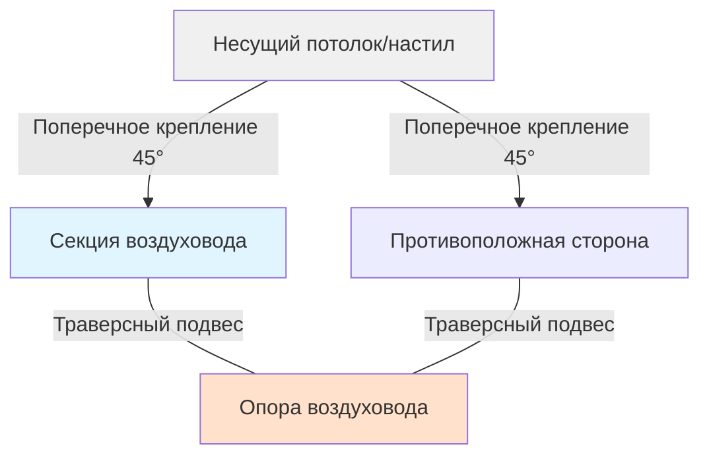

# Сейсмостойкое крепление систем воздуховодов HVAC

Сейсмостойкое крепление воздуховодов HVAC необходимо для обеспечения целостности системы и безопасности жизни во время сейсмических событий. Надлежащее крепление предотвращает отказ воздуховодов, сохраняет целостность огнестойких и дымовых преград и обеспечивает продолжение работы критических систем вентиляции после землетрясений.

## Нормативно-правовая база

### Требования кодексов

Сейсмостойкое крепление воздуховодов должно соответствовать:

- **ASCE 7**: Минимальные проектные нагрузки и соответствующие критерии для зданий и других конструкций
- **Международный строительный кодекс (IBC)**: Глава 16, Проектирование конструкций
- **Руководство по сейсмостойким креплениям SMACNA**: Отраслевой стандарт проектирования крепления воздуховодов
- **NFPA 90A**: Установка систем кондиционирования воздуха и вентиляции

IBC требует сейсмостойкие крепления для всех воздуховодов в категориях сейсмического проектирования (SDC) C, D, E и F. Некоторые юрисдикции требуют крепления в SDC B для воздуховодов, превышающих установленные размеры.

### Пороги применимости

Сейсмостойкое крепление обычно требуется для:

- Воздуховодов с размерами более 152 мм (6 дюймов)
- Воздуховодов с толщиной листового металла 26 калибр или больше
- Всех воздуховодов в критических объектах (больницы, пожарные станции, центры аварийного управления)
- Воздуховодов, обслуживающих огнестойкие/дымовые заслонки и системы обеспечения безопасности жизни

## Расчеты сейсмических нагрузок

Сейсмическая проектная нагрузка для компонентов воздуховодов рассчитывается по следующему уравнению из ASCE 7:

$$F_p = \frac{0.4 a_p S_{DS} W_p}{R_p / I_p} \left(1 + 2\frac{z}{h}\right)$$

Где:

- $F_p$ = сейсмическая проектная нагрузка (кН)
- $a_p$ = коэффициент амплификации компонента (2.5 для воздуховодов)
- $S_{DS}$ = проектная спектральная ускорение отклика при коротких периодах
- $W_p$ = рабочий вес компонента (кН)
- $R_p$ = коэффициент модификации отклика компонента (6.0 для воздуховодов)
- $I_p$ = коэффициент важности компонента (1.0 или 1.5)
- $z$ = высота точки крепления над уровнем земли
- $h$ = средняя высота конька конструкции

Проектная нагрузка подлежит максимальным и минимальным ограничениям:

$$F_{p,max} = 1.6 S_{DS} I_p W_p$$

$$F_{p,min} = 0.3 S_{DS} I_p W_p$$

Для прямоугольного воздуховода вес на единицу длины составляет:

$$W_d = \frac{t \cdot \rho \cdot P}{1000}$$

Где:

- $t$ = толщина листового металла (мм)
- $\rho$ = плотность материала (7850 кг/м³ для оцинкованной стали)
- $P$ = периметр воздуховода (мм)

## Конфигурации крепления

Сейсмостойкое крепление воздуховодов состоит из двух ортогональных компонентов, которые работают вместе для сопротивления многонаправленным сейсмическим нагрузкам.

### Поперечное крепление

Поперечные крепления сопротивляются горизонтальным нагрузкам, перпендикулярным продольной оси воздуховода. Эти крепления предотвращают боковое движение во время грунтовых колебаний.

**Требования к поперечному креплению:**

- Минимальный угол: 45° от горизонтали (30° допустимо с инженерным обоснованием)
- Максимальный интервал: см. таблицу ниже
- Крепления должны присоединяться к несущим элементам, способным сопротивляться проектным нагрузкам
- Четырехстороннее крепление (две противоположные пары) требуется для больших воздуховодов

### Продольное крепление

Продольные крепления сопротивляются нагрузкам, параллельным оси воздуховода, предотвращая телескопирование и движение концов.

**Требования к продольному креплению:**

- Требуется при изменениях направления (отводы, тройники)
- Требуется с максимальным интервалом на прямых участках
- Должны сопротивляться скользящим нагрузкам и предотвращать гармошкообразный отказ
- Крепления обычно позиционируются под углом 45° к оси воздуховода

## Максимальный интервал крепления

SMACNA устанавливает максимальный интервал на основе размера воздуховода, сейсмической зоны и конфигурации опоры. В следующей таблице приведены типичные требования:

| Размер воздуховода (см) | Вес (кг/м) | Поперечный интервал (м) | Продольный интервал (м) |
|-------------------------|------------|------------------------|------------------------|
| 15 - 30 | < 5 | 12 | 24 |
| 33 - 61 | 5 - 10 | 9 | 18 |
| 64 - 91 | 10 - 17 | 7 | 15 |
| 94 - 152 | 17 - 35 | 6 | 12 |
| 155 - 244 | 35 - 70 | 5 | 9 |
| > 244 | > 70 | 4 | 7 |

**Примечания:**
- Интервал измеряется по центральной линии воздуховода
- Снизить интервал на 50% для категорий сейсмического проектирования E и F
- Первое крепление в пределах 1.2 м от вентилятора, отвода или подключения оборудования
- Требуются гибкие соединения на оборудовании

## Проектирование компонентов крепления

### Определение размеров элемента крепления

Требуемая площадь поперечного сечения элемента крепления составляет:

$$A_{req} = \frac{F_p}{F_a \cos\theta}$$

Где:

- $A_{req}$ = требуемая площадь поперечного сечения (см²)
- $F_p$ = сейсмическая проектная нагрузка (кН)
- $F_a$ = допустимое напряжение для материала крепления (МПа)
- $\theta$ = угол крепления от горизонтали

Для стального профиля с $F_a = 138$ МПа и типичным 45° креплением:

$$A_{req} = \frac{F_p}{138 \times 0.707} = \frac{F_p}{97.6}$$

### Проектирование соединений

Все соединения должны развивать полную прочность элемента крепления. Критические точки соединения включают:

- **Присоединение к воздуховоду**: используйте выносные скобки, не саморезы по листовому металлу
- **Присоединение к конструкции**: просверленные и нарезанные вставки, сварные пластины или болтовые соединения
- **Соединение крепления с кронштейном**: болтовое соединение с минимальным диаметром болта 10 мм

## Требования к установке

### Крепление к конструкции

Крепления должны присоединяться к несущим элементам, способным сопротивляться сейсмическим нагрузкам:

- **Бетон**: просверленные расширительные якоря, адгезионные якоря или предварительно установленные вставки
- **Сталь**: сварка или болтовое крепление к балкам, не к гофрированной кровле
- **Дерево**: болтовое крепление через элементы каркаса, не тоненние гвозди

**Запрещенные крепления:**
- Системы подвесных потолков
- Неконструктивные перегородки
- Кровельный настил без конструктивного крепления
- Порошковые крепежные детали в приложениях растяжения

### Зазоры и гибкость

Сохраняйте надлежащие зазоры между воздуховодами и конструктивными элементами:

- Минимальный зазор 2.5 см от жестких препятствий
- Минимум 5 см для воздуховодов, подверженных термическому расширению
- Гибкие соединения на оборудовании для допуска дифференциального движения
- Сейсмические разделительные швы на строительных швах расширения

## Особые соображения

### Системы виброизоляции

Воздуховоды с виброизоляцией требуют специальных сейсмостойких креплений:

- Крепления установлены вне зоны изоляции
- Амортизаторы ограничивают смещение до 6 мм
- Защищенный зазор 12 мм для операционного отклонения

### Вертикальные воздуховоды

Вертикальные воздуховоды требуют дополнительного крепления:

- Боковая опора на каждом уровне этажа
- Компенсация межэтажного смещения
- Скользящие соединения для допуска вертикального движения
- Крепление независимое от огнестойких/дымовых заслонок

### Предварительно спроектированные системы

Несколько производителей предлагают предварительно спроектированные системы сейсмостойкого крепления с опубликованными таблицами нагрузок. Эти системы обеспечивают:

- Упрощенное проектирование через таблицы нагрузок
- Заводские компоненты
- Инструкции по установке
- Документация соответствия для проверки

При использовании собственных систем проверьте:
- Действительность отчета оценки ICC-ES
- Таблицы нагрузок соответствуют сейсмическим параметрам проекта
- Установка соответствует требованиям производителя
- Установщики получают надлежащее обучение

## Документирование и проверка

Документация заявки должна включать:

- Расчеты сейсмического проектирования с параметрами ($S_{DS}$, $I_p$ и т.д.)
- График интервала крепления по секциям воздуховода
- Детали соединения для типичных и специальных условий
- Спецификации продуктов для креплений и крепежных изделий

Полевая проверка подтверждает:

- Интервал крепления соответствует утвержденным чертежам
- Углы крепления соответствуют минимальным требованиям
- Соединения развивают полную емкость элемента
- Крепления конструкции надлежащим образом установлены и затянуты

---

**Ссылки:**
- SMACNA, *Руководство по сейсмостойким креплениям: Рекомендации по механическим системам*, 3-е издание
- ASCE 7-22, *Минимальные проектные нагрузки и соответствующие критерии для зданий и других конструкций*
- Международный совет по кодексам, *Международный строительный кодекс*
- Ассоциация подрядчиков листового металла и кондиционирования воздуха, *Проектирование систем воздуховодов HVAC*, 4-е издание
