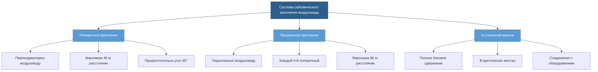
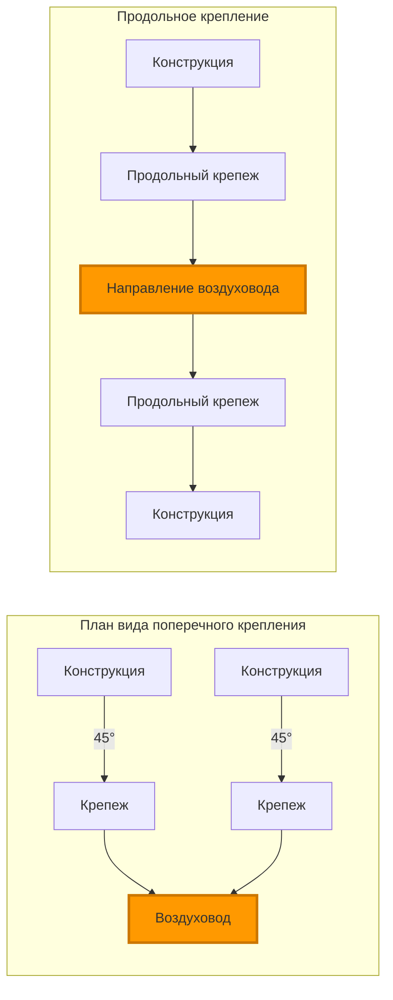

## Основные ориентации крепежей

Сейсмическое крепление воздуховодов требует удержания в двух перпендикулярных горизонтальных направлениях для сопротивления боковым усилиям во время сейсмических событий. **Поперечные крепежи** сопротивляются усилиям, перпендикулярным продольной оси воздуховода, в то время как **продольные крепежи** сопротивляются усилиям, параллельным направлению прокладки воздуховода. SMACNA и ASCE 7 требуют обе ориентации для полной сейсмической защиты.

### Требования поперечного крепления

Поперечные крепежи предотвращают боковое движение, перпендикулярное оси воздуховода. Эти крепежи обычно прикрепляются к воздуховоду под углом 90° к продольной центральной линии и передают сейсмические нагрузки на конструкцию здания.

**Ключевые параметры проектирования:**
- Максимальный шаг крепления: 12 м для воздуховодов площадью поперечного сечения до 0,75 м²
- Максимальный шаг крепления: 9 м для воздуховодов площадью 0,75–1,85 м²
- Максимальный шаг крепления: 7,6 м для воздуховодов площадью более 1,85 м²
- Крепление в пределах 1,8 м от изменений направления воздуховода
- Крепежи под углом 45° (максимально 60°) к горизонтали

### Требования продольного крепления

Продольные крепежи сопротивляются осевому движению вдоль направления воздуховода. Эти удержания предотвращают телескопирование или аккордеонное сжатие во время сейсмических событий.

**Критерии шага крепления:**
- Требуется в каждой четвёртой точке поперечного крепления
- Максимальный шаг крепления 24 м для воздуховодов площадью до 0,75 м²
- Максимальный шаг крепления 18 м для воздуховодов площадью более 0,75 м²
- Обязательное крепление при изменениях высоты воздуховода
- Требуется вблизи соединений с тяжёлым оборудованием

## Расчёты сейсмических усилий

Боковое сейсмическое усилие для проектирования крепления воздуховодов соответствует положениям ASCE 7:

$$F_p = \frac{0.4 a_p S_{DS} W_p}{(R_p / I_p)} \left(1 + 2\frac{z}{h}\right)$$

Где:
- $F_p$ = сейсмическое расчётное усилие (кН)
- $a_p$ = коэффициент амплификации компонента (2,5 для воздуховодов)
- $S_{DS}$ = расчётное спектральное ускорение отклика
- $W_p$ = рабочий вес компонента (кН)
- $R_p$ = коэффициент модификации отклика компонента (6,0 для воздуховодов)
- $I_p$ = коэффициент важности компонента (от 1,0 до 1,5)
- $z$ = высота точки крепления над уровнем земли (м)
- $h$ = средняя высота крыши конструкции (м)

**Пределы усилий:**

$$F_{p,max} = 1.6 S_{DS} I_p W_p$$

$$F_{p,min} = 0.3 S_{DS} I_p W_p$$

Распределённая нагрузка на погонный метр воздуховода:

$$w_d = \frac{F_p}{L}$$

Где $L$ = расстояние между крепежами (м).

### Распределение нагрузки крепежа

Каждая пара поперечных крепежей сопротивляется трибьютарной сейсмической нагрузке:

$$F_{brace} = \frac{w_d \cdot L}{2 \sin(\theta)}$$

Где $\theta$ = угол крепежа от горизонтали (обычно 45°).

Для продольных крепежей, несущих кумулятивные усилия:

$$F_{long} = F_p \cdot n$$

Где $n$ = количество интервалов поперечного крепления между продольными крепежами.

## Диаграммы конфигурации крепежей

## Системы комбинированного крепления

4-сторонний крепеж объединяет поперечное и продольное удержание в единых точках крепления для оптимальной сейсмической производительности.

### Расположение 4-стороннего крепежа

Устанавливайте комбинированный крепеж в следующих местах:
- Вертикальные подъёмы и опускания воздуховодов
- Соединения с тяжёлым оборудованием (вентиляторы, теплообменники)
- Боковые ответвления от основных магистралей
- Места, где происходит изменение размера воздуховода
- В пределах 1,8 м от сейсмических швов
- По обе стороны расширительных швов здания

### Конструктивные преимущества

Комбинированный крепеж обеспечивает:
- Полное боковое удержание во всех горизонтальных направлениях
- Снижение сложности монтажа
- Меньшее количество отверстий в потолке
- Лучшее распределение нагрузки
- Соответствие как поперечным, так и продольным требованиям

## Детали крепления и соединения

### Методы крепления воздуховода

**Воздуховоды из листового металла:**
- Сварные или болтовые стальные уголки
- Стальные полосы минимум 12 калибра
- Полный периметр прямоугольного воздуховода
- Обхват на 180° для круглых воздуховодов диаметром более 71 см

**Крепления к конструкции:**
- Сварка к стальной конструкции
- Болтовое крепление к бетону (закладные детали или послемонтажные анкеры)
- Минимум резьбовой стержень диаметром 9,5 мм
- Требуются стопорные гайки или прихватные швы

### Проверка пути передачи нагрузки

Полный путь передачи нагрузки должен передавать сейсмические усилия:

1. Стенка воздуховода → крепление воздуховода
2. Крепление воздуховода → стержень/кабель крепежа
3. Стержень крепежа → конструктивное соединение
4. Конструктивное соединение → каркас здания
5. Каркас здания → фундамент

Каждый элемент должен удовлетворять условию:

$$\text{Несущая способность} \geq 1.4 F_{brace}$$

Коэффициент 1,4 учитывает требования по избыточной прочности материала в соответствии с SMACNA.

## Соответствие стандарту SMACNA

Рекомендации SMACNA по сейсмическому удержанию механических систем устанавливают минимальные требования:

**Определение размера крепежа:**
- Минимум стержень диаметром 32 мм для крепежей длиной менее 9 м
- Минимум стержень диаметром 38 мм для крепежей длиной 9–12 м
- Минимум диаметр стального кабеля 6 мм (конструкция 7×19)
- Требуются натяжные муфты для натяжения кабеля

**Требования к качеству:**
- Резьбовой стержень, соответствующий ASTM A36 или выше
- Крепежи класса 5 или выше
- Предпочтительны изготовленные на заводе сборки крепежей
- Полевая сварка должна выполняться аттестованными сварщиками

**Документация:**
- Рабочие чертежи, показывающие все точки крепления
- Расчёты, заверенные лицензированным инженером
- Записи об инспекции и испытаниях
- Сертификаты материалов

## Лучшие практики монтажа

### Проверка на месте

Перед монтажом:
- Убедитесь в несущей способности конструкции в точках крепления
- Подтвердите, что толщина стенки воздуховода соответствует требованиям проектирования
- Обеспечьте достаточный зазор для углов крепежа
- Выявите конфликты с другими системами
- Определите места сейсмических швов

### Распространённые ошибки при монтаже

Избегайте следующих дефектов:
- Крепежи, прикреплённые к несущим элементам конструкции
- Избыточные углы крепежа (более 60° от горизонтали)
- Отсутствие или недостаточное крепление воздуховода
- Неправильно подобранные стержни или кабели
- Слабые соединения без стопорных устройств
- Крепежи, прикреплённые к трубопроводам спринклеров или кабелепроводам

### Испытания и инспекция

Проверка после монтажа:
- Визуальная инспекция всех соединений
- Проверка момента затяжки болтовых соединений
- Измерение натяжения кабеля
- Проверка зазора при полном сейсмическом смещении
- Фотодокументирование

Сейсмическое крепление воздуховодов представляет собой критически важную инфраструктуру безопасности жизни. Правильное проектирование и монтаж поперечных и продольных опор гарантирует, что воздуховоды остаются функциональными после сейсмических событий, обеспечивая герметизацию зданий, управление дымом и системы критической вентиляции.
