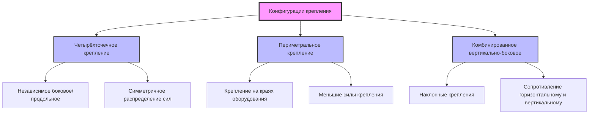
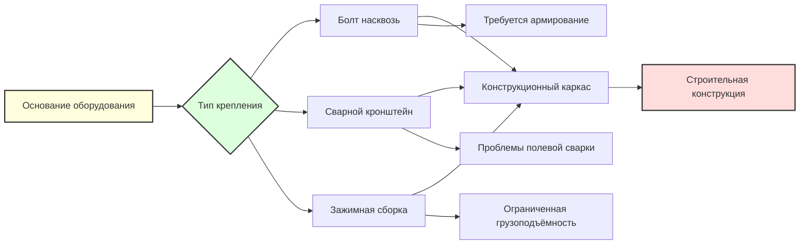

## Фундаментальные принципы крепления

Системы бокового и продольного крепления защищают оборудование HVAC от горизонтальных сейсмических сил, действующих перпендикулярно друг другу. Боковое крепление сопротивляется силам, параллельным ширине оборудования, а продольное крепление противодействует силам вдоль его длины. Эффективное сейсмическое крепление требует работы обеих направленных систем независимо друг от друга для предотвращения движения оборудования, опрокидывания или конструктивного отказа во время сейсмических событий.

Различие между этими направлениями крепления вытекает из непредсказуемого характера движения грунта при землетрясении, которое одновременно генерирует силы во всех горизонтальных направлениях. Оборудование должно сопротивляться этим многонаправленным силам через правильно спроектированные и установленные элементы крепления, которые передают сейсмические нагрузки на строительную конструкцию.

## Расчеты горизонтальных сейсмических сил

ASCE 7 устанавливает основу проектирования для горизонтальных сейсмических сил, приложенных к неструктурным компонентам, включая оборудование HVAC. Горизонтальная сейсмическая сила $F_p$ действует в центре тяжести оборудования:

$$F_p = \frac{0.4 a_p S_{DS} W_p}{R_p/I_p} \left(1 + 2\frac{z}{h}\right)$$

где:
- $F_p$ = горизонтальная сейсмическая проектная сила (кДж или Н)
- $a_p$ = коэффициент усиления компонента (обычно 2,5 для механического оборудования)
- $S_{DS}$ = ускорение спектрального отклика проектирования на коротких периодах
- $W_p$ = рабочая масса компонента (кДж или Н)
- $R_p$ = коэффициент модификации отклика компонента (обычно 2,5 для оборудования HVAC)
- $I_p$ = коэффициент важности компонента (1,0 или 1,5)
- $z$ = высота точки крепления над основанием
- $h$ = средняя высота крыши конструкции

Сила подлежит минимальным и максимальным ограничениям:

$$F_{p,min} = 0.3 S_{DS} I_p W_p$$

$$F_{p,max} = 1.6 S_{DS} I_p W_p$$

## Распределение сил между элементами крепления

Общая горизонтальная сила должна быть распределена между отдельными элементами крепления на основе их ориентации и геометрии. Для оборудования с четырьмя точками крепления сила в каждом боковом или продольном направлении распределяется среди элементов крепления, сопротивляющихся этому направлению.

Для симметрично закрепленного оборудования с двумя креплениями на направление:

$$F_{brace} = \frac{F_p}{2 \cos \theta}$$

где $\theta$ — угол крепления от горизонтали. Вертикальные крепления ($\theta = 0°$) воспринимают половину горизонтальной силы, в то время как наклонные крепления испытывают большие силы растяжения или сжатия.

## Рассмотрение центра тяжести

Расположение центра тяжести (ЦТ) оборудования критически влияет на проектирование крепления. ЦТ представляет точку, где вся сейсмическая масса может быть сосредоточена. Для прямоугольного оборудования:

$$x_{CG} = \frac{\sum m_i x_i}{\sum m_i}, \quad y_{CG} = \frac{\sum m_i y_i}{\sum m_i}, \quad z_{CG} = \frac{\sum m_i z_i}{\sum m_i}$$

где $m_i$ представляет массы отдельных компонентов, а $x_i$, $y_i$, $z_i$ — их координаты.

Критические рассмотрения ЦТ включают:

**Момент опрокидывания**: Горизонтальная сила, приложенная на высоте ЦТ, создает момент опрокидывания:

$$M_{OT} = F_p \times h_{CG}$$

где $h_{CG}$ — вертикальное расстояние от основания до центра тяжести.

**Восстанавливающий момент**: Вес оборудования обеспечивает восстанавливающий момент:

$$M_R = W_p \times \frac{b}{2}$$

где $b$ — ширина основания в направлении анализа. Коэффициент безопасности против опрокидывания составляет:

$$SF = \frac{M_R}{M_{OT}} \geq 1.5$$

**Эксцентричная нагрузка**: Когда ЦТ не совпадает с геометрическим центром, элементы крепления испытывают неравномерные силы, требующие индивидуального анализа.

## Типы конфигураций крепления

### Система четырёхточечного крепления

Четырёхточечное крепление использует отдельные элементы в каждом ортогональном горизонтальном направлении. Эта конфигурация обеспечивает:

- Четкие пути передачи нагрузок для каждого направления
- Независимое сопротивление боковым и продольным силам
- Упрощенные расчеты распределения сил
- Резервирование в случае отказа одного элемента

### Подход периметрального крепления

Периметральное крепление присоединяет ограничители на углах или краях оборудования, а не в центре основания. Этот метод:

- Снижает моменты опрокидывания за счет понижения эффективного ЦТ
- Распределяет силы крепления между несколькими точками
- Обеспечивает оборудование с ограниченным доступом к основанию
- Требует координации со структурной способностью оборудования

### Комбинированные вертикально-боковые системы

Наклонные элементы крепления сопротивляются одновременно горизонтальным и вертикальным сейсмическим силам:

$$F_{h,brace} = F_p \cos \alpha$$

$$F_{v,brace} = 0.2 S_{DS} W_p \cos \beta$$

где $\alpha$ и $\beta$ представляют углы наклона крепления в горизонтальной и вертикальной плоскостях.

## Проектирование точек крепления

Точки крепления должны передавать рассчитанные силы от элементов крепления в конструкцию оборудования без вызывания локального отказа. Критические факторы включают:

**Прочность материала основания**: Основания оборудования должны сопротивляться сосредоточенным нагрузкам в точках крепления. Минимальные требования толщины основания и армирования зависят от предела текучести материала и приложенных сил.

**Требования расстояния от края**: Болтовые соединения требуют минимального расстояния от края для предотвращения разрыва:

$$d_e \geq 1.5d_b$$

где $d_e$ — расстояние от края и $d_b$ — диаметр болта.

**Грузоподъёмность соединения**: Каждая точка крепления должна сопротивляться максимально ожидаемой силе с соответствующими коэффициентами безопасности, обычно 2,5 для сейсмических приложений.

## Критерии установки и проверки

Надлежащая установка обеспечивает производительность системы крепления:

- Проверка веса оборудования в соответствии с расчётами проектирования
- Подтверждение расположения ЦТ для оборудования с высоким центром тяжести
- Обеспечение совмещения элементов крепления с предполагаемыми направлениями
- Затяжка всех соединений с указанными значениями крутящего момента
- Проверка отсутствия помех с тепловым расширением
- Документирование углов и размеров крепления в исполнении
- Испытание крепления согласно ASTM E488 или эквивалентному стандарту

Проверки контроля качества должны проверить размер элемента крепления, класс материала, детали соединения и конструктивную адекватность точек крепления перед окончательным одобрением.

## Распространённые ошибки проектирования

Частые ошибки в проектировании бокового и продольного крепления включают:

- Использование одноточечного крепления при предположении о симметричном отклике оборудования
- Игнорирование расположения вертикального ЦТ в расчётах опрокидывания
- Приложение горизонтальной силы на основание оборудования вместо ЦТ
- Недостаточный размер соединений из-за геометрии угла крепления
- Неучтение эксцентричного распределения массы
- Недостаточное крепление в строительную конструкцию
- Пренебрежение гибкостью оборудования и динамическим усилением

Эти ошибки могут привести к отказу системы крепления во время сейсмических событий, потенциально вызывая повреждение оборудования, повреждение строительной конструкции или опасности для безопасности.
