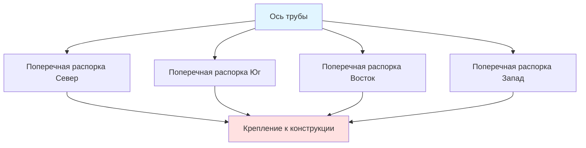
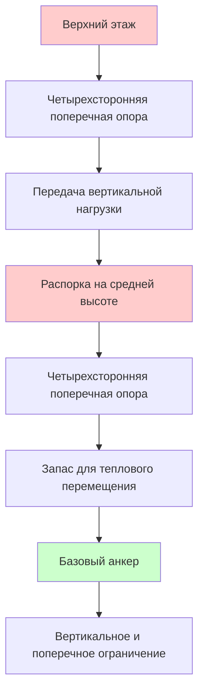

Сейсмическое крепление трубопроводных систем защищает инфраструкцию HVAC от повреждений, вызванных землетрясениями, путем ограничения движения труб в горизонтальном и вертикальном направлениях. Правильный проект крепления следует стандартам MSS SP-127 и NFPA 13, которые устанавливают требования к расстоянию между опорами, расчетам нагрузок и деталям монтажа.

## Принципы сейсмического проектирования

Трубопроводные системы испытывают инерционные силы от собственной массы и дифференциальные перемещения между точками опоры во время сейсмических событий. Основной подход проектирования ограничивает трубы от этих сил с помощью поперечных и продольных распорок, передающих нагрузки на строительную конструкцию.

**Расчет сейсмической силы**

Горизонтальная сейсмическая сила на трубопроводную систему определяется по формуле:

$$F_p = 0.4 a_p S_{DS} W_p \frac{1 + 2\frac{z}{h}}{R_p / I_p}$$

Где:
- $F_p$ = горизонтальная сейсмическая сила (Н)
- $a_p$ = коэффициент усиления компонента (2.5 для трубопроводов)
- $S_{DS}$ = расчетная спектральная реакция ускорения
- $W_p$ = вес трубы, жидкости и изоляции (Н)
- $z$ = высота точки крепления над уровнем земли (м)
- $h$ = высота здания (м)
- $R_p$ = коэффициент модификации реакции компонента (12 для трубопроводов)
- $I_p$ = коэффициент важности компонента (1.0 или 1.5)

Минимальная расчетная сила не должна быть меньше:

$$F_{p,min} = 0.3 S_{DS} I_p W_p$$

## Требования MSS SP-127

MSS SP-127 (Крепление для сейсмостойкости трубопроводных систем) устанавливает максимальное расстояние между распорками и минимальные требования к нагрузкам. Стандарт применяется к трубопроводам диаметром 12 мм и более с весом жидкости, превышающим 37,3 кг на погонный метр.

**Максимальное расстояние между распорками**

Поперечные распорки сопротивляются горизонтальным силам, перпендикулярным оси трубы. Максимальное расстояние зависит от диаметра трубы:

| Диаметр трубы | Максимальное расстояние поперечной распорки |
|------|----------|
| 12 мм - 25 мм | 12,2 м |
| 32 мм - 50 мм | 15,2 м |
| 64 мм - 89 мм | 18,3 м |
| 102 мм - 127 мм | 21,3 м |
| 152 мм - 203 мм | 24,4 м |
| 254 мм и более | Расчет по уравнению |

Для труб диаметром 254 мм и более рассчитайте максимальное расстояние:

$$L_{max} = 0.75 \sqrt{\frac{E I}{W_p}}$$

Где:
- $L_{max}$ = максимальное расстояние распорки (м)
- $E$ = модуль упругости (Па)
- $I$ = момент инерции (м⁴)
- $W_p$ = вес трубы на метр (Н/м)

**Продольные распорки**

Продольные распорки сопротивляются силам, параллельным оси трубы. Устанавливайте их при изменениях направления с отступом более 3,7 м или каждые 24,4 м на прямых участках.

## Конфигурация четырехстороннего крепления

Четырехстороннее крепление обеспечивает поперечное ограничение в двух ортогональных горизонтальных направлениях. Эта конфигурация требуется в критических местах, включая:

- В пределах 0,6 м от изменений направления
- В местах ответвлений диаметром более 50 мм
- На вершинах и основаниях стояков
- Вблизи гибких муфт и компенсаторов

**Требования к углу распорки**

Распорки должны соединяться с конструкцией под углами от 30° до 60° от горизонтали для оптимальной передачи нагрузки. Эффективная несущая способность корректируется в зависимости от угла распорки:

$$F_{eff} = \frac{F_p}{\sin(\theta)}$$

Где $\theta$ — угол распорки от горизонтали.

## Требования к опоре стояка

Вертикальные трубопроводные стояки требуют особого внимания из-за своей высоты и потенциального бокового смещения. Устанавливайте крепления стояков, соответствующие следующим критериям:

**Конфигурация крепления стояка**

**Максимальная высота стояка без промежуточного крепления**

$$H_{max} = 5 \sqrt{\frac{E I}{W_p}}$$

Для стояков, превышающих эту высоту, установите промежуточные четырехсторонние распорки. Расстояние между промежуточными распорками:

$$L_{riser} = 0.5 H_{max}$$

Верхняя часть распорки стояка должна располагаться в пределах 305 мм от наивысшей точки для предотвращения консольного действия.

## Требования NFPA 13 к противопожарным спринклерным системам

Раздел 9.3 стандарта NFPA 13 устанавливает специфические требования к сейсмическому креплению трубопроводов систем противопожарной защиты в сейсмических категориях проектирования D, E и F. Эти требования часто регулируют прокладку трубопроводов HVAC при совместной трассировке.

**Крепление ответвлений**

Ответвления с 4 и более спринклерами требуют поперечного крепления. Максимальное расстояние:
- Ответвления диаметром 64 мм и менее: 12,2 м
- Ответвления диаметром 76 мм и более: 15,2 м

**Крепление магистралей и стояков**

Магистрали и стояки требуют четырехстороннего крепления с меньшим шагом, чем в MSS SP-127, в районах с высокой сейсмической активностью. Устанавливайте распорки:
- В каждом месте изменения направления
- Каждые 12,2 м на прямых участках для труб диаметром 64 мм и менее
- Каждые 15,2 м на прямых участках для труб диаметром 76 мм и более

## Расчетные нагрузки для конструкций крепления

Сборки распорок должны выдерживать как вертикальные, так и горизонтальные нагрузки. Проверка на совместное напряжение:

$$\frac{f_a}{F_a} + \frac{f_b}{F_b} \leq 1.0$$

Где:
- $f_a$ = фактическое осевое напряжение
- $F_a$ = допускаемое осевое напряжение
- $f_b$ = фактическое изгибающее напряжение
- $F_b$ = допускаемое изгибающее напряжение

Фурнитура, включая хомуты, крепежные элементы и конструктивные крепления, должна иметь номинальную нагрузку, превышающую расчетную силу как минимум в 2,0 раза (коэффициент запаса).

## Особенности монтажа

**Требования к зазорам**

Обеспечьте минимальные зазоры вокруг труб для теплового расширения:
- Трубы диаметром 13–51 мм: зазор 13 мм
- Трубы диаметром 64–152 мм: зазор 25 мм
- Трубы диаметром 203 мм и более: зазор 51 мм

**Крепление к конструкциям**

Распорки должны крепиться к конструктивным элементам, способным выдерживать сейсмические нагрузки. Допустимые точки крепления:
- Стальные балки и колонны
- Бетонные колонны и стены (минимальная прочность 27,6 МПа)
- Деревянный каркас (дугласова пихта или лучше)

Не крепите распорки к:
- Подвесным потолочным системам
- Неструктурным перегородкам
- Архитектурным отделочным материалам
- Другим трубопроводным системам

**Документация**

Ведите документацию по сейсмическому креплению, включая:
- Расчеты, показывающие определение сил
- Схемы расположения распорок на чертежах
- Номинальные нагрузки и сертификаты на фурнитуру
- Записи о проверке монтажа

Правильный проект и монтаж сейсмического крепления обеспечивают целостность трубопроводной системы во время землетрясений, предотвращая катастрофические отказы и поддерживая критически важные функции HVAC и противопожарной защиты в наиболее важные моменты.
