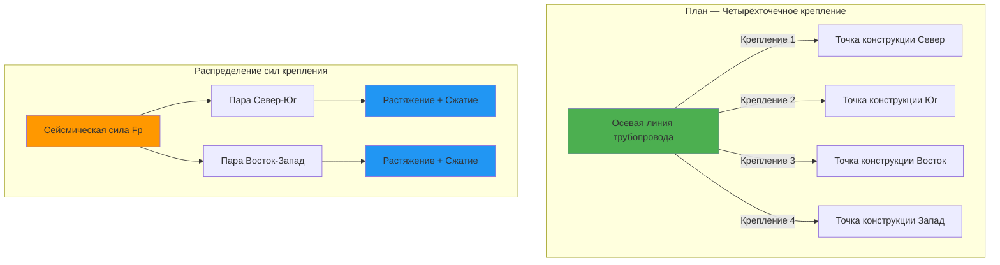
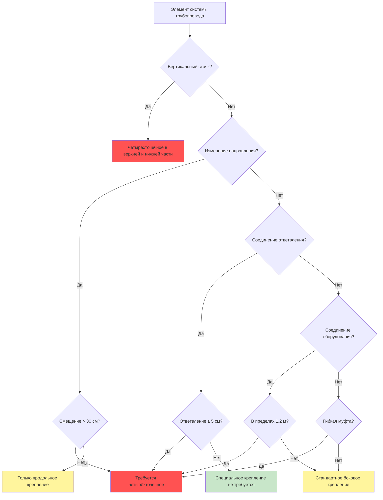
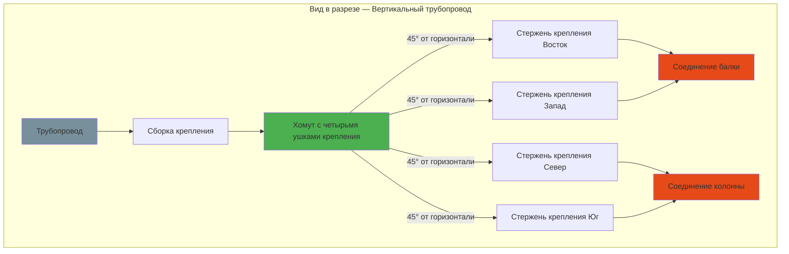
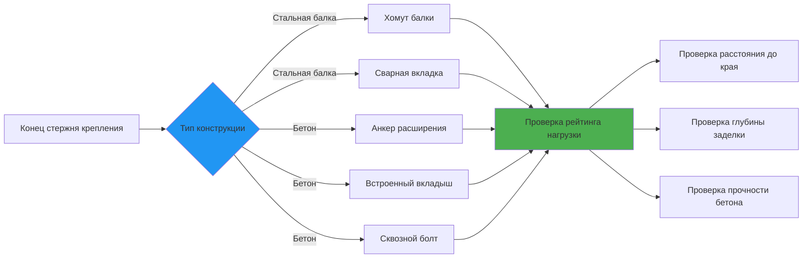

Четырёхточечное крепление обеспечивает полную боковую сейсмическую защиту трубопроводов HVAC путём ограничения горизонтального перемещения в двух взаимно перпендикулярных направлениях. Эта конфигурация обязательна в критических местах трубопровода, где неограниченное боковое смещение компрометирует целостность системы или создаёт чрезмерные напряжения на соединениях и оборудовании.

## Конфигурация четырёхточечного крепления

Четырёхточечное крепление состоит из двух пар боковых креплений, ориентированных перпендикулярно друг другу; каждая пара противостоит горизонтальным сейсмическим силам в одном основном направлении. Конфигурация создаёт стабильную систему удержания, которая предотвращает смещение трубопровода независимо от направления землетрясения.

**Основные требования конфигурации**

Четыре крепления должны быть расположены так, чтобы создавать две взаимно перпендикулярные оси удержания, обычно совпадающие с конструктивными сетками здания или основными направлениями сейсмических сил. Надлежащая геометрия обеспечивает сбалансированное распределение нагрузки и предотвращает торсионное вращение трубопровода вокруг его продольной оси.

Оптимальное расположение креплений размещает противоположные крепления на разделении 180° и соседние крепления на разделении 90°. Отклонение от идеальной геометрии требует корректировки расчётов несущей способности крепления с целью учёта разложения векторов сил.

## Когда требуется четырёхточечное крепление

MSS SP-127 и NFPA 13 обязывают четырёхточечное крепление в определённых местах трубопровода, где боковые силы сходятся или уязвимость системы трубопровода повышается:

**Критические места, требующие четырёхточечного крепления**

- **Изменения направления:** В пределах 0,6 м от колен, тройников и крестовин, где боковое смещение ответвления превышает 30 см
- **Соединения стояков:** В верхней и нижней части вертикальных стояков, превышающих 2,4 м в высоту
- **Соединения ответвлений:** На ответвлениях размером 5 см и более, подключаемых к основным трубам
- **Соединения оборудования:** В пределах 1,2 м от ниппелей оборудования, включая насосы, воздухоотделители, расширительные баки
- **Гибкие муфты:** Рядом с расширительными стыками, гибкими соединителями и сейсмическими разделениями
- **Переходы основной трубы и коллектора:** Где размер трубы изменяется на 5 см или более
- **Разделения здания:** На сейсмических стыках, где возникает дифференциальное перемещение здания

**Дополнительные требования NFPA 13**

Для систем пожаротушения в категориях сейсмического проектирования D, E и F:

- Четырёхточечное крепление требуется на каждом изменении направления на основных трубах и стояках
- Линии ответвлений с 4 и более оросителями требуют бокового крепления каждые 12 м
- Конфигурации армовера требуют четырёхточечного крепления на переходе вертикаль-горизонталь

## Расчёты несущей способности крепления и нагрузок

Каждое крепление в конфигурации четырёхточечного крепления должно сопротивляться составляющей сейсмической силы, разрешённой вдоль его оси. Горизонтальная сейсмическая сила распределяется между противоположными парами креплений на основе ортогональных составляющих сил.

**Горизонтальная сейсмическая сила**

Полная горизонтальная сейсмическая сила на сегменте трубопровода составляет:

$$F_p = 0.4 a_p S_{DS} W_p \frac{1 + 2\frac{z}{h}}{R_p / I_p}$$

Где:
- $F_p$ = горизонтальная сейсмическая сила (кДж)
- $a_p$ = коэффициент усиления компонента (2,5 для трубопроводов)
- $S_{DS}$ = расчётное ускорение спектрального отклика на коротком периоде (g)
- $W_p$ = вес трубопровода, жидкости и теплоизоляции (кДж)
- $z$ = высота крепления над основанием (м)
- $h$ = средняя высота кровли конструкции (м)
- $R_p$ = коэффициент модификации отклика компонента (12 для трубопроводов)
- $I_p$ = коэффициент важности компонента (1,0 или 1,5)

Минимальное требование по силе:

$$F_{p,min} = 0.3 S_{DS} I_p W_p$$

**Распределение сил в четырёхточечной системе**

Когда движение землетрясения происходит под углом $\alpha$ к основным осям крепления, составляющие сил в каждом ортогональном направлении составляют:

$$F_x = F_p \cos(\alpha)$$

$$F_y = F_p \sin(\alpha)$$

Для целей проектирования предположите, что максимальная сила действует одновременно в обоих направлениях со 100% в одном направлении и 30% ортогонально:

$$F_{design,x} = F_p$$

$$F_{design,y} = 0.3 F_p$$

Или наоборот, в зависимости от того, что даёт максимальные нагрузки на крепление.

**Нагрузка на отдельное крепление с корректировкой угла**

Каждое крепление подключается к трубопроводу под углом $\theta$ от горизонтали. Требуемая несущая способность растяжения/сжатия крепления составляет:

$$T_{brace} = \frac{F_{design}}{\sin(\theta)}$$

Где $\theta$ измеряется от горизонтальной плоскости к осевой линии крепления. Оптимальный диапазон угла крепления составляет 30°–60° от горизонтали.

**Уравнение расчёта несущей способности крепления**

Элемент крепления должен удовлетворять:

$$T_{brace} \leq \phi T_{allowable}$$

Где:
- $T_{allowable}$ = растягивающая или сжимающая способность стержня крепления или подкоса
- $\phi$ = коэффициент сопротивления (0,9 для растяжения, варьируется для сжатия в зависимости от стройности)

Для элементов сжатия проверьте коэффициент стройности:

$$\frac{KL}{r} \leq 200$$

Где:
- $K$ = коэффициент эффективной длины (1,0 для шарнирно-шарнирного)
- $L$ = неподкреплённая длина (м)
- $r$ = радиус инерции (см)

**Пример расчёта**

Дано:
- Трубопровод: 15 см Schedule 40 сталь, изолированный
- $W_p = 2000$ кДж (притяговой вес между креплениями)
- $S_{DS} = 1,0g$
- $I_p = 1,5$ (критическая система)
- $z/h = 0,75$ (близко к кровле)
- Угол крепления $\theta = 45°$

Рассчитайте сейсмическую силу:

$$F_p = 0.4(2.5)(1.0)(2000) \frac{1 + 2(0.75)}{12/1.5} = 0.4(2.5)(1.0)(2000) \frac{2.5}{8}$$

$$F_p = 2000 \times 0.3125 = 625 \text{ кДж}$$

Проверьте минимум:

$$F_{p,min} = 0.3(1.0)(1.5)(2000) = 900 \text{ кДж} \rightarrow \text{определяет}$$

Нагрузка на крепление (предполагая, что сила действует вдоль одной оси):

$$T_{brace} = \frac{900}{\sin(45°)} = \frac{900}{0.707} = 1273 \text{ кДж}$$

Расчётная несущая способность крепления с коэффициентом безопасности:

$$T_{design} = 1273 \times 2.0 = 2546 \text{ кДж минимум}$$

## Расположение ортогональных креплений

Надлежащее геометрическое расположение четырёх креплений обеспечивает сбалансированную передачу нагрузки и предотвращает эксцентричную нагрузку, которая могла бы вызвать вращение трубопровода или изгиб.

**Геометрические требования**

1. **Угловое разделение:** Поддерживайте 90° ± 15° между соседними креплениями в плане
2. **Угол высоты:** Все четыре крепления должны заканчиваться на одной вертикальной дистанции от трубопровода, обычно 30°–60° от горизонтали
3. **Симметрия:** Противоположные крепления в каждой паре должны иметь равные углы и длины, если возможно
4. **Зазор:** Минимальный зазор 5 см между аппаратурой крепления и соседними трубопроводами, воздуховодами или конструкцией

**Выбор точки крепления**

Крепление крепления к конструкции здания должно соответствовать требованиям пути нагрузки:

- Стальная конструкция: Фланцы балок, соединения стенки или поверхности колонн
- Железобетонная конструкция: Встроенные пластины, анкеры расширения (диаметр не менее 10 мм)
- Деревянная конструкция: Сплошной брус, не менее 5×15 см сосна-ель (редко в коммерческих зданиях)

Проверьте, что конструкция может сопротивляться нагрузкам крепления без перенапряжения или чрезмерной деформации. Максимальное смещение точки крепления под сейсмической нагрузкой не должно превышать 0,6 см.

## Рассмотрение углов крепления

Угол крепления напрямую влияет на величину нагрузки и эффективность удержания. Мелкие углы увеличивают осевые нагрузки; крутые углы уменьшают составляющую боковой нагрузки.

**Эффективность крепления в зависимости от угла**

| Угол крепления θ | sin(θ) | Множитель силы | Эффективность |
|------------------|--------|---|---|
| 30° | 0,500 | 2,00 | Минимально допустимая |
| 45° | 0,707 | 1,41 | Оптимальная |
| 60° | 0,866 | 1,15 | Хорошая |
| 75° | 0,966 | 1,04 | Неэффективная боковая |
| 90° | 1,000 | 1,00 | Нет боковой составляющей |

**Эффективная горизонтальная составляющая силы**

Горизонтальная составляющая силы, обеспечиваемая наклонным креплением под нагрузкой $T$, составляет:

$$F_{horizontal} = T \sin(\theta)$$

Таким образом, для обеспечения требуемой горизонтальной силы $F_p$ крепление должно нести:

$$T = \frac{F_p}{\sin(\theta)}$$

Углы менее 30° приводят к чрезмерным нагрузкам на крепление и возможной потере устойчивости при сжатии. Углы более 60° уменьшают боковую эффективность и могут не обеспечивать надлежащее удержание.

**Оптимизация двойного угла**

Где вертикальное пространство ограничено, используйте комбинацию:
- Более крутые крепления (50°–60°) для снижения нагрузок на крепление
- Расположены для поддержания ортогональных пар в плане

Где вертикальное пространство достаточно:
- Более пологие крепления (30°–45°) обеспечивают лучшее боковое удержание на единицу длины крепления
- Облегчённая установка на стандартных высотах балок

## Требования по установке согласно MSS SP-127

**Выбор хомута трубопровода**

Сборки четырёхточечного крепления требуют хомутов с четырьмя ушками крепления, расположенными с интервалом 90°. Хомут должен:

- Соответствовать внешнему диаметру трубопровода с учётом теплоизоляции, если она присутствует
- Обеспечивать минимальный контакт 240° с поверхностью трубопровода
- Передавать нагрузку без раздавливания или деформации трубопровода
- Включать тепловую прокладку для предотвращения теплового моста на охлаждённых или горячих трубопроводах

**Характеристики аппаратуры**

Все компоненты крепления должны соответствовать или превышать:

- Стержни крепления: Сталь ASTM A36 минимум, диаметр 10 мм минимум для трубопроводов до 5 см
- Более крупные трубопроводы требуют стержни диаметром 13–19 мм на основе расчётов нагрузки
- Резьбовые соединения: Минимум 3 витка резьбы за гайкой
- Турбухты: Кованая сталь, рассчитанная на расчётную нагрузку крепления
- Конструктивные крепления: Сварные или болтовые с несущей способностью, превышающей нагрузку крепления минимум в 2 раза

**Допуски при установке**

- Выравнивание стержня крепления: В пределах 5° от расчётного угла
- Затяжка хомута: Момент затяжки согласно спецификации производителя, проверка отсутствия проскальзывания
- Аппаратура соединения: Все гайки полностью затянуты, применены шайбы-стопоры или состав для фиксации резьбы
- Зазоры: Проверьте отсутствие помех с тепловым расширением трубопровода

## Стандарты пожаротушения NFPA 13

Раздел 9.3 NFPA 13 устанавливает конкретные требования четырёхточечного крепления для трубопроводов системы орошения в высокосейсмических зонах.

**Требования категории сейсмического проектирования**

| SDC | Требование четырёхточечного крепления |
|-----|---|
| A, B, C | Минимальные требования, прежде всего на стояках |
| D | Четырёхточечное на изменениях направления, максимальное расстояние 15 м |
| E, F | Четырёхточечное на всех изменениях направления, расстояние 12 м, боковое крепление линии ответвления |

**Специальные положения линии ответвления**

Линии ответвления в SDC D-F с 4 и более оросителями:
- Требуется боковое крепление (два крепления, предпочтительно ортогональное)
- Максимальное расстояние 12 м для диаметров 6 см и менее
- Крепления должны подключаться к конструкции, не к основным трубам
- Гибкие муфты требуют четырёхточечного крепления в пределах 60 см

**Приспособление дифференциального перемещения**

На сейсмических стыках здания:
- Установите гибкую муфту
- Четырёхточечное крепление на каждой стороне муфты в пределах 60 см
- Проверьте достаточное смещение гибкой муфты для антиципируемого дифференциального перемещения
- Типичное требование: минимум ±5 см

## Детали соединения крепления

**Соединение хомута трубопровода**

Интерфейс хомута трубопровода должен распределять нагрузки без точечной нагрузки:

$$\sigma_{bearing} = \frac{T_{brace}}{A_{contact}}$$

Где:
- $\sigma_{bearing}$ = напряжение опоры на стенку трубопровода (кПа)
- $T_{brace}$ = нагрузка на крепление (кДж)
- $A_{contact}$ = эффективная площадь контакта (см²)

Поддерживайте напряжение опоры ниже:
- Стальной трубопровод: 138 МПа
- Медный трубопровод: 69 МПа
- Трубопровод CPVC: 7 МПа (редко используется в системах с сейсмическим креплением)

**Варианты соединения конструкции**

**Расчёт анкера в бетоне**

Для анкеров расширения в бетоне:

$$T_{anchor} \leq \phi T_{nominal}$$

Проверьте все режимы отказа:
- Отказ стали анкера
- Отказ выбивания бетона
- Отказ выдёргивания
- Отказ от выдува боковой поверхности (если рядом с краем)

Минимальное расстояние до края: 7× диаметр анкера

Минимальная глубина заделки: 10 см для анкеров диаметром 10 мм, 13 см для анкеров диаметром 13 мм

## Контроль качества и проверка

**Предустановочная проверка**

- Рассмотрите расчёты, подтверждающие размер и расстояние между креплениями
- Проверьте, что рейтинги нагрузки аппаратуры соответствуют или превышают требования расчёта
- Подтвердите точки крепления, определённые на конструктивных чертежах
- Проверьте зазоры для теплового расширения трубопровода

**Проверка при установке**

- Проверьте, что ориентация хомута размещает ушки с интервалом 90°
- Подтвердите углы крепления в допуске от расчёта (±5°)
- Проверьте затяжку и надёжность всех соединений
- Проверьте отсутствие помех с соседними системами
- Сфотографируйте завершённые установки в критических местах

**Сертификация и документирование**

- Сертификация монтажника, что работа соответствует MSS SP-127 или NFPA 13
- Документация рейтинга нагрузки для всех компонентов аппаратуры
- Чертежи с учётом выполненных работ, показывающие фактические местоположения креплений
- Отчёты о проверке органом, имеющим юрисдикцию

Надлежащее проектирование и установка четырёхточечного крепления защищает трубопроводные системы HVAC от сейсмических повреждений, сохраняя целостность системы и предотвращая каскадные отказы во время землетрясений. Соблюдение требований MSS SP-127, NFPA 13 и ASCE 7 обеспечивает соответствие нормам и оптимальную сейсмическую производительность.
