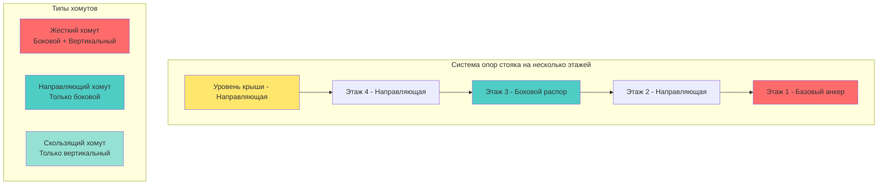
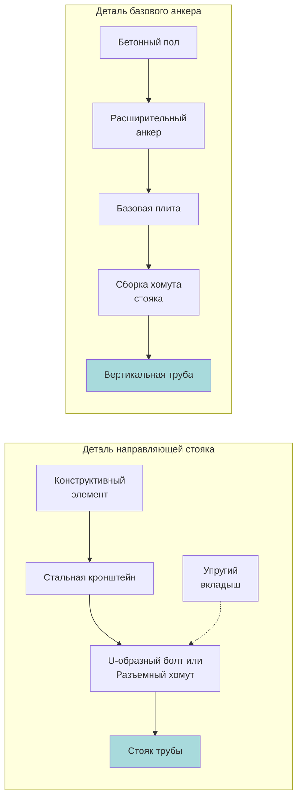

Вертикальные трубопроводные системы (стояки) требуют специализированных подходов к сейсмическому удержанию, которые фундаментально отличаются от горизонтальных трубопроводов. Опоры стояков должны сопротивляться как боковым сейсмическим силам, так и вертикальным нагрузкам, обеспечивая при этом компенсацию теплового расширения и структурную непрерывность через несколько этажей.

## Основы опор стояков

Вертикальные трубопроводы испытывают уникальные сейсмические нагрузки из-за своей ориентации и пролета через несколько этажей. Основная задача заключается в передаче боковых сил в стратегических точках при сохранении вертикальной опоры и обеспечении контролируемого перемещения на промежуточных этажах.

**Критические аспекты проектирования:**
- Распределение боковой силы по высоте стояка
- Путь вертикальной нагрузки к конструктивным опорам
- Компенсация теплового расширения
- Детализация прохода через перекрытия
- Дифференциальное движение здания

## Расчеты сейсмических нагрузок для стояков

Боковая сейсмическая сила в каждой точке опоры зависит от присоединенного веса и характеристик сейсмического отклика.

**Боковая сила на опору:**

$$F_p = 0.4 a_p S_{DS} I_p W_p \left(\frac{1 + 2\frac{z}{h}}{R_p / I_p}\right)$$

Где:
- $F_p$ = боковая сейсмическая сила на участок стояка (Н)
- $a_p$ = коэффициент усиления компонента (1.0 для жестких, 2.5 для гибких)
- $S_{DS}$ = расчетная спектральная ускоренная реакция
- $I_p$ = коэффициент важности компонента (1.0 или 1.5)
- $W_p$ = рабочий вес участка стояка (Н)
- $z$ = высота опоры над основанием (м)
- $h$ = высота здания (м)
- $R_p$ = коэффициент модификации отклика компонента (обычно 12 для трубопроводов)

**Вертикальная нагрузка на базовый анкер:**

$$P_{base} = W_{total} \pm F_p \left(\frac{e}{d}\right)$$

Где:
- $W_{total}$ = общий вес стояка, включая жидкость (Н)
- $e$ = эксцентриситет приложения боковой силы (мм)
- $d$ = расстояние от анкера до самого дальнего хомута (мм)

Базовый анкер должен сопротивляться комбинированной вертикальной нагрузке от веса трубы и опрокидывающему моменту от боковых сил.

## Конфигурации хомутов стояков

**Выбор типа хомута:**

| Тип опоры | Боковое удержание | Вертикальная опора | Тепловое перемещение | Применение |
|------|----------|----------|----------|----------|
| Базовый анкер | В обоих направлениях | Полная опора | Фиксированная точка | Нижний этаж |
| Боковой распор | В обоих направлениях | Частичная/отсутствует | Позволяет вертикальное | Каждые 4-5 этажей |
| Направляющая | В обоих направлениях | Отсутствует | Позволяет вертикальное | Промежуточные этажи |
| Скользящая опора | Отсутствует | Полная опора | Позволяет боковое | Не для сейсмических условий |

## Детали прохода через перекрытия

Проходы стояков через перекрытия должны обеспечивать как сейсмическое перемещение, так и предотвращать распространение огня и дыма.

**Требования к проектированию:**
- Увеличенный гильза: минимальный зазор 50 мм вокруг трубы
- Гильза выступает на 50 мм выше готового пола
- Огнезащитный уплотнительный материал (минеральная вата) заполняет кольцевое пространство
- Система огнезащиты, сертифицированная для динамических перемещений
- Проверка зазора: $C_{min} = 50.8 + D_p \times 0.635$

Где $D_p$ — диаметр трубы в дюймах.

**Расчет сейсмического зазора:**

$$\Delta_{seismic} = \delta_x \sqrt{\left(\frac{h_x}{h}\right)^2 + \left(\frac{h_y}{h}\right)^2}$$

Где:
- $\delta_x$ = расчетный сдвиг этажа на уровне x
- $h_x$ = высота прохода над уровнем земли
- $h$ = общая высота здания
- $h_y$ = высота этажа выше

## Конфигурации направляющих и анкеров

**Требования к расстоянию между направляющими:**

Максимальное расстояние между поперечными опорами:

$$L_{max} = 13.5 \sqrt{\frac{d}{p}}$$

Где:
- $L_{max}$ = максимальный пролет между направляющими (м)
- $d$ = наружный диаметр трубы (мм)
- $p$ = расчетное давление (кПа)

Для сейсмических применений уменьшите $L_{max}$ на 25% или используйте максимальное значение 9,14 м, в зависимости от того, что меньше.

## Распределение нагрузки на анкеры

Базовые анкеры должны выдерживать наиболее тяжелую комбинацию нагрузок. Критическое натяжение анкерного болта:

$$T_{bolt} = \frac{4M}{n \times b} + \frac{W}{n}$$

Где:
- $M$ = опрокидывающий момент от боковых сил (Н·м)
- $n$ = количество анкерных болтов
- $b$ = размер схемы расположения болтов (м)
- $W$ = вертикальная нагрузка (растяжение или сжатие) (Н)

**Факторы проектирования анкеров:**
- Минимум 4 болта на базовой плите
- Расстояние от края: $\geq 7 \times$ диаметр болта
- Расстояние между болтами: $\geq 4 \times$ диаметр болта
- Прочность бетона: минимум 20,7 МПа через 28 дней
- Коэффициент запаса: 4,0 для сейсмических нагрузок на растяжение

## Строительные соображения

**Последовательность монтажа:**
1. Проверьте несущую способность конструкции в каждой точке опоры
2. Установите базовый анкер с выверенной осевой линией
3. Установите направляющие на промежуточных этажах, двигаясь вверх
4. Проверьте допуск вертикальности (6,35 мм на 3,05 м)
5. Установите поперечные распорки на указанных этажах
6. Затяните все соединения в соответствии с требованиями производителя
7. Установите противопожарную изоляцию во всех проходах

**Распространенные ошибки, которых следует избегать:**
- Трубы меньшего диаметра, вызывающие заклинивание в гильзах проходов
- Жесткое крепление на всех этажах (предотвращает тепловое расширение)
- Недостаточная глубина заделки базового анкера
- Отсутствие или неправильная установка противопожарной изоляции
- Непредусмотренный дрейф здания при расчетах

## Ссылки на нормы

Проектирование сейсмических стояков должно соответствовать главе 13 ASCE 7, разделу 1621 IBC и ASME B31.9. Дополнительные требования могут применяться к трубопроводам под давлением согласно ASME B31.1. Местные юрисдикции могут устанавливать более строгие требования в зонах с высокой сейсмической опасностью (SDC D, E, F).

Правильное проектирование опор стояков обеспечивает целостность вертикальной системы трубопроводов во время сейсмических событий, сохраняя эксплуатационную надежность и соответствие нормам по всей высоте конструкции.
