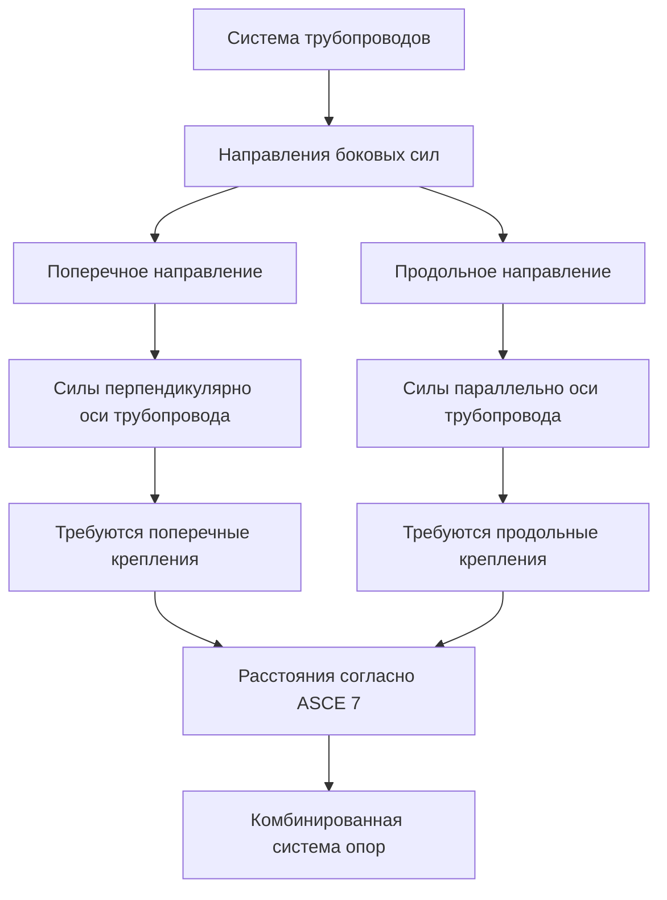
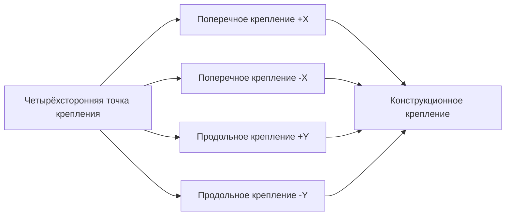

Сейсмическое крепление систем трубопроводов HVAC требует опорных элементов, ориентированных на сопротивление боковым силам в нескольких направлениях. Поперечные и продольные опоры составляют основу комплексной системы сейсмического удержания, каждый тип разработан для сопротивления силам, действующим перпендикулярно и параллельно оси трубопровода соответственно.

## Определения направлений

**Поперечные опоры** сопротивляются боковым силам, действующим перпендикулярно продольной оси трубопровода. Эти силы являются результатом колебаний грунта, происходящих под прямым углом к направлению трассы трубопровода.

**Продольные опоры** сопротивляются боковым силам, действующим параллельно продольной оси трубопровода. Эти силы являются результатом колебаний грунта, происходящих вдоль направления трассы трубопровода.

Оба типа опор должны быть спроектированы для сопротивления сейсмическим силам в соответствующих направлениях при одновременном обеспечении теплового расширения, нормальных рабочих нагрузок и динамических эффектов во время сейсмических событий.

## Требования к ориентации опор

Ориентация опорных элементов определяет их эффективность в сопротивлении сейсмическим силам. Полная система крепления требует опор в обоих направлениях, хотя некоторые конфигурации креплений могут обеспечивать сопротивление в нескольких направлениях одновременно.

## Расчёты боковых сил

Боковая сейсмическая сила конструирования для компонентов трубопроводов рассчитывается в соответствии с ASCE 7, Глава 13 (Неконструкционные компоненты):

$$F_p = \frac{0.4 a_p S_{DS} W_p}{R_p / I_p} \left(1 + 2\frac{z}{h}\right)$$

Где:
- $F_p$ = сейсмическая сила конструирования (кН)
- $a_p$ = коэффициент амплификации компонента (2,5 для трубопроводов)
- $S_{DS}$ = спектральное ускорение отклика конструирования на коротких периодах
- $W_p$ = рабочая масса компонента (кН)
- $R_p$ = коэффициент модификации отклика компонента (12 для трубопроводов с соединениями, 6 для остальных)
- $I_p$ = коэффициент важности компонента (1,0–1,5)
- $z$ = высота точки крепления над основанием
- $h$ = средняя высота крыши конструкции

Сила $F_p$ должна удовлетворять граничные условия:

$$F_{p,min} = 0.3 S_{DS} I_p W_p$$

$$F_{p,max} = 1.6 S_{DS} I_p W_p$$

Эта общая боковая сила должна быть распределена между поперечными и продольными опорными элементами на основе направления анализируемого колебания грунта.

## Конструирование поперечных опор

Поперечные опоры обычно состоят из:

**Жёсткие крепления**: Угловые стальные элементы, соединяющие трубопровод с конструкционными элементами, спроектированные для сопротивления силам растяжения и сжатия перпендикулярно оси трубопровода.

**Расчёт силы в поперечном креплении**:

$$F_T = F_p \cos(\theta)$$

Где $\theta$ — угол между креплением и горизонтальной плоскостью. Для крепления под углом 45°:

$$F_{brace} = \frac{F_T}{\sin(45°)} = 1.414 F_T$$

**Четырёхсторонние крепления**: Комбинация поперечных креплений в противоположных направлениях обеспечивает резервирование и сбалансированное удержание.

## Конструирование продольных опор

Продольные опоры сопротивляются силам вдоль оси трубопровода через:

**Стояковые крепления**: Вертикальные трассы трубопроводов требуют продольные опоры в каждой точке пересечения перекрытий для предотвращения осевого движения.

**Продольные боковые крепления**: Угловые элементы, ориентированные параллельно направлению трассы трубопровода.

Распределение продольной силы:

$$F_L = F_p \sin(\alpha)$$

Где $\alpha$ — угол продольного крепления к оси трубопровода.

## Требования к расстояниям между опорами

ASCE 7 и NFPA 13 устанавливают максимальные расстояния для сейсмического крепления на основе диаметра трубопровода и привнесённой массы:

| Диаметр трубопровода | Максимальное расстояние (поперечное) | Максимальное расстояние (продольное) |
|----------------------|--------------------------------------|--------------------------------------|
| ≤ 51 мм | 12,2 м | 24,4 м |
| 64–89 мм | 12,2 м | 24,4 м |
| 102–127 мм | 12,2 м | 24,4 м |
| 152 мм | 12,2 м | 15,2 м |
| 203–305 мм | 12,2 м | 12,2 м |

Расстояния должны быть уменьшены, когда:
- Масса трубопровода превышает стандартные пределы
- Существуют дополнительные сосредоточенные нагрузки (задвижки, оборудование)
- Присутствуют промежуточные гибкие соединения

## Комбинированные системы опор

Четырёхстороннее крепление в одной точке обеспечивает как поперечное, так и продольное удержание. Эта конфигурация требует тщательного анализа распределения нагрузок, чтобы обеспечить надлежащий размер каждого крепёжного элемента.

Сила в каждом креплении четырёхсторонней системы:

$$F_{brace,i} = \frac{F_p}{\sin(\theta_i)}$$

Где $\theta_i$ — угол отдельного крепления к горизонтальной плоскости.

## Рекомендации по монтажу

**Требования к зазорам**: Крепления не должны препятствовать движениям теплового расширения. Обеспечьте надлежащий зазор или используйте компенсаторы рядом с точками крепления.

**Конструкционное крепление**: Все крепления должны соединяться с конструкционными элементами, способными сопротивляться приложенным нагрузкам. Крепление к архитектурным отделочным элементам или неконструкционным элементам запрещено.

**Применение амортизаторов**: Когда движение теплового расширения превышает возможность крепления, гидравлические или механические амортизаторы позволяют нормальное расширение при удержании сейсмического движения.

**Проверка в поле**: Каждая установка требует проверки соответствия углов крепления, точек крепления и расстояний между опорами проектным документам.

## Методы анализа

Эквивалентный статический метод (ESM) применяется к большинству систем трубопроводов HVAC. Для критических или сложных установок может потребоваться динамический анализ:

$$\ddot{u}(t) + 2\zeta\omega\dot{u}(t) + \omega^2 u(t) = -a_g(t)$$

Где:
- $u(t)$ = относительное смещение
- $\zeta$ = коэффициент демпирования
- $\omega$ = естественная частота
- $a_g(t)$ = ускорение грунта

Это дифференциальное уравнение описывает динамический отклик системы трубопроводов на сейсмические колебания грунта.

## Стандарты соответствия

- **ASCE 7**: Минимальные нагрузки при конструировании зданий и других конструкций (Глава 13)
- **NFPA 13**: Установка систем спринклеров (требования к сейсмическому креплению)
- **SMACNA**: Руководство по сейсмическому удержанию (детали опор трубопроводов)
- **ASME B31.1/B31.9**: Коды трубопроводов силовых установок и трубопроводов внутридомовых систем

Надлежащее применение поперечных и продольных опор обеспечивает, чтобы системы трубопроводов HVAC оставались функциональными после сейсмических событий и предотвращает катастрофические отказы, которые могли бы поставить под угрозу безопасность здания.
