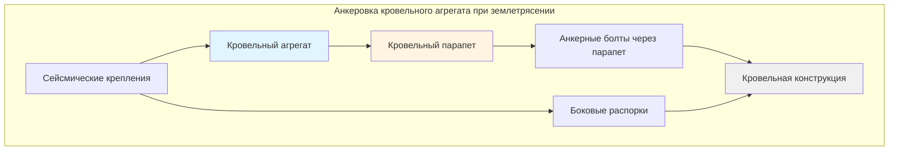
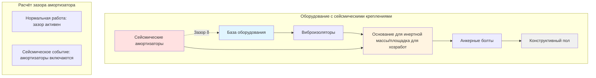
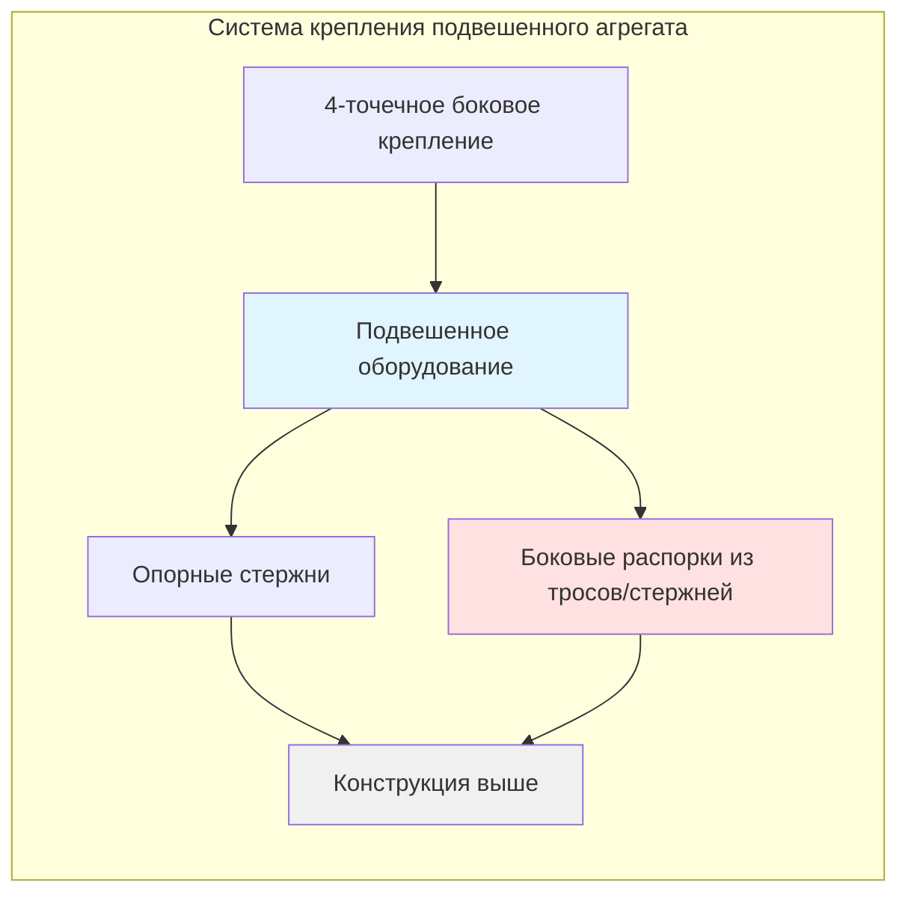

# Сейсмические крепления для оборудования HVAC

Надлежащее проектирование сейсмических крепежей защищает оборудование HVAC от сил, вызванных землетрясениями, и предотвращает катастрофические отказы. Это руководство охватывает расчеты сил, проектирование анкеровки и требования к установке согласно стандартам IBC, ASCE 7 и SMACNA.

## Расчеты сейсмических сил

### Горизонтальная сейсмическая сила (Fp)

Горизонтальная сейсмическая сила проектирования для неструктурных компонентов рассчитывается по уравнению ASCE 7 13.3-1:

$$F_p = \frac{0.4 a_p S_{DS} W_p}{(R_p/I_p)} \left(1 + 2\frac{z}{h}\right)$$

При условии ограничений:

$$F_{p,\text{max}} = 1.6 S_{DS} I_p W_p$$

$$F_{p,\text{min}} = 0.3 S_{DS} I_p W_p$$

Где:
- $F_p$ = проектная сейсмическая сила, приложенная к компоненту (кН)
- $a_p$ = коэффициент амплификации компонента (обычно 2.5 для механического оборудования)
- $S_{DS}$ = ускорение спектрального отклика проектирования для коротких периодов
- $W_p$ = рабочая масса компонента с содержимым (кН)
- $R_p$ = коэффициент модификации отклика компонента (варьируется по типам оборудования)
- $I_p$ = коэффициент значимости компонента (1.0 или 1.5)
- $z$ = высота точки крепления над уровнем земли (м)
- $h$ = средняя высота крыши сооружения (м)

### Коэффициенты модификации отклика оборудования

| Тип оборудования | Значение Rp | Примечания |
|----------------|----------|-------|
| Механическое оборудование | 2.5 | Общее оборудование HVAC |
| Оборудование с виброизоляцией | 2.5 | С сейсмическими амортизаторами |
| Распределённые системы | 2.5 | Воздуховоды, трубопроводы диаметром менее 30 см |
| Оборудование на виброизоляторах | 2.5 | При Fp ≥ 1.6 × восстанавливающей силе изолятора |
| Баки и сосуды | 2.5 | Накопительные баки, водонагреватели |
| Котлы и сосуды под давлением | 1.0 | Высокоопасное оборудование |

## Требования к проектированию анкеровки

### Минимальная прочность анкеровки

Анкеры должны сопротивляться как горизонтальным, так и вертикальным сейсмическим силам:

**Горизонтальная сила:**
$$F_h = F_p$$

**Вертикальная сила (одновременная):**
$$F_v = 0.2 S_{DS} W_p$$

### Коэффициенты безопасности анкеровки

Проектная прочность анкера должна превышать приложенные нагрузки с соответствующими коэффициентами безопасности:

$$\phi R_n \geq \text{Требуемая прочность}$$

Где:
- $\phi$ = коэффициент снижения прочности (0.65 для закладных анкеров, 0.55 для устанавливаемых после монтажа)
- $R_n$ = номинальная прочность анкера при растяжении или срезе

## Конфигурации анкеровки оборудования

### Установленные на парапете кровельные агрегаты

**Критерии проектирования:**
- Минимум 4 анкерных болта на парапет
- Диаметр болта ≥ 13 мм для агрегатов < 450 кг
- Диаметр болта ≥ 16 мм для агрегатов > 450 кг
- Глубина заделки согласно рекомендациям производителя и конструктивным требованиям
- Боковые крепления в 4 углах, если Fp превышает вес парапета

### Оборудование, установленное на полу, с изоляторами

**Требования к сейсмическим амортизаторам:**
- Максимальный зазор: 6 мм
- Прочность амортизатора должна сопротивляться полной Fp
- Крепление во всех направлениях (обе горизонтальные оси)
- Вертикальное крепление, если требуется по ASCE 7
- Минимум 4 амортизатора на основание оборудования

### Подвешенное оборудование с распорками

Для подвешенного оборудования на потолке (блоки вентиляторных катушек, обработчики воздуха) крепление состоит из:

**Конфигурация распорок:**
- Минимум 4-точечное боковое крепление
- Угол распорки 45° от горизонтали (30° до 60° приемлемо)
- Прочность распорки ≥ Fp/количество распорок в направлении
- Отсутствие опоры на потолочную сетку для сейсмического сопротивления
- Прямое крепление к конструктивным элементам

## Требования кодекса соответствия

### Категории сейсмического проектирования IBC

| SDC | Диапазон SDS | Требуется анкеровка оборудования |
|-----|-----------|------------------------------|
| A | SDS < 0.167g | Специальные требования отсутствуют |
| B | 0.167g ≤ SDS < 0.33g | Ограниченные требования |
| C | 0.33g ≤ SDS < 0.50g | Полная анкеровка и распорки |
| D, E, F | SDS ≥ 0.50g | Повышенные требования, специальные проверки |

### Положения ASHRAE Guideline 13

**Пороги по массе оборудования:**
- Оборудование < 180 кг: упрощённая анкеровка приемлема (SDC A-C)
- Оборудование ≥ 180 кг: требуется полный сейсмический анализ
- Оборудование > 4500 кг: повышенное проектирование и специальная проверка

**Аспекты высоты установки:**
- Наземное размещение: стандартный анализ
- Установка на крыше: применяется коэффициент амплификации z/h
- Оборудование > 9 м над уровнем земли: повышенные коэффициенты сил

### Руководство SMACNA по сейсмическим креплениям

Основные положения из рекомендаций SMACNA:

**Крепление воздуховодов:**
- Воздуховоды ≥ 0.56 м² сечения требуют боковое крепление
- Максимальное расстояние между креплениями: 9 м продольно, 3.6 м поперечно
- Прочность крепления: минимум 450 Н или рассчитанная сейсмическая сила

**Крепление трубопроводов:**
- Трубопроводы ≥ 6.4 см диаметра требуют сейсмическое крепление (SDC C-F)
- Максимальное расстояние между креплениями: 12 м продольно, 3.6 м поперечно
- Четырёхстороннее крепление в местах изменения направления

**Установка оборудования:**
- Основания для хозработ минимум 10 см толщины
- Цементная стяжка или прокладки между оборудованием и поверхностью монтажа
- Установка анкерных болтов согласно положениям ACI 318
- Полевая проверка прочности основания

## Виброизоляция с сейсмическим креплением

### Проверка восстанавливающей силы

Для оборудования на виброизоляторах проверьте:

$$F_p \geq 1.6 \times k \times \delta_{static}$$

Где:
- $k$ = жёсткость пружины изолятора (Н/см)
- $\delta_{static}$ = статический прогиб под массой оборудования (см)

Если это условие не выполнено, используйте Rp = 1.0 вместо 2.5.

### Расчёт зазора амортизатора

Максимально допустимый зазор между оборудованием и амортизатором:

$$\delta_{gap} = \min\left(6 \text{ мм}, \frac{\delta_{static}}{2}\right)$$

Это предотвращает приобретение оборудованием чрезмерного момента перед включением сейсмических крепежей.

## Установка и проверка

### Критические этапы установки

1. **Проверка основания:** Подтверждение прочности бетона (минимум 17 МПа) и толщины
2. **Установка анкеров:** Следование спецификациям производителя по моменту затяжки
3. **Проверка зазоров:** Измерение и документирование зазоров амортизаторов
4. **Выравнивание:** Обеспечение горизонтальности оборудования и надлежащей поддержки
5. **Документация:** Запись типов анкеров, глубины заделки, значений моментов затяжки

### Требования к специальной проверке

SDC D, E, F требуют специальную проверку для:
- Оборудования с Ip = 1.5 (критически важные объекты)
- Опор для оборудования массой > 180 кг
- Анкеров, устанавливаемых после монтажа, в бетоне
- Полевой сварки сейсмических распорок

### Типичные ошибки при установке

- Недостаточная глубина заделки анкеров
- Чрезмерно крупные отверстия, снижающие прочность анкера
- Отсутствие или неправильно отрегулированные сейсмические амортизаторы
- Недостаточное расстояние до края для анкеров в бетоне
- Опора на неконструктивные элементы (архитектурные особенности, потолочная сетка)
- Некорректное приложение момента затяжки к анкерным болтам

## Пример расчётного проектирования

**Дано:**
- Кровельный обработчик воздуха: Wp = 1130 кг (11.1 кН)
- Местоположение: SDC D, SDS = 1.0g
- Высота: z = 12.2 м, h = 13.7 м
- Коэффициент значимости: Ip = 1.0

**Расчёт:**

$$F_p = \frac{0.4 \times 2.5 \times 1.0 \times 11.1}{2.5/1.0} \left(1 + 2\frac{12.2}{13.7}\right) = 12.4 \text{ кН}$$

Проверка максимума:
$$F_{p,max} = 1.6 \times 1.0 \times 1.0 \times 11.1 = 17.8 \text{ кН}$$ ✓

Проверка минимума:
$$F_{p,min} = 0.3 \times 1.0 \times 1.0 \times 11.1 = 3.3 \text{ кН}$$ ✓

**Проектная сила: Fp = 12.4 кН**

Требуемая прочность анкера при срезе (4 болта):
$$V_{required} = \frac{12.4}{4} = 3.1 \text{ кН на болт}$$

Выберите анкер диаметром 16 мм с расширением, где φVn ≥ 3.1 кН.

## Заключение

Проектирование сейсмических крепежей требует тщательного внимания к обязательным по кодексу расчётам сил, надлежащему выбору анкеровки и качеству установки. Следование методологии ASCE 7, требованиям IBC и рекомендациям SMACNA обеспечивает, что оборудование остаётся функциональным и безопасным во время сейсмических событий. Надлежащая документация и специальная проверка обеспечивают подтверждение того, что установленные системы соответствуют проектным намерениям и нормативным требованиям.
