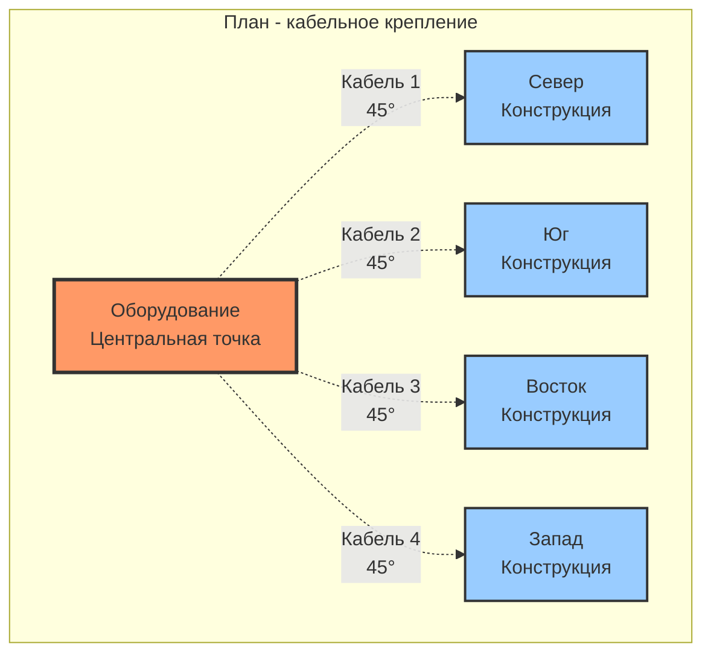
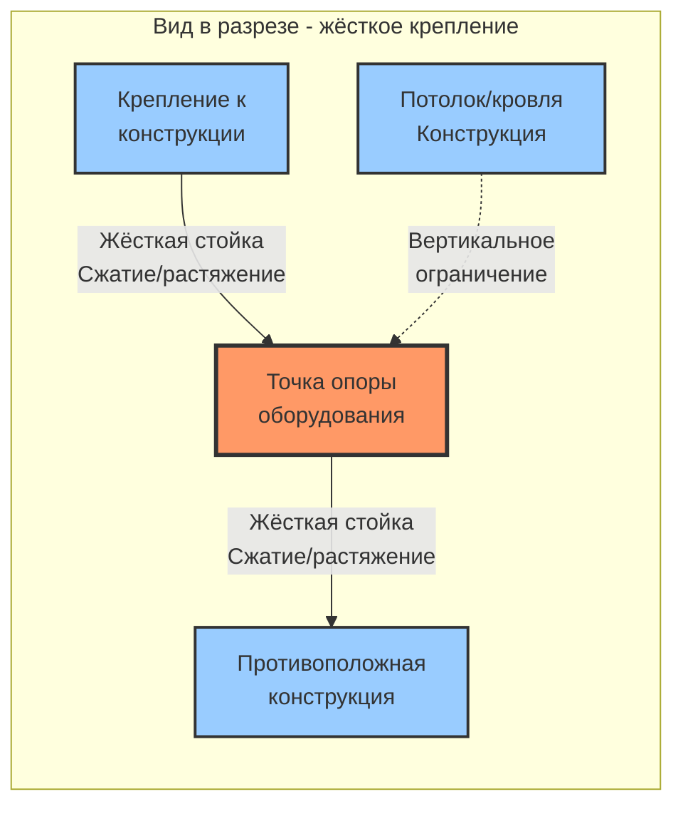
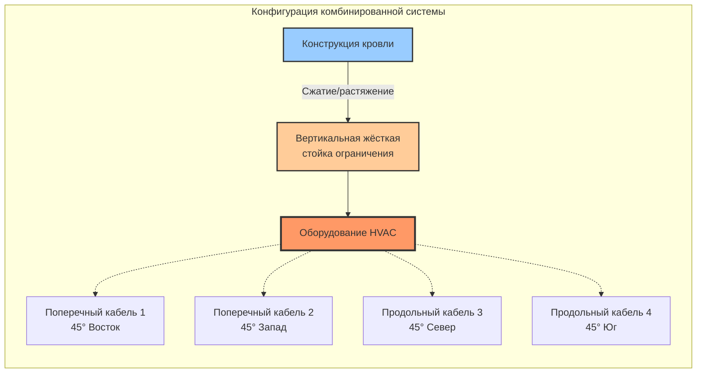

## Обзор

Системы сейсмического крепления защищают оборудование HVAC и компоненты распределительных сетей от сейсмических нагрузок, вызванных землетрясениями, посредством надлежащим образом спроектированных и установленных сборок ограничителей. Эти системы должны противостоять как горизонтальным (продольным и поперечным), так и вертикальным сейсмическим нагрузкам, сохраняя конструктивную целостность при воздействии колебаний грунта.

## Типы систем крепления

### Системы кабельного крепления

Кабельное крепление использует высокопрочный стальной трос или авиационный кабель для ограничения движения оборудования. Эта гибкая система крепления позволяет иметь место тепловому расширению, обеспечивая сейсмическую стойкость.

**Компоненты:**
- авиационный кабель 7×19 или 7×7 (минимальный диаметр 6,4 мм)
- опрессованные или механические кабельные фитинги, рассчитанные на полную прочность кабеля
- талрепы для регулировки натяжения
- зажимы на балки или анкеры в бетон в местах крепления к конструкции
- кронштейны крепления или зажимы оборудования

**Преимущества:**
- допускает тепловое движение
- лёгкий вес и менее навязчивый
- экономичен для типовых установок
- натяжение регулируется в полевых условиях

**Ограничения:**
- эффективен только при растяжении (требует диагональной ориентации)
- минимум 4 кабеля требуются на одну точку опоры (углы 45°)
- не подходит для вертикального сейсмического ограничения в одиночку
- может удлиняться под динамической нагрузкой

### Жёсткие системы крепления

Жёсткое крепление использует стальные стойки, швеллеры или уголки для обеспечения жёсткого ограничения сейсмических нагрузок. Эти системы обеспечивают превосходную производительность в зонах с высокой сейсмичностью.

**Системы стойких каналов:**
- стальные стойки-каналы (ASTM A1011 или A653)
- спроектированные фитинги и разъёмы
- анкеры в бетон или крепления на балки
- жёсткие соединения на интерфейсе оборудования

**Системы конструктивной стали:**
- уголковое железо или двутавровые профили
- сварные или болтовые соединения
- кронштейны крепления изготовленные по индивидуальному заказу
- приложения для тяжёлого оборудования

**Преимущества:**
- противостоит нагрузкам при сжатии и растяжении
- обеспечивает способность вертикального сейсмического ограничения
- минимальное отклонение под нагрузкой
- подходит для тяжёлого оборудования и высоких сейсмических требований

**Ограничения:**
- должен допускать тепловое расширение через гибкие муфты
- выше затраты на материалы и монтаж
- более сложный монтаж
- может требовать конструктивного анализа

### Гибридные системы

Комбинированное кабельное и жёсткое крепление использует преимущества обеих систем. Типовые конфигурации используют жёсткое крепление для вертикального ограничения и кабельное крепление для контроля поперечного движения.

## Расчёты сейсмических нагрузок

### Горизонтальная нагрузка

Горизонтальная сейсмическая нагрузка на оборудование рассчитывается согласно ASCE 7:

$$F_p = \frac{0,4 \cdot a_p \cdot S_{DS} \cdot W_p}{R_p / I_p} \left(1 + 2 \frac{z}{h}\right)$$

Где:
- $F_p$ = горизонтальная сейсмическая проектная нагрузка (кН)
- $a_p$ = коэффициент амплификации компонента (1,0–2,5)
- $S_{DS}$ = проектное спектральное ускорение отклика
- $W_p$ = рабочий вес компонента (кН)
- $R_p$ = коэффициент модификации отклика компонента (1,5–12)
- $I_p$ = коэффициент важности компонента (1,0–1,5)
- $z$ = высота точки крепления над уровнем земли
- $h$ = средняя высота кровли конструкции

**Предельные нагрузки:**

$$F_{p,max} = 1,6 \cdot S_{DS} \cdot I_p \cdot W_p$$

$$F_{p,min} = 0,3 \cdot S_{DS} \cdot I_p \cdot W_p$$

### Распределение нагрузки в крепёжных элементах

Для четырёхточечного крепления (продольные и поперечные пары):

$$F_{brace} = \frac{F_p}{2 \cos(\theta)}$$

Где $\theta$ = угол от горизонтали (обычно 45° для оптимальной эффективности)

**При ориентации 45°:**

$$F_{brace} = 0,707 \cdot F_p$$

### Вертикальная нагрузка

Вертикальная сейсмическая нагрузка для жёстко прикреплённого оборудования:

$$F_{pv} = 0,2 \cdot S_{DS} \cdot W_p$$

Эта нагрузка действует как вверх, так и вниз, требуя ограничения в обоих направлениях.

## Диаграммы конфигурации крепления

### Четырёхточечное кабельное крепление

### Система продольного и поперечного ограничения

### Сборка гибридного крепления

## Соображения при проектировании

### Руководящие принципы SMACNA

Стандарты SMACNA по сейсмическому ограничению содержат предписывающие требования:

**Крепление воздуховодов:**
- поперечное крепление: максимальный интервал 9,1 м (3,7 м для категории сейсмического проектирования D, E, F)
- продольное крепление: максимальный интервал 18,3 м (7,3 м для SDC D, E, F)
- минимум 4-точечное ограничение в каждой точке крепления
- угол крепления: 30–60° от горизонтали (45° предпочтительно)

**Крепление трубопроводов:**
- аналогичные требования по интервалу на основе диаметра трубы и сейсмической категории
- учёт веса жидкости в трубе
- обеспечение теплового расширения/сжатия

### Требования к монтажу

**Кабельные системы:**
1. Предварительное натяжение кабелей на 220–450 Н для устранения провиса
2. Использование наконечников кабеля для предотвращения повреждения проволоки на концах
3. Проверка зацепления талрепа (минимум 75% зацепления резьбы)
4. Установка защитных кожухов кабеля, где кабели пересекаются или доступны

**Жёсткие системы:**
1. Проверка ориентации элемента для осевой нагрузки
2. Использование резьбо-закрепляющего состава на регулируемых соединениях
3. Обеспечение теплового облегчения через изоляцию оборудования или компенсационные швы
4. Обеспечение полного контакта в местах соединения

**Крепления к конструкции:**
- анкеры в бетон: минимальное заглубление согласно отчётам оценки ICC-ES
- стальная конструкция: проверка пропускной способности элемента для сосредоточенных нагрузок
- зажимы на балку: позиционирование для предотвращения деформации полки
- проверка краевых расстояний и требований к интервалам

### Обеспечение качества

**Полевая проверка:**
- подтверждение углов креплений в пределах допусков проектирования (±5°)
- проверка значений крутящего момента анкеров и глубины заглубления
- проверка натяжения кабеля с помощью калиброванного манометра
- документирование условий как построенного с помощью фотографий

**Испытание под нагрузкой:**
- приложение испытательной нагрузки, равной 1,25 конструктивной нагрузки
- мониторинг отклонения и остаточной деформации
- проверка целостности соединения под нагрузкой
- выполнение циклической нагрузки для критического оборудования

## Соответствие нормам

### Требования ASCE 7

**Категории сейсмического проектирования:**
- SDC A, B: ограниченные требования, приемлемы предписывающие решения
- SDC C: необходимо базовое сейсмическое ограничение
- SDC D, E, F: обязательны спроектированные системы ограничения

**Важность компонента:**
- $I_p = 1,5$ для систем, критичных для безопасности жизни (дымоудаление, пожарные насосы)
- $I_p = 1,0$ для стандартного оборудования HVAC

### Уполномоченный орган

Требования специальной инспекции варьируются в зависимости от юрисдикции:
- надзор конструкции во время монтажа
- протоколы испытаний и документации
- сертификация установщиков для сейсмического крепления
- процедуры окончательного одобрения

## Заключение

Надлежащий выбор и монтаж системы сейсмического крепления критичны для сейсмической стойкости. Кабельное крепление обеспечивает экономичное ограничение для типовых приложений, в то время как жёсткие системы крепления обеспечивают превосходную производительность в зонах с высокой сейсмичностью или для тяжёлого оборудования. Гибридные подходы оптимизируют производительность и затраты. Все системы должны соответствовать расчётам сейсмических нагрузок ASCE 7 и стандартам монтажа SMACNA для обеспечения защиты жизни и операционной непрерывности во время сейсмических событий.
