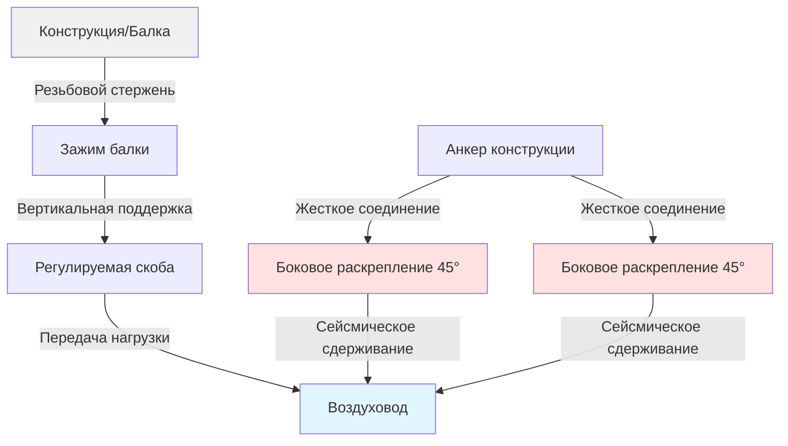
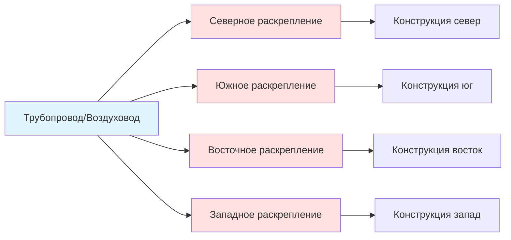
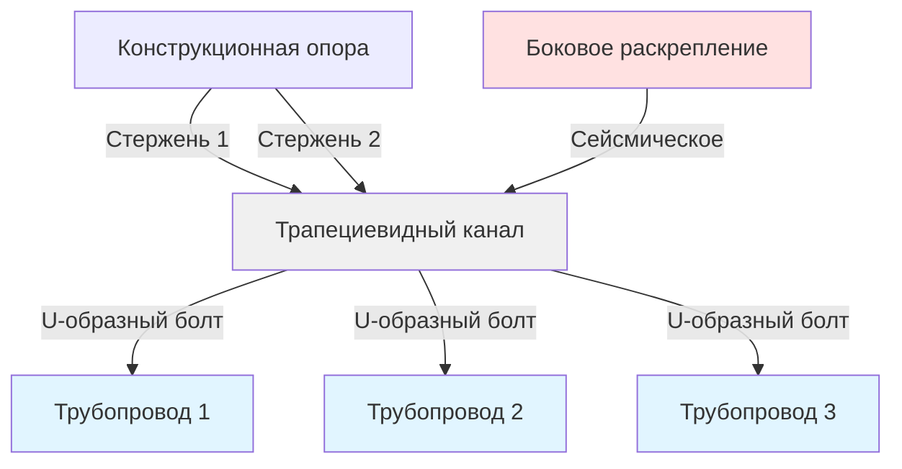

## Обзор

Надлежащее проектирование и установка опор воздуховодов и трубопроводов являются критическими компонентами систем сейсмического сдерживания. Системы опор должны сопротивляться как силам гравитации, так и сейсмическим силам, сохраняя при этом структурную целостность во время сейсмических колебаний. Стандарты SMACNA и MSS предоставляют предписывающие методы расчета расстояний между опорами, определения размеров стержней и требований к анкеровке.

## Требования к расстояниям между опорами

### Расстояния между опорами воздуховодов

Максимальное расстояние между опорами варьируется в зависимости от размера воздуховода и категории сейсмического проектирования. Рекомендации SMACNA устанавливают пределы расстояний на основе массы воздуховода и сейсмических сил.

**Стандартное расстояние между опорами для прямоугольного воздуховода:**

| Размер воздуховода (см) | Максимальное расстояние (м) | Сейсмическая категория SDC D-F (м) |
|-------------------|------------------------|------------------------|
| ≤ 61 шириной | 3,66 | 3,05 |
| 64-152 шириной | 3,05 | 2,44 |
| 155-244 шириной | 2,44 | 1,83 |
| > 244 шириной | 1,83 | 1,52 |

**Расстояния между опорами круглого воздуховода:**

$$
L_{max} = \min\left(3.66, \frac{610}{d}\right) \text{ м}
$$

где $d$ — диаметр воздуховода в сантиметрах. Для сейсмических приложений в категории SDC D-F уменьшите расстояние на 20%.

### Расстояния между опорами трубопроводов

MSS SP-58 устанавливает максимальные пролеты для трубопроводов на основе материала, размера и условий эксплуатации.

**Максимальное расстояние между опорами стальных труб (водоснабжение):**

$$
L_{max} = K \cdot d^{0.5}
$$

где:
- $L_{max}$ = максимальный пролет (м)
- $K$ = коэффициент опоры (3,05 для стали, 2,44 для меди)
- $d$ = номинальный диаметр трубы (см)

Для сейсмических зон уменьшите расстояние на 25%, если диаметр трубы превышает 10 см.

## Типы подвесов и применение

### Системы вертикальной поддержки

**Регулируемые скобы-ушки** обеспечивают вертикальную поддержку с ограниченным боковым сдерживанием. Используются как для воздуховодов, так и для трубопроводов, когда первичной задачей является передача вертикальной нагрузки.

**Зажимы стояков** поддерживают вертикальные участки на каждом пересечении перекрытия. Требуемое расстояние:

$$
L_{riser} = 4,57 \text{ м (максимум)}
$$

Для сейсмических приложений предусмотрите дополнительные промежуточные опоры для стояков, превышающих 6,10 м.

**Трапециевидные подвесы** распределяют нагрузки на несколько опор. Минимальный размер стержня на основе воспринимаемой нагрузки:

$$
A_{rod} = \frac{W \cdot SF}{F_{allow}}
$$

где:
- $A_{rod}$ = площадь поперечного сечения стержня (см²)
- $W$ = общая поддерживаемая масса (кг)
- $SF$ = коэффициент безопасности (минимум 2,0)
- $F_{allow}$ = допустимое напряжение стержня (158,6 МПа для ASTM A36)

### Системы бокового сдерживания

**Жесткое раскрепление** сопротивляется боковым силам благодаря осевому сжатию и растяжению в жестких элементах. Расчет угла:

$$
\theta = \arctan\left(\frac{h}{L_{brace}}\right)
$$

где $\theta$ должна быть от 30° до 60° для оптимальной эффективности.

**Четырехнаправленное раскрепление** обеспечивает сдерживание во всех направлениях на расстояниях не превышающих:

$$
L_{4way} = \min(12.2 \text{ м}, 4 \times L_{support})
$$

## Расчеты размеров стержней

### Определение размера при гравитационных нагрузках

Минимальный диаметр подвесного стержня при гравитационных нагрузках:

$$
d_{min} = \sqrt{\frac{4W \cdot SF}{\pi \cdot F_{allow}}}
$$

**Стандартные грузоподъемности стержней (ASTM A36):**

| Диаметр стержня | Безопасная рабочая нагрузка (кг) | Предельная нагрузка (кг) |
|--------------|------------------------|-------------------|
| 9,5 мм | 249 | 997 |
| 12,7 мм | 454 | 1816 |
| 15,9 мм | 726 | 2903 |
| 19,1 мм | 1043 | 4171 |
| 22,2 мм | 1406 | 5625 |

### Определение размера при сейсмических нагрузках

Комбинированная гравитационная и сейсмическая нагрузка:

$$
F_{combined} = \sqrt{(W)^2 + (F_{seismic})^2}
$$

где сейсмическая сила:

$$
F_{seismic} = 0.4 \cdot S_{DS} \cdot W \cdot \frac{I_p}{R_p}
$$

Параметры:
- $S_{DS}$ = спектральное ускорение проектирования
- $I_p$ = коэффициент важности компонента (от 1,0 до 1,5)
- $R_p$ = коэффициент модификации отклика компонента (2,5 для жесткого, 6,0 для гибкого)

## Требования к анкеровке

### Анкеровка в бетоне

**Постоянно устанавливаемые анкеры** должны соответствовать критериям оценки ICC-ES. Минимальная глубина заделки:

$$
h_{ef} = \max\left(4d_a, 6,35 \text{ см}\right)
$$

где $d_a$ — диаметр анкера.

**Требования к расстоянию от края:**

$$
c_{min} = \max\left(4h_{ef}, 30,5 \text{ см}\right)
$$

### Анкеровка в стали

**Зажимы балок** передают нагрузки на конструкционную сталь без сверления. Грузоподъемность зависит от толщины полки и конструкции зажима.

**Сварные соединения** требуют проверки марки конструкционной стали. Определение размера сварки:

$$
L_{weld} = \frac{F_{applied}}{6.40 \cdot F_{allow} \cdot t_{weld}}
$$

где $t_{weld}$ — эффективная толщина горла сварки.

## Диаграммы Mermaid

### Типичная конфигурация опоры воздуховода

### Система четырехнаправленного раскрепления

### Деталь трапециевидного подвеса

## Рекомендации по установке

**Требования к проверке на месте:**
- Подтвердите несущую способность конструкции перед установкой
- Проверьте заделку анкера и расстояния от края
- Проверьте зацепление резьбы стержня (минимум 1,5 раза диаметр)
- Убедитесь, что боковые раскрепления достигают углов 30-60°
- Подтвердите зазор для теплового расширения

**Проверки контроля качества:**
- Спецификации крутящего момента для анкерных болтов и соединений
- Правильные шайбы и стопорные гайки на резьбовых стержнях
- Правильная ориентация и выравнивание подвесов
- Адекватный зазор от электрических систем
- Документирование выполненных условий

## Соответствие нормативам

Системы опор должны соответствовать:
- **Руководству по сейсмическому сдерживанию SMACNA** (последняя редакция)
- **MSS SP-58** Подвесы и опоры трубопроводов
- **ASCE 7** Минимальные проектные нагрузки и связанные критерии
- **IBC Глава 16** Конструктивное проектирование
- **Местные поправки**, специфичные для юрисдикции

Регулярная проверка и техническое обслуживание обеспечивают продолжительную работоспособность в течение всего периода эксплуатации здания.

## Заключение

Надлежащее проектирование и установка опор являются основополагающими для сейсмической устойчивости систем HVAC. Соответствие стандартам SMACNA и MSS, правильное определение размера стержней, надлежащие расстояния между опорами и достаточная анкеровка обеспечивают, чтобы системы выдерживали как эксплуатационные, так и сейсмические нагрузки. Инженерные расчеты должны учитывать комбинированные условия нагружения с адекватными коэффициентами безопасности.
