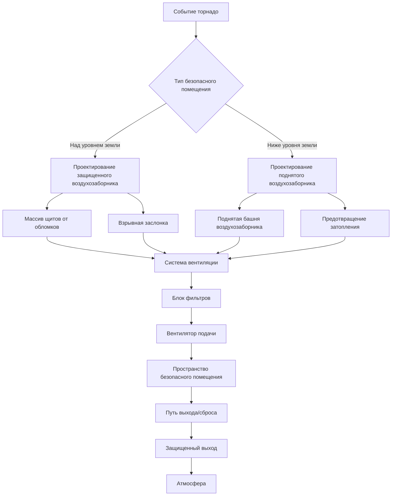
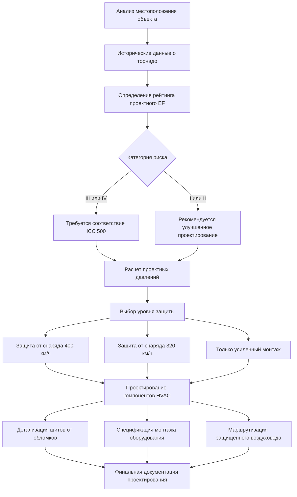

## Обзор

Дизайн HVAC, устойчивый к торнадо, решает уникальные проблемы, создаваемые экстремальными ветровыми событиями, характеризующимися интенсивными вращательными ветрами, быстрыми изменениями давления и обломками с высокой скоростью. Системы, обслуживающие безопасные помещения от торнадо и критические объекты, должны поддерживать пригодность помещений во время и сразу после прохождения торнадо, одновременно защищая людей от ветровых сил, дифференциального давления и проникновения снарядов.

Расширенная шкала Fujita (EF) классифицирует торнадо на основе расчетных скоростей ветра и наблюдаемых повреждений. Оборудование HVAC и защитные системы должны быть спроектированы с учетом соответствующего рейтинга EF на основе категории риска объекта и классификации занятости.

## Расширенная шкала Fujita и критерии проектирования

### Классификация по шкале EF

| Рейтинг EF | Скорость ветра (км/ч) | Давление проектирования (кПа) | Последствия для HVAC |
|-----------|----------------------|-------------------------------|----------------------|
| EF0 | 105-137 | 72-120 | Стандартный монтаж оборудования достаточен |
| EF1 | 138-177 | 124-206 | Усиленный монтаж, защищенные воздухозаборники |
| EF2 | 179-217 | 210-312 | Жалюзи, устойчивые к ударам, армированные воздуховоды |
| EF3 | 219-266 | 316-465 | Положения безопасного помещения, щиты от обломков |
| EF4 | 267-322 | 469-684 | Закаленное оборудование, подземная прокладка |
| EF5 | >322 | >689 | Максимальная защита, резервные системы |

### Расчет проектного ветрового давления

Проектное ветровое давление для строительства, устойчивого к торнадо, следует:

$$P_d = 0.00256 \cdot K_z \cdot K_{zt} \cdot K_d \cdot V^2 \cdot I$$

Где:
- $P_d$ = проектное ветровое давление (кПа)
- $K_z$ = коэффициент экспозиции скорости давления
- $K_{zt}$ = топографический коэффициент
- $K_d$ = коэффициент направленности
- $V$ = базовая скорость ветра (км/ч)
- $I$ = коэффициент важности

Для проектирования убежища от торнадо согласно ICC 500 эффективная скорость ветра:

$$V_{eff} = V_{tornado} \cdot \sqrt{\frac{3}{t}}$$

Где $t$ — длительность воздействия в секундах (обычно 3 секунды для пиковых порывов).

## Рассмотрение дифференциального давления

### Анализ быстрого снижения давления

Торнадо создают экстремальные дифференциалы давления при прохождении низкопрессионного ядра над конструкциями. Разница давления на оболочке здания:

$$\Delta P = \frac{\rho V^2}{2} \cdot C_p$$

Где:
- $\Delta P$ = дифференциальное давление (кПа)
- $\rho$ = плотность воздуха (1.2 кг/м³ при стандартных условиях)
- $V$ = скорость ветра торнадо (м/с)
- $C_p$ = коэффициент давления (обычно -2.0 до +1.0)

Для торнадо EF4 со скоростью ветра 290 км/ч (80.6 м/с):

$$\Delta P = \frac{1.2 \cdot (80.6)^2}{2} \cdot 2.0 = 7774 \text{ Па} \approx 7.8 \text{ кПа}$$

### Системы выравнивания давления

Безопасные помещения требуют механизмов сброса давления для предотвращения структурного отказа:

$$Q_{relief} = C_d \cdot A \cdot \sqrt{\frac{2 \cdot \Delta P}{\rho}}$$

Где:
- $Q_{relief}$ = воздушный поток сброса (м³/ч)
- $C_d$ = коэффициент расхода (0.6-0.8)
- $A$ = площадь отверстия сброса (м²)
- $\Delta P$ = проектное дифференциальное давление (кПа)

## Требования ICC 500 и FEMA P-361

### Стандарты HVAC для безопасных помещений

ICC 500 (стандарт строительства убежищ от штормов) и FEMA P-361 (безопасные помещения от торнадо и ураганов) устанавливают минимальные требования:

**Требования вентиляции:**
- Минимум 8.5 м³/ч на одного человека для укрытий, рассчитанных на менее 24 часов
- Минимум 25.5 м³/ч на одного человека для расширенного пребывания (более 24 часов)
- Приемлемы естественная или механическая вентиляция, если они устойчивы к воздействию обломков

**Структурная защита:**
- Воздухозаборники и выходы должны выдерживать удар бревна 7 кг сечением 5x10 см при скорости ветра 160 км/ч (EF3-EF5)
- Жалюзи и решетки рассчитаны на скорость ветра 400 км/ч
- Проникновения воздуховодов герметизированы материалами, устойчивыми к обломкам

### Защита от воздействия обломков

Критерий снаряда из дерева весом 7 кг при скорости 400 км/ч:

$$E_{impact} = \frac{1}{2} m v^2 = \frac{1}{2} \cdot 3.18 \cdot (111.1)^2 = 19,619 \text{ Дж}$$

Стратегии защиты включают:
- Стальные жалюзи пластины (минимум 2 мм толщины)
- Армированные бетонные конструкции воздухозаборника
- Жертвенные экраны обломков с аварийным байпасом
- Подземные скважины воздухозаборника с горизонтальным входом

## Проектирование HVAC для безопасного помещения

### Конфигурация системы вентиляции

```mermaid
flowchart LR
    A[Защищенный внешний<br/>воздухозаборник] --> B[Экран обломков<br/>сетка из стали 2 мм]
    B --> C[Взрывная/торнадо заслонка<br/>автоматическое закрытие]
    C --> D[Переход воздуховода<br/>армированный бетон]
    D --> E[Предварительный фильтр<br/>MERV 8]
    E --> F[Вентилятор подачи<br/>резервное электроснабжение]
    F --> G[Фильтр HEPA<br/>опционально]
    G --> H[Распределение<br/>безопасного помещения]
    H --> I[Решетки низкого<br/>выхода]
    I --> J[Заслонка сброса<br/>давления]
    J --> K[Защищенный путь<br/>выхода]

    style A fill:#ff9999
    style C fill:#ffcc99
    style F fill:#99ccff
    style H fill:#99ff99
```

### Спецификации оборудования

**Сборка защищенного воздухозаборника:**
- Железобетонная конструкция с усилением стали (стены минимум 15 см)
- Ориентация с горизонтальным входом для минимизации прямого воздействия
- Несколько экранов обломков в серии
- Автоматические заслонки закрытия (отказоустойчиво закрытые)

**Оборудование вентиляции:**
- Вентиляторы, рассчитанные на непрерывную работу во время пребывания в укрытии
- Подключение резервного электроснабжения (генератор или аккумулятор)
- Монтаж, изолированный от вибраций для предотвращения структурной связи
- Доступные сервисные панели для аварийного обслуживания

**Требования к воздуховодам:**
- Сварной стальной воздуховод в открытых зонах (минимум 1.6 мм толщины)
- Воздуховод, заключенный в бетон при проникновении через стены укрытия
- Гибкие соединения только в защищенных пространствах
- Все стыки герметизированы для устойчивости к давлению

## Процесс и критерии проектирования

### Оценка опасности торнадо

### Критические параметры проектирования

1. **Длительность пребывания:** Определяет требования к скорости вентиляции (8.5-25.5 м³/ч на человека)

2. **Местоположение укрытия:** Над землей vs. ниже земли влияет на проектирование воздухозаборника и потребности в защите от затопления

3. **Доступность электроэнергии:** Расчеты размера резервного генератора и длительность батареи

4. **Интеграция со структурой:** Координация со строительным инженером для проникновения воздуховодов и монтажа оборудования

5. **Доступ для обслуживания:** Аварийный ремонт при расширенном пребывании в укрытии

### Размер клапана сброса давления

Для безопасного помещения площадью 46 м² с 20 людьми и дифференциалом давления 21 кПа:

$$A_{relief} = \frac{Q}{ C_d \cdot 60 \cdot \sqrt{\frac{2 \cdot \Delta P}{\rho}}}$$

$$A_{relief} = \frac{8.5}{ 0.7 \cdot 60 \cdot \sqrt{\frac{2 \cdot 21}{1.2}}} = 0.016 \text{ м}^2 = 155 \text{ см}^2$$

## Стратегии защиты оборудования

### Уязвимость оборудования на крыше

Стандартные кровельные блоки HVAC чрезвычайно уязвимы к повреждениям от торнадо. Варианты защиты:

**Для событий EF0-EF2:**
- Усиленный монтаж с адаптерами основания, рассчитанными на сейсмические нагрузки
- Экраны оборудования, рассчитанные на ветер
- Кабели крепления к структурным элементам

**Для событий EF3-EF5:**
- Перемещение оборудования во внутренние механические помещения
- Подземные хранилища оборудования
- Жертвенные внешние блоки с защищенными резервными системами

### Детали защиты воздухозаборника и выхода

**Проектирование экрана обломков:**
- Интервал между стержнями: 10-15 см для сброса давления при блокировке больших обломков
- Материал: ASTM A36 сталь, стержни диаметром минимум 1.3 см
- Ориентация: под углом 45° для отклонения ударных сил
- Резервность: несколько слоев экрана с интервалом 30 см

**Интеграция взрывной заслонки:**
- Автоматическое закрытие при обнаружении скачка давления
- Ручное управление из внутри укрытия
- Отказоустойчиво закрыта при отключении электроэнергии
- Рассчитана на удержание дифференциала 70 кПа

## Операционные соображения

### Процедуры перед штормом

1. **Проверка системы:** Тестирование автоматического закрытия заслонки и резервного электроснабжения
2. **Проверка фильтра:** Замена загруженных фильтров для максимизации работы после события
3. **Резервное электроснабжение:** Проверка топлива генератора и уровня заряда аккумулятора
4. **Очистка обломков:** Удаление потенциальных снарядов около отверстий воздухозаборника/выхода

### Оценка после шторма

После прохождения торнадо:

- Проверить щиты от обломков на повреждения и блокировку
- Проверить целостность воздуховодов, особенно на проникновениях в здание
- Проверить монтаж оборудования и структурные соединения
- Протестировать систему вентиляции перед повторным занятием

## Интеграция с управлением чрезвычайными ситуациями

Системы HVAC, устойчивые к торнадо, должны координироваться с аварийными операциями объекта:

- Автоматическое нагнетание давления в укрытии при предупреждении о торнадо
- Интеграция с системами массового оповещения
- Мониторинг в реальном времени условий в безопасном помещении (температура, CO₂, давление)
- Возможность связи между людьми в укрытии и управлением чрезвычайными ситуациями

## Анализ затрат и выгод

Затраты на защиту от торнадо значительно различаются в зависимости от подхода к проектированию:

| Уровень защиты | Надбавка к стоимости | Обоснование для объектов |
|-----------------|---------------------|--------------------------|
| Усиленный монтаж | 5-10% | Все объекты в регионах, подверженных торнадо |
| Безопасное помещение EF3 | 15-25% | Школы, больницы, аварийные операции |
| Закаленное укрытие EF5 | 40-60% | Критическая инфраструктура, высокой занятости |

Дополнительная стоимость проектирования HVAC, устойчивого к торнадо, при новом строительстве существенно ниже, чем при модернизации, делая раннее рассмотрение существенным для объектов в зонах высокого риска.

## Заключение

Дизайн HVAC, устойчивый к торнадо, требует комплексного понимания экстремальной ветровой динамики, дифференциалов давления и механики воздействия обломков. Соответствие стандартам ICC 500 и FEMA P-361 обеспечивает, что системы вентиляции безопасных помещений обеспечивают надежную защиту во время событий торнадо. Интеграция структурного упрочнения, устойчивости к воздействию обломков и механизмов сброса давления создает устойчивые системы, способные поддерживать пригодность помещений даже при самых суровых атмосферных условиях.

Успешная реализация требует тесной координации между механическими, структурными дисциплинами и управлением чрезвычайными ситуациями для создания поистине эффективных систем защиты жизни в регионах, подверженных торнадо.
