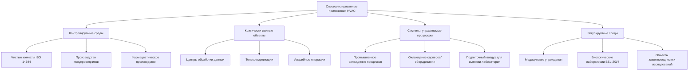

# Специализированные приложения HVAC

Специализированные приложения HVAC представляют инженерные решения для сред, требующих точного управления, выходящего за рамки стандартного комфортного охлаждения. Эти системы решают уникальные проблемы стабильности температуры, контроля влажности, предотвращения загрязнения, создания избыточного давления и избыточности для поддержки критических операций, где отказ системы имеет серьёзные последствия.

## Основные категории специализированных приложений

Специализированные системы HVAC обслуживают различные операционные требования в нескольких секторах:

## Уникальные требования к проектированию

### Контроль загрязнения

Чистые комнаты и объекты фармацевтического производства требуют ограничений концентрации частиц, намного превышающих типичные строительные среды. Чистые комнаты ISO класса 5 требуют ≤3 520 частиц ≥0,5 мкм на кубический метр, что требует фильтрации HEPA или ULPA с конечными фильтрами, достигающими эффективности 99,97% до 99,9995%. Схемы воздушного потока используют однонаправленный (ламинарный) поток на уровне 0,3–0,5 м/с для критических зон, с частотой смены воздуха, достигающей 300–600 ACH в пространствах ISO класса 5 по сравнению с 6–8 ACH в коммерческих зданиях.

Каскады создания избыточного давления поддерживают барьеры загрязнения путём контроля дифференциального давления. Положительное давление защищает целостность продукта в производственных люках, в то время как отрицательное давление содержит опасные материалы в биолабораториях. Дифференциалы давления 5–12 Па между смежными пространствами требуют точной балансировки подачи-вытяжки и специальных систем мониторинга давления в соответствии со стандартом ASHRAE 170.

### Управление тепловой нагрузкой

Центры обработки данных представляют экстремальную чувствительную плотность тепла от ИТ-оборудования. Современные высокоплотные серверные стойки генерируют 10–30 кВт на стойку, с плотностью мощности, достигающей 3 230–5 380 Вт/м² в гипермасштабных объектах. Традиционные подходы охлаждения с использованием охладителей воздуха в компьютерном помещении (CRAC) с распределением под полом уступают место внутристеллажному охлаждению, теплообменникам на задней двери и прямому жидкостному охлаждению для нагрузок, превышающих 15 кВт/стойку.

Соотношение чувствительного тепла (SHR) в центрах обработки данных приближается к 0,95–1,0, требуя систем, оптимизированных для чувствительного охлаждения, а не осушения. Рекомендации по тепловым рекомендациям ASHRAE TC 9.9 предусматривают температуру на входе 18–27°C с допустимыми диапазонами до 15–32°C, обеспечивая экономайзерную работу и сокращённые часы механического охлаждения.

### Динамика вентиляции лаборатории

Исследовательские лаборатории требуют систем со 100% наружным воздухом без рециркуляции из-за вытяжных шкафов для химических веществ, шкафов биологической безопасности и обращения с опасными материалами. Скорость лица вытяжного шкафа 0,4–0,5 м/с в соответствии с ANSI Z9.5 создаёт переменные требования к вытяжке при открытии и закрытии створок. Системы постоянного объёма теряют энергию, поддерживая максимальную вытяжку непрерывно, в то время как системы переменного объёма воздуха (VAV) с не зависящими от давления элементами управления снижают энергопотребление на 40–60% путём отслеживания воздушного потока.

### Требования, специфичные для здравоохранения

Медицинские учреждения следуют строгим требованиям вентиляции в соответствии со стандартом ASHRAE 170 и руководящими принципами FGI по проектированию и строительству больниц. Операционные требуют минимум 20 ACH с 4 ACH наружного воздуха, положительного давления относительно коридоров и фильтрации HEPA для ортопедических и трансплантационных операций. И наоборот, палаты изоляции от инфекции, передаваемой по воздуху (AII), поддерживают отрицательное давление с минимум 12 ACH и вытяжным воздухом, выбрасываемым наружу или через фильтрацию HEPA.

## Матрица сравнения приложений

| Тип приложения | Диапазон ACH | Фильтрация | Контроль давления | Допуск температуры | Контроль влажности | Уровень избыточности |
|---|---|---|---|---|---|---|
| Чистая комната ISO 5 | 300–600 | HEPA 99,97% | +5–12 Па | ±0,5°C | ±2% ОВ | N+1 минимум |
| Центр обработки данных | 20–40 | MERV 13–14 | Нейтраль/небольшой + | ±2°C допустимо | 40–60% ОВ | 2N для уровня IV |
| Лаборатория BSL-3 | 12–15 | Вытяжка HEPA | минимум -12 Па | ±2°C | 30–60% ОВ | N+1 с резервной копией |
| Операционная | 20–25 | HEPA опционально | +5–12 Па | ±2°C | 20–60% ОВ | Резервное питание |
| Фармацевтическое производство | 20–60 | Конечный HEPA | Каскадные зоны | ±1°C | ±5% ОВ | N+1 минимум |
| Виварий | 15–20 | Подача/вытяжка HEPA | Отрицательный (помещения для животных) | ±1°C | 30–70% ОВ | N+1 рекомендуется |

## Критические элементы конструкции системы

**Архитектура избыточности**: Критически важные приложения используют конфигурации N+1 (одно резервное устройство) или 2N (полностью резервные системы). Стандарты центров обработки данных уровня III требуют N+1 для всех компонентов с одновременным обслуживанием, в то время как уровень IV требует архитектуры 2N с отказоустойчивостью при обслуживании или отказе компонента.

**Сложность системы управления**: Специализированные приложения используют системы прямого цифрового управления (DDC) с детальным мониторингом температуры, влажности, дифференциалов давления, воздушного потока и перепадов давления на фильтре. Критические параметры запускают сигналы тревоги с шагом 0,1°C или отклонениях давления 1 Па, с записью данных для протоколов валидации и соответствия нормативным требованиям.

**Ограничения рекуперации энергии**: Хотя вентиляторы рекуперации энергии (ERV) достигают 60–80% чувствительной эффективности в коммерческих приложениях, требования к контролю загрязнения ограничивают их использование. Перекрёстное загрязнение через утечку или перенос в роторных колёсах исключает ERV из фармацевтических и биозащитных приложений. Системы лабораторий используют циркуляционные контуры с отдельными катушками или пластинчатыми теплообменниками, поддерживающими полное разделение воздушных потоков.

**Валидация и пусконаладка**: Специализированные системы подвергаются обширному функциональному тестированию производительности за пределами стандартной пусконаладки. Чистые комнаты требуют испытаний подсчёта частиц в соответствии с ISO 14644-3, визуализации воздушного потока с использованием дымовых исследований и испытаний на утечку фильтра с использованием аэрозолей DOP или PAO. Медицинские учреждения проходят испытания давления в помещении в соответствии с ASHRAE 170, а центры обработки данных проверяют мощность охлаждения в условиях имитируемых ИТ-нагрузок.

## Применимые стандарты и рекомендации

- **ASHRAE Standard 170**: Вентиляция медицинских учреждений
- **ISO 14644**: Чистые комнаты и связанные с ними контролируемые среды
- **ANSI/ISA-S71.04**: Условия окружающей среды для систем измерения и управления процессами
- **ASHRAE TC 9.9**: Тепловые рекомендации для центров обработки данных
- **ANSI Z9.5**: Стандарт вентиляции лаборатории
- **USP <797>**: Фармацевтическое смешивание—стерильные препараты
- **TIA-942**: Стандарт инфраструктуры телекоммуникаций для центров обработки данных

## Будущая траектория

Специализированные приложения HVAC всё чаще включают профилактическое обслуживание с использованием алгоритмов машинного обучения, анализирующих тенденции производительности оборудования. Внедрение жидкостного охлаждения ускоряется, поскольку ИИ и высокопроизводительные вычисления выталкивают плотность стоек за пределы 50 кВт. Модульное строительство чистых комнат сокращает время установки на 30–40% по сравнению с построенными системами, при этом поддерживая производительность контроля загрязнения благодаря предварительно изготовленным модулям потолочной сетки-фильтра-вентилятора.

Конвергенция датчиков IoT, облачной аналитики и моделирования цифровых двойников позволяет оптимизировать в реальном времени сложные специализированные системы, балансируя операционные требования против энергопотребления в средах, где производительность исторически превосходила соображения энергоэффективности.
