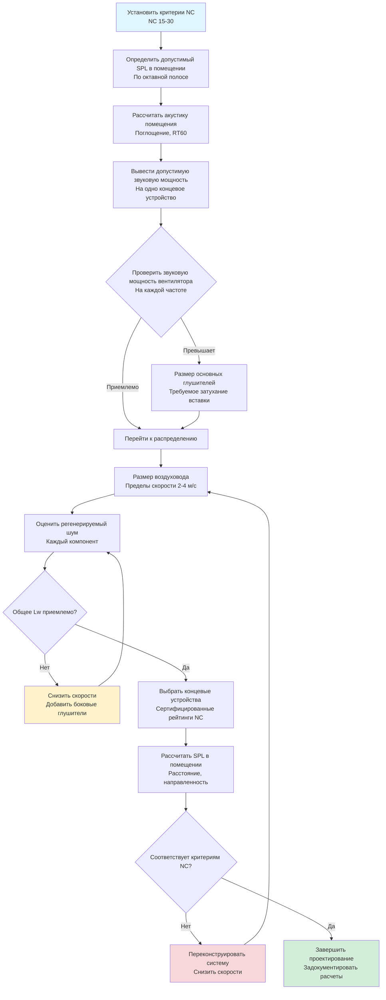

## Обзор

Системы распределения воздуха генерируют шум через два фундаментальных механизма: передаточный шум от механического оборудования и регенерируемый шум, производимый турбулентностью воздушного потока внутри самой системы распределения. В помещениях общественного назначения, требующих производительности NC 15-25, регенерируемый шум часто доминирует в акустической сигнатуре после того, как шум, генерируемый вентилятором, затухает через глушители и виброизоляцию.

Физика, регулирующая регенерируемый шум, включает взаимодействия турбулентного пограничного слоя, срыв вихрей на геометрических разрывах и отделение потока на препятствиях. Эти явления преобразуют кинетическую энергию в воздушном потоке в акустическую энергию во всем широком частотном спектре, с пиковой генерацией, как правило, в октавных полосах 500-2000 Гц, где слух человека наиболее чувствителен.

## Основы регенерируемого шума

### Механизмы генерации звуковой мощности

Регенерируемый шум возникает из четырех основных источников в системах распределения воздуха:

**1. Шум турбулентного пограничного слоя**

Поток воздуха вдоль стенок воздуховода создает турбулентный пограничный слой с флуктуациями скорости, которые излучают звук. Уровень звуковой мощности увеличивается с шестой степенью скорости:

$$L_w = K_1 + 60\log_{10}(V) + 10\log_{10}(A)$$

Где:
- $L_w$ = уровень звуковой мощности (дБ относительно $10^{-12}$ Вт)
- $K_1$ = эмпирическая константа (зависит от шероховатости и геометрии воздуховода)
- $V$ = скорость воздуха (м/с)
- $A$ = площадь поверхности воздуховода (м²)

Эта зависимость объясняет, почему удвоение скорости воздуха увеличивает звуковую мощность примерно на 18 дБ, что делает снижение скорости наиболее эффективной стратегией контроля шума.

**2. Срыв вихрей на препятствиях**

Поток мимо лопаток демпфера, поворотных лопаток и переходов воздуховода генерирует периодический срыв вихрей на частотах, определяемых следующим:

$$f_s = \frac{St \cdot V}{D}$$

Где:
- $f_s$ = частота срыва вихрей (Гц)
- $St$ = число Струхала (обычно 0,2-0,3 для тупых тел)
- $V$ = скорость потока (м/с)
- $D$ = характерный размер (м)

Когда частоты срыва совпадают с акустическими резонансами воздуховода, происходит усиление тонального шума, создающее возражаемые компоненты чистого тона.

**3. Шум отделения потока**

Абrupt изменения площади, острые отводы и плохо спроектированные переходы вызывают отделение потока со связанной генерацией широкополосного шума:

$$L_w = K_2 + 50\log_{10}(V) + 10\log_{10}(Q) + C_f$$

Где:
- $K_2$ = базовая константа для типа монтажа
- $Q$ = объемный расход (м³/ч)
- $C_f$ = коэффициент коррекции для геометрии (0-15 дБ)

**4. Шум, генерируемый концевым устройством**

Диффузоры и решетки генерируют шум при расширении высокоскоростной струи в пространство помещения. Производители предоставляют данные звуковой мощности как функцию расхода и скорости выпуска.

### Процесс проектирования акустики

## Акустическая производительность концевых устройств

### Предсказание звуковой мощности диффузора

Производители концевых устройств предоставляют данные о звуковой мощности на основе стандартизированного тестирования согласно AHRI Standard 885. Общая зависимость имеет следующий вид:

$$L_w = L_{w,ref} + 10n\log_{10}\left(\frac{Q}{Q_{ref}}\right)$$

Где:
- $L_{w,ref}$ = эталонная звуковая мощность при эталонном потоке
- $n$ = показатель степени (обычно 5-6 для диффузоров)
- $Q$ = фактический объемный расход
- $Q_{ref}$ = эталонный расход (обычно 28,3 м³/ч)

### Сравнение концевых устройств

| Тип устройства | Типичный рейтинг NC @ 28,3 м³/ч | Макс. скорость (м/с) | Применения | Преимущества | Ограничения |
|-------------|----------------------------|-------------------|--------------|------------|-------------|
| Линейные щелевые диффузоры | NC 20-25 | 1,5 | Концертные залы, театры | Низкий профиль, архитектурная интеграция | Требует низкого статического давления |
| Диффузоры с перфорированной лицевой частью | NC 25-30 | 2,0 | Лекционные залы, аудитории | Хорошая дальность, умеренная стоимость | Требуется большая лицевая площадь |
| Концевые устройства вытеснения | NC 15-20 | 1,0 | Театры с высокими потолками | Превосходная акустическая производительность | Требование по высоте >3,7 м |
| Радиальные диффузоры | NC 25-30 | 1,75 | Общие помещения общественного назначения | Картина распределения 360° | Умеренная генерация шума |
| Системы тканевых воздуховодов | NC 20-25 | 1,25 | Многофункциональные залы | Равномерное распределение, очищаемые | Требуется индивидуальное изготовление |
| Сопловые диффузоры | NC 30-35 | 3,0 | Большие помещения (>6 м потолок) | Возможность длинного броска | Более высокий шум у источника |

### Методология выбора

**Шаг 1: Определить требуемый воздушный поток**

Рассчитать чувствительное и скрытое охлаждающие нагрузки, затем вывести требуемый подающий воздушный поток:

$$Q = \frac{Q_s}{1,2 \times \Delta T}$$

Где:
- $Q$ = подающий воздушный поток (м³/ч)
- $Q_s$ = чувствительная охлаждающая нагрузка (кДж/ч)
- $\Delta T$ = разность температур подающий воздух-помещение (°C)

**Шаг 2: Установить допустимую звуковую мощность**

Работая в обратном направлении от критериев NC, определить максимальную допустимую звуковую мощность на один диффузор. Для $N$ идентичных диффузоров:

$$L_{w,max} = L_{p,target} - 10\log_{10}\left(\frac{Q_{total}}{4\pi r^2}\right) - 10\log_{10}\left(\frac{4}{R}\right) + 10\log_{10}(N)$$

Где:
- $L_{p,target}$ = целевой уровень звукового давления из кривой NC
- $r$ = расстояние от диффузора до приемника
- $R$ = постоянная помещения
- $N$ = количество диффузоров

**Шаг 3: Выбрать устройство из каталога**

Выбрать концевое устройство с сертифицированными рейтингами звуковой мощности как минимум на 5 дБ ниже рассчитанного $L_{w,max}$, чтобы обеспечить запас проектирования. Проверить производительность во всех октавных полосах, не только в A-взвешенных уровнях.

## Конструирование воздуховода для акустической производительности

### Пределы скорости по местоположению в системе

Контроль регенерируемого шума требует строгих пределов скорости во всей системе распределения:

| Компонент системы | NC 15-20 | NC 20-25 | NC 25-30 | Стандартные |
|------------------|----------|----------|----------|--------------|
| Основные стволовые воздуховоды | 2,0-2,7 м/с | 2,7-3,4 м/с | 3,4-4,1 м/с | 6,7-8,4 м/с |
| Боковые воздуховоды | 1,3-2,0 м/с | 2,0-2,7 м/с | 2,7-3,4 м/с | 4,1-6,1 м/с |
| Отводы к концевым устройствам | 1,0-1,3 м/с | 1,3-1,7 м/с | 1,7-2,0 м/с | 2,0-3,0 м/с |
| Горловины концевых устройств | 0,7-1,0 м/с | 1,0-1,3 м/с | 1,3-1,7 м/с | 1,7-2,4 м/с |

Эти пределы приводят к сечениям воздуховодов в 2,5-4 раза больше, чем стандартное проектирование, с соответствующим увеличением затрат на материалы и требований к пространству.

### Влияние конструкции воздуховода

Различные конструкции воздуховодов проявляют различные характеристики регенерируемого шума:

**Круглые против прямоугольных воздуховодов**

Круглые воздуховоды производят на 3-5 дБ меньше регенерируемого шума, чем прямоугольные воздуховоды эквивалентной площади благодаря:
- Более низкому отношению площади поверхности к потоку
- Отсутствию угловой турбулентности
- Более равномерному распределению скорости

Для критических приложений спиральный круглый воздуховод со стоячими швами обеспечивает превосходную акустическую производительность по сравнению с конструкцией продольного шва.

**Эффективность акустической облицовки**

Внутренняя облицовка воздуховода стекловолокном толщиной 2,5-5 см обеспечивает:
- Затухание на 5-10 дБ в октавных полосах 500-4000 Гц
- Минимальный эффект на низкочастотное распространение (<250 Гц)
- Снижение регенерируемого шума из-за демпфирования пограничного слоя

Применять облицовку минимум на 3 м выше по потоку от критических точек выпуска и по всей длине окончательных боковых ответвлений.

### Потери в фитингах и генерация шума

Фитинги воздуховода генерируют как потери давления, так и акустический шум. Зависимость между динамическим давлением и звуковой мощностью для различных фитингов:

| Тип фитинга | Коэффициент потери давления $C_p$ | Генерация шума (дБ выше прямого воздуховода) | Рекомендации проектирования |
|--------------|--------------------------------|------------------------------------------|----------------------|
| Прямой воздуховод (базовый уровень) | 0,01 на м | 0 | Максимизировать прямые участки |
| Плавный отвод (R/D = 1,5) | 0,15 | +2 до +4 | Предпочтительно для критических зон |
| Острый отвод (R/D = 0,75) | 0,40 | +8 до +12 | Избегать в системах помещений общественного назначения |
| Боковое ответвление (45° тройник) | 0,20 | +5 до +7 | Использовать плавные переходы |
| Боковое ответвление (90° отвод) | 0,60 | +10 до +15 | Избегать полностью в системах низкого NC |
| Дроссельный клапан (50% открыт) | 2,5 | +15 до +20 | Использовать балансировочные клапаны удаленно |
| Переход (расширение 30°) | 0,10 | +3 до +5 | Ограничить изменения площади до 2:1 |
| Загрузочный сапог диффузора | 0,25 | +6 до +10 | Указать акустические сапоги |

### Пример расчета регенерируемого шума

Для бокового воздуховода 28,3 м³/ч, обслуживающего диффузор концертного зала:

**Дано:**
- Требуемое NC: 20
- Размер воздуховода: 406 мм × 305 мм (0,124 м²)
- Скорость: 2,5 м/с
- Длина воздуховода: 6 м

**Рассчитать звуковую мощность прямого воздуховода (октавная полоса 500 Гц):**

$$L_w = 10\log_{10}(A) + 50\log_{10}(V) - K$$

Используя эмпирическую константу $K = 45$ для облицованного прямоугольного воздуховода:

$$L_w = 10\log_{10}(0,124 \times 6) + 50\log_{10}(2,5) - 45$$

$$L_w = 10(0,89) + 50(0,40) - 45 = 8,9 + 20,0 - 45 = -16,1 \text{ дБ}$$

**Добавить вклад фитинга** (один плавный отвод):

$$L_{w,фитинг} = L_w + 4 = -12,1 \text{ дБ}$$

Эта звуковая мощность должна быть объединена со звуковой мощностью концевого устройства и сравнена с допустимыми уровнями, выведенными из критериев NC 20.

## Сравнение стратегий распределения

### Варианты архитектуры системы

| Стратегия | Воздухообмены в час | Коэффициент размера воздуховода | Потребное пространство потолка | Энергопотребление | Акустическая производительность | Капитальная стоимость |
|----------|----------------|-------------------|---------------|------------|---------------------|--------------|
| **Стандартная VAV** | 4-6 | 1,0× | Стандартное | Базовое | Плохая (NC 35-40) | Базовая |
| **VAV с низкой скоростью** | 4-6 | 2,5× | +30% | +5% (более низкое ΔP) | Хорошая (NC 25-30) | +25% |
| **CAV с ультра-низкой скоростью** | 6-8 | 3,5× | +50% | +15% (без VAV экономии) | Отличная (NC 20-25) | +40% |
| **Вентиляция вытеснения** | 3-5 | 4,0× | Минимальное (низкоуровневая подача) | -10% (более высокий ΔT) | Отличная (NC 15-20) | +30% |
| **Воздухораспределение в приподнятом полу** | 4-6 | 3,0× | Отсутствует (приподнятый пол) | -5% | Очень хорошая (NC 20-25) | +35% |
| **Отдельная подача наружного воздуха + лучистое** | 2-3 | 1,5× | Минимальное | -20% (разделенные нагрузки) | Отличная (NC 15-20) | +50% |

### Компромиссы производительности

**Системы VAV с низкой скоростью**

Преимущества:
- Сохраняет энергосберегающий потенциал операции VAV
- Приемлемая акустическая производительность для приложений NC 25-30
- Умеренный прирост стоимости

Недостатки:
- Клапаны VAV генерируют регенерируемый шум при низких расходах
- Требует тщательного выбора диффузора при низком расходе
- Минимальные установки потока ограничивают акустические преимущества

**Системы CAV с ультра-низкой скоростью**

Преимущества:
- Предсказуемая, последовательная акустическая производительность
- Исключает источники шума VAV-боксов
- Упрощенные последовательности управления

Недостатки:
- Нет снижения энергии на основе нагрузки
- Требует зональный перегрев для управления температурой
- Более высокие эксплуатационные затраты в большинстве климатов

**Вентиляция вытеснения**

Преимущества:
- Превосходная акустическая производительность (NC 15-20 достижимо)
- Улучшенное качество внутреннего воздуха благодаря стратификации
- Снижение энергии перемешивания

Недостатки:
- Требование по высоте потолка (минимум 3,7 м, предпочтительно 4,6+ м)
- Ограниченная применимость в климатах с доминирующим охлаждением
- Ограничения температуры подаваемого воздуха (17-20°C)

## Требования к документации проектирования

Всесторонняя документация акустического проектирования должна включать:

1. **Анализ акустики помещения** - Время реверберации, коэффициенты поглощения, расчет постоянной помещения
2. **Расчеты соответствия NC** - Анализ октавной полосы, демонстрирующий запасы соответствия
3. **Данные звуковой мощности оборудования** - Сертифицированные данные производителя для всех генерирующих шум компонентов
4. **Прогнозы регенерируемого шума** - Компонент-компонентный анализ с использованием методов ASHRAE
5. **Спецификации глушителей** - Требуемое затухание вставки по октавной полосе
6. **Критерии пуско-наладки** - Приемные измерения уровня звукового давления

Сошлитесь на ASHRAE Handbook—Fundamentals, Chapter 8 (Sound and Vibration) для методологий расчета и акустических свойств строительных материалов. ASHRAE Handbook—HVAC Applications, Chapter 49 предоставляет подробное руководство по стратегиям управления шумом, специфичным для системы.

## Практические соображения по внедрению

### Координация с архитектурной акустикой

Проектирование HVAC акустики не может быть успешным независимо от проектирования комнатной акустики. Критические точки координации:

- Убедиться, что архитектурные отделки обеспечивают адекватное поглощение (RT60 <1,5 секунд для речи, <2,0 для музыки)
- Интегрировать проходы воздуховодов с конструкцией акустического потолка, чтобы предотвратить пути обхода
- Координировать местоположения диффузоров с архитектурным проектированием потолка и освещением
- Указать акустически рассчитанные панели доступа для доступа к воздуховодам в помещениях производительности

### Балансировка и пуско-наладка

Акустические системы требуют специализированной пуско-наладки:

- Выполнить работу TAB в нерабочее время, чтобы разрешить измерения уровня звука
- Задокументировать уровни звукового давления в репрезентативных позициях аудитории со всеми работающими оборудованием
- Проверить соответствие критериям NC с использованием анализа октавной полосы 1/3
- Отрегулировать работу системы, чтобы минимизировать шум при сохранении тепловой производительности

### Операционные стратегии

Максимизировать акустическую производительность через интеллектуальные операционные последовательности:

- Поэтапная работа оборудования для запуска минимально необходимых вентиляторов во время представлений
- Реализовать установки тихого режима, которые приоритизируют акустику над плотным управлением температурой
- Использовать управление вентиляцией, управляемое спросом, для снижения воздушного потока во время периодов низкой занятости
- Расписать обслуживание оборудования на нерабочее время для сохранения пиковой эффективности

Интеграция принципов распределения воздуха с низкой скоростью с тщательным выбором концевого устройства и кропотливым конструированием воздуховода позволяет достичь уровней производительности NC 15-25, требуемых для премиум-класса помещений общественного назначения. Прирост стоимости примерно на 30-40% представляет собой существенное инвестирование в акустическое качество, которое определяет успех помещений производительности.
