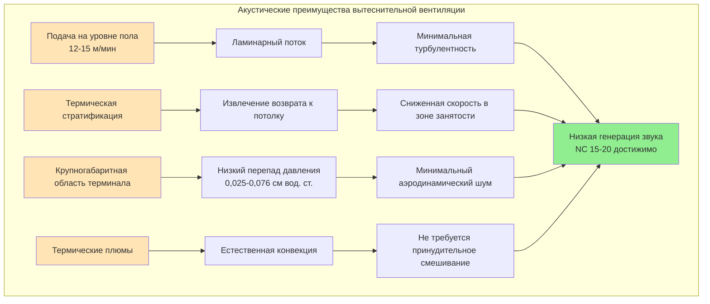

## Обзор

Вытеснительная вентиляция представляет оптимальную стратегию распределения воздуха для акустически чувствительных сборочных помещений, используя фундаментальные принципы механики жидкостей и термической стратификации для достижения превосходных акустических характеристик по сравнению с традиционными системами верхнего смешивания. Путем подачи кондиционированного воздуха на уровне пола со скоростью менее 15 м/мин вытеснительные системы устраняют турбулентное смешивание и высокоскоростной выброс, которые порождают нежелательный шум в традиционных конструкциях.

Акустические преимущества вытеснительной вентиляции вытекают непосредственно из физики низкоскоростного ламинарного потока. Звуковая мощность, генерируемая движением воздуха через терминалы, масштабируется примерно с шестой степенью скорости для турбулентного потока. Снижение скорости выброса со 120 м/мин (обычный диффузор) до 12 м/мин (терминал вытеснения) теоретически снижает звуковую мощность на 60 дБ, превращая источник навязчивого шума в неуловимый.

## Фундаментальные принципы акустики

### Генерирование звука в зависимости от скорости

Взаимосвязь между скоростью воздуха и генерируемой звуковой мощностью следует принципам аэроакустики, установленным акустической аналогией Лайтхилла. Для турбулентного потока через отверстия и решетки уровень звуковой мощности резко возрастает со скоростью:

$$L_w = L_{w,ref} + 60 \log_{10}\left(\frac{V}{V_{ref}}\right)$$

Где:
- $L_w$ = уровень звуковой мощности (дБ отнесенный к $10^{-12}$ Вт)
- $L_{w,ref}$ = эталонный уровень звуковой мощности при эталонной скорости
- $V$ = фактическая скорость воздуха (м/мин)
- $V_{ref}$ = эталонная скорость (обычно 30 м/мин)

Эта зависимость по шестой степени объясняет, почему снижение скорости вдвое снижает звуковую мощность на 18 дБ—драматическое улучшение, легко воспринимаемое слушателями.

### Характеристики выброса терминала

Обычные верхние диффузоры достигают распределения воздуха в помещении посредством высокоскоростного выброса (90-180 м/мин) и увлечения воздуха помещения в соотношении 20:1 до 40:1. Этот процесс увлечения создает зоны турбулентного смешивания с связанной генерацией шума. Генерируемая звуковая мощность включает:

$$L_w = 10 + 50 \log_{10}(Q) + 10 \log_{10}(\Delta P)$$

Где:
- $Q$ = расход воздуха (CFM)
- $\Delta P$ = перепад давления на устройстве терминала (см вод. ст.)

Терминалы вытеснения исключают высокоскоростной выброс и перепад давления, существенно снижая оба параметра. Типичные терминалы вытеснения работают при 0,025-0,076 см вод. ст., в сравнении с 0,127-0,381 см вод. ст. для смешивающих диффузоров.

## Характеристики систем вытеснительной вентиляции

### Принципы работы

Вытеснительная вентиляция подает охлажденный воздух (15-18°C) на уровне пола через крупногабаритные, низкоскоростные терминалы. Подаваемый воздух остается стратифицированным на уровне пола до нагревания жильцами, оборудованием и освещением. По мере поглощения воздухом тепла силы плавучести приводят к восходящему движению в термических плюмах над каждым источником тепла. Эти плюмы поднимаются к потолку, где решетки возврата извлекают нагретый воздух.

Система создает вертикальный температурный градиент 3-5°C от пола к потолку, при этом зона занятости (0-1,8 м высоты) поддерживается в пределах параметров комфорта. Эта стратификация оказывается полезной для сборочных помещений с высокими потолками, так как она сосредотачивает охлаждение там, где находятся жильцы, а не кондиционирует весь объем.

### Паттерны распределения воздуха

В отличие от систем смешивания, которые создают циркуляцию по всему пространству, системы вытеснения устанавливают три отчетливые зоны:

1. **Зона подачи** (0-0,6 м) - слой холодного воздуха с минимальным вертикальным движением, температура на 1-2°C ниже уставки
2. **Зона занятости** (0,6-1,8 м) - постепенное повышение температуры через термические плюмы, целевые условия уставки
3. **Зона извлечения** (1,8 м до потолка) - накопление нагретого воздуха, температура на 2-3°C выше уставки

Этот паттерн стратификации устраняет высокоскоростное движение воздуха в зоне занятости, основной источник нежелательного шума в обычных системах.

## Сравнение акустических характеристик

### Анализ уровня звуковой мощности

Прямое измерение установленных систем вытеснения и обычных систем в сопоставимых сборочных помещениях демонстрирует акустическое превосходство вытеснительной вентиляции:

| Тип системы | Скорость терминала | Перепад давления | Звуковая мощность (Lw) | Уровень NC пространства |
|-------------|-------------------|-----------------|------------------------|------------------------|
| Обычный щелевой диффузор | 120 м/мин | 0,20 см вод. ст. | 45 дБ | NC 30-35 |
| Обычное перфорированное лицо | 90 м/мин | 0,15 см вод. ст. | 40 дБ | NC 25-30 |
| Линейная решетка вытеснения | 15 м/мин | 0,05 см вод. ст. | 22 дБ | NC 20-25 |
| Напольный вихревой диффузор | 12 м/мин | 0,038 см вод. ст. | 18 дБ | NC 15-20 |

Снижение звуковой мощности терминала на 20-25 дБ напрямую приводит к более тихим помещениям для занятости. Для театра с 40 диффузорами объединенная звуковая мощность терминалов падает с Lw = 61 дБ (обычная) до Lw = 38 дБ (вытеснение), обеспечивая соответствие NC 20 без дополнительного глушения.

### Производительность в октавных полосах

Системы вытеснения обеспечивают особенно эффективный контроль шума в средне-высокочастотных полосах (500-4000 Гц), где находится речевой и музыкальный контент:

| Частота (Гц) | Обычная Lw | Вытеснение Lw | Преимущество |
|-------------|-----------|-------------|------------|
| 63 | 38 дБ | 28 дБ | 10 дБ |
| 125 | 42 дБ | 30 дБ | 12 дБ |
| 250 | 45 дБ | 28 дБ | 17 дБ |
| 500 | 44 дБ | 24 дБ | 20 дБ |
| 1000 | 42 дБ | 20 дБ | 22 дБ |
| 2000 | 38 дБ | 16 дБ | 22 дБ |
| 4000 | 33 дБ | 12 дБ | 21 дБ |

Это спектральное преимущество критично для разборчивости речи и музыкальной ясности, так как эти приложения требуют минимального фонового шума в диапазоне 500-2000 Гц.

## Проектные соображения для сборочных помещений

### Выбор устройства терминала

Терминалы вытеснения для приложений сборочных помещений требуют тщательного выбора на основе акустических, тепловых и эстетических критериев:

**Напольные вихревые диффузоры:**
- Круглый паттерн, диаметр 0,45-0,9 м
- Скорость подачи 9-15 м/мин
- Пропускная способность потока воздуха 24-94 м³/ч на терминал
- Звуковая мощность Lw = 15-20 дБ при расчетном потоке
- Требует поднятого пола или подпольного плена

**Линейные напольные решетки:**
- Непрерывная щелевая конфигурация
- Скорость подачи 12-18 м/мин
- Пропускная способность потока воздуха 47-188 м³/ч на метр пог.
- Звуковая мощность Lw = 18-25 дБ при расчетном потоке
- Интегрируется с архитектурными деталями пола

**Настенные терминалы вытеснения:**
- Монтаж низко на боковой стене (0,3-0,45 м над полом)
- Скорость подачи 12-21 м/мин
- Пропускная способность потока воздуха 94-283 м³/ч на терминал
- Звуковая мощность Lw = 20-28 дБ при расчетном потоке
- Пригодна для приложений модернизации

### Акустика термической стратификации

Вертикальный температурный градиент, присущий вытеснительной вентиляции, влияет на распространение звука через пространство. Более теплый воздух на уровне потолка создает положительный температурный градиент ($dT/dz > 0$), который преломляет звуковые волны вверх и в стороне от плоскости аудитории. Этот эффект снижает уровни звукового давления в местах прослушивания на 1-3 дБ по сравнению с изотермальными условиями.

Скорость звука увеличивается с температурой согласно:

$$c = 331,3\sqrt{1 + \frac{T}{273,15}}$$

Где $T$ - температура в °C. Вертикальный градиент 3-5°C создает градиент скорости звука, который изгибает звуковые лучи вверх, эффективно "улавливая" шум оборудования на уровне потолка в стороне от аудитории.

### Требования по высоте потолка

Вытеснительная вентиляция требует достаточной высоты потолка для развития стабильной термической стратификации. Рекомендации минимальной высоты для сборочных помещений:

| Тип помещения | Минимальная высота потолка | Оптимальная высота |
|-------------|--------------------------|------------------|
| Аудитории | 3,7 м | 4,3-4,9 м |
| Театры | 4,3 м | 5,5-7,3 м |
| Концертные залы | 5,5 м | 7,3-12,2 м |
| Многофункциональные залы | 4,3 м | 4,9-6,1 м |

Недостаточная высота предотвращает адекватное развитие стратификации, вызывая преждевременное смешивание подаваемого воздуха и нейтрализуя акустические преимущества. Помещения ниже минимальной высоты должны использовать альтернативные низкоскоростные стратегии.

## Размер системы и расчеты потока воздуха

### Определение расхода подаваемого воздуха

Рассчитайте расход вытеснительной вентиляции на основе чувствительной охлаждающей нагрузки и допустимого температурного дифференциала:

$$Q = \frac{q_s}{1,2 \times \Delta T}$$

Где:
- $Q$ = расход подачи (м³/ч)
- $q_s$ = чувствительная охлаждающая нагрузка (кДж/ч)
- $\Delta T$ = разница температур подачи и помещения (°C)
- 1,2 = константа для стандартного воздуха (1,2 кг/м³ × 1005 Дж/кг·°C ÷ 3600 с/ч)

Системы вытеснения обычно работают с $\Delta T$ = 3-6°C, в сравнении с 8-11°C для обычных верхних систем. Этот сниженный дифференциал требует 50-100% более высокого расхода воздуха для эквивалентной охлаждающей способности.

### Расчет количества терминалов

Определите количество терминалов на основе пропускной способности отдельного терминала и общего расхода воздуха:

$$N = \frac{Q_{total}}{Q_{terminal}}$$

Расставьте терминалы равномерно по площади пола, поддерживая максимальное расстояние 3,7-4,6 м для обеспечения полного покрытия пола. Для театра площадью 929 м², требующего 9438 м³/ч:

- Пропускная способность терминала: 71 м³/ч при 13 м/мин
- Требуемое количество: 9438 / 71 = 133 терминала
- Расстояние: $\sqrt{929/133}$ = 2,6 м по центру

Этот плотный массив терминалов обеспечивает низкоскоростной выброс при одновременном обеспечении адекватного охлаждающего покрытия.

## Интеграция со строительными системами

### Распределение воздуха под полом

Вытеснительная вентиляция оптимально интегрируется с системами распределения воздуха под полом (UFAD), используя структурный плен пола как камеру подачи воздуха. Эта конфигурация предлагает:

- Исключение воздуховодов верхних помещений в зонах аудитории
- Упрощенные соединения терминалов через гибкие воздуховоды
- Улучшенная архитектурная эстетика потолка
- Повышенная гибкость для переконфигурации сидений

Плен под полом работает при 0,127-0,254 см вод. ст., едва заметном жильцами и генерирующем незначительный акустический выход.

### Стратегии возврата воздуха

Извлекайте возвратный воздух на уровне потолка через крупные решетки или непрерывные перфорированные потолки. Проектируйте системы возврата для:

- Скорость на лице <24 м/мин, чтобы избежать регенерированного шума
- Акустически облицованные пленумы с облицовкой из стекловолокна 5 см
- Изоляция вентилятора возврата на упругих опорах с прогибом 38 мм
- Выделенные системы возвратных воздуховодов (избегайте общих пленумов)

Расположите возвратные решетки в областях потолка, а не в софитах, чтобы максимизировать эффективность извлечения из стратифицированного теплого слоя.

### Рассмотрения контроля влажности

Системы вытеснения вводят холодный воздух (15-18°C) непосредственно в зону занятости, вызывая опасения по поводу конденсации на холодных поверхностях и дискомфорта от сквозняков. Поддерживайте точку росы подаваемого воздуха ниже 13°C для предотвращения конденсации на напольных терминалах. Для сборочных помещений во влажном климате интегрируйте выделенные системы наружного воздуха (DOAS) с терминалами вытеснения для независимого управления скрытыми нагрузками от чувствительного охлаждения.

## Проверка производительности и пусконаладка

### Процедуры акустического тестирования

Пусконаладка систем вытеснительной вентиляции с комплексной акустической проверкой:

1. **Измерения фонового шума** - Измерьте уровни NC в многочисленных местах аудитории при работе системы в расчетных условиях
2. **Тестирование звуковой мощности терминала** - Проверьте соответствие значений Lw отдельного терминала спецификациям производителя
3. **Анализ в октавных полосах** - Подтвердите соответствие во всех частотных полосах (63-4000 Гц)
4. **Сравнительный анализ** - Документируйте улучшение в сравнении с обычными системами или исходными условиями

Проводите измерения согласно ANSI S12.2 (Критерии оценки шума в помещении) с использованием прецизионных звукомеров с фильтрами для октавных полос.

### Проверка термической стратификации

Документируйте профили вертикальной температуры в репрезентативных местах по всему пространству:

- Измеряйте на высоте 10 см (уровень пола), 107 см (высота головы в сидячем положении), 170 см (стоящая высота) и уровне потолка
- Проверьте, что зона занятости (0-1,8 м) поддерживает температуру в пределах ±1°C от уставки
- Подтвердите градиент стратификации 3-5°C от пола к потолку
- Проверьте, что чрезмерный расход подаваемого воздуха не вызывает чрезмерное смешивание и коллапс стратификации

Используйте системы поперечного измерения температуры или вертикальные массивы термопар для точного профилирования.

## Примеры применения в практике

### Реализация в симфоническом зале

Симфонический зал на 2400 мест в умеренном климате реализовал вытеснительную вентиляцию через подпольное распределение с 380 напольными вихревыми диффузорами. Параметры проектирования:

- Чувствительная охлаждающая нагрузка: 233 кВт (высокая занятость + освещение)
- Расход подачи: 44,7 м³/с при 18°C
- Средняя скорость выброса терминала: 13 м/мин
- Измеренные уровни NC: NC 18 во время исполнения (целевое NC 20)
- Термическая стратификация: 4,6°C от пола к потолку

Акустические измерения подтвердили улучшение на 24 дБ в сравнении с исходной системой VAV верхнего размещения, устранив предыдущие жалобы на слышимое движение воздуха во время тихих музыкальных пассажей.

### Проект модернизации театра

Театр на 600 мест, ориентированный на драматургию, переоборудован со стандартных верхних диффузоров на настенные терминалы вытеснения. Сравнение производительности:

| Параметр | Исходная система | Система вытеснения |
|---------|-----------------|------------------|
| Тип диффузора | Линейные щели | Настенное вытеснение |
| Количество терминалов | 32 | 48 |
| Средняя скорость | 115 м/мин | 17 м/мин |
| Звуковая мощность (Lw) | 48 дБ на диффузор | 24 дБ на терминал |
| Измеренный уровень NC | NC 32 | NC 22 |
| Отклик аудитории | Заметный свист | Неуловимый |

Преобразование не требовало значительных архитектурных модификаций, используя существующие периметральные стены для монтажа терминалов и пространство потолка для сбора возвратного воздуха.

## Ограничения и альтернативы

### Ограничения тепловой нагрузки

Вытеснительная вентиляция наиболее эффективна для приложений, ориентированных на охлаждение, с умеренными чувствительными тепловыми нагрузками (72-115 кДж/м²·ч). Более высокие нагрузки требуют чрезмерного расхода подачи, который нарушает стратификацию. Для сборочных помещений, превышающих 115 кДж/м²·ч чувствительную плотность, рассмотрите:

- Панели радиационного охлаждения для обработки базовой нагрузки
- Гибридные системы, сочетающие вытеснение с верхним смешиванием
- Выделенные высокообъемные, низкоскоростные вентиляторы (HVLS) для улучшения смешивания

### Отопление в холодном климате

Вытеснительная вентиляция обеспечивает ограниченную отопительную способность, так как теплый воздух, подаваемый на уровне пола, сразу же поднимается без преимущества для жильца. Для отопительно-ориентированного климата интегрируйте дополнительные системы:

- Панели радиационного отопления по периметру или конвекторы плинтуса
- Распределение теплого воздуха верхнего уровня в режиме отопления
- Подпольные гидравлические системы отопления

Спроектируйте органы управления для переключения между режимом охлаждения вытеснения и режимом верхнего отопления на основе сезонных требований.

## Ссылки ASHRAE и стандарты

Спроектируйте системы вытеснительной вентиляции для сборочных помещений в соответствии с:

- **ASHRAE Handbook—HVAC Applications, Chapter 58**: Применяет принципы вытеснительной вентиляции к конкретным типам зданий, включая сборочные помещения
- **ASHRAE Handbook—Fundamentals, Chapter 8**: Предоставляет теорию акустики и методы расчета для анализа звуковой мощности
- **ASHRAE Standard 55**: Требования к тепловому комфорту, применимые к стратифицированной среде
- **ASHRAE Guideline 36**: Последовательности управления системами вытеснения, включая мониторинг стратификации

Проконсультируйтесь с технической литературой производителя для сертифицированных данных акустической производительности на конкретных продуктах терминалов вытеснения согласно процедурам тестирования AHRI Standard 885.

## Заключение

Вытеснительная вентиляция обеспечивает непревзойденную акустическую производительность для сборочных помещений, достигая уровней NC 15-20 через фундаментальные принципы низкоскоростного распределения воздуха и термической стратификации. Снижение звуковой мощности на 20-25 дБ по сравнению с обычными системами устраняет шум терминала как значительный фактор, способствующий фоновым уровням звука, позволяя проектировщикам сосредоточить внимание на изоляции вентиляторов и глушении воздуховодов.

Физика генерирования звука в зависимости от скорости сильно благоприятствует подходам вытеснения. Снижением скоростей терминалов со 90-120 м/мин до 12-15 м/мин звуковая мощность теоретически падает на 54-60 дБ и на 20-25 дБ на практике. Это акустическое преимущество, в сочетании с улучшенным качеством воздуха посредством стратификации и сниженным потреблением энергии из-за тепловой зонации, позиционирует вытеснительную вентиляцию как предпочтительное решение для требовательных сборочных приложений, где тишина оказывается столь же критична, как тепловой комфорт.
