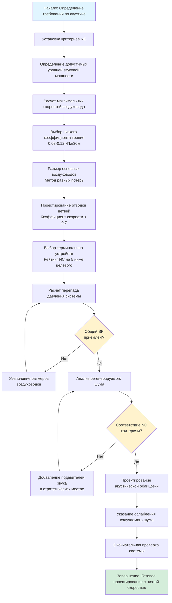

## Обзор

Низкоскоростная раздача воздуха представляет собой фундаментальную стратегию достижения строгих требований по акустике в помещениях собраний. За счет снижения скорости воздуха до 30-50% от обычных значений проектирования, регенерированный шум от турбулентности воздуха уменьшается драматически, позволяя системам HVAC соответствовать критериям NC 15-25, необходимым для концертных залов, театров и лекционных аудиторий.

Акустический эффект снижения скорости следует экспоненциальным соотношениям. Звуковая мощность, генерируемая турбулентностью воздуха в воздуховодах, масштабируется примерно с шестой степенью скорости, что означает, что при уменьшении скорости вдвое звуковая мощность уменьшается в 64 раза (на 18 дБ). Эта физическая зависимость делает контроль скорости наиболее эффективной стратегией снижения шума, доступной проектировщикам HVAC.

Проектирование с низкой скоростью требует принципиального отхода от обычной практики. Размеры воздуховодов увеличиваются на 100-200%, перепады давления снижаются на 50-75%, а затраты на установку системы увеличиваются на 20-30%. Эти компромиссы необходимы для достижения уровней фонового шума, которые сохраняют разборчивость речи и ясность музыки в критических окружающих средах прослушивания.

## Соотношения скорость-звуковая мощность

### Фундаментальные акустические уравнения

Уровень звуковой мощности, генерируемой потоком воздуха в воздуховодах, зависит в первую очередь от скорости, размера воздуховода и характеристик турбулентности. Зависимость выражается следующим образом:

$$L_w = 10 \log_{10} \left( \frac{V^6 \cdot A}{10^{12}} \right) + K$$

Где:
- $L_w$ = уровень звуковой мощности (дБ отн. $10^{-12}$ Вт)
- $V$ = скорость воздуха (м/с)
- $A$ = площадь поперечного сечения воздуховода (м²)
- $K$ = эмпирическая константа (типично 50-60 дБ)

Шестистепенная зависимость демонстрирует драматическое акустическое влияние изменений скорости. Снижение скорости с 10,2 м/с до 5,1 м/с уменьшает звуковую мощность на:

$$\Delta L_w = 60 \log_{10} \left( \frac{10,2}{5,1} \right) = 60 \log_{10}(2) = 18 \text{ дБ}$$

Это снижение на 18 дБ представляет разницу между слышимой системой (NC 35) и неощутимой системой (NC 17).

### Механизмы генерации шума

Турбулентность воздуха генерирует шум через три основных механизма:

**Турбулентность прямого воздуховода:**

$$L_w = K_s + 50 \log_{10}(V) + 10 \log_{10}(A)$$

Где $K_s$ = 17 для круглых воздуховодов, 20 для прямоугольных воздуховодов

**Шум, генерируемый отводом:**

$$L_w = K_e + 60 \log_{10}(V) + 10 \log_{10}(A) - 15 \log_{10}(R/D)$$

Где:
- $K_e$ = эмпирическая константа (35-45 дБ)
- $R/D$ = отношение радиуса к диаметру

**Шум ответвления:**

$$L_w = K_b + 50 \log_{10}(V_m) + 20 \log_{10}(V_b/V_m)$$

Где:
- $K_b$ = 30-40 дБ
- $V_m$ = скорость в основном воздуховоде
- $V_b$ = скорость в ответвлении

Эти уравнения демонстрируют, что фитинги генерируют значительно больше шума, чем прямые воздуховоды, особенно когда скорости в ответвлениях существенно отличаются от скоростей в основном воздуховоде.

## Пределы скорости по приложениям

### Стандарты скорости для помещений собраний

Следующие пределы скорости обеспечивают акустическую производительность для различных типов помещений собраний:

| Тип помещения | Целевой NC | Основной воздуховод (м/с) | Ветвь (м/с) | Скорость в терминале (м/с) | Лицо диффузора (м/с) |
|------------|-----------|-----------------|-------------------|-------------------------|---------------------|
| Концертные залы | NC 15-20 | 3,0-4,6 | 1,5-3,0 | 0,8-1,5 | 0,5-1,0 |
| Театры легального проката | NC 20-25 | 4,1-6,1 | 2,0-4,1 | 1,0-2,0 | 0,8-1,5 |
| Кинотеатры | NC 25-30 | 5,1-7,6 | 3,0-5,1 | 1,5-2,5 | 1,0-2,0 |
| Большие аудитории | NC 25-30 | 5,1-7,6 | 3,0-5,1 | 1,5-2,5 | 1,0-2,0 |
| Лекционные аудитории | NC 25-30 | 6,1-8,1 | 3,6-5,6 | 2,0-3,0 | 1,3-2,3 |
| Переговорные комнаты | NC 30-35 | 7,6-10,2 | 4,6-7,1 | 2,5-4,1 | 1,8-3,0 |

### Пределы скорости для отдельных компонентов

**Основные распределительные воздуховоды:**

Максимальные скорости в первичных распределительных воздуховодах не должны превышать значения, которые создают регенерируемый шум, превышающий допустимые уровни звуковой мощности воздуховода. Для помещений NC 20 ограничьте скорость в основном воздуховоде до 4,1-5,1 м/с, используя потери трения 0,08-0,12 кПа на 30 м.

**Ветвевые воздуховоды:**

Ветвевые отводы представляют критические акустические точки из-за генерации турбулентности при переходах скорости. Ограничьте скорости в ветвях до 50-70% скоростей в основном воздуховоде и используйте конические или обтекаемые отводы вместо входов с острыми краями. Для применений NC 20 скорости в ветвях не должны превышать 3,0 м/с.

**Терминальные устройства:**

Звуковая мощность от диффузоров и решеток следует специфичным для производителя кривым производительности, обычно показывающим увеличение на 5-8 дБ при удвоении расхода воздуха. Выбирайте терминальные устройства с сертифицированными рейтингами NC по крайней мере на 5 пунктов ниже требований пространства и работайте при 60-80% от максимального каталогизированного расхода воздуха.

**Скорость в горловине диффузора:**

Соединение между воздуховодом и диффузором генерирует значительную турбулентность. Ограничьте скорость в горловине до 1,0-1,5 м/с для помещений NC 20, 1,5-2,0 м/с для помещений NC 25. Используйте облицованные переходные элементы для минимизации излучаемого шума.

## Определение размеров воздуховода для снижения шума

### Применение метода равных потерь трения

Размер воздуховодов по методу равных потерь трения с величинами потерь трения 0,08-0,12 кПа на 30 м для помещений NC 15-25, в отличие от обычной практики 0,35-0,45 кПа на 30 м. Этот подход производит следующие соотношения размеров:

| Расход воздуха (м³/ч) | Обычный размер | Обычная скорость | Размер с низкой скоростью | Скорость с низкой скоростью |
|---------------|-------------------|----------------------|-------------------|----------------------|
| 3,4 | 40 см × 30 см | 9,6 м/с | 66 см × 46 см | 3,7 м/с |
| 8,5 | 66 см × 46 см | 10,9 м/с | 107 см × 76 см | 4,0 м/с |
| 17 | 91 см × 66 см | 10,9 м/с | 152 см × 102 см | 4,2 м/с |
| 34 | 127 см × 97 см | 11,3 м/с | 213 см × 152 см | 4,0 м/с |
| 68 | 183 см × 132 см | 11,3 м/с | 305 см × 213 см | 4,0 м/с |

### Рассмотрение соотношения сторон

Соотношения сторон прямоугольного воздуховода влияют как на акустическую производительность, так и на эффективность установки:

**Акустическая производительность:**
- Квадратные воздуховоды минимизируют отношение периметра к площади, снижая излучаемый шум
- Высокие соотношения сторон (>4:1) увеличивают развитие турбулентного пограничного слоя

**Практические соображения:**
- Соотношения сторон 1,5:1 к 2,5:1 оптимизируют структурную эффективность
- Сохраняйте соотношения ниже 3:1 для упрощения изготовления и уменьшения утечек

Для воздуховода с расходом 17 м³/ч и низкой скоростью 4,1 м/с:
- Квадратный вариант: 142 см × 142 см (2023 см² площади)
- Соотношение 2:1: 201 см × 102 см (2050 см² площади) - **Предпочтительно**
- Соотношение 4:1: 284 см × 71 см (2023 см² площади)

### Соотношения скоростного давления

Статическое восстановление в системах с низкой скоростью следует фундаментальной зависимости:

$$\Delta P_s = P_{v1} - P_{v2} = \frac{\rho}{2} (V_1^2 - V_2^2)$$

При стандартных условиях (1,2 кг/м³):

$$P_v = \left( \frac{V}{12,7} \right)^2 \text{ кПа}$$

Дифференциал скоростного давления между обычным (10,2 м/с) и низкоскоростным (3,2 м/с) проектированием:

$$\Delta P_v = \left( \frac{10,2}{12,7} \right)^2 - \left( \frac{3,2}{12,7} \right)^2 = 0,645 - 0,063 = 0,582 \text{ кПа}$$

Этот сниженный скоростной напор уменьшает общее статическое давление системы на 30-50%, частично компенсируя увеличенное трение от увеличенной площади поверхности воздуховода.

## Методология проектирования системы с низкой скоростью

### Последовательность проектирования

**1. Установка критериев акустики:**
- Определение требований кривой NC для пространства
- Определение допустимых уровней звукового давления в октавных полосах
- Расчет постоянной помещения и коэффициентов направленности

**2. Распределение бюджета звуковой мощности:**
- Распределение допусков звуковой мощности вентиляторам, воздуховодам и терминалам
- Резервирование запаса 3-5 дБ для неопределенностей расчета
- Учет комбинаций множественных источников

**3. Определение максимальных скоростей:**
- Расчет максимальной скорости воздуховода, используя уравнения регенерируемого шума
- Применение пределов скорости из стандартов для помещений собраний
- Установление графика снижения скорости (основной к ветви к терминалу)

**4. Размер системы воздуховодов:**
- Выбор коэффициента трения (0,08-0,12 кПа на 30 м)
- Применение метода равных потерь трения к основному распределению
- Размер ветвей с сохранением коэффициентов скорости ниже 0,7
- Проверка соотношений сторон в пределах практического диапазона (1,5:1 к 3:1)

**5. Расчет производительности системы:**
- Суммирование потерь трения, потерь на фитингах и потерь на терминалах
- Включение перепадов давления подавителей звука
- Проверка общего статического давления системы, остается ниже 1,5 кПа

**6. Анализ акустической производительности:**
- Расчет регенерируемого шума на отводах, отводах и терминалах
- Логарифмическое сложение уровней звуковой мощности
- Сравнение с допустимыми уровнями звуковой мощности воздуховода

**7. Добавление акустической обработки:**
- Указание подавителей звука там, где рассчитанные уровни превышают допустимые
- Применение внутренней облицовки воздуховода для контроля излучаемого шума
- Проектирование акустически облицованных камер на соединениях терминалов

## Стратегии минимизации перепада давления

### Снижение потерь трения

Проектирование с низкой скоростью по своей сути снижает потери трения за счет сниженного скоростного давления, но увеличенная площадь поверхности воздуховода частично компенсирует эту выгоду. Чистый эффект на потерю трения:

**Обычное проектирование (10,2 м/с, 91 см × 66 см воздуховод):**
- Коэффициент трения: 0,35 кПа на 30 м
- Гидравлический диаметр: 77 см
- Площадь поверхности на 1 метр: 9,6 м²

**Проектирование с низкой скоростью (4,1 м/с, 152 см × 102 см воздуховод):**
- Коэффициент трения: 0,10 кПа на 30 м
- Гидравлический диаметр: 122 см
- Площадь поверхности на 1 метр: 15,5 м²

Для трассы воздуховода длиной 61 м:
- Потери трения в обычном проектировании: 0,71 кПа
- Потери трения в низкоскоростном проектировании: 0,20 кПа
- Чистое снижение: 0,51 кПа (72%)

### Оптимизация потерь на фитингах

Фитинги представляют 40-60% общего перепада давления системы и являются значительными источниками генерируемого шума. Минимизируйте потери на фитингах через:

**Проектирование отводов:**
- Используйте радиальные отводы с R/D ≥ 1,5
- Укажите направляющие лопатки для R/D < 1,5 или больших прямоугольных воздуховодов
- Ограничьте перепад давления на одном отводе до 0,05 кПа

**Отводы ветвей:**
- Используйте конические вводы с углами входа 15-30°
- Сохраняйте минимальные углы отвода 45° к основному воздуховоду
- Размер скорости отвода 50-70% скорости основного воздуховода

**Переходы:**
- Ограничьте углы расширения/сжатия до 15° для расширений, 30° для сжатий
- Используйте многосекционные переходы для больших изменений площади
- Укажите обтекаемые переходы в критических акустических местах

### Выбор терминального устройства

Перепады давления терминального устройства в системах с низкой скоростью остаются значительными, потому что диффузоры работают при сниженных скоростях, но должны сохранять характеристики выброса и смешивания:

| Тип диффузора | Обычный ΔP | ΔP с низкой скоростью | Акустическое преимущество |
|---------------|-----------------|-----------------|-------------------|
| Линейная щель | 0,10-0,17 кПа | 0,04-0,07 кПа | Рейтинг NC на -8 до -12 дБ |
| Перфорированное лицо | 0,14-0,21 кПа | 0,06-0,11 кПа | Рейтинг NC на -6 до -10 дБ |
| Вытеснение | 0,03-0,07 кПа | 0,01-0,03 кПа | Рейтинг NC на -10 до -15 дБ |
| Стандартный VAV | 0,17-0,28 кПа | Не рекомендуется | Переменная производительность NC |

Выбирайте диффузоры, сертифицированные по стандарту AHRI 885, с документированными рейтингами NC при расчетных расходах воздуха.

## Установка и проверка

### Критические детали строительства

**Требования герметизации воздуховода:**
- Герметизация класса C согласно стандартам SMACNA HVAC Duct Construction Standards
- Герметизация мастикой всех поперечных соединений и продольных швов
- Проверка утечек для проверки <3 м³/ч на 30 м² при 0,25 кПа

**Применение акустической облицовки:**
- Применение облицовки стекловолокном толщиной 2,5-5 см с минимальной плотностью 24 кг/м³
- Облицовка минимум 15 м воздуховода выше и ниже каждого подавителя
- Использование механически закрепленной облицовки с покрытыми поверхностями в местах высокой скорости

**Детали поддержки и подвесов:**
- Обеспечение виброизоляции при всех соединениях оборудования
- Используйте подвесы с неопреновой облицовкой с интервалом 2,4-3,0 м
- Изолируйте проникновения воздуховода через звукоизолированные стены гибкими загрузочными элементами

### Пусконаладочные испытания и проверка

**Проверка расхода воздуха:**
- Поперечное сечение воздуховодов согласно стандарту ASHRAE 111 в местах основного/ветвевого воздуховода
- Проверка скоростей в пределах ±10% от расчетных значений
- Документирование расходов терминального устройства на каждом диффузоре

**Акустические измерения:**
- Измерение уровней фонового шума согласно ASTM E1574
- Документирование уровней в октавных полосах в репрезентативных местах сидения
- Проверка соответствия критериям NC при работе системы
- Проведение измерений со всем работающим оборудованием HVAC и пустым зданием

## Заключение

Проектирование низкоскоростной раздачи воздуха позволяет системам HVAC соответствовать строгим требованиям по акустике в помещениях собраний посредством систематического применения принципов снижения скорости. Экспоненциальная зависимость между скоростью и генерацией звуковой мощности делает контроль скорости наиболее эффективной стратегией снижения шума. Хотя системы с низкой скоростью требуют воздуховодов размером на 100-200% больше и увеличивают затраты на установку на 20-30%, эти инвестиции необходимы для достижения производительности уровней NC 15-25.

Проверка проектирования должна включать расчеты регенерируемого шума на всех фитингах, акустический анализ излучаемого звука воздуховодом и комплексные пусконаладочные измерения для подтверждения производительности. При надлежащем проектировании и установке системы с низкой скоростью обеспечивают неощутимую работу HVAC, которая сохраняет акустическую целостность концертных залов, театров и других критических окружающих сред прослушивания.

Обратитесь к справочнику ASHRAE—Основы, глава 21 (Проектирование воздуховодов) для подробных процедур определения размеров воздуховодов и справочнику ASHRAE—Приложения HVAC, глава 49 (Контроль шума и вибрации) для методологии расчета акустики и критериев производительности.
