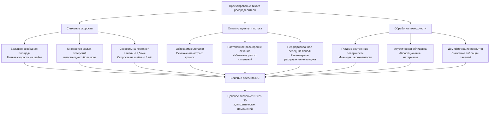

Концевые устройства распределения воздуха генерируют шум через турбулентный поток воздуха, взаимодействие с поверхностями и механизмы перепада давления. Тихие распределители используют специальные конструктивные характеристики для минимизации генерации звука при сохранении эффективного распределения воздуха, что делает их критически важными для акустически чувствительных помещений, таких как театры, студии звукозаписи, классные комнаты и учреждения здравоохранения.

## Механизмы генерации шума

Шум, генерируемый распределителем, происходит из трёх основных источников, которые должны контролироваться в процессе проектирования.

**Шум турбулентного перемешивания**

Высокоскоростной воздух, выходящий из распределителя, создаёт турбулентные вихри при перемешивании с воздухом помещения. Звуковая мощность, генерируемая турбулентным перемешиванием, следует выражению:

$$L_w = 10 \log_{10}\left(\frac{V^6 A}{10^{12}}\right) + K$$

где $L_w$ — уровень звуковой мощности (дБ), $V$ — скорость на выходе (м/с), $A$ — площадь выхода (м²), и $K$ — константа, зависящая от геометрии распределителя (обычно 50-70 для обычных распределителей).

Зависимость от шестой степени демонстрирует, что уменьшение скорости вдвое снижает звуковую мощность на 18 дБ, что делает снижение скорости наиболее эффективной стратегией контроля шума.

**Срыв вихрей**

Воздух, обтекающий лопатки распределителя и кромки, создаёт периодический срыв вихрей на частоте:

$$f = \frac{S \cdot V}{d}$$

где $f$ — частота срыва (Гц), $S$ — число Струхаля (0,2 для тупых тел), $V$ — скорость воздуха (м/с), и $d$ — характерный размер (м). Тихие распределители минимизируют срыв вихрей благодаря обтекаемым профилям лопаток и перфорированным передним панелям.

**Шум пограничного слоя**

Развитие турбулентного пограничного слоя на поверхностях распределителя генерирует широкополосный шум. Звуковая мощность турбулентности пограничного слоя масштабируется как:

$$L_w \propto 50 \log_{10}(V) + 10 \log_{10}(A_s)$$

где $A_s$ — смачиваемая площадь поверхности. Гладкие внутренние поверхности и постепенные переходы сечений снижают шум пограничного слоя.

## Критические пределы скорости

Скорость воздуха в ключевых местах распределителя непосредственно определяет акустические характеристики. ASHRAE Handbook устанавливает максимальные скорости для конкретных рейтингов NC.

| Рейтинг NC | Скорость на панели | Скорость на шейке | Типовое применение |
|-----------|-------|-------|---------------------|
| NC-15 | 1,0 м/с (200 CFM/фут²) | 2,0 м/с (400 CFM/фут²) | Студии звукозаписи, концертные залы |
| NC-20 | 1,5 м/с (300 CFM/фут²) | 2,5 м/с (500 CFM/фут²) | Театры, приватные офисы |
| NC-25 | 2,0 м/с (400 CFM/фут²) | 3,0 м/с (600 CFM/фут²) | Классные комнаты, библиотеки |
| NC-30 | 2,5 м/с (500 CFM/фут²) | 4,0 м/с (800 CFM/фут²) | Переговорные, открытые офисы |
| NC-35 | 3,0 м/с (600 CFM/фут²) | 5,0 м/с (1000 CFM/фут²) | Розничные помещения, вестибюли |

Скорость на передней панели представляет среднюю скорость через видимую переднюю панель распределителя, в то время как скорость на шейке измеряет скорость потока воздуха на входе распределителя. Скорость на шейке обычно управляет генерацией шума из-за более высокой скорости и меньшей площади.

## Выбор распределителя для акустических характеристик

Производители предоставляют рейтинги уровня звуковой мощности, протестированные в соответствии со стандартом ASHRAE 130 и стандартом ARI 890. Рейтинг звуковой мощности учитывает как излучаемый, так и регенерируемый шум.

**Рейтинг уровня звуковой мощности**

Данные о звуковой мощности распределителя указывают:

$$L_{w,total} = 10 \log_{10}\left(\sum_{i=1}^{8} 10^{L_{w,i}/10}\right)$$

где $L_{w,i}$ представляет звуковую мощность в каждой октавной полосе (63 Гц до 8 кГц). Общая звуковая мощность объединяет все октавные полосы логарифмически.

Уровень звукового давления в помещении, возникающий от шума распределителя:

$$L_p = L_w - 10 \log_{10}(R) + 6$$

где $L_p$ — уровень звукового давления (дБ), и $R$ — постоянная помещения (м²). Для абсорбционных помещений $R = S\alpha/(1-\alpha)$, где $S$ — площадь поверхности, а $\alpha$ — средний коэффициент поглощения.

**Рассмотрение соотношения сторон**

Соотношение сторон распределителя (длина/ширина) влияет на генерацию шума. Щелевые распределители с высоким соотношением сторон (>10:1) концентрируют поток воздуха, повышая скорость и шум. Квадратные или распределители с низким соотношением сторон (<4:1) распределяют воздух более равномерно, снижая пиковые скорости.

## Конструктивные характеристики тихих распределителей

Специализированные тихие распределители включают множественные технологии снижения шума.

**Перфорированные распределители с передней панелью**

Перфорированные передние панели разделяют поток воздуха на множество малых струй, снижая скорость отдельной струи при сохранении общего потока воздуха. Акустическое преимущество вытекает из:

$$L_{w,perforated} = L_{w,solid} - 10 \log_{10}(N)$$

где $N$ — количество перфораций. Удвоение количества перфораций снижает звуковую мощность на 3 дБ.

Диаметр перфорации обычно составляет 3-10 мм с открытой площадью 40-60%. Меньшие перфорации обеспечивают лучшие акустические характеристики, но увеличивают перепад давления.

**Вытесняющие распределители**

Вытесняющие распределители подают воздух при очень низкой скорости (0,25-0,5 м/с) вблизи уровня пола, исключая турбулентный шум перемешивания. Уровни звуковой мощности обычно достигают NC-20 до NC-25 без дополнительной обработки.

Принцип вытеснения зависит от зависящего от плавучести потока, а не от импульсного перемешивания:

$$\Delta T = \frac{Q_{sensible}}{\rho c_p \dot{V}}$$

где $\Delta T$ — разница температур подачи и помещения (К), $Q_{sensible}$ — чувствительная нагрузка охлаждения (Вт), $\rho$ — плотность воздуха (кг/м³), $c_p$ — удельная теплоёмкость (Дж/кг·К), и $\dot{V}$ — объёмный расход (м³/с).

**Акустическая облицовка**

Внутренняя акустическая облицовка поглощает звук, генерируемый внутри распределителя, перед его излучением в помещение. Стекловолоконная или пенная облицовка толщиной 25-50 мм обеспечивает ослабление на 5-10 дБ в средних и высоких частотах (500-4000 Гц).

Коэффициент шумопоглощения (NRC) облицовочного материала должен превышать 0,70 для эффективного функционирования.

## Сравнение технологий тихих распределителей

| Тип распределителя | Достижимый рейтинг NC | Скорость на панели | Перепад давления | Надбавка к стоимости | Лучшее применение |
|---------------|---------------------|---------------|---------------|--------------|------------------|
| Стандартный щелевой | NC-35 до NC-40 | 3-4 м/с | 25-40 Па | Базовая | Общее коммерческое |
| Перфорированный щелевой | NC-25 до NC-30 | 2-3 м/с | 30-50 Па | 20-40% | Офисы, классные комнаты |
| Радиальный конус | NC-25 до NC-30 | 2-2,5 м/с | 20-35 Па | 10-25% | Помещения с низким потолком |
| Вытесняющий | NC-20 до NC-25 | 0,25-0,5 м/с | 5-15 Па | 50-100% | Помещения большого объёма |
| Акустический потолочный распределитель | NC-20 до NC-25 | 1,5-2 м/с | 40-60 Па | 30-60% | Критичные по акустике помещения |
| Пользовательская перфорированная панель | NC-15 до NC-20 | 1-1,5 м/с | 50-80 Па | 100-200% | Студии, театры |

## Рекомендации по проектированию согласно ASHRAE

ASHRAE Handbook Глава 48 (Контроль шума и вибрации) предоставляет критерии выбора распределителей:

1. Выбирайте распределители с опубликованными данными звуковой мощности, протестированными в соответствии с ASHRAE 130
2. Поддерживайте скорость на шейке ниже значений, указанных для целевого рейтинга NC
3. Учитывайте шум, генерируемый распределителем, при расчёте общего рейтинга NC помещения
4. Рассмотрите регенерируемый шум от турбулентности воздухопровода выше по течению
5. Проверьте, что соотношение сторон и конфигурация монтажа соответствуют условиям испытания

Для критических приложений, требующих NC-25 или ниже, указывайте распределители со следующими характеристиками:
- Перфорированной передней панелью или вытесняющей конструкцией
- Скоростью на шейке ≤3,0 м/с
- Внутренней акустической облицовкой
- Сертифицированными производителем данными звуковой мощности
- Полевой проверкой посредством измерений при пусконаладке

Достижение исключительно тихой работы (NC-20 или лучше) требует тщательной интеграции системы, включая проектирование воздухопровода с низкой скоростью, надлежащее размещение распределителя вдали от уровня уха занятых, и координацию с акустической обработкой помещения для контроля распространения звука и реверберации.
