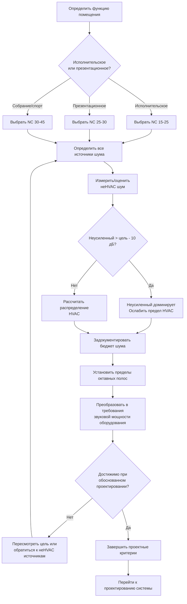

## Обзор

Пределы фонового шума определяют максимально допустимые уровни звукового давления от систем HVAC в помещениях общего назначения. Эти пределы сбалансированы между требованиями акустических характеристик и практическими ограничениями конструкции систем. В отличие от занятых офисных сред, где умеренный фоновый шум способствует конфиденциальности речи, помещения общего назначения требуют почти бесшумной работы для сохранения разборчивости речи и чистоты звучания музыки.

Установление надлежащих пределов фонового шума требует понимания акустической функции помещения, ожиданий пользователей и взаимодействия между шумом, генерируемым HVAC, и другими источниками звука, включая архитектурные материалы, электронные системы и внешний экологический шум.

## Методы критериев шума

### Кривые NC (Noise Criteria)

Метод NC, разработанный Лео Беранеком в 1957 году и уточненный в результате последующих исследований, устанавливает пределы уровня звукового давления по октавным полосам от 63 Гц до 8000 Гц. Каждая кривая NC представляет рейтинг с единственным числом, описывающий максимально допустимый уровень звукового давления в каждой октавной полосе.

Семейство кривых NC предоставляет пределы, которые учитывают частотно-зависимую чувствительность человеческого уха. Низкочастотный шум получает более строгие пределы, чем шум средней частоты, поскольку низкие частоты сложнее ослабляются и более вероятно вызывают раздражение через ощутимые вибрации и гул.

**Математическое соотношение кривых NC:**

Пределы уровня звукового давления в октавных полосах для кривых NC следуют приблизительным соотношениям:

$$L_{NC} = NC - A_f$$

Где:
- $L_{NC}$ = предел уровня звукового давления в октавной полосе (дБ)
- $NC$ = рейтинговый номер критерия шума
- $A_f$ = частотно-зависимый коэффициент коррекции

Для практического применения используйте опубликованные таблицы кривых NC вместо вычислений, так как эмпирические кривые включают психоакустические исследования, выходящие за рамки простых математических соотношений.

### Кривые RC (Room Criteria)

Метод RC, введенный в 1981 году и обновленный до RC Mark II в 1997 году, устраняет ограничения системы NC путем явной оценки качества спектра. Кривые RC идентифицируют "гул" (избыток энергии низких частот) и "шипение" (избыток энергии высоких частот), указывающие на плохую конструкцию системы даже при соответствии пределам NC.

Кривые RC используют эталонную форму спектра, основанную на нейтральной системе HVAC. Отклонения от этого эталона указывают на конкретные проблемы:

- **Гул (R)** - Избыток энергии низких частот, указывающий на недостаточно большие воздуховоды, неправильный выбор вентилятора или неадекватное затухание низких частот
- **Шипение (H)** - Избыток энергии высоких частот, указывающий на чрезмерную скорость воздуха или турбулентность
- **Нейтральный (N)** - Сбалансированный спектр, следующий форме эталонной кривой

Рейтинг RC включает как величину (RC 25, RC 30), так и дескриптор качества (RC 25(N), RC 30(H)).

### Соотношение между NC и RC

Для систем с нейтральным спектральным балансом:

$$RC \approx NC - 5$$

Это соотношение обеспечивает приблизительную эквивалентность между двумя рейтинговыми системами. Хорошо спроектированная система, соответствующая NC 25, обычно достигает RC 20(N). Однако это соотношение не работает для систем с плохим спектральным балансом.

## Критерии фонового шума по типам помещений

### Концертные залы

Концертные залы требуют наиболее строгих пределов фонового шума для сохранения акустической чистоты:

| Тип помещения | Предел NC | Предел RC | Основной критерий | Примечания |
|------------|----------|----------|------------------|-------|
| Концертные залы (классическая музыка) | NC 15-20 | RC 15(N) | Неусиленная оркестровая музыка | Уровень шума не должен маскировать pianissimo |
| Оперные дома | NC 20-25 | RC 20(N) | Неусиленное вокальное исполнение | Критический для ясности вокала без усиления |
| Залы камерной музыки | NC 15-20 | RC 15(N) | Камерная музыка, сольное исполнение | Интимная акустическая среда |
| Театры драматического жанра | NC 20-25 | RC 20(N) | Драматическое исполнение | Разборчивость речи критична |
| Кинотеатры | NC 25-30 | RC 25(N) | Усиленная презентация | Шум системы не должен мешать звуковой дорожке |
| Универсальные аудитории | NC 25-30 | RC 25(N) | Смешанное использование | Компромисс для операционной гибкости |

**Помещения NC 15 представляют акустический предел практического проектирования HVAC.** Системы, достигающие NC 15, требуют экстраординарных мер, включая очень низкие скорости (61-122 м/ч в магистралях), увеличенные воздуховоды, обширное применение глушителей и удаленное размещение оборудования. Примерно 50-75% премию по стоимости в сравнении с обычными системами оправдано только для мировых концертных залов высокого класса.

### Помещения для презентаций и собраний

Помещения, подчеркивающие вербальную коммуникацию, требуют умеренных пределов фонового шума:

| Тип помещения | Предел NC | Предел RC | Основная функция | Акустический приоритет |
|------------|----------|----------|------------------|-------------------|
| Большие аудитории (>200 мест) | NC 25-30 | RC 25(N) | Образовательная презентация | Разборчивость речи с усилением |
| Малые аудитории (<200 мест) | NC 25-30 | RC 25(N) | Образовательная презентация | Может использоваться неусиленная речь |
| Конференц-центры | NC 25-30 | RC 25(N) | Деловые презентации | Совместимость с видеоконференцией |
| Храмы - основной зал | NC 20-30 | RC 20-25(N) | Религиозные службы, музыка | Варьируется в зависимости от конфессии и традиции |
| Храмы - зал общения | NC 30-35 | RC 30(N) | Социальное скопление | Менее критичная акустическая среда |
| Судебные залы | NC 25-30 | RC 25(N) | Судебное разбирательство | Разборчивость речи для протокола |
| Залы советов | NC 25-30 | RC 25(N) | Публичные заседания | Разборчивость речи, качество записи |

### Спортивные и рекреационные объекты

Помещения большого объема с высокой численностью населения и усиленными звуковыми системами:

| Тип объекта | Предел NC | Предел RC | Проектное соображение | Акустический подход |
|---------------|----------|----------|----------------------|-------------------|
| Закрытые арены (>5000 мест) | NC 35-45 | RC 35-40 | Высокий шум от публики, усиленный звук | Шум HVAC вторичен по отношению к толпе и звуковой системе |
| Гимназии | NC 35-40 | RC 35(N) | Высокий уровень активности | Адекватно для вербальной коммуникации |
| Бассейны | NC 40-45 | RC 40 | Высокая реверберация, шум воды | Шум HVAC маскируется окружающими звуками |
| Ледовые площадки | NC 40-45 | RC 40 | Близость холодильного оборудования | Виброизоляция критична |

## Расчет комбинированного источника шума

Когда несколько источников шума способствуют фоновому шуму, общий уровень звукового давления рассчитывается с использованием логарифмического суммирования:

$$L_{total} = 10 \log_{10}\left(\sum_{i=1}^{n} 10^{L_i/10}\right)$$

Где:
- $L_{total}$ = общий комбинированный уровень звукового давления (дБ)
- $L_i$ = уровень звукового давления источника $i$ (дБ)
- $n$ = количество источников шума

**Пример расчета:**

Аудитория содержит три диффузора HVAC, каждый производящий 30 дБ на позиции слушателя, плюс проектор, производящий 28 дБ:

$$L_{total} = 10 \log_{10}\left(3 \times 10^{30/10} + 10^{28/10}\right)$$

$$L_{total} = 10 \log_{10}(3000 + 631) = 10 \log_{10}(3631)$$

$$L_{total} = 10 \times 3.56 = 35.6 \text{ дБ}$$

Комбинированный уровень шума 35.6 дБ превышает целевой NC 30 (~38 дБ на средних частотах), демонстрируя важность рассмотрения всех источников.

### Распределение бюджета шума

Распределите допустимый фоновый шум между вносящими источниками:

$$L_{HVAC} = L_{criterion} - 10 \log_{10}\left(1 + 10^{(L_{other} - L_{criterion})/10}\right)$$

Где:
- $L_{HVAC}$ = допустимый вклад шума HVAC
- $L_{criterion}$ = целевой уровень NC/RC
- $L_{other}$ = комбинированный уровень всех источников, не связанных с HVAC

Для помещения с целевым NC 25 (35 дБ на 1000 Гц) и источниками, не связанными с HVAC, суммирующимися до 32 дБ:

$$L_{HVAC} = 35 - 10 \log_{10}\left(1 + 10^{(32-35)/10}\right) = 35 - 2.5 = 32.5 \text{ дБ}$$

Система HVAC не должна превышать 32.5 дБ для поддержания критерия NC 25 при сочетании с другими источниками.

## Процесс определения предела шума

## Конфиденциальность речи и соображения маскировки

### Требования конфиденциальности речи

Конфиденциальность речи описывает степень, в которой разговоры непонятны непредусмотренным слушателям. Индекс членораздельности (AI) или Индекс передачи речи (STI) количественно определяет конфиденциальность речи:

- **AI < 0.05 или STI < 0.30** - Конфиденциальная конфиденциальность (кабинеты руководителей, кабинеты консультирования)
- **AI 0.05-0.20 или STI 0.30-0.45** - Нормальная конфиденциальность (общие офисы, кабинеты для экзаменов)
- **AI 0.20-0.50 или STI 0.45-0.60** - Ограниченная конфиденциальность (открытые офисы, зоны ожидания)
- **AI > 0.50 или STI > 0.60** - Без конфиденциальности (публичные места, холлы)

**Помещения общего назначения обычно нацелены на максимальную разборчивость (AI > 0.70, STI > 0.75)**, противоположность дизайну, ориентированному на конфиденциальность. Фоновый шум должен быть минимизирован для максимизации разборчивости речи.

### Системы маскировки звука

Системы маскировки звука вводят контролируемый фоновый шум для улучшения конфиденциальности речи в помещениях, где низкий фоновый шум создает чрезмерную разборчивость. Эти системы неуместны для помещений общего назначения, но могут применяться к:

- Зоны холла, прилегающие к концертным залам (NC 35-40 маскировка)
- Административные офисы в центрах исполнительских искусств
- Буфеты и зоны публичного движения

Системы маскировки обычно производят розовый шум или сформированные спектры на уровнях NC 35-40. Никогда не применяйте маскировку звука в исполнительских или презентационных помещениях, так как это прямо противоречит акустическим целям.

### Взаимодействие с архитектурной акустикой

Пределы фонового шума должны быть скоординированы с требованиями времени реверберации:

$$RT_{60} = 0.049 \times \frac{V}{A}$$

Где:
- $RT_{60}$ = время реверберации (секунды)
- $V$ = объем помещения (м³)
- $A$ = полное поглощение (сабины)

Помещения с длительным временем реверберации (соборы, большие аудитории) усиливают фоновый шум посредством накопления звуковой энергии. Эффективный уровень фонового шума увеличивается:

$$L_{reverberant} = L_{direct} + 10 \log_{10}\left(\frac{RT_{60}}{0.5}\right)$$

Помещение с 2.5-секундным RT₆₀ увеличивает эффективный шум на 7 дБ по сравнению с измерением прямого поля. Скоординируйте пределы шума HVAC с рекомендациями консультанта по акустике по лечению поглощением и контролю реверберации.

## Проверка и измерение

### Испытания перед вводом в эксплуатацию

Проверьте уровни фонового шума перед принятием здания:

1. **Условия испытания** - система HVAC в нормальном режиме эксплуатации, все остальные системы защищены, наружные двери закрыты
2. **Позиции измерения** - несколько мест, представляющих типичные позиции аудитории/пользователей
3. **Длительность измерения** - минимум 30 секунд на каждой позиции для статистического усреднения
4. **Разрешение по частоте** - анализ октавных полос от 63 Гц до 4000 Гц минимум

### Критерии приемлемости

ASHRAE Standard 189.1 предлагает следующие допуски:

- **В пределах ±3 дБ на октавную полосу** - Приемлемые характеристики
- **Превышение критерия на 3-5 дБ в любой полосе** - Пограничное, исследуйте корректирующие меры
- **Превышение критерия на >5 дБ в любой полосе** - Несоответствие, необходимо корректирующее воздействие

Многие контракты концертных залов указывают более жесткие допуски ±2 дБ для помещений NC 15-20.

### Устранение неполадок при чрезмерном шуме

Распространенные причины и средства правовой защиты:

| Проблема | Вероятная причина | Средство правовой защиты |
|---------|--------------|--------|
| Гул низких частот (63-125 Гц) | Шум, генерируемый вентилятором, недостаточно большие воздуховоды | Добавить низкочастотные глушители, снизить скорость вентилятора |
| Избыток средних частот (250-1000 Гц) | Шум в воздуховодах, неадекватные глушители | Увеличить производительность глушителя, проверить установку |
| Шипение высоких частот (2000-4000 Гц) | Чрезмерная скорость на диффузорах | Снизить поток воздуха, добавить терминальные глушители |
| Локализованный шум на диффузорах | Турбулентность, закупорка | Отрегулировать демпферы, проверить подключение воздуховодов |
| Вибрация оборудования | Неадекватная виброизоляция | Улучшить виброизоляцию, добавить инертные основания |

## Рекомендации по проектированию

### Консервативный подход

Для критических помещений (NC 15-25) спроектируйте системы HVAC для достижения производительности на 5 дБ лучше требуемого:

- Целевой NC 20 → Спроектировать для NC 15
- Целевой NC 25 → Спроектировать для NC 20

Этот запас прочности учитывает:
- Допуски производства в характеристиках оборудования
- Вариации полевой установки от проектного намерения
- Старение и деградация акустических материалов
- Непредвиденные источники шума, обнаруженные после ввода в эксплуатацию

### Требования к документации

Предоставьте полную акустическую документацию:

1. **Расчеты проектирования** - оценки уровня звуковой мощности для всего оборудования
2. **Анализ затухания** - затухание в воздуховодах, вставка потерь глушителя, расчеты эффекта помещения
3. **Прогнозируемые характеристики** - уровни звукового давления в октавных полосах на типичных позициях
4. **Данные продукта** - сертифицированные AHRI рейтинги звуковой мощности для вентиляторов, данные AHRI Standard 885 для глушителей
5. **План проверки поля** - протокол испытаний, критерии приемлемости, процедуры устранения

## Ссылки и стандарты

**Стандарты и справочники ASHRAE:**
- ASHRAE Handbook—HVAC Applications, Глава 49: Контроль шума и вибрации
- ASHRAE Handbook—Fundamentals, Глава 8: Звук и вибрация
- ASHRAE Standard 189.1: Стандарт для проектирования высокоэффективных экологичных зданий

**Акустические стандарты:**
- AHRI Standard 885: Процедура оценки уровней звука в занятом помещении при применении воздушных терминалов и воздухозаборников
- AHRI Standard 260: Рейтинг звука канальных воздвижных и кондиционирующих оборудований
- ASTM E1573: Стандартный метод испытаний для оценки маскирующего звука в открытых офисах

**Руководство по проектированию:**
- Acoustical Society of America: Acoustics of Worship Spaces
- ANSI S12.60: Критерии акустических характеристик, требования к проектированию и руководство для школ

Пределы фонового шума представляют основу успешного акустического проектирования для помещений общего назначения. Установите реалистичные, достижимые критерии, основанные на функции помещения, скоординируйте с архитектурным акустическим проектированием и проверьте характеристики посредством систематических измерений. Инвестиция в достижение строгих критериев шума напрямую коррелирует с удовлетворением пользователей и способностью помещения выполнить свою акустическую миссию.
