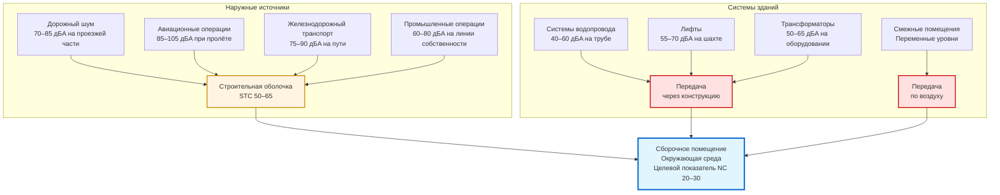

## Обзор

Окружающая звуковая среда охватывает все источники звука, внешние по отношению к системе HVAC, которые влияют на общий уровень фонового шума в сборочных помещениях. Хотя системам HVAC уделяется основное внимание при акустическом проектировании, окружающая среда часто устанавливает практический нижний предел достижимых уровней фонового шума. Тщательно спроектированная система HVAC NC 15 не приносит никаких преимуществ, если дорожный шум окружающей среды создаёт условия NC 25 в занятом помещении.

Окружающая звуковая среда включает наружные источники (трафик, авиация, железная дорога, промышленные работы), деятельность в смежных помещениях и системы инженерного обеспечения зданий (водопровод, лифты, трансформаторы). Успешное акустическое проектирование требует комплексного анализа всех источников окружающего шума и реализации стратегий управления передачей, которые снижают внедрение до уровней ниже вклада системы HVAC.

## Передача звука через строительную оболочку

### Основы потерь передачи

Передача звука через сборки строительной оболочки следует закону массы, где потери передачи увеличиваются с поверхностной плотностью и частотой:

$$TL = 20\log(f \cdot m) - 48$$

Где:
- $TL$ = потери передачи (дБ)
- $f$ = частота (Гц)
- $m$ = поверхностная плотность массы (кг/м²)

Эта зависимость демонстрирует, что удвоение массы стены увеличивает потери передачи на 6 дБ, а удвоение частоты также увеличивает потери передачи на 6 дБ. Низкочастотный звук (63–125 Гц) представляет наибольшую проблему передачи для строительных оболочек.

### Класс передачи звука (STC)

Sound Transmission Class обеспечивает единый числовой рейтинг производительности звукоизоляции сборки. Рейтинги STC получены из измерений потерь передачи в 16 полосах одной третины октавы от 125–4000 Гц, подогнанных к стандартным контурам сравнения в соответствии с ASTM E413.

Зависимость между уровнем звукового давления на улице и уровнем внутри учитывает потери передачи и поглощение звука в помещении:

$$L_{indoor} = L_{outdoor} - TL + 10\log\left(\frac{S}{A}\right)$$

Где:
- $L_{indoor}$ = уровень звукового давления внутри (дБ)
- $L_{outdoor}$ = уровень звукового давления снаружи (дБ)
- $TL$ = потери передачи оболочки (дБ)
- $S$ = площадь передающей поверхности (м²)
- $A$ = полное поглощение звука в помещении (сабины)

Для сборочных помещений, нацеленных на NC 20–25, сборки оболочки, сталкивающиеся со значительными источниками наружного шума, требуют рейтингов STC 55–65.

## Источники окружающего шума

### Характеристики дорожного шума

Магистральный и артериальный трафик генерирует широкополосный шум с пиковой энергией в октавных полосах 250–1000 Гц. Уровни звука на краю проезжей части варьируются от 70–85 дБA в зависимости от объёма трафика, скорости и типа транспортного средства (процент грузовых автомобилей).

Дорожный шум затухает с расстоянием в соответствии с:

$$L_2 = L_1 - 20\log\left(\frac{r_2}{r_1}\right) - \alpha(r_2 - r_1)$$

Где:
- $L_2$ = уровень звука на расстоянии $r_2$ (дБ)
- $L_1$ = уровень звука на расстоянии сравнения $r_1$ (дБ)
- $\alpha$ = коэффициент атмосферного поглощения (дБ/м)

Удвоение расстояния от проезжей части снижает уровни звука примерно на 6 дБ для линейных источников. Дополнительное затухание происходит от поглощения грунтом, барьерами и промежуточными конструкциями.

### Воздействие авиационного шума

Авиационные операции создают наибольшие по амплитуде события окружающего шума, влияющие на сборочные помещения рядом с аэропортами. Коммерческие реактивные самолёты генерируют 85–105 дБA при взлёте и приближении, с преобладающей энергией в октавных полосах 125–500 Гц от турбовентиляторного выхлопа.

Федеральное управление авиации устанавливает контуры среднесуточного уровня звука (DNL) вокруг аэропортов. Объекты в контуре 65 DNL требуют специальной акустической обработки для шумочувствительных применений. Сборочные площадки в этих местах обычно требуют:

- Наружные стеновые сборки: STC 60–65
- Кровельные сборки: STC 55–60
- Системы остекления: STC 50–55 (ламинированные или разнородные стеклопакеты)
- Механические проходки: Облицованные, оборудованные глушителями конфигурации

### Шум железнодорожного транспорта

Железнодорожные операции (грузовые, пассажирские и лёгкие рельсовые) генерируют импульсивные события шума, обусловленные взаимодействием колеса и рельса, обычно 75–90 дБA на расстоянии 15 м от центра пути. Вибрация, возникающая от земли при железнодорожных операциях, также передаётся через основания зданий, излучаясь как шум, передаваемый через конструкцию, внутри внутренних помещений.

Системы метро и подземных железных дорог представляют особые проблемы для сборочных помещений, расположенных выше или в пределах 60 м от выравнивания туннеля. Виброизоляция строительной конструкции от окружающего грунта может быть необходима для достижения производительности NC 20–25.

## Типичные уровни окружающего шума

В следующей таблице представлены характеристические уровни окружающего шума для различных типов площадок и условий:

| Место расположения площадки | Наружный окружающий уровень | Требуемый STC оболочки | Достигнутый внутренний NC |
|------------------------------|---------------------------|----------------------|--------------------------|
| Сельское/пригородное, жилая зона | 45–55 дБA | STC 45–50 | NC 20–25 |
| Пригородное, лёгкая коммерция | 55–65 дБA | STC 50–55 | NC 25–30 |
| Городское, артериальная улица | 65–75 дБA | STC 55–60 | NC 25–30 |
| Городское, основная магистраль | 70–80 дБA | STC 60–65 | NC 30–35 |
| Зона приближения к аэропорту (65–70 DNL) | 75–85 дБA (события) | STC 60–65 | NC 25–30 |
| Зона приближения к аэропорту (70–75 DNL) | 80–90 дБA (события) | STC 65–70 | NC 30–35 |
| Активный железнодорожный коридор | 70–85 дБA (события) | STC 55–60 + виброизоляция | NC 25–30 |

### Целевые показатели фонового шума сборочного помещения

Вклады окружающего шума должны оставаться ниже уровней проектирования системы HVAC, чтобы избежать доминирования в окружающей среде. Следующие целевые показатели устанавливают надлежащие отношения:

| Тип сборочного помещения | Целевой показатель HVAC (NC) | Целевой показатель окружающего шума (NC) | Комбинированный результат (NC) |
|--------------------------|------------------------------|-----------------------------------------|-------------------------------|
| Концертные залы | NC 15–20 | NC 12–17 | NC 18–22 |
| Законные театры | NC 20–25 | NC 17–22 | NC 23–27 |
| Кинотеатры | NC 25–30 | NC 22–27 | NC 28–32 |
| Лекционные залы | NC 25–30 | NC 22–27 | NC 28–32 |
| Многофункциональные аудитории | NC 30–35 | NC 27–32 | NC 33–37 |

Взносы окружающей среды должны быть примерно на 3–5 дБ ниже взносов HVAC, чтобы обеспечить доминирование механической системы. Этот подход обеспечивает эксплуатационную гибкость, так как системы HVAC могут быть отключены во время критических представлений, в то время как окружающий шум остаётся приемлемым.

## Стратегии проектирования строительной оболочки

### Конструкция стеновой сборки

Наружные стеновые сборки достигают требуемых рейтингов STC за счёт массы, развязки и поглощения:

**Высокопроизводительная стеновая сборка (STC 60–65):**
- Наружная облицовка: Кирпичная облицовка (10 см номинальная) или сборный железобетон (15 см)
- Воздушное пространство: Минимум 5 см с теплоизоляцией
- Опорная стена: 20 см CMU или стойки из металла 15 см при расстоянии 41 см
- Теплоизоляция в полости: 15 см стекловолокно
- Внутренний упругий канал: Шляпный канал при расстоянии 61 см
- Внутренняя отделка: Два слоя гипсокартона 16 мм типа X

Развязанная внутренняя отделка обеспечивает критическое дополнительное ослабление передачи на средних и высоких частотах, где закон массы обеспечивает недостаточное затухание.

### Выбор системы остекления

Остекление представляет акустически наиболее слабый элемент в строительных оболочках. Стандартное монолитное стекло 6 мм обеспечивает примерно STC 28, что недостаточно для большинства приложений сборочных помещений.

Достичь улучшенной производительности через:

**Ламинированное стекло:** Два стеклянных слоя, соединённых вязкоупругим промежуточным слоем (ПВБ). Единица 6 мм + 0,76 мм ПВБ + 6 мм ламинированного стекла достигает STC 35–38.

**Асимметричные стеклопакеты (IGU):** Разнородные толщины стекла (например, 6 мм наружное, 10 мм внутреннее) с воздушным зазором 50 мм достигают STC 40–45. Асимметрия устраняет резонанс провала совпадения.

**Ламинированные стеклопакеты:** Комбинируют ламинированное стекло со стеклопакетом для максимальной производительности. 6 мм + ПВБ + 6 мм ламинированное наружное стекло с воздушным зазором 50 мм и 10 мм внутреннее стекло достигает STC 48–52.

Устанавливайте открываемые окна только при условии, что уровни наружного окружающего шума остаются ниже 55 дБA. Открываемые единицы по сути негерметичны вокруг уплотнений и обеспечивают на 10–15 дБ меньшую изоляцию, чем неподвижное остекление.

### Акустика кровельной сборки

Кровельные сборки требуют равного внимания стенам для объектов с воздействием авиационного пролёта. Системы металлических кровель без надлежащей детализации обеспечивают плохую низкочастотную изоляцию из-за резонанса панели.

**Высокопроизводительная кровельная сборка (STC 55–60):**
- Кровельное покрытие: TPO или EPDM
- Прослойка: гипс 13 мм или волоконно-цементная доска
- Теплоизоляция: 150 мм полиизоцианурат (несколько слоёв, разбросанные стыки)
- Металлическая дека: датчик 22, глубина 38 мм
- Акустическая обработка деки: Напыляемое волокно или минеральная вата (25–50 мм)
- Внутренняя отделка: Подвесной потолок ACT или гипсокартон на конструкции

Обработка акустической деки обеспечивает критическое поглощение энергии звука в полости крыши, снижая передачу звука через сборку.

## Контроль шума в смежных помещениях

### Требования к внутренним перегородкам

Перегородки, разделяющие сборочные помещения от смежных занятых площадей, требуют тщательного акустического проектирования. Стандартные гипсокартонные перегородки обеспечивают недостаточную изоляцию для площадок, нацеленных на NC 20–25.

| Тип смежного помещения | Требуемый STC перегородки | Пример конструкции |
|----------------------|--------------------------|-------------------|
| Механические помещения | STC 60–65 | 20 см CMU или разбросанные стойки с двойным гипсокартоном |
| Вестибюли, циркуляция | STC 55–60 | Разбросанные стойки или двойные стойки с теплоизоляцией |
| Офисы, репетиционные помещения | STC 50–55 | Одиночные стойки, изолированные, упругий канал |
| Туалеты | STC 50–55 | Одиночные стойки, изолированные, упругий канал |
| Складские, служебные помещения | STC 45–50 | Стандартная изолированная стойчатая перегородка |

Все проникновения перегородки (розетки, клеммы HVAC, трубопровод) требуют акустического уплотнения. Коробки с двойной спинкой создают пути обхода звука, которые нивелируют производительность перегородки. Смещайте коробки горизонтально минимум на 61 см или используйте пластины из замазки для сохранения акустической целостности.

### Изоляция узла пол-потолок

Передача звука через конструкцию от деятельности на полу выше сборочных помещений (вестибюли, репетиционные помещения, офисы) требует изоляции от ударов:

**Класс изоляции ударов (IIC):** Измеряет сопротивление передаче шума от шагов и ударов. Сборочные помещения ниже занятых полов требуют IIC 60–65, чтобы предотвратить внедрение.

Достичь требуемый IIC через:
- Плавающие системы пола (38–50 мм бетон над упругой прокладкой)
- Ковровое покрытие с подкладкой (обеспечивает улучшение 15–20 IIC по сравнению с жёсткими поверхностями)
- Подвесной потолок ниже с глубиной плёнки 30–45 см
- Крепление потолка с упругим каналом

## Внедрение шума от систем зданий

### Акустика систем водопровода

Системы водопровода генерируют шум через турбулентность потока воды, разряд дренажа и работу насоса. Вертикальные стеки слива, прилегающие к сборочным помещениям, передают широкополосный шум и резонанс низкой частоты во время событий разряда.

Контролируйте шум водопровода через:

**Маршрутизация:** Расположите вертикальные стеки слива минимум на расстоянии 4,5 м от стен сборочного помещения. Консолидируйте водопровод в выделенных стенах шахты, изолированных от помещений производительности.

**Обёртывание труб:** Наносите теплоизоляцию из стекловолокна или пены толщиной 25–50 мм с акустическим барьером, обращённым наружу, на все дренажные трубопроводы в пределах 9 м от сборочных помещений.

**Изоляция стены:** Сооружайте стены шахты как полностью изолированные сборки (отдельные стойки, упругое крепление, герметизированные проходки).

**Выравниватели ловушек:** Используйте электронные или приводимые в действие давлением выравниватели ловушек вместо систем с постоянным каплеобразованием, чтобы устранить постоянный шум потока.

### Шум трансформатора и электрической системы

Трансформаторы сухого типа генерируют тональный шум на 120 Гц (основная) и гармоники от магнитострикции ламинирования сердечника. Большие трансформаторы (500+ кВА) производят 60–70 дБA на расстоянии 1 м, достаточно, чтобы внедриться в смежные сборочные помещения через передачу через конструкцию.

Изолируйте шум трансформатора через:

- Выделенное электрическое помещение с STC 55–60 стенами, минимум 7,5 м от сборочных помещений
- Подушки виброизоляции (25 мм отклонения) под основанием трансформатора
- Гибкие соединения проводников для предотвращения передачи звука через конструкцию к строительной стали
- Акустические жалюзи на вентиляционных отверстиях (вставка потерь 15–20 дБ)

## Комбинированное исследование окружающего и HVAC

Общий уровень фонового шума в сборочном помещении является результатом логарифмического сложения всех источников вклада:

$$L_{total} = 10\log\left(\sum_{i=1}^{n} 10^{L_i/10}\right)$$

Где $L_i$ представляет индивидуальные вклады источников в дБ.

Для практического проектирования, когда два источника отличаются на:
- 0–1 дБ: Общий уровень = более громкий источник + 3 дБ
- 2–3 дБ: Общий уровень = более громкий источник + 2 дБ
- 4–9 дБ: Общий уровень = более громкий источник + 1 дБ
- 10+ дБ: Общий уровень ≈ более громкий источник (доминирующий)

**Пример проектирования:**

Концертный зал, нацеленный на NC 20:
- Система HVAC: NC 18 (27 дБ @ 1000 Гц)
- Дорожный окружающий шум: NC 15 (24 дБ @ 1000 Гц)
- Система водопровода: NC 12 (21 дБ @ 1000 Гц)

Комбинированный уровень: $10\log(10^{27/10} + 10^{24/10} + 10^{21/10}) = 28,3$ дБ при 1000 Гц

Результат: NC 21, соответствующий целевому показателю проектирования с надлежащим допуском.

## Проверка в полевых условиях и тестирование

### Предварительные обследования окружающего шума на месте строительства

Проведите 24-часовой мониторинг окружающего шума на объекте во время фазы проектирования для установления исходных условий. Измеряйте уровни в октавных полосах в течение репрезентативных периодов (будний день/выходные, день/ночь). Определите пиковые события (авиационные пролёты, проходы поездов) и устойчивые уровни фона.

Сравните измеренные уровни окружающего шума с целевыми показателями проектирования. Если окружающий шум превышает допустимый внутренний NC на меньшую величину, чем потери передачи оболочки, объект поддерживает акустические цели. Если окружающий шум превышает цели даже с высокопроизводительной оболочкой, рассмотрите альтернативный объект или примите компромисс в акустической производительности.

### Проверка после строительства

Проверьте производительность оболочки через тестирование звукоизоляции в соответствии с ASTM E336. Генерируйте широкополосный шум внешне по отношению к зданию (откалиброванный громкоговоритель или записанный дорожный/авиационный шум) и измеряйте внутренний отклик. Рассчитайте нормализованную разницу уровня и сравните с проектной потерей передачи.

Проведите тестирование с работающей и неработающей системой HVAC, чтобы разделить взносы. Приемлемая производительность демонстрирует внутренний окружающий NC минимум на 3 дБ ниже вклада HVAC.

## Применимые стандарты и рекомендации

**Стандарты ASHRAE:**
- ASHRAE Handbook—HVAC Applications, Chapter 49: Noise and Vibration Control
- ASHRAE Handbook—Fundamentals, Chapter 8: Sound and Vibration

**Стандарты ASTM:**
- ASTM E413: Classification for Rating Sound Insulation
- ASTM E90: Laboratory Measurement of Airborne Sound Transmission Loss
- ASTM E336: Field Measurement of Airborne Sound Insulation

**Ссылки по акустическому проектированию:**
- Beranek, L.L. *Concert Halls and Opera Houses* - Критерии окружающей среды для площадок производительности
- Long, M. *Architectural Acoustics* - Анализ передачи строительной оболочки
- Cavanaugh, W.J. and Wilkes, J.A. *Architectural Acoustics* - Расчёты комбинированной передачи

## Заключение

Окружающая звуковая среда устанавливает фундаментальные ограничения на достижимую производительность фонового шума в сборочных помещениях. Объекты со значительным воздействием наружного шума (трафик, авиация, железная дорога) требуют высокопроизводительных сборок оболочки с рейтингами STC 55–65 для достижения целевых показателей NC 20–30. Шум систем зданий (водопровод, трансформаторы, лифты) требует тщательной маршрутизации и изоляции для предотвращения внедрения через конструкцию. Успешное акустическое проектирование интегрирует комплексный анализ окружающей среды с проектированием системы HVAC, чтобы обеспечить соответствие комбинированных взносов строгим требованиям сборочного помещения. Мониторинг окружающей среды на ранней фазе и проверка производительности оболочки предоставляют существенную валидацию того, что цели проектирования могут быть достигнуты на выбранном объекте.
