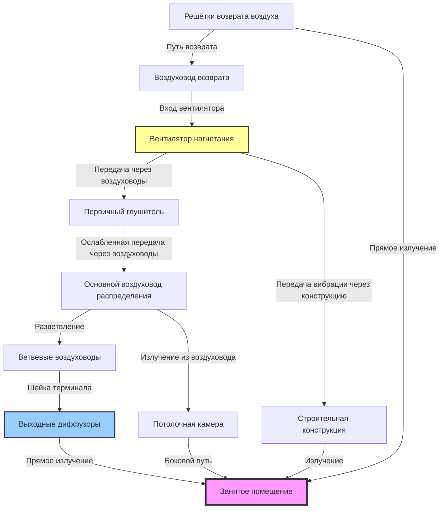

## Обзор

Системы HVAC являются доминирующим постоянным источником шума в помещениях для собраний во время пребывания людей. Хотя архитектурные элементы, движение аудитории и внешние помехи способствуют общей акустической обстановке, правильно спроектированные механические системы определяют, достигнет ли помещение установленного расчётного рейтинга шумовых критериев (NC). Понимание того, как отдельные компоненты HVAC способствуют общему бюджету шума, позволяет проектировщикам эффективно распределять ресурсы на ослабление шума и достичь требуемых характеристик без чрезмерных затрат.

Основная сложность заключается в том, что шум от HVAC попадает в позиции слушателей по нескольким одновременно действующим путям — передача через воздуховоды, излучение из воздуховода, передача вибрации через конструкцию и боковые пути через потолочные камеры. Каждый путь требует отдельного анализа и снижения. Общий уровень звукового давления в любой точке представляет логарифмическую сумму вкладов всех источников и путей.

## HVAC как доминирующий источник фонового шума

### Процентная доля вклада

В правильно спроектированных зданиях системы HVAC вносят 70-85% от общей энергии фонового шума во время нормальной работы. Такая доминирующая роль обусловлена несколькими факторами:

- Постоянная работа во время пребывания людей
- Распределённое расположение источников по всему помещению
- Многочастотное распределение генерируемой энергии
- Прямая связь с занятыми зонами через систему распределения воздуха

Другие источники шума (внешний транспортный шум, соседние помещения, системы зданий) обычно вносят оставшиеся 15-30% при работающих системах HVAC. При остановке HVAC эти источники становятся слышимыми и могут превышать целевые значения NC, но оценка производительности сосредоточена на условиях пребывания людей при полной работе механических систем.

### Проектный целевой показатель: 5 дБ ниже NC

Стандартная практика устанавливает целевые показатели шума систем HVAC на 5 дБ ниже рейтинга NC помещения. Этот запас учитывает:

1. **Источники, не связанные с HVAC** — позволяет вклад в размере 15-30% от других источников
2. **Неопределённость измерений** — компенсирует точность ±2 дБ в прогнозах
3. **Будущие модификации** — обеспечивает резерв для изменений системы
4. **Вариация при производстве** — учитывает допуски по характеристикам оборудования

Для концертного зала NC 25 целевой показатель системы HVAC становится NC 20. Этот запас гарантирует, что помещение достигает NC 25 даже при среднем вкладе от других источников.

$$\text{NC}_{\text{HVAC}} = \text{NC}_{\text{помещение}} - 5 \text{ дБ}$$

## Методология бюджетирования шума

### Расчёт общего шума системы

Уровень звукового давления у позиции слушателя от нескольких некоррелированных источников объединяется логарифмически:

$$L_{p,\text{общий}} = 10 \log_{10} \left( \sum_{i=1}^{n} 10^{L_{p,i}/10} \right)$$

Где:
- $L_{p,\text{общий}}$ = общий уровень звукового давления (дБ)
- $L_{p,i}$ = уровень звукового давления от источника $i$ (дБ)
- $n$ = количество независимых источников

Это уравнение демонстрирует, что источники в диапазоне 10 дБ от самого громкого источника значительно способствуют общему уровню, в то время как источники более чем на 10 дБ тише имеют пренебрежимое влияние.

### Бюджетирование на уровне компонентов

Распределите общий бюджет шума HVAC между компонентами системы на основе их близости к занятым помещениям и простоты управления:

$$L_{w,\text{допустимый}} = L_{p,\text{целевой}} - 10\log\left(\frac{Q}{4\pi r^2}\right) - 10\log\left(\frac{4}{R}\right) + \text{NR}$$

Где:
- $L_{w,\text{допустимый}}$ = допустимый уровень звуковой мощности (дБ)
- $L_{p,\text{целевой}}$ = целевой уровень звукового давления у приёмника (дБ)
- $Q$ = коэффициент направленности (безразмерный)
- $r$ = расстояние от источника к приёмнику (м)
- $R$ = постоянная помещения, $R = \frac{S\bar{\alpha}}{1-\bar{\alpha}}$ (м²)
- $\text{NR}$ = снижение шума за счёт промежуточных барьеров (дБ)

### Требования анализа октавных полос

Все бюджетирование шума должно проводиться в октавных полосах от 63 Гц до 4000 Гц. Кривые NC задают различные пределы на каждой частоте, где полосы средних частот (500-1000 Гц) обычно определяют помехи речи, а низкие частоты (63-125 Гц) контролируют восприятие низкочастотного грохота.

| Центральная частота октавной полосы (Гц) | NC 15 | NC 20 | NC 25 | NC 30 |
|-------------------------------------------|-------|-------|-------|-------|
| 63 | 47 | 51 | 54 | 57 |
| 125 | 36 | 40 | 44 | 48 |
| 250 | 29 | 33 | 37 | 41 |
| 500 | 22 | 26 | 31 | 35 |
| 1000 | 17 | 22 | 27 | 31 |
| 2000 | 14 | 19 | 24 | 29 |
| 4000 | 12 | 17 | 22 | 28 |

Наиболее ограничивающая частотная полоса определяет, соответствует ли помещение своему рейтингу NC. Большинство систем HVAC производят пиковую энергию на 250-500 Гц, что делает эти полосы критическими для проектирования.

## Вклад шума компонентов

### Типичная разбивка вклада

В правильно сбалансированной конструкции системы вклад компонентов распределяется приблизительно следующим образом:

| Компонент | Вклад в общий шум HVAC | Типичный диапазон (дБ ниже NC) |
|-----------|------------------------|-------------------------------|
| Воздухораспределители на выходе | 40-50% | NC −3 до NC −5 |
| Шум вентилятора (передача через воздуховоды) | 20-30% | NC −6 до NC −8 |
| Излучение из воздуховода | 10-20% | NC −8 до NC −10 |
| Решётки возврата воздуха | 10-15% | NC −8 до NC −10 |
| Передача вибрации через конструкцию | 5-10% | NC −10 до NC −12 |
| Пути через потолочную камеру | 5-10% | NC −10 до NC −12 |

Это распределение предполагает надлежащее применение глушителя на выходе вентилятора, соответствующий размер воздуховода и адекватную виброизоляцию. Плохая конструкция резко смещает процентные соотношения вклада — недостаточный размер воздуховодов или неадекватные глушители могут сделать шум вентилятора доминирующим вкладом.

### Доминирование выходных воздухораспределителей

Выходные диффузоры обычно представляют наибольший единственный вклад, потому что они:

1. Расположены непосредственно в занятом помещении
2. Не испытывают затухания между источником и приёмником
3. Работают на самой высокой скорости воздуха в системе распределения
4. Могут количеством 20-100+ единиц в помещении, объединяясь логарифмически

Производители предоставляют рейтинги NC на определённых расходах воздуха, но фактические условия установки (тип потолка, глубина камеры, ориентация монтажа) изменяют производительность на ±3 дБ.

### Передача шума вентилятора

Шум, генерируемый вентилятором, передаётся через воздуховодную сеть в занятые помещения посредством распространения через воздуховоды. Затухание происходит за счёт:

- Глушителей воздуховода: вставляемые потери 10-25 дБ на один глушитель
- Естественного затухания: 0,1-0,3 дБ на метр в облицованных воздуховодах
- Потерь на отражение в концевых точках: 3-10 дБ на выходе терминала
- Деления мощности в ветвях: теоретически 3 дБ на разветвление

Общее затухание в воздуховоде от вентилятора до самого дальнего диффузора может достигать 20-40 дБ, но ближайшие терминалы получают минимальную пользу. Это требует уровней звуковой мощности вентилятора на 20-30 дБ ниже пределов NC помещения на выходе вентилятора.

### Излучение из воздуховода

Стальные воздуховоды излучают звуковую энергию в соседние помещения посредством вибрации панелей. Потери передачи при излучении из воздуховода изменяются с:

$$\text{TL}_{\text{излучение}} = 10\log\left(\frac{P_d}{S_d}\right) + \text{TL}_{\text{стена}} - 3 \text{ дБ}$$

Где:
- $P_d$ = периметр воздуховода (м)
- $S_d$ = площадь поверхности воздуховода (м²)
- $\text{TL}_{\text{стена}}$ = потери передачи через стену воздуховода (дБ)

Излучение становится значимым, когда:
- Воздуховоды проходят в потолочных камерах над чувствительными к шуму помещениями
- Внутренние уровни шума воздуховода превышают 75-80 дБ
- Низкие частоты (63-250 Гц) доминируют в спектре

Специфицируйте конструкцию с двойными стенками или обёрнутыми воздуховодами для воздуховодов с внутренними уровнями, превышающими 85 дБ.

## Анализ путей распространения шума

### Иерархия путей и управление

Диаграмма иллюстрирует шесть различных путей для передачи шума от систем HVAC в занятые помещения:

1. **Прямой путь передачи через воздуховоды (Вентилятор → Глушитель → Воздуховоды → Терминалы → Помещение)**
   - Первичный фокус проектирования
   - Управляется через глушители, определение размеров воздуховодов, выбор терминала
   - Обычно вносит 60-75% от общего шума

2. **Путь излучения из воздуховода (Внутренний уровень воздуховода → Стены воздуховода → Камера → Потолок → Помещение)**
   - Значимый, когда внутренние уровни воздуховода превышают 80 дБ
   - Управляется через конструкцию стен воздуховода, поглощение в камере
   - Вносит 10-20% при отсутствии контроля

3. **Путь вибрации через конструкцию (Вибрация вентилятора → Конструкция → Излучённый шум)**
   - Требует виброизоляции на опорах оборудования
   - Доминирует ниже 125 Гц при недостаточной изоляции
   - Должен вносить <5% при надлежащей изоляции

4. **Путь возврата воздуха (Помещение → Решётки возврата → Воздуховоды возврата → Вентилятор)**
   - Часто игнорируется при проектировании
   - Обеспечивает обратный путь передачи для шума вентилятора
   - Управляется через облицованные воздуховоды возврата, низкие скорости на решётках

5. **Путь обхода через потолочную камеру**
   - Обходит предусмотренные акустические барьеры
   - Требует герметичной конструкции камеры, потолочную плитку с высоким классом звукопоглощения
   - Может доминировать, если система потолка неадекватна

6. **Путь наружного воздухозабора/выброса**
   - Наружные источники шума, попадающие через вентиляционные отверстия
   - Требует глушённых жалюзи, адекватную длину воздуховода

### Запасы при проектировании и коэффициенты безопасности

Консервативная практика проектирования включает запасы на нескольких уровнях:

**Запас на уровне компонента**: Специфицируйте оборудование на 2-3 дБ тише, чем требуемое расчётное значение
- Учитывает допуски при производстве
- Обеспечивает резерв для вариаций при установке
- Компенсирует старение/износ

**Запас на уровне системы**: Спроектируйте для рейтинга NC на 5 дБ ниже требуемого
- Позволяет вклад от источников, не связанных с HVAC
- Приспосабливает будущие модификации
- Снижает риск предельного отказа

**Запас на конкретной частоте**: Обеспечьте дополнительное ослабление на проблемных частотах
- Запасы низкой частоты (63-125 Гц) в 3-5 дБ для управления низкочастотным грохотом вентилятора
- Запасы средней частоты (500-1000 Гц) в 2-3 дБ для помех речи
- Высокие частоты (2000-4000 Гц) обычно достигают целевых показателей без специального запаса

Общий совокупный запас может достичь 10-12 дБ, что может показаться чрезмерным, но отражает совокупные неопределённости в акустическом прогнозировании и серьёзные последствия отказа в помещениях для собраний.

### Кумулятивные эффекты нескольких источников

Когда 20 идентичных диффузоров работают одновременно в аудитории, увеличение общей звуковой мощности следует:

$$\Delta L_w = 10\log_{10}(N)$$

Где $N$ = количество идентичных источников.

Для 20 диффузоров: $\Delta L_w = 10\log_{10}(20) = 13$ дБ увеличение по сравнению с уровнем одного диффузора.

Этот кумулятивный эффект требует рейтингов отдельных диффузоров NC на 13 дБ ниже целевого показателя помещения для этого примера. При 40 диффузорах требуемый запас увеличивается до 16 дБ, иллюстрируя, почему высокопроизводительные, низкошумные терминалы оказываются более экономичными, чем многочисленные маленькие единицы.

### Внешний шум, попадающий через HVAC

Воздухозаборники наружного воздуха и выходные отверстия выброса обеспечивают пути для проникновения внешнего шума в здания. Городские помещения для собраний сталкиваются с вызовами от:

- Транспортного шума: 70-85 дBA на фасадах зданий
- Шума самолётов: 80-95 dBA во время событий
- Строительной деятельности: 75-90 dBA

Спроектируйте системы воздухозабора и выброса с:

- Акустически рассчитанными жалюзи (вставляемые потери 15-25 дБ)
- Минимум 6 м облицованного воздуховода между жалюзи и занятым помещением
- Расположением воздухозабора на спокойной части фасада здания, где возможно
- Глушителями как на воздухозаборе, так и на выбросе, когда наружные уровни превышают 75 dBA

Путь передачи от внешнего к внутреннему включает ослабление жалюзи, ослабление в воздуховоде и потерю на отражение на конце терминала, но прямая связь между внешним и внутренним делает этот путь критическим в шумной обстановке.

## Стратегии управления по отдельным частотам

### Сложности низких частот (63-125 Гц)

Управление низкой частотой представляет наибольшую сложность из-за:

- Больших длин волн (5,5 м на 63 Гц), ограничивающих эффективность глушителя
- Высокого выхода энергии вентилятора в этом диапазоне
- Снижения эффективности пористых поглотителей
- Сильной передачи вибрации через конструкцию

Стратегии управления:

1. Выбор вентилятора с собственно низким выходом НЧ
2. Виброизоляция с собственными частотами <10 Гц
3. Реактивные глушители (расширительные камеры) для ослабления на конкретной длине волны
4. Массивная бетонная конструкция вокруг механических помещений

### Проектирование средних частот (250-1000 Гц)

Диапазон 250-1000 Гц определяет большинство рейтингов NC и получает первичное внимание при проектировании:

- Стандартные стеклопластиковые глушители воздуховода обеспечивают пиковую производительность
- Кривые NC наиболее ограничивающие в этом диапазоне
- Человеческий слух наиболее чувствителен на этих частотах
- Помехи речи сосредоточены здесь

Спроектируйте для достижения пределов NC минус запас 3-5 дБ в октавных полосах 500-1000 Гц.

### Ослабление высоких частот (2000-4000 Гц)

Высокие частоты легко ослабляются благодаря:

- Естественным потерям воздуховода (0,5-1,0 дБ/м в облицованных воздуховодах)
- Отражению в конце терминала
- Поглощению потолочной плиткой и предметами обстановки

Редко требуют специальной обработки, кроме реверберационно-контролируемых помещений с минимальным поглощением.

## Практический пример применения

Для концертного зала NC 20 с 30 выходными диффузорами:

**Шаг 1: Установите целевой показатель HVAC**
$$\text{NC}_{\text{HVAC}} = 20 - 5 = \text{NC } 15$$

**Шаг 2: Рассчитайте допустимость отдельного диффузора**
$$L_{\text{диффузор}} = L_{\text{NC15@1000Hz}} - 10\log_{10}(30) - 3 \text{ дБ (запас)}$$
$$L_{\text{диффузор}} = 17 - 15 - 3 = -1 \text{ дБ отн. NC 15}$$

Отдельные диффузоры должны иметь рейтинг NC 14 или лучше при проектном расходе воздуха.

**Шаг 3: Проверьте вклад шума вентилятора**
При первичном глушителе, обеспечивающем вставляемые потери 20 дБ:
$$L_{\text{вентилятор,допустимый}} = \text{NC } 15 - 8 \text{ дБ (на 8 дБ ниже диффузоров)}$$

Звуковая мощность выхода вентилятора не должна превышать NC 7 после ослабления глушителем.

Это распределение бюджета гарантирует, что диффузоры доминируют в сигнатуре шума, в то время как вклад вентилятора и воздуховода остаются на 8-10 дБ ниже, как рекомендуется в ASHRAE Fundamentals Chapter 48.

## Проверка и пуско-наладка

Проверка после установки подтверждает прогнозы проектирования:

1. **Измерение фонового шума** при работе HVAC на проектном расходе воздуха
2. **Анализ в октавных полосах** для определения доминирующих вкладов
3. **Сравнение с кривыми NC** в нескольких позициях слушателя
4. **Изоляция отдельных источников** для проверки вкладов компонентов

Измерения должны проводиться с пустым помещением, используя прецизионные звукомеры, отвечающие стандартам ANSI S1.4 Type 1. Результаты испытаний в пределах ±2 дБ от прогнозов указывают на успешное выполнение проектирования.

## Заключение

Системы HVAC вносят 70-85% фонового шума в помещения для собраний, требуя систематического бюджетирования шума по всем компонентам и путям передачи. Запасы при проектировании в 5 дБ ниже рейтинга NC помещения обеспечивают необходимые коэффициенты безопасности для источников, не связанных с HVAC, неопределённостей и будущих модификаций. Анализ на уровне компонентов показывает, что выходные воздухораспределители обычно доминируют в бюджете шума, при этом шум вентилятора, излучение из воздуховода и пути вибрации через конструкцию вносят вторичные эффекты при надлежащем управлении. Анализ в октавных полосах от 63-4000 Гц обеспечивает соответствие всем частотам кривых NC, при этом полосы средних диапазонов (500-1000 Гц) обычно определяют решения при проектировании. Обратитесь к ASHRAE Fundamentals Chapter 48 (Noise and Vibration Control) для детальных процедур расчёта и руководства по проектированию конкретных систем.
