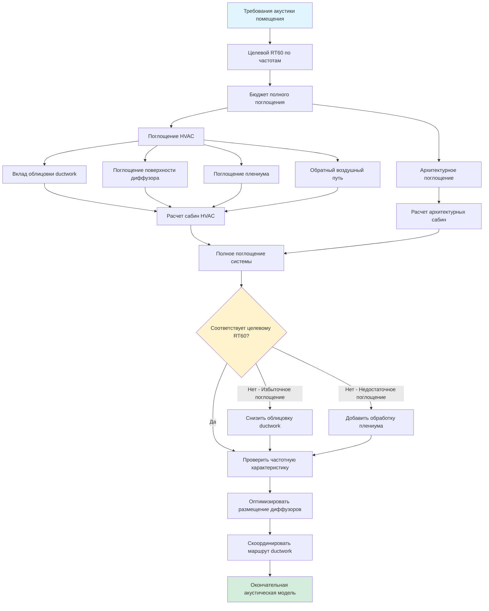

## Обзор

Время реверберации представляет продолжительность, необходимую для затухания звуковой энергии на 60 дБ после прекращения излучения источником. В помещениях собраний системы HVAC влияют на время реверберации несколькими механизмами: открытые поверхности ductwork обеспечивают звукопоглощение, местоположение диффузоров влияет на распределение звукового поля, пространства плениума вносят дополнительное поглощение, а материалы облицовки ductwork способствуют общей акустике помещения. Координация между проектированием механических систем и архитектурной акустикой обеспечивает, что системы HVAC поддерживают, а не компрометируют предполагаемую акустическую среду.

Инженер-механик должен понимать, что каждая открытая поверхность HVAC, от лицевых панелей диффузоров до ductwork до полостей плениума, действует как акустическая граница с определенными характеристиками поглощения. Игнорирование этих вкладов во время проектирования приводит к расхождениям между прогнозируемым и измеренным временем реверберации, потенциально требуя дорогостоящих пост-строительных исправлений.

## Основы времени реверберации

### Уравнение Сабина

Уравнение Сабина связывает время реверберации с объемом помещения и полным звукопоглощением:

$$RT_{60} = \frac{0.049V}{A}$$

Где:
- $RT_{60}$ = время реверберации (секунды)
- $V$ = объем помещения (м³)
- $A$ = полное поглощение помещения (сабины)

Полное поглощение рассчитывается как:

$$A = \sum_{i=1}^{n} S_i \alpha_i$$

Где:
- $S_i$ = площадь поверхности материала $i$ (м²)
- $\alpha_i$ = коэффициент поглощения материала $i$ (безразмерный, 0-1)

### Уравнение Норриса-Айринга

Для помещений с высокопоглощающими поверхностями (средний α > 0,3) уравнение Норриса-Айринга дает более точные результаты:

$$RT_{60} = \frac{0.049V}{-S\ln(1-\bar{\alpha})}$$

Где:
- $S$ = полная площадь поверхности (м²)
- $\bar{\alpha}$ = средний коэффициент поглощения

Это уравнение учитывает факт, что звукопоглощение не идеально диффузно в высокопоглощающих средах, состояние часто присутствующее в помещениях собраний с обширной акустической обработкой.

## Целевые времена реверберации по типам помещений

### Требования помещений собраний

Различные функции собраний требуют определенных акустических характеристик для оптимизации разборчивости речи или музыкального качества:

| Тип помещения | Диапазон объема (м³) | Целевой RT₆₀ @ 500-1000 Гц | Основная акустическая цель |
|------------|-------------------|---------------------------|----------------------|
| Концертные залы (классические) | 8500-17000 | 1.8-2.2 сек | Музыкальное тепло, слияние |
| Концертные залы (современные) | 5700-11300 | 1.4-1.8 сек | Ясность, артикуляция |
| Оперные театры | 7100-14200 | 1.3-1.7 сек | Вокальная проекция, оркестровой баланс |
| Драматические театры | 2800-8500 | 0.9-1.2 сек | Разборчивость речи |
| Многофункциональные аудитории | 5700-14200 | 1.2-1.6 сек | Универсальность |
| Лекционные залы | 1400-4200 | 0.7-1.0 сек | Ясность речи |
| Кинотеатры | 2800-7100 | 0.8-1.2 сек | Воспроизведение усиленного звука |
| Здания культа | 4200-22600 | 1.5-2.5 сек | Литургическая музыка, реверберация |

### Целевые показатели, зависящие от частоты

Время реверберации варьируется с частотой. Оптимальные помещения проявляют определенные характеристики частотной характеристики:

| Частота (Гц) | 125 | 250 | 500 | 1000 | 2000 | 4000 |
|----------------|-----|-----|-----|------|------|------|
| Коэффициент концертного зала | 1.05-1.15 | 1.00-1.05 | 1.00 | 1.00 | 0.95-1.00 | 0.90-0.95 |
| Коэффициент помещения для речи | 1.00-1.10 | 1.00-1.05 | 1.00 | 1.00 | 0.95-1.00 | 0.85-0.95 |

Коэффициент представляет $RT_{60}(f) / RT_{60}(1000\text{ Гц})$. Концертные залы выигрывают от небольшого повышения басов для тепла, в то время как помещения, ориентированные на речь, требуют более плоского отклика для ясности.

## Акустические вклады системы HVAC

### Коэффициенты поглощения материалов HVAC

Компоненты HVAC обеспечивают измеримое поглощение по всему спектру частот:

| Материал/компонент | 125 Гц | 250 Гц | 500 Гц | 1000 Гц | 2000 Гц | 4000 Гц |
|-------------------|--------|--------|--------|---------|---------|---------|
| Bare sheet metal ductwork | 0.02 | 0.02 | 0.03 | 0.03 | 0.04 | 0.05 |
| 2.5 см облицовка ductwork (стекловолокно) | 0.08 | 0.25 | 0.65 | 0.85 | 0.90 | 0.90 |
| 5 см облицовка ductwork (стекловолокно) | 0.15 | 0.50 | 0.85 | 0.95 | 0.95 | 0.95 |
| Перфорированный металлический диффузор | 0.15 | 0.20 | 0.15 | 0.10 | 0.08 | 0.05 |
| Линейный щелевой диффузор | 0.10 | 0.12 | 0.10 | 0.08 | 0.06 | 0.05 |
| Акустическая потолочная плита | 0.15 | 0.40 | 0.70 | 0.85 | 0.85 | 0.80 |
| Возвратная решетка воздуха (25% открытых) | 0.10 | 0.15 | 0.12 | 0.10 | 0.08 | 0.06 |

### Пример расчета

Рассмотрим лекционный зал объемом 4250 м³ с целевым $RT_{60} = 0.85$ сек на частоте 1000 Гц:

**Требуемое полное поглощение:**
$$A = \frac{0.049V}{RT_{60}} = \frac{0.049 \times 4250}{0.85} = 245 \text{ сабин}$$

**Вклад поглощения HVAC:**
- Открытый ductwork: 232 м² с облицовкой 2.5 см, $\alpha = 0.85$ → 197 сабин
- 40 диффузоров: 5.6 м² всего, $\alpha = 0.08$ → 0.4 сабина
- Поглощение плениума: 743 м² со стекловолокном, $\alpha = 0.75$ → 557 сабин

**Общий вклад HVAC:** 755 сабин (308% от требуемого поглощения)

Этот пример демонстрирует, что системы HVAC могут доминировать в акустике помещения при применении обширной облицовки ductwork и обработки плениума. Архитектурный акустик должен учитывать эти вклады во время проектирования.

## Размещение диффузоров и акустическое воздействие

### Принципы размещения

Местоположение диффузора влияет на однородность звукового поля и модели ранних отражений. Стратегическое размещение поддерживает акустические цели:

**Потолочные диффузоры:**
- Разместите вдали от отражающих поверхностей в критическом расстоянии от исполнителей
- Поддерживайте минимальный интервал 1.8 м от стен для предотвращения флаттер-эхо
- Скоординируйте с архитектурными панелями отражателей, чтобы избежать блокирования ранних отражений
- Расположите между рядами сидений, а не прямо над головами слушателей (снижает ощущение сквозняка)

**Настенные диффузоры:**
- Установите в боковых местах 2.4-3.6 м над уровнем пола
- Направляйте выпуск воздуха в сторону от отражающих поверхностей
- Избегайте размещения рядом с проемами авансцены или звукопрозрачными поверхностями
- Учитывайте акустическое затенение от свесов балконов

### Рассмотрение критического расстояния

Критическое расстояние $D_c$ представляет точку, где прямой звук равен реверберирующему звуку:

$$D_c = 0.141\sqrt{\frac{QR}{1}}$$

Где:
- $Q$ = коэффициент направленности (2 для полусферы, 4 для четверти-сферы)
- $R$ = постоянная комнаты = $\frac{S\bar{\alpha}}{1-\bar{\alpha}}$

Размещайте диффузоры вне критического расстояния для исполнителей/говорящих, чтобы минимизировать помехи прямому потоку воздуха при взаимодействии с акустическими источниками.

## Эффекты окончания ductwork

### Геометрия лицевой панели диффузора

Конфигурация лицевой панели диффузора влияет как на генерацию аэродинамического шума, так и на характеристики акустического отражения:

**Диффузоры с перфорированной лицевой панелью:**
- Процент перфорации: 25-40% для оптимальной акустической производительности
- Диаметр отверстия: 4.8-6.4 мм уравновешивает акустику и структурную целостность
- Глубина резервного пространства: глубина плениума 5-10 см обеспечивает поглощение средней частоты
- Акустическое поведение: Действует как массив резонаторов Гельмгольца с пиком поглощения на $f = \frac{c}{2\pi}\sqrt{\frac{p}{t(d+0.8D)}}$

Где:
- $c$ = скорость звука (344 м/с)
- $p$ = процент перфорации (десятичное число)
- $t$ = толщина панели (м)
- $d$ = глубина резервного пространства (м)
- $D$ = диаметр отверстия (м)

**Линейные щелевые диффузоры:**
- Ширина щели: 1.3-2.5 см для приложений в помещениях собраний
- Коэффициент пропорции: длина/ширина >12:1 минимизирует конечные эффекты
- Скорость на лицевой панели: <61 м/с предотвращает свист щели
- Управление потоком: Регулируемые направляющие лопасти направляют воздух параллельно потолку, чтобы снизить шум турбулентности

### Окончание облицовки ductwork

Завершите облицовку ductwork на расстояние 30-45 см выше по потоку от соединения диффузора, чтобы предотвратить эрозию при сохранении акустической производительности. Открытый ductwork в концевой зоне снижает падение давления, но увеличивает высокочастотную регенерацию шума. Этот компромисс требует тщательного анализа для помещений NC 15-20.

## Характеристики поглощения плениума

### Акустика пространства плениума

Потолочные плениумы действуют как связанные объемы, влияющие на реверберацию помещения. Вклад поглощения плениума зависит от:

1. **Потери при передаче потолочной плиты** - Определяет акустическую связь между помещением и плениумом
2. **Обработка поверхности плениума** - Облицовка из стекловолокна обеспечивает коэффициенты поглощения 0.70-0.95
3. **Объем плениума** - Более крупные объемы расширяют низкочастотное поглощение
4. **Геометрия плениума** - Коэффициенты пропорции влияют на распределение модальности

### Модель связанного объема

Для помещений со значительной связью плениума (NRC потолочной плиты >0.65) моделируйте как связанные объемы:

$$RT_{60,total} = \frac{0.049(V_{room} + V_{plenum})}{A_{room} + A_{plenum} + A_{interface}}$$

Где $A_{interface}$ представляет поглощение на границе потолочной плиты, рассчитываемое как:

$$A_{interface} = S_{ceiling} \times TL_{avg}$$

С $TL_{avg}$ преобразованной в эквивалентное поглощение с использованием эмпирических соотношений из ASTM E795.

## Стратегии интеграции HVAC-акустики

### Интеграция процесса проектирования

**Этап 1 - Схематическое проектирование:**
1. Установите целевые значения $RT_{60}$ по полосам частот
2. Рассчитайте требуемое полное поглощение из уравнения Сабина
3. Распределите бюджет поглощения между архитектурными системами и HVAC
4. Определите предварительную стратегию облицовки ductwork (облицованный или открытый)

**Этап 2 - Разработка проекта:**
1. Рассчитайте вклады поглощения HVAC на основе маршрутизации и расположения диффузоров
2. Скоординируйте местоположение диффузоров с архитектурными панелями отражателей
3. Моделируйте эффекты поглощения плениума на поведение связанного объема
4. Отрегулируйте архитектурные материалы для компенсации вкладов HVAC

**Этап 3 - Конструкторская документация:**
1. Укажите толщину и плотность облицовки ductwork по местоположению
2. Детализируйте крепление диффузора для минимизации путей утечки звука
3. Установите требования конструкции плениума (герметичный или негерметичный)
4. Скоординируйте с архитектурным акустиком по окончательным расчетам поглощения

## Акустическая обработка обратного воздушного пути

Системы возврата воздуха требуют равного рассмотрения систем подачи при акустическом проектировании:

**Вклады передаточной решетки:**
- Поглощение лицевой площади: $A = S_{grille} \times \alpha$ где $\alpha = 0.10-0.15$ в зависимости от перфорации
- Шум турбулентности: Поддерживайте скорость на лицевой панели <91 м/с
- Изоляция монтажа: Акустически изолируйте рамки от жестких поверхностей

**Системы возврата с ductwork:**
- Облицуйте возвратные каналы теми же критериями, что и системы подачи для помещений, требующих NC <25
- Размер для скоростей на 25% ниже, чем подача для снижения падения давления и регенерированного шума
- Завершите облицовку на расстояние 45-60 см от соединений решетки

**Системы возврата в плениум:**
- Приемлемо только для помещений NC 30-35 с надлежащей герметичной конструкцией плениума
- Требуют потолочные плиты с CAC (индекс атténuation потолка) >35
- Обеспечьте облицовку плениума из стекловолокна толщиной 5 см для вклада поглощения

## Стандарты и ссылки

**Стандарты ASHRAE:**
- ASHRAE Handbook—HVAC Applications, Chapter 49: Контроль шума и вибрации
- ASHRAE Handbook—Fundamentals, Chapter 8: Звук и вибрация
- ASHRAE Standard 189.1: Критерии проектирования высокопроизводительных зданий

**Стандарты архитектурной акустики:**
- ASTM E90: Лабораторное измерение передачи звука в воздухе
- ASTM E795: Крепление образцов испытаний при измерении поглощения звука
- ISO 3382: Измерение времени реверберации в аудиториях
- ANSI S12.60: Критерии акустической производительности школ

**Справочные материалы отрасли:**
- Acoustical Society of America: Принципы проектирования акустики помещений
- National Council of Acoustical Consultants (NCAC): Рекомендации по проектированию
- SMACNA HVAC Systems—Duct Design: Спецификации акустической облицовки

## Координация с консультантом по акустике

Успешные проекты требуют постоянного сотрудничества между инженерами-механиками и консультантами по акустике:

1. **Ранняя фаза проектирования**: Поделитесь предварительной маршрутизацией ductwork и расположением диффузоров для оценки акустического воздействия
2. **Разработка проекта**: Предоставьте спецификации облицовки ductwork и детали конструкции плениума для моделирования поглощения
3. **Конструкторская документация**: Скоординируйте спецификации для требований акустической производительности и протоколов тестирования
4. **Ввод в эксплуатацию**: Совместная проверка уровней фонового шума и измерений времени реверберации

Инженер-механик предоставляет количественные данные о вкладах поглощения HVAC, позволяя акустику точно прогнозировать акустическую производительность помещения и указывать подходящие архитектурные обработки.

## Заключение

Системы HVAC оказывают существенное влияние на характеристики реверберации помещения за счет поглощения облицовки ductwork, эффектов поверхности диффузора, связи плениума и вкладов обратного воздушного пути. Инженеры-механики должны количественно определить эти эффекты, используя уравнение Сабина, и скоординировать с архитектурными акустиками, чтобы обеспечить, что проектирование HVAC поддерживает, а не компрометирует цели акустической производительности. Стратегическое размещение диффузоров, тщательная детализация окончания ductwork и надлежащая обработка плениума позволяют системам HVAC положительно способствовать акустике помещения при сохранении теплового комфорта и качества воздуха внутри помещений. От 8 до 15% полного поглощения в помещении, обычно обеспечиваемое системами HVAC, представляет значительную переменную проектирования, требующую явного рассмотрения во всех фазах проекта.
