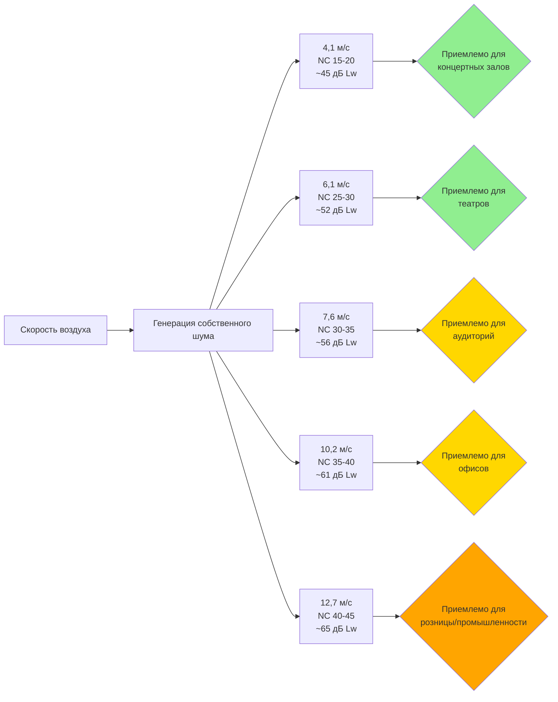

Скорость воздушного потока через воздуховодные глушители представляет критический параметр проектирования, который прямо влияет на генерацию собственного шума, акустическое качество и эффективность системы. Превышение пределов скорости вызывает шум, вызванный турбулентностью, который нивелирует выигрыш от вставления глушителя, в то время как ненужно низкие скорости приводят к завышенным размерам оборудования и чрезмерным затратам.

## Механизмы генерации собственного шума

Собственный шум возникает, когда воздушный поток генерирует акустическую энергию внутри сборки глушителя. Три основных механизма вызывают собственный шум в диссипативных воздуховодных глушителях:

**Шум перфорирования**

Воздух, проходящий через перфорированные покрытия, создает турбулентные струи, излучающие звук. Акустическая мощность, генерируемая при увеличении скорости, возрастает резко, следуя примерно степенной зависимости шестой степени. Небольшие диаметры перфорации (1,6–3,2 мм) вызывают высокочастотный шум, в то время как большие отверстия (4,8–6,4 мм) смещают генерацию шума в сторону более низких частот.

**Турбулентность в проходах**

Отделение потока на передних кромках дефлекторов, ограничение потока через узкие проходы и турбулентность пограничного слоя вдоль поглощающих поверхностей генерируют широкополосный шум по всему слышимому спектру. Проходы уже 101,6 см усугубляют эффекты турбулентности, особенно при скоростях, превышающих 7,6 м/с.

**Срыв вихрей**

Вихри на задних кромках образуются по мере выхода воздуха из глушителя, создавая периодические колебания давления, которые проявляются как тональный или узкополосный шум. Соотношение Штруханоля управляет частотой срыва:

$$f = \frac{St \cdot V}{d}$$

Где:
- $f$ = частота срыва вихря (Гц)
- $St$ = число Штруханоля (обычно 0,2 для тупых тел)
- $V$ = скорость воздуха (м/с)
- $d$ = характерный размер, толщина дефлектора (м)

## Соотношения для уровня акустической мощности собственного шума

Акустическая мощность, генерируемая собственным шумом глушителя, следует эмпирическим соотношениям, подтвержденным лабораторными испытаниями согласно ASTM E477:

$$L_{w,self} = K_{silencer} + 50 \log_{10}(V) + 10 \log_{10}(A)$$

Где:
- $L_{w,self}$ = уровень звуковой мощности собственного шума (дБ от 10⁻¹² Вт)
- $K_{silencer}$ = константа конструкции глушителя (-10 до +5 дБ)
- $V$ = скорость на входе (м/ч)
- $A$ = площадь свободного прохода (м²)

Коэффициент 50 log(V) указывает, что удвоение скорости увеличивает собственный шум примерно на 15 дБ. Это быстрое увеличение доминирует над акустическим качеством при высоких скоростях.

**Упрощенное соотношение скорости и шума**

Для глушителей с параллельными дефлекторами с проходами 10,2–15,2 см:

$$\Delta L_w = 50 \log_{10}\left(\frac{V_2}{V_1}\right)$$

Где $\Delta L_w$ представляет изменение уровня звуковой мощности собственного шума при изменении скорости с $V_1$ на $V_2$.

Практический пример: увеличение скорости с 5,1 м/с на 10,2 м/с увеличивает собственный шум на:

$$\Delta L_w = 50 \log_{10}(2) = 50 \times 0,301 = 15 \text{ дБ}$$

## Рекомендуемые пределы скорости по применению

Пределы скорости гарантируют, что собственный шум остается ниже уровней, которые нарушают акустическое качество. Критическое ограничение состоит в том, что уровень звуковой мощности собственного шума должен быть как минимум на 5–10 дБ ниже допустимого уровня звуковой мощности, входящего в занимаемое пространство.

### Рекомендации по максимальной скорости на входе

| Тип помещения | Целевой NC | Макс. скорость (м/ч) | Макс. скорость (м/с) | Типичное применение |
|------------|-----------|--------------------|--------------------|---------------------|
| Концертные залы, студии звукозаписи | NC 15-20 | 1289-1524 | 4,0-5,1 | Критические акустические среды |
| Театры, церкви | NC 20-25 | 1524-1829 | 5,1-6,1 | Залы представлений |
| Аудитории, лекционные залы | NC 25-30 | 1829-2286 | 6,1-7,6 | Помещения для презентаций |
| Офисы, конференц-залы | NC 30-35 | 2286-3048 | 7,6-10,2 | Стандартные коммерческие |
| Розница, коридоры | NC 35-40 | 3048-3810 | 10,2-12,7 | Общественные проходы |
| Промышленные помещения | NC 40-45 | 3810-4572 | 12,7-15,2 | Некритичные помещения |

### Пределы от производителей

Ведущие производители глушителей публикуют кривые скорость-шум, показывающие уровни звуковой мощности собственного шума при различных скоростях. Типичные рекомендации производителей:

- **Критические приложения (NC 15-25)**: ограничивают скорость максимум 6,1 м/с
- **Стандартные приложения (NC 30-35)**: ограничивают скорость максимум 9,1 м/с
- **Некритичные приложения (NC 35-40)**: ограничивают скорость максимум 12,7 м/с
- **Промышленные приложения (NC 40+)**: скорости до 17,8 м/с приемлемы

Эти пределы применяются к стандартной конструкции с параллельными дефлекторами. Низкоскоростные глушители с улучшенными моделями перфорирования и оптимизированной геометрией проходов поддерживают на 20–30% более высокие скорости при эквивалентных уровнях собственного шума.

## Рассмотрения относительно шума прорыва

Шум прорыва возникает, когда акустическая энергия передается через корпус глушителя в смежные помещения. Тонкостенные металлические корпусы обеспечивают минимальную звукоизоляцию, позволяя высоким уровням звуковой мощности внутри излучаться наружу.

**Звукоизоляция прорыва**

Передача звука через листовой металл следует:

$$TL = 20 \log_{10}(m \cdot f) - 47$$

Где:
- $TL$ = звукоизоляция (дБ)
- $m$ = поверхностная масса (кг/м²)
- $f$ = частота (Гц)

Стандартные корпусы из оцинкованной стали толщиной 0,9–1,2 мм обеспечивают только 15–25 дБ звукоизоляции на средних частотах, что недостаточно для приложений, где глушители проходят через занимаемые помещения или рядом с ними.

**Стратегии предотвращения прорыва**

1. **Увеличение толщины корпуса**: укажите конструкцию толщиной 1,2 или 1,5 мм для глушителей в чувствительных местах
2. **Добавление наружной изоляции**: оберните наружную часть глушителя волокнистой изоляцией толщиной 25–50 мм и виниловой мембраной массой 2,4–4,9 кг/м²
3. **Использование двойной конструкции**: производители предлагают двойные корпусы с внутренней изоляцией
4. **Ограничение внутренней скорости**: снижение скорости уменьшает уровни звуковой мощности, доступные для прорыва

Для глушителей, расположенных в пределах 3 м от занимаемых помещений с требованиями NC 30 или ниже, наружная обработка добавляет 8–15 дБ дополнительной звукоизоляции.

## Методология расчета размеров глушителей

Правильный расчет размеров глушителя балансирует акустическое качество, перепад давления, физические ограничения и пределы скорости.

**Шаг 1: Расчет допустимой скорости на входе**

На основе целевого уровня NC из таблицы пределов скорости установите максимальную скорость на входе.

**Шаг 2: Определение требуемой площади входа**

$$A_{face} = \frac{Q}{V_{max}}$$

Где:
- $A_{face}$ = площадь входа глушителя (м²)
- $Q$ = расход воздуха (м³/ч)
- $V_{max}$ = максимально допустимая скорость (м/ч)

**Шаг 3: Выбор стандартного размера глушителя**

Выберите стандартный размер глушителя, обеспечивающий площадь входа равную или большую, чем рассчитанный минимум. Типичные прямоугольные размеры:
- 61 × 61 см (0,37 м²)
- 76 × 76 см (0,58 м²)
- 91 × 91 см (0,83 м²)
- 122 × 122 см (1,49 м²)

**Шаг 4: Проверка производительности собственного шума**

Используя данные производителя или формулу собственного шума, рассчитайте фактический уровень звуковой мощности собственного шума при проектной скорости. Убедитесь, что собственный шум остается как минимум на 5 дБ ниже допустимого уровня звуковой мощности.

**Шаг 5: Проверка перепада давления**

Рассчитайте перепад давления, используя:

$$\Delta P = K \cdot \frac{V^2}{4005} \cdot \frac{L}{12}$$

Где:
- $\Delta P$ = перепад давления (Па)
- $K$ = коэффициент потерь (0,8–1,5, специфичен для производителя)
- $V$ = скорость на входе (м/ч)
- $L$ = активная длина глушителя (м)

Целевой перепад давления ниже 62,4 Па для большинства приложений, чтобы минимизировать энергопотребление вентилятора.

### Решенный пример

Разработайте глушитель для 3786 м³/ч, обслуживающий лекционный зал с требованием NC 25.

1. Максимальная скорость = 1829 м/ч (из таблицы)
2. Требуемая площадь входа = 3786 ÷ 1829 = 2,07 м²
3. Выбрать глушитель 91 × 91 см (0,83 м²)
4. Фактическая скорость = 3786 ÷ 0,83 = 4559 м/ч ✓
5. Собственный шум = $K + 50 \log_{10}(1,27) + 10 \log_{10}(0,83)$ = 0 + 3,8 + (-0,8) = 47,5 дБ
6. Для длины 1,5 м с K = 1,0: $\Delta P = 1,0 \times (1,27^2/4005) \times (1,5/12) = 6,2$ Па ✓

## Стандарты ASHRAE и промышленности

Справочник ASHRAE—Приложения HVAC, Глава 49 (Контроль звука и вибрации) предоставляет полное руководство по выбору глушителей, включая рекомендации по пределам скорости. Справочник подчеркивает, что скорость на входе представляет единственный наиболее критический параметр, влияющий на генерацию собственного шума.

ASTM E477 устанавливает стандартные лабораторные методы испытания для измерения вставления глушителя, перепада давления и собственного шума. Этот стандарт требует испытания при различных скоростях для характеристики производительности собственного шума в диапазоне эксплуатации.

Стандарт AHRI 885 (Процедура оценки уровней звука в занимаемых помещениях при применении воздушных терминалов и выпусков воздуха) рассматривает генерацию шума устройства терминала, включая эффекты скорости подхода на регенерированный шум.

Ведущие производители глушителей, включая Industrial Acoustics Company (IAC), Kinetics Noise Control, Vibro-Acoustics и Duct Silencers Inc., публикуют полные технические данные, показывающие соотношения скорость-шум для своих линий продуктов. Программное обеспечение выбора от этих производителей включает пределы скорости и автоматически отмечает проекты, превышающие рекомендуемые пороги.

## Рассмотрения избыточного расчета

Хотя поддержание скорости ниже пределов предотвращает проблемы с собственным шумом, чрезмерный расчет размеров налагает штрафы на стоимость и пространство. Площадь входа глушителя на 25–40% больше, чем требуемый минимум, обеспечивает резерв для:

- Регулирования расхода воздуха в системе во время пуска
- Будущих модификаций или увеличения производительности системы
- Вариации в данных производителя
- Консервативного коэффициента безопасности для критичных приложений

Избегайте расчета размеров, превышающего 50% рассчитанного минимума, так как дополнительная акустическая выгода уменьшается, в то время как стоимость увеличивается линейно с размером.

## Заключение

Пределы скорости воздуха в воздуховодных глушителях вытекают из фундаментальной физики шума, вызванного турбулентностью, при этом собственный шум увеличивается в 50 раз логарифм скорости. Поддержание скоростей входа ниже 6,1 м/с для критичных акустических приложений (NC 25–30) и ниже 7,6 м/с для стандартных коммерческих приложений (NC 30–35) гарантирует, что собственный шум остается подчиненным выигрышу от вставления глушителя. Правильный расчет размеров требует тщательного анализа акустических требований, ограничений скорости, ограничений перепада давления и параметров физической установки для достижения оптимальной производительности системы.
